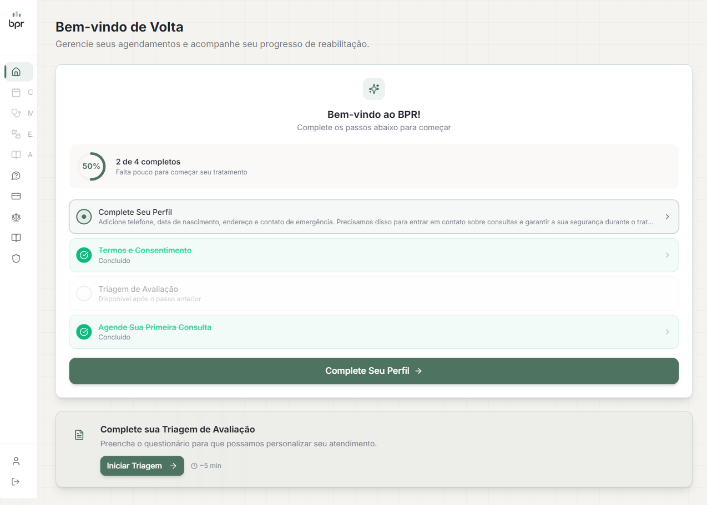
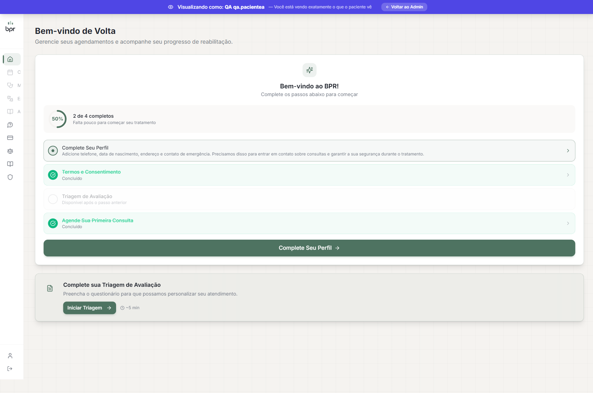
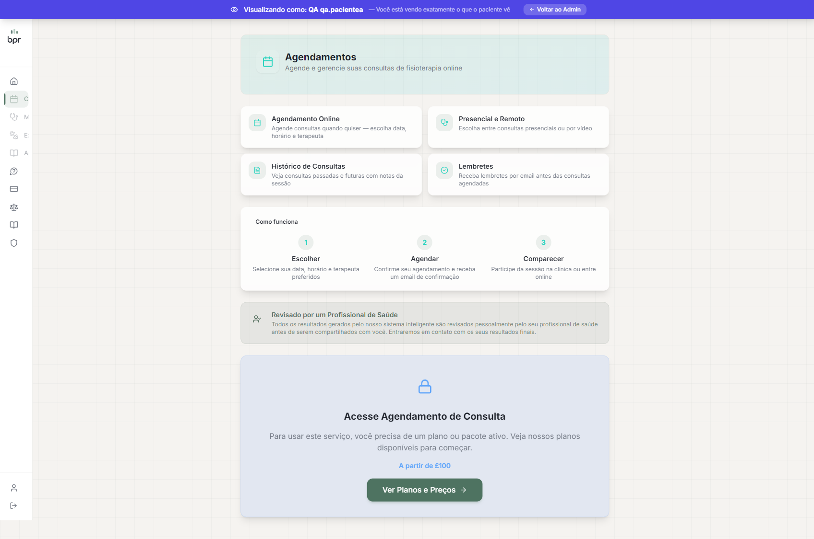
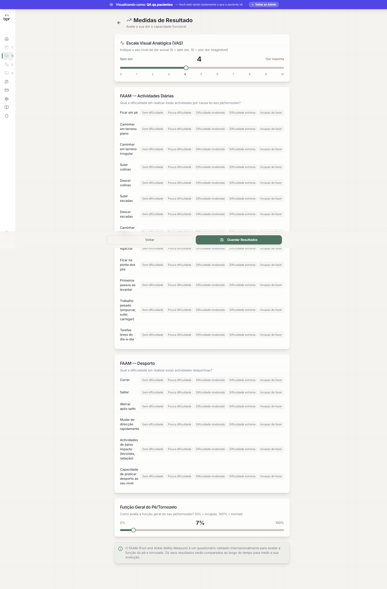
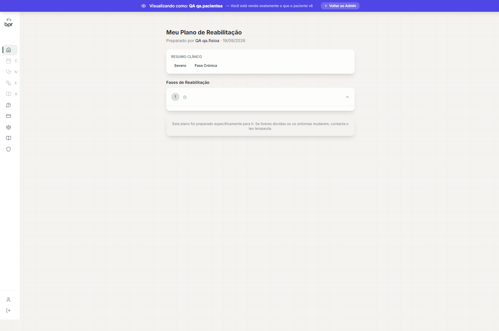
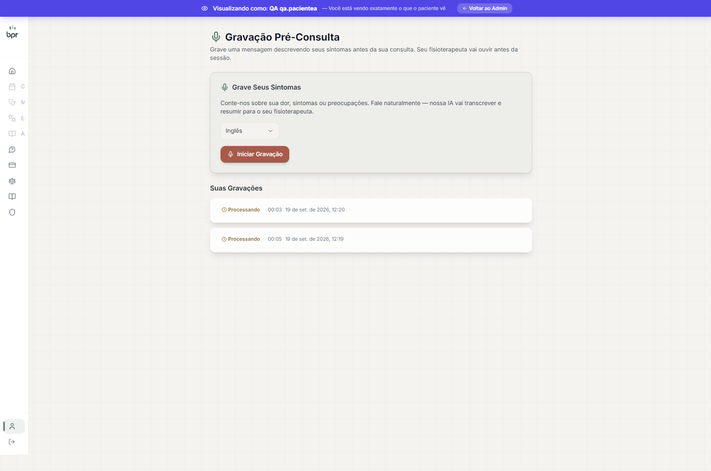

# QA Report — Fix: impersonação ignorada em 7 rotas de paciente

**Data:** 2026-09-19
**Escopo:** correção que trocou `getRequestSession()`/`getServerSession()` por `getEffectiveUser()` (com guard `role !== "PATIENT"` → 401) em 7 rotas voltadas ao paciente, para que "View as Patient" (impersonação de staff) resolva a identidade correta.
**Ambiente:** dev local, `http://localhost:4210`, banco local (Postgres via `.env` `DATABASE_URL`).
**Resultado geral:** ✅ **Aprovado**

Não é uma tarefa de `specs/`; cenários derivados a partir da descrição do bug fornecida pelo autor da correção (não existe `qa-spec.md` para este trabalho).

## Resumo

| # | Cenário | Tipo | Resultado |
|---|---------|------|-----------|
| 1a | GET `/api/patient/adherence` — paciente logado normal | API | ✅ |
| 1b | GET `/api/patient/assessment-progress` — paciente logado normal | API | ✅ |
| 1c | GET `/api/patient/outcome-measures` (+ `history=true`) — paciente logado normal | API | ✅ |
| 1d | GET `/api/patient/appointments` — paciente logado normal | API | ✅ |
| 1e | POST `/api/patient/appointments/confirm-schedule` — paciente logado normal | API | ✅ |
| 1f | GET/POST `/api/patient/consultation-recording` — paciente logado normal | API | ✅ |
| 1g | GET `/api/patient/rehab-plan` — paciente logado normal | API | ✅ |
| 1h | POST `/api/patient/outcome-measures` — paciente logado normal | API | ✅ |
| 2 | Impersonação — staff vê dados da PACIENTE (6 rotas GET) | API + UI | ✅ |
| 3 | `confirm-schedule` sob impersonação — `ClinicMessage` atribuída à paciente | API + DB | ✅ |
| 4a | Sem sessão nenhuma → redirect do middleware (não 500/crash) | API | ✅ |
| 4b | Staff SEM impersonar acessando as 7 rotas → 401 (guard não quebrou o caso comum) | API | ✅ |
| 5 | `consultation-recording` POST — upload funciona e `clinicId` resolvido corretamente | API | ✅ |
| — | Console do browser nas telas de paciente (dashboard, appointments, my-plan, outcome-measures, recordings) sob impersonação | UI | ✅ nenhum erro |
| — | `npx tsc --noEmit -p .` (excl. `reconstruir/`) vs. baseline 1898 | Build | ✅ 1898 = 1898 |

## Fixtures usadas

- `scripts/qa/tenant-fixtures.cjs` (já existente) — clínica `QA Clinic A`, `qa.admina@example.test` (ADMIN), `qa.pacientea@example.test` (PATIENT), senha `QaTenant#2026`.
- `scripts/qa/impersonation-fix-fixtures.cjs` (criado para este QA, idempotente) — adiciona à `qa.pacientea`: 3 `DailyCheckIn`, 1 `PatientOutcomeMeasure` (vasScore=9), 1 `RehabPlan` enviado, 1 `Appointment` `PENDING_PATIENT`, 1 `ConsultationRecording`. Permite distinguir "dados da paciente" de "dados vazios/do staff" durante a impersonação.

## Detalhes

### 1. Regressão — paciente logado normalmente (sem impersonação) ✅

Login via UI (Playwright) como `qa.pacientea@example.test`, depois `fetch()` no contexto do browser (cookies httpOnly de sessão enviados automaticamente).

```
GET /api/patient/adherence               → 200 { series: [{ periodStart: "2026-09-14", doneCount: 3, totalDays: 3, percent: 100 }] }
GET /api/patient/assessment-progress     → 200 { steps: [...], completedCount: 1, totalSteps: 2, userId: "cmu6aoc36...", ... }
GET /api/patient/outcome-measures        → 200 { measures: { vasScore: 9, faamAdl: 60, ... } }
GET /api/patient/outcome-measures?history=true → 200 { series: [{ recordedAt: ..., vasScore: 9, ... }] }
GET /api/patient/appointments            → 200 { appointments: [2 items, incl. "QA fixture pending confirm" PENDING_PATIENT] }
GET /api/patient/consultation-recording  → 200 { recordings: [1 item, patientId = pacienteA] }
GET /api/patient/rehab-plan              → 200 { plan: { chiefComplaint: "QA fixture — knee pain", ... } }
```

POST `/api/patient/appointments/confirm-schedule` (body `{}`) → `200 { confirmed: 1 }`. Verificado no banco: `ClinicMessage` criada com `patientId = senderId = <id da pacienteA>`, `senderRole: "patient"` — comportamento correto e idêntico ao anterior à correção.

POST `/api/patient/outcome-measures` (`{ vasScore: 4, faamAdl: 80, faamSport: 70, overallFunction: 7 }`) → `200`, `patientId` = pacienteA.

POST `/api/patient/consultation-recording` (multipart, arquivo de áudio fake) → `200 { success: true, recording: { patientId: <pacienteA>, clinicId: <QA Clinic A> } }` — ver cenário 5.

**Evidência:** 

Nenhuma regressão: todas as 7 rotas continuam funcionando exatamente como esperado para o paciente logado normalmente.

### 2. Impersonação — staff vê os dados da PACIENTE, não os próprios ✅

Login como `qa.admina@example.test` (staff), acessei `/admin/patients/<pacienteA>` e cliquei **"View as Patient"**. O clique abre uma nova aba já com o cookie `impersonate-patient-id` ativo e o banner "Visualizando como: QA qa.pacientea" visível.

Repeti a mesma bateria de `fetch()` nessa aba impersonada:

```
GET /api/patient/adherence               → 200, mesmos 3 checkins da pacienteA (100%)
GET /api/patient/assessment-progress     → 200, mesmo outcome measure (vasScore=4, o último gravado)
GET /api/patient/outcome-measures        → 200, patientId = pacienteA
GET /api/patient/appointments            → 200, mesmos 2 agendamentos da pacienteA
GET /api/patient/consultation-recording  → 200, 2 gravações, ambas patientId = pacienteA
GET /api/patient/rehab-plan              → 200, mesmo plano (id cmu8ap4zu...)
```

Em nenhuma chamada apareceu o id do admin (`cmu6aoc2y0005xz8o9w8qp1i4`) como `patientId` — todos os registros pertencem exclusivamente à pacienteA. Antes da correção, essas rotas resolviam a identidade pela sessão real do staff (e-mail/id do admin), e como o admin não possui `DailyCheckIn`/`PatientOutcomeMeasure`/etc. próprios, o sintoma esperado seria retorno vazio (não os dados do staff, já que ele não tem registros desse tipo) — o comportamento correto agora é ver os dados reais da paciente.

Confirmei também via UI, navegando pelas telas que consomem essas rotas:

- **Dashboard** — onboarding e triagem corretos para a paciente. 
- **Consultas** (`/dashboard/appointments`) — sem erros de console. 
- **Medidas de Resultado** (`/dashboard/outcome-measures`) — VAS mostra "4", o último valor gravado pela pacienteA (confirma que não é o valor de outro usuário). 
- **Meu Plano de Reabilitação** (`/dashboard/my-plan`) — mostra o plano criado para a pacienteA (chiefComplaint "QA fixture — knee pain"). 
  - Nota (não é bug de auth, é limitação da fixture de QA): os rótulos "Severo"/"Fase Crónica" exibidos vêm de `planJson.severity`/`planJson.phase`, que a fixture não populou (só preenchi as colunas top-level do `RehabPlan`). A página cai no `default` do ternário. Não relacionado à correção de impersonação — não corrigi, só registro para não confundir quem ler o relatório.
- **Gravações** (`/dashboard/recordings`) — sem erros de console. 
- **Meu Plano de Tratamento / Protocolo** (`/dashboard/treatment`) — console mostrou `403 Forbidden` em `/api/patient/protocol` e `/api/exercises`. **Investiguei e não é regressão desta correção**: essas rotas já usam `getEffectiveUser()` corretamente; o 403 vem de `assertModuleAccess(userId, "mod_treatment")` — a pacienteA de fixture simplesmente não tem essa permissão de módulo concedida (o admin precisaria clicar "Grant Full Access", visto no snapshot da página do paciente). Comportamento de gating esperado, não um vazamento nem uma quebra.

### 3. `confirm-schedule` sob impersonação ✅

Com a pendência `PENDING_PATIENT` recriada via fixture, chamei `POST /api/patient/appointments/confirm-schedule` na aba impersonada:

```
→ 200 { confirmed: 1 }
```

Consulta ao banco logo em seguida:

```json
{
  "id": "cmu8as11y0022xz202vr7ix7j",
  "patientId": "cmu6aoc360009xz8oyncztycs",   // pacienteA — correto
  "senderId": "cmu6aoc360009xz8oyncztycs",    // pacienteA — correto (não o admin cmu6aoc2y0005xz8o9w8qp1i4)
  "senderRole": "patient",
  "kind": "notice",
  "title": "Agenda confirmada",
  "content": "✅ O paciente confirmou a agenda de tratamento (1 sessão)."
}
```

Confirma exatamente o comportamento novo descrito: antes da correção esta rota retornava 401 durante impersonação (só validava `role==PATIENT` da sessão real, sempre ADMIN/SUPERADMIN para staff); agora funciona e atribui corretamente à paciente impersonada, nunca ao admin.

Também testei `POST /api/patient/outcome-measures` sob impersonação: `200`, `measures.patientId` = pacienteA (não o admin).

### 4. Auth negativo ✅

**4a. Sem sessão nenhuma** (curl puro, sem cookies):

```
$ curl -s -D - -o /dev/null http://localhost:4210/api/patient/adherence
HTTP/1.1 307 Temporary Redirect
location: /login?callbackUrl=%2Fapi%2Fpatient%2Fadherence

$ curl -s -D - -o /dev/null http://localhost:4210/api/patient/appointments
HTTP/1.1 307 Temporary Redirect
location: /login?callbackUrl=%2Fapi%2Fpatient%2Fappointments
```

Redirect do middleware (`getToken` retorna null) — é o padrão já existente do projeto, não uma regressão.

**4b. Staff logado, SEM impersonar** (cookie `impersonate-patient-id` ausente/limpo), guard `role !== "PATIENT"` deve continuar bloqueando:

```
GET /api/patient/adherence               → 401 { error: "Unauthorized" }
GET /api/patient/assessment-progress     → 401 { error: "Unauthorized" }
GET /api/patient/outcome-measures        → 401 { error: "Unauthorized" }
GET /api/patient/appointments            → 401 { error: "Unauthorized" }
GET /api/patient/consultation-recording  → 401 { error: "Unauthorized" }
GET /api/patient/rehab-plan              → 401 { error: "Unauthorized" }
POST /api/patient/appointments/confirm-schedule → 401 { error: "Unauthorized" }
```

(O teste de `confirm-schedule` foi feito após encerrar a impersonação via `DELETE /api/admin/impersonate`, porque o cookie `impersonate-patient-id` é global ao browser/contexto — não por aba — então qualquer aba aberta na mesma sessão herda a impersonação ativa até ela ser encerrada. Isso é comportamento correto do cookie, só relevante para o desenho do teste.)

O guard funciona como esperado nos dois sentidos: bloqueia staff sem impersonar, libera paciente real e staff impersonando.

### 5. `consultation-recording` POST — upload e `clinicId` ✅

Upload via `fetch()` com `FormData` (arquivo de áudio fake, 8 bytes) como paciente logado normalmente:

```
POST /api/patient/consultation-recording
→ 200 {
    success: true,
    recording: {
      id: "cmu8aqua2001uxz20g7eqemcq",
      patientId: "cmu6aoc360009xz8oyncztycs",   // pacienteA
      clinicId: "cmu6aoc2j0000xz8oaserpn4m"     // QA Clinic A — resolvido via a nova query extra a prisma.user
    }
  }
```

`clinicId` corresponde exatamente à clínica da pacienteA (antes vinha direto de `session.user.clinicId`; agora é buscado com `prisma.user.findUnique({ where: { id: userId }, select: { clinicId: true } })`) — resolvido corretamente. A rota tentou a transcrição automática (Groq/Gemini) e não travou mesmo sem transcript válido (áudio fake) — respondeu 200 normalmente.

## Erros de console

- Nenhum erro real de JavaScript nas telas de paciente visitadas (dashboard, appointments, outcome-measures, my-plan, recordings) durante impersonação.
- `/dashboard/treatment` mostrou `403` em `/api/patient/protocol` e `/api/exercises` — investigado, é gating de permissão de módulo (`assertModuleAccess`) esperado para a fixture, não vazamento nem regressão da correção (ver item 2).
- Os "6 errors" que aparecem numa captura de console foram gerados pelos próprios testes manuais de 401 do item 4b (fetch para rotas que retornam 401 de propósito) — ruído esperado do teste, não erro do app.

## Build

```
$ npx tsc --noEmit -p . 2>&1 | grep -v "^reconstruir/" | grep -c "error TS"
1898
```

Igual à baseline informada (1898). Os únicos erros de TS dentro dos arquivos alterados (`consultation-recording/route.ts`, linhas 35-38, `Property 'get' does not exist on type 'FormData'`) já existiam antes da correção — são sobre chamadas `formData.get(...)` que não foram tocadas pelo diff (só a resolução de auth acima delas mudou). Nenhuma regressão de tipos introduzida.

## Falhas e recomendações

Nenhuma falha na correção em si. Duas observações fora do escopo, sem ação necessária da minha parte (reporto, não corrijo):

1. **`/dashboard/treatment`**: 403 em `/api/patient/protocol` e `/api/exercises` para pacientes sem o módulo `mod_treatment` liberado. Comportamento correto de permissão, mas se o app espera mostrar essas telas por padrão para pacientes novos, vale conferir se a fixture/onboarding padrão deveria conceder isso automaticamente — não investiguei mais a fundo por estar fora do escopo desta correção.
2. **`/dashboard/my-plan`**: rótulos de severidade/fase (`Severo`/`Fase Crónica`) vêm de `planJson.severity`/`planJson.phase` (preenchidos pelo agente de IA em produção), não das colunas top-level do `RehabPlan`. Minha fixture de QA só populou as colunas, então a página caiu no valor default do ternário — comportamento esperado da página dada a fixture incompleta, não um bug.

## Limpeza

Fixtures ficaram no banco local (`scripts/qa/impersonation-fix-fixtures.cjs` é idempotente — reexecutar sobrescreve os mesmos registros). Não há necessidade de rollback para QA local; se quiser remover, adicione um script de cleanup análogo aos demais em `scripts/qa/`.
