# QA — T-1: Middleware — aluno/paciente fora de `/api/admin/*`

**Resultado:** ✅ APROVADO. Os 9 cenários (1.1–1.9) passaram. A ressalva D-3 (`/signout` do aluno recebia 403) foi corrigida e re-testada; ver o fim do relatório.

- **Data:** 18/09/2026
- **Código:** working tree da branch `brunoto02028/Personal` (`middleware.ts`: `PATIENT_ALLOWED_ADMIN_APIS` + bloqueio logo depois do `staffRoutes`)
- **Ambiente:** local (Next dev :4002, banco local com `scripts/qa/tenant-fixtures.cjs`, `RESEND_API_KEY` vazio)
- **Executado por:** agente qa-tester; re-teste de D-3 feito pela sessão principal.

## Resumo

| # | Cenário | Tipo | Resultado |
|---|---|---|---|
| 1.1 | Aluno (cookie): GET finance, finance/stripe, marketplace/products, patient-tasks | API | ✅ 403 JSON nas 4 (e também para `qa.aluno2` e `qa.pacientea`) |
| 1.2 | Aluno (cookie): POST `/api/admin/social/upload` com `.jpg` | API | ✅ 403, nenhum arquivo gravado |
| 1.3 | Aluno (Bearer do mobile): GET finance e workouts | API | ✅ 307 para `/login` (não autorizado) |
| 1.4 | Aluno: rota da allowlist (termos) | API | ✅ 200 com os termos (EN e pt-BR); outros métodos e subcaminhos → 403 |
| 1.5 | Crawl do portal (desktop 1366 e 390px) | UI | ✅ nenhum 403 e nenhum 4xx novo em `/api/admin` |
| 1.6 | Aluno abre `/dashboard/consent` | UI | ✅ termos aparecem (1366 e 390) |
| 1.7 | `qa.trainer` e `qa.superadmin`: GET das 10 rotas admin | API | ✅ nenhum 403 do middleware (os status ≠ 200 vêm da própria rota; ver detalhe) |
| 1.8 | `qa.trainer` → ficha do aluno → "View as Student" | UI | ✅ portal abre, navega e volta ao admin |
| 1.9 | Sem sessão: GET `/api/admin/finance` | API | ✅ 307 para `/login`, como antes |
| D-1 | Varredura: aluno e paciente de clínica em **todas** as 196 rotas estáticas de `/api/admin` | API | ✅ só a allowlist e as exceções por header passam |
| D-2 | Tentativas de contornar o bloqueio (encoding, barra dupla, barra final, HEAD, OPTIONS) | API | ✅ nenhuma passou |
| D-3 | Aluno usa a página `/signout` | UI | ✅ após a correção (antes: `DELETE /api/admin/impersonate` → 403) |

D-1 a D-3 são cenários derivados: não estão na qa-spec.

## Detalhes

Login por cookie: `GET /api/auth/csrf` + `POST /api/auth/callback/credentials`. Sessões conferidas em `/api/auth/session`:
- `qa.aluno` / `qa.aluno2`: PATIENT de `qa-studio-pt` (PERSONAL_TRAINER);
- `qa.pacientea`: PATIENT de `qa-clinic-a` (CLINIC);
- `qa.trainer`: ADMIN;
- `qa.superadmin`: SUPERADMIN.

### 1.1 Aluno (cookie) em rotas de finanças, loja e tarefas: ✅
Antes da mudança, as três primeiras davam 200 para `qa.aluno` (confirmado ao vivo em 18/09, na revisão).
```
$ curl -s -i -b aluno.jar http://localhost:4002/api/admin/finance
HTTP/1.1 403 Forbidden
content-type: application/json
x-content-type-options: nosniff
x-frame-options: DENY
{"error":"Forbidden"}

### qa.aluno (cookie)
GET /api/admin/finance               -> 403 | {"error":"Forbidden"}
GET /api/admin/finance/stripe        -> 403 | {"error":"Forbidden"}
GET /api/admin/marketplace/products  -> 403 | {"error":"Forbidden"}
GET /api/admin/patient-tasks         -> 403 | {"error":"Forbidden"}
### qa.aluno2 e qa.pacientea: as mesmas 4 → 403
```
Controle: para staff as mesmas rotas respondem normalmente, então o 403 é do bloqueio por papel, não do detector de ameaças.
```
qa.trainer    GET /api/admin/finance/stripe       -> 200
qa.trainer    GET /api/admin/marketplace/products -> 200 | []
qa.superadmin GET /api/admin/finance/stripe       -> 200
qa.superadmin GET /api/admin/marketplace/products -> 200
```

### 1.2 Aluno envia um `.jpg` para `social/upload`: ✅
```
antes: arquivos em public/uploads/social = 0
$ curl -s -i -b aluno.jar -F "files=@qa-foto.jpg;type=image/jpeg" http://localhost:4002/api/admin/social/upload
HTTP/1.1 403 Forbidden
{"error":"Forbidden"}
qa.aluno2 / qa.pacientea -> 403
depois: arquivos em public/uploads/social = 0
controle qa.trainer -> 200 (arquivo de controle apagado depois)
anônimo -> 307 /login
```

### 1.3 Aluno com token Bearer do mobile: ✅
O token veio de `POST /api/mobile/login` (`role: PATIENT`).
```
GET  /api/admin/finance               -> 307 | Location: /login?callbackUrl=%2Fapi%2Fadmin%2Ffinance
GET  /api/admin/workouts              -> 307
GET  /api/admin/finance/stripe        -> 307
GET  /api/admin/marketplace/products  -> 307
GET  /api/admin/patient-tasks         -> 307
GET  /api/admin/consent-texts         -> 307
POST /api/admin/social/upload         -> 307
controle (mesmo Bearer): GET /api/patient/profile -> 200 ; GET /api/mobile/me -> 200
```
O ramo Bearer do middleware só vale para os prefixos de `MOBILE_API_PREFIXES`, e nenhum é `/api/admin`. Sem cookie, a requisição cai no redirect para login.

### 1.4 Allowlist `GET /api/admin/consent-texts`: ✅
```
GET /api/admin/consent-texts               -> 200 (Terms / Privacy / Liability: 5+8+5 seções)
GET /api/admin/consent-texts?locale=pt-BR  -> 200 {"termsTitle":"Termos e Condições de Serviço",...}
qa.aluno2 / qa.pacientea                   -> 200
PUT / POST / DELETE / PATCH                -> 403
GET /api/admin/consent-texts/x             -> 403 (caminho exato)
```

### 1.5 Crawl do portal do aluno (1366px e 390px): ✅
Cada rodada abriu um Chromium novo com contexto novo (sem cache), com 4 s de pausa entre páginas. Foram visitados os links do menu e as rotas extras do crawl de referência de antes da mudança.

| Rota | 1366 | 390 |
|---|---|---|
| `/dashboard`, achievements, appointments, appointments/book, assessments, billing, challenges, community, consent, education, guide, journey, marketplace, membership, nutrition, profile, questions, tasks, workouts | 200 | 200 |
| exercises, plans, treatment | 200 (redirecionam para `/dashboard`) | idem |
| badges, body-assessment, messages, notifications, progress, settings (rotas extras que não existem) | 404 | 404 |

- **Chamadas a `/api/admin/*` feitas pelo portal:** só `GET /api/admin/consent-texts?locale=en-GB → 200`.
- **Respostas ≥ 400:** só os 404 das rotas inexistentes, **iguais ao crawl de antes da mudança**.
- **Nenhum 403** nas duas larguras.

A primeira rodada, sem pausa, foi invalidada: estourou o rate limit de `/api/patient/access` (60/min; localmente todos são o IP `unknown`). O código afetado não mudou nesta tarefa.

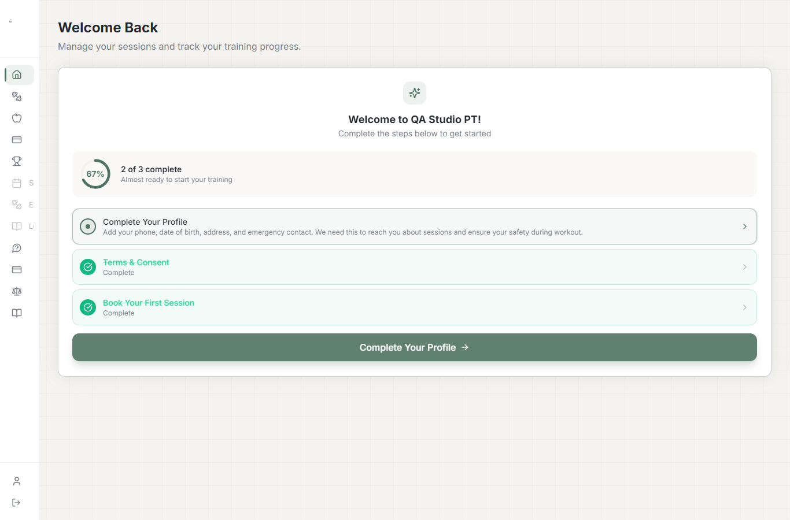 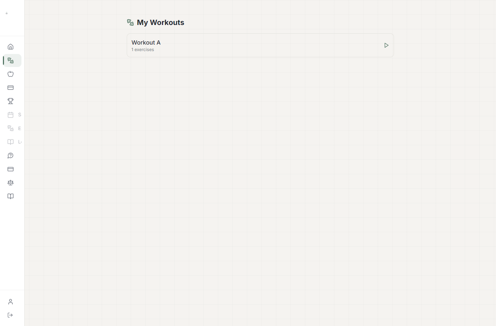 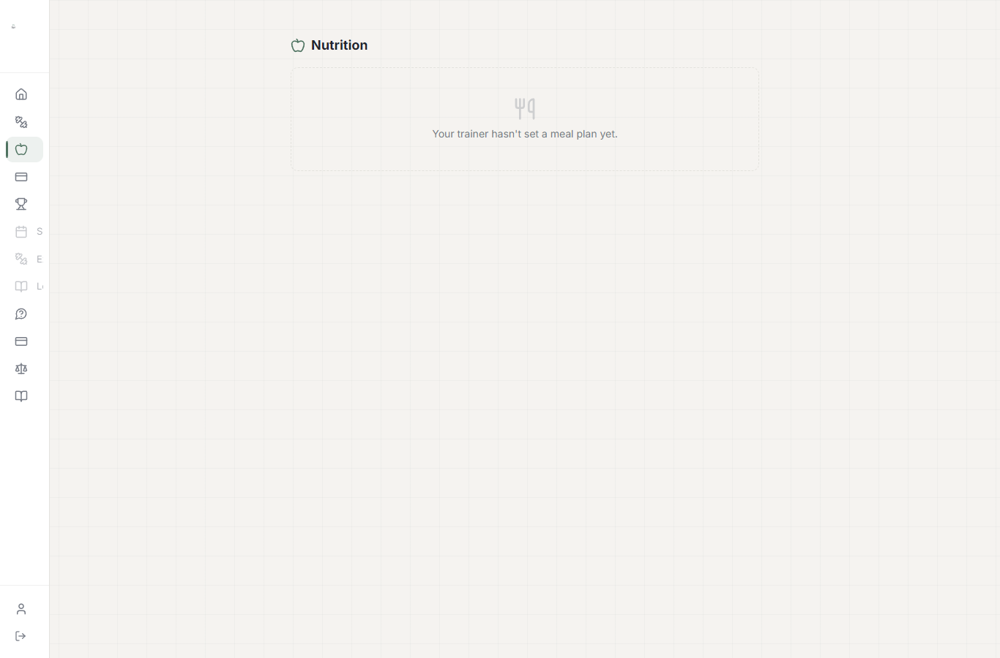 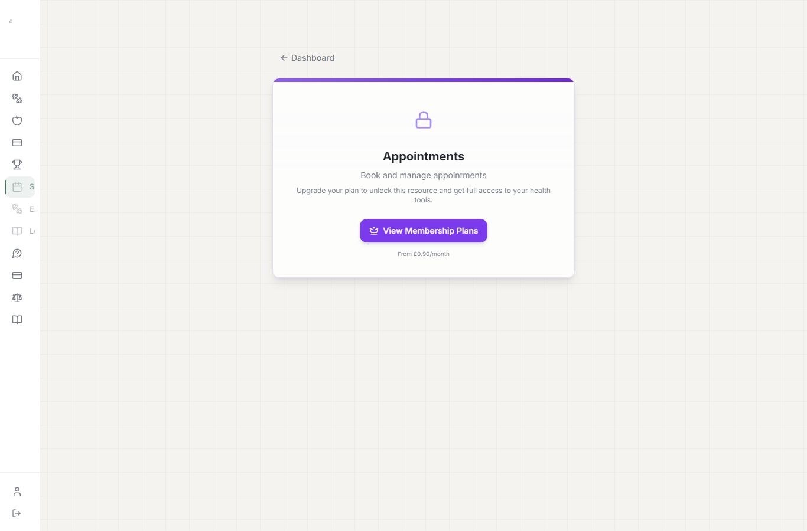 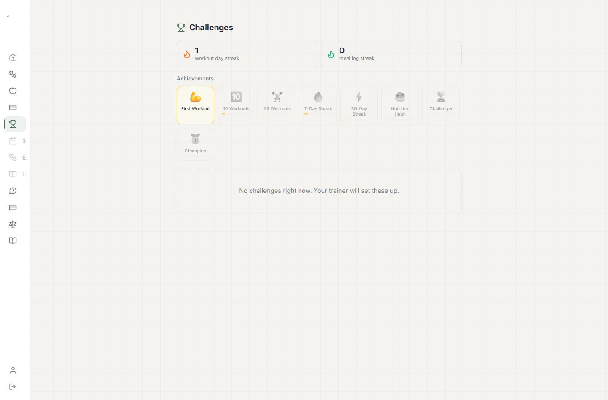
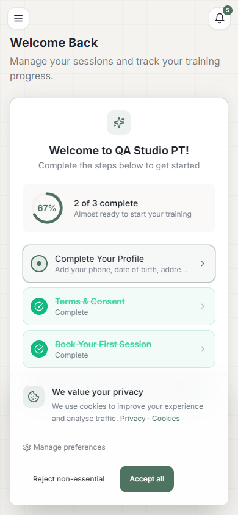 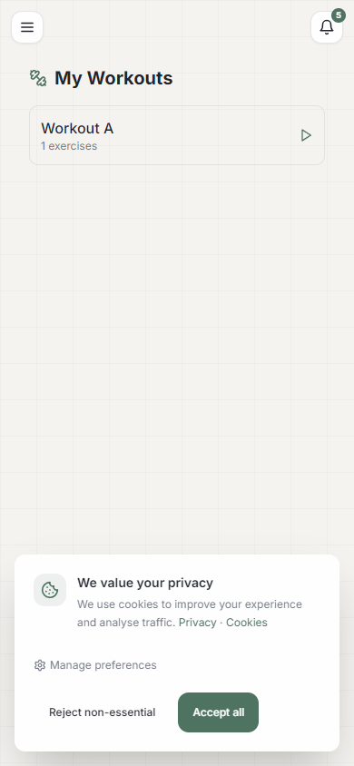 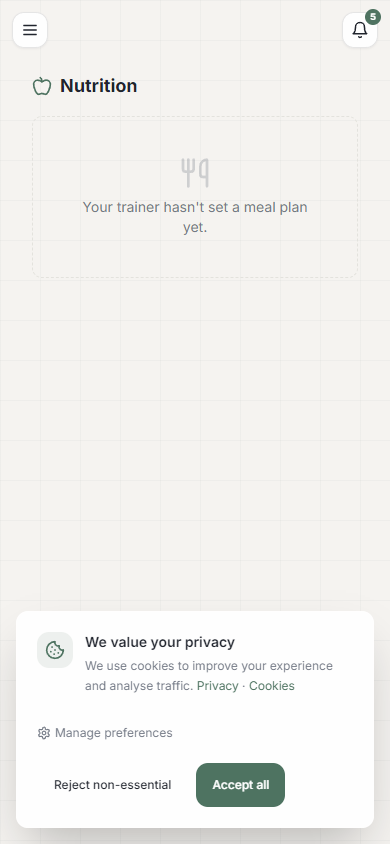 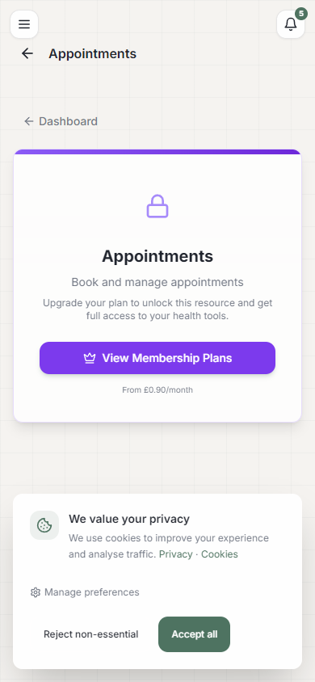 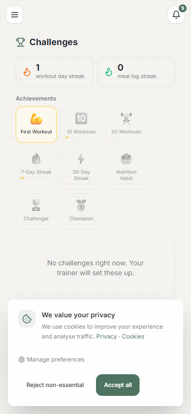

### 1.6 `/dashboard/consent`: ✅
```
[1366] /dashboard/consent -> HTTP 200 | Terms, Privacy (GDPR), Liability, Introduction, Governing Law: todos visíveis
[390]  /dashboard/consent -> HTTP 200 | idem
rede: GET /api/admin/consent-texts?locale=en-GB -> 200 ; console sem erros ; nenhuma resposta >= 400
```
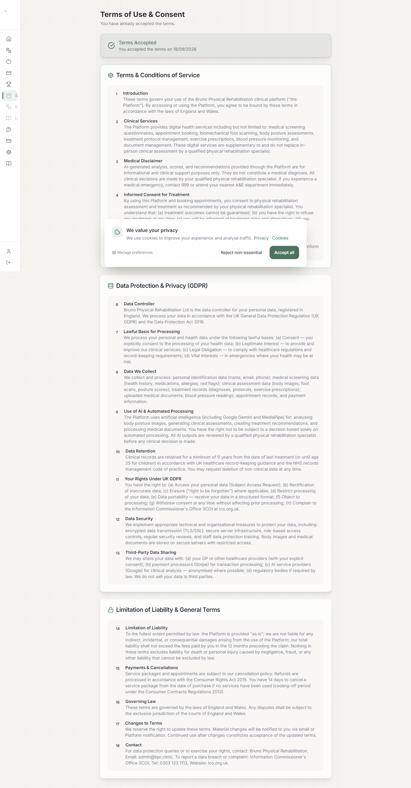 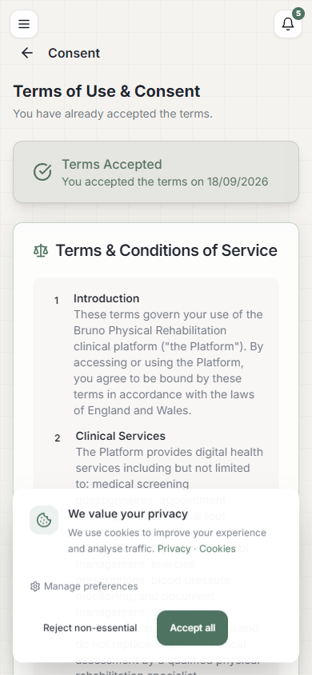

### 1.7 Staff não perde acesso: ✅
```
qa.trainer: workouts, exercises, meal-plans, finance, patients, notifications, challenges, patient-tasks, billing-plans -> 200
            assessments -> 400 {"error":"studentId is required"} ; assessments?studentId=<aluno> -> 200
qa.superadmin (Active Clinic = B): as 9 -> 200 ; finance -> 400 {"error":"No clinic"}
qa.fisioa (THERAPIST clínica A): patients, exercises, notifications, patient-tasks, consent-texts -> 200
```
Nenhum status ≠ 200 vem da T-1. O bloqueio só age com `userRole === 'PATIENT'` e só devolve `{"error":"Forbidden"}`; os casos acima trazem mensagens das próprias rotas.

### 1.8 "View as Student": ✅
```
ficha do aluno -> "View as Student" -> /dashboard (banner "Visualizando como: QA qa.aluno")
  workouts, nutrition, appointments, consent, profile -> abrem, banner visível
"Voltar ao Admin" -> /admin/patients/cmu6aoc3g000fxz8oskbwfggp
rede: POST /api/admin/impersonate 200 ; GET consent-texts 200 ; DELETE /api/admin/impersonate 200 ; nenhuma resposta >= 400
```
`__tests__/tenant/impersonation.test.ts` → 6/6 passando.

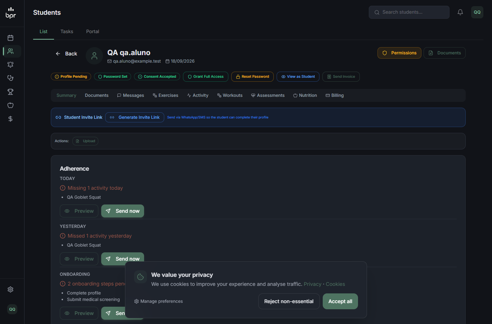 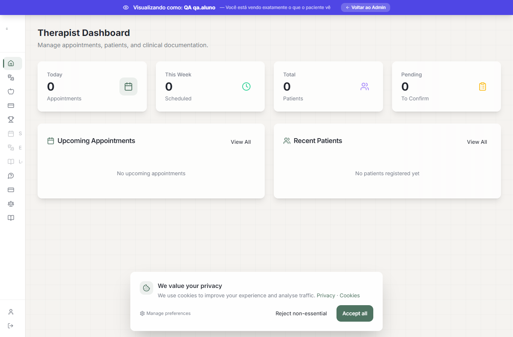 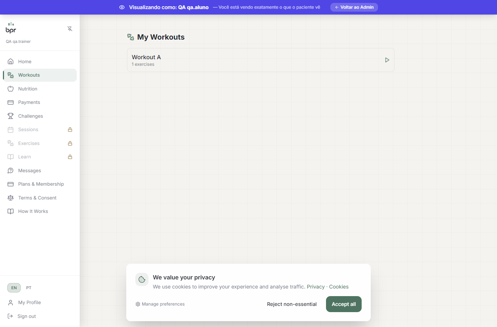 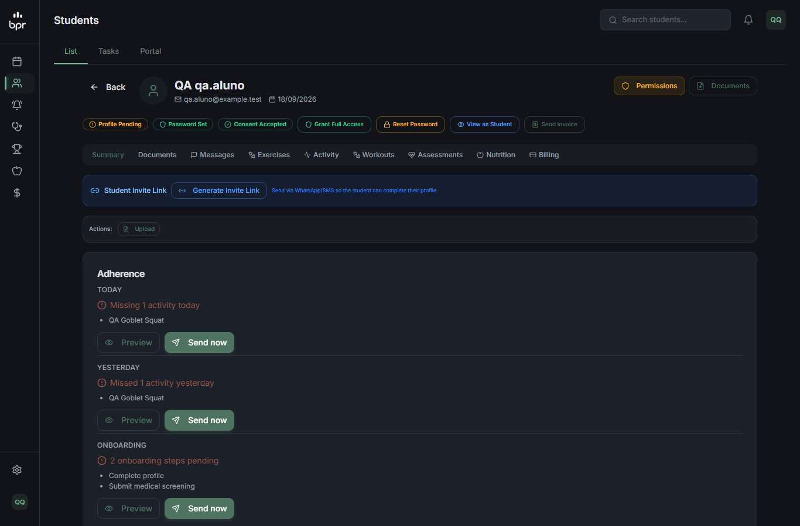

### 1.9 Sem sessão: ✅
```
GET /api/admin/finance, consent-texts, marketplace/products, workouts -> 307 /login
exceções por header (passo 4): /api/admin/maintenance/clear-images e /api/admin/backup/uploads -> 401 da própria rota (não redirect)
```

### D-1 Varredura das 196 rotas estáticas de `/api/admin`: ✅
```
qa.aluno (personal):    182 × 403 · 10 × 404 (gate personal-blocked, roda antes) · 2 × 401 · 1 × 405 · 1 × 200
qa.pacientea (clínica): 192 × 403 · 2 × 401 · 1 × 405 · 1 × 200
```
- 200: só `consent-texts`.
- 401: `maintenance/clear-images` e `backup/uploads` (a própria rota recusa).
- 405: `maintenance/setup-admin` (só aceita POST).

### D-2 Tentativas de contornar o bloqueio: ✅
```
                                   aluno                        trainer
/api/admin/finance/                308 -> /api/admin/finance    308
/api//admin/finance                308 -> /api/admin/finance    308
/api/%61dmin/finance               404                          404
/api/admin/%66inance               403                          404
/api/admin/finance%2Fstripe        403                          404
/api/admin/finance?x=1             403                          200
/API/admin/finance                 404                          404
HEAD    /api/admin/finance         403                          200
OPTIONS /api/admin/finance         403                          204
```
Nenhuma variação entregou dados ao aluno.

### D-3 `/signout` do aluno: ✅ após correção
- **Achado:** `app/signout/page.tsx:17` chama `DELETE /api/admin/impersonate` antes do `signOut`. Para PATIENT isso passou a dar 403: o logout funcionava, mas os cookies de impersonação não eram limpos.
- **Correção (sessão principal):** `{ method: 'DELETE', path: '/api/admin/impersonate' }` entrou na allowlist. Esse DELETE (`app/api/admin/impersonate/route.ts:110`) só expira cookies e não lê sessão nem banco.
- **Re-teste:**
```
qa.aluno DELETE /api/admin/impersonate -> 200
qa.aluno POST   /api/admin/impersonate -> 403   (iniciar impersonação continua proibido)
qa.aluno GET    /api/admin/finance     -> 403   (bloqueio intacto)
```

## Achados fora do escopo da T-1 (pré-existentes; registrados, não corrigidos aqui)
1. **"View as Student" mostra o "Therapist Dashboard" na home.** `app/dashboard/page.tsx` escolhe o painel pelo papel da sessão (ADMIN) sem olhar a impersonação. As outras páginas do portal impersonado estão corretas.
2. **Caminhos com ponto pulam o middleware inteiro** (matcher `.*\\..*` + `pathname.includes('.')`). Hoje o risco é baixo: ids são cuid e não há rota admin catch-all. Considerar na T-8/T-9.
3. **`/dashboard/patients` (fora do menu) mostra ao aluno a tela de staff "Student Management".** Com a T-1, o POST do botão passa a dar 403.
4. **Rate limit em memória por IP + rota:** `/api/patient/access` é chamado cerca de 4 vezes por página. Usuários atrás do mesmo NAT (wifi de academia) podem receber 429 ao navegar rápido.

## Dados alterados e restaurados
- Arquivo de controle do upload do trainer apagado, e a pasta `social` removida (não existia antes).
- Troca de Active Clinic do SUPERADMIN só nos cookie jars do curl.
- Nenhum registro do banco alterado.

Saídas brutas e scripts: `scratchpad/qa-t1/` da sessão (`s1-*.txt`, `sweep-*.txt`, `crawl/student-*/report.json`, `crawl-t1.cjs`, `ui-t1.cjs`).
