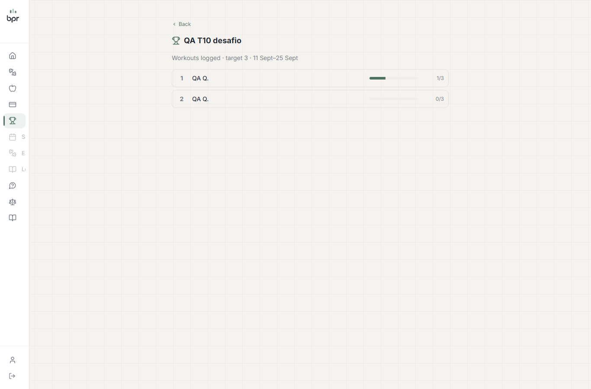

# QA — T-10: Itens médios — checkout duplicado, webhook Connect, trigger, escapes

**Resultado final:** ✅ APROVADO. Os 8 cenários em escopo (10.1–10.4, 10.6–10.9) passaram. O 10.5 (`version/update`) ficou fora do escopo da branch e foi revertido a pedido do Bruno. As ressalvas R-1 e R-3 e o achado do e-mail foram corrigidos depois do QA.

- **Data:** 18/09/2026 · **Executado por:** agente qa-tester; correções pela sessão principal.
- **Como a Stripe foi testada sem chave:** a própria rota foi carregada com tsx sobre o banco local real, com os métodos da Stripe trocados e a rede externa bloqueada (0 chamadas). O webhook usou o handler real e a verificação de assinatura real (`constructEvent`), com segredo local de teste.

| # | Cenário | Resultado |
|---|---|---|
| 10.1 | Checkout com INCOMPLETE aberta (duas abas, dois planos) | ✅ expira a anterior e sobra 1 aberta; PAST_DUE conta como viva (409) |
| 10.2 | Webhook: `active` para CANCELLED; `paused`/`incomplete` | ✅ CANCELLED não volta; status desconhecido não muda a linha; `expired` de sessão antiga não cancela a linha atual |
| 10.3 | Cancelamento com a Stripe falhando | ✅ 502 e linha inalterada; já cancelada na Stripe → 200 `alreadyCancelled` |
| 10.4 | `notifications/trigger` | ✅ ADMIN → 401 (R-4); sem `CRON_SECRET`, nenhum Bearer passa, nem o default antigo |
| 10.5 | `version/update` | N/A — fora do escopo, revertido |
| 10.6 | Mensagem do aluno com `` | ✅ HTML escapado no e-mail |
| 10.7 | Ranking e challenge ARCHIVED | ✅ ids dos outros alunos viram `rank-N`; ARCHIVED → 404 |
| 10.8 | `performedAt` inválido | ✅ 400 (POST e PATCH) |
| 10.9 | THERAPIST: refund, cancel, connect/onboard | ✅ 403; ADMIN passa |

Evidências principais:
```
10.1 aba 1 -> create(cs_1) ; aba 2 -> expire(cs_1), create(cs_2) ; abertas: [cs_2] ; com PAST_DUE -> 409
10.2 CANCELLED + subscription.updated active / invoice.paid / payment_failed -> continua CANCELLED ; paused -> linha inalterada
10.3 cancel com StripeAPIError -> 502, linha inalterada ; resource_missing -> 200 {"alreadyCancelled":true}
10.6 corpo do e-mail: &lt;img src=x onerror=alert(1)&gt; (escapado)
10.7 [aluno] leaderboard studentId: ["<id próprio>", "rank-2"]
```


## Ressalvas e correções
| # | Ressalva | Situação |
|---|---|---|
| R-1 | Um erro transitório ao expirar a sessão anterior era engolido e abria uma segunda sessão | **corrigido:** só o erro de requisição inválida (sessão já não está aberta) é ignorado; rede, rate limit ou erro da Stripe → 502, sem sessão nova |
| R-2 | Corrida entre o webhook `expired` e a criação da sessão nova | registrado (baixa) |
| R-3 | No reembolso, se o cancelamento falhava, a linha virava CANCELLED e a Stripe continuava cobrando | **corrigido:** cancela primeiro (tolerando "já cancelada"); se falhar → 502, e nada é reembolsado nem alterado |
| R-4 | `notifications/trigger` responde 401, não 403 | registrado (baixa) |
| Achado | A mensagem do aluno de um estúdio sem e-mail ia para a caixa da BPR | **corrigido:** `getAdminNotificationEmail` usa o dono do tenant (primeiro ADMIN ativo) antes do fallback global |

Verificação das correções:
```
getAdminNotificationEmail(estúdio B, sem e-mail próprio) -> qa.trainer@example.test (antes: caixa da BPR)
getAdminNotificationEmail(clínica A, sem e-mail próprio) -> qa.admina@example.test
```

**Dados:** tenants, planos, assinaturas, eventos, mensagens, challenge e avaliações de teste foram apagados. Nenhum e-mail saiu.
