# QA — T-2 + T-3: Configuração global só SUPERADMIN + Marca do estúdio

## Rodada 1 — ❌ REPROVADO

Os 18 cenários da qa-spec (2.1–2.9, 3.1–3.9) passaram, com uma ressalva na 3.2. A reprovação veio do cenário derivado **D-1**: com a regra "artigos por tenant" adotada na code review, qualquer staff de qualquer tenant publicava no **blog público da BPR**. É exatamente o que a T-2 devia impedir. Correções e re-teste nas seções seguintes.

- **Data:** 18/09/2026
- **Código:** working tree da branch `brunoto02028/Personal`, depois das correções da code review. A bateria rodada antes delas foi descartada. A T-7 começou depois da captura do menu Finance.
- **Ambiente:** local. Next dev :4002, fixtures locais, `RESEND_API_KEY` vazio, sem `STRIPE_SECRET_KEY` e sem `DEFAULT_CLINIC_SLUG` no `.env`.
- **Executado por:** agente qa-tester.

### Resumo

| # | Cenário | Tipo | Resultado |
|---|---|---|---|
| 2.1 | Trainer: PUT `/api/settings` com o corpo do GET | API | ✅ 403; `SiteSettings` idêntico |
| 2.2 | Trainer: consent-texts, portal-config, stripe-branding e todo o hub de preços | API | ✅ 403 em todas; banco inalterado |
| 2.3 | THERAPIST e ADMIN de clínica: PUT settings etc. | API | ✅ 403 |
| 2.4 | SUPERADMIN: PUT `/api/settings` | API | ✅ 200; linha restaurada byte a byte |
| 2.5 | Leitura pública (settings, termos) | API | ✅ 200 |
| 2.6 | Menus do trainer | UI | ✅ Settings: Branding \| Users · Students: List \| Tasks \| Journey · Finance sem Pricing |
| 2.7 | Páginas de plataforma pela URL | UI | ✅ 8 páginas → `/admin`; analytics, service-pages e journey abrem |
| 2.8 | SUPERADMIN: todas as abas; salvar o site pela UI | UI | ✅ restaurado |
| 2.9 | Hub de preços: trainer 403, SUPERADMIN 200 | API | ✅ |
| 3.1 | Trainer troca nome, logo e cor | UI | ✅ admin atualizado sem relogar |
| 3.2 | `/studio` e `/join` anônimos | UI | ⚠️ `/studio` ✅; `/join` sem o logo (R-1) |
| 3.3 | Aluno loga depois da mudança | UI | ✅ (ressalva de layout R-3) |
| 3.4 | PATCH com campos proibidos | API | ✅ só a cor muda |
| 3.5 | Cor/nome/logo inválidos | API/UI | ✅ 400 com mensagem |
| 3.6 | Aluno: PATCH | API | ✅ 403 |
| 3.7 | `SiteSettings` depois da 3.1 | DB | ✅ idêntico |
| 3.8 | Getting started / atalho / guia | UI | ✅ 1→2 de 5 |
| 3.9 | Restaurar a marca | — | ✅ |
| D-1 | Artigo de tenant aparece no site público da BPR | API/UI | ❌ |
| D-2 | Staff de outro tenant lê rascunhos da BPR | API | ⚠️ (anterior à tarefa) |
| D-3 | Contornar o bloqueio por URL | API | ✅ |
| D-4 | Slug de artigo global: colisão → 500 | API | ⚠️ |
| (a) | THERAPIST na marca | API/UI | ✅ 403/redirect (R-4: a aba aparece) |
| (b)–(e) | Campos proibidos, `/studio` e `/join`, `SiteSettings`, logo na barra lateral sem sair | — | ✅ (`/join` = R-1) |
| R#4 | Logo de imagem de outro tenant → 400 | API | ✅ (R-2: `../` depois de id próprio passava) |
| R#5 | Mobile: `clinicLogoUrl` absoluto | API | ✅ login/me/refresh |

### Evidências principais

**2.1 / 2.2: escritas globais pelo trainer**
```
PUT /api/settings (corpo do GET) -> 403 {"error":"Forbidden"} ; SiteSettings.updatedAt antes/depois = 2026-09-12T20:03:42.943Z (0 diferenças)
PUT consent-texts / PUT patient-portal-config / GET+POST stripe-branding -> 403
service-prices GET/POST/DELETE, service-packages GET/POST/DELETE, service-packages/ai POST,
patient-packages GET/POST/DELETE, service-access GET/POST -> 403
banco depois (SiteSettings, preços, pacotes, ServiceAccess, artigos): IDENTICO
controle SUPERADMIN: service-prices/packages/patient-packages/service-access -> 200 ; stripe-branding -> 500 (sem chave Stripe local)
```

**2.4 / 2.8: SUPERADMIN salva o site**
```
PUT /api/settings (mesmo corpo) -> 200 ; com siteName de teste -> 200, GET público reflete
UI "Save All Changes" -> PUT 200, toast "Settings saved successfully"
restauração Prisma (todos os campos + updatedAt): idêntico à base
```

**2.6 / 2.7: menus e URLs**

| Papel | Settings | Students | Finance |
|---|---|---|---|
| `qa.trainer` | Branding \| Users | List \| Tasks \| Journey | Overview \| Memberships \| Marketplace (antes da T-7) |
| `qa.superadmin` | General \| Branding \| Users \| Clinics \| AI \| Security \| Logs | List \| Screening \| Tasks \| Portal \| Journey | Overview \| Pricing \| Memberships \| Marketplace |

```
trainer/admina/fisioa: settings, clinics, ai-settings, security, system-logs, patient-portal, service-pricing,
                       stripe-branding, ai-coworker, agent-keys, voice-costs -> 307 /admin ; SUPERADMIN -> 200
analytics / service-pages / journey -> 200 para todos
/admin/studio-branding: trainer 200, admina 200, fisioa 307 /admin
variações de URL (barra final, barra dupla, ./, ?x=1) -> /admin ; maiúscula/encoding -> 404
```
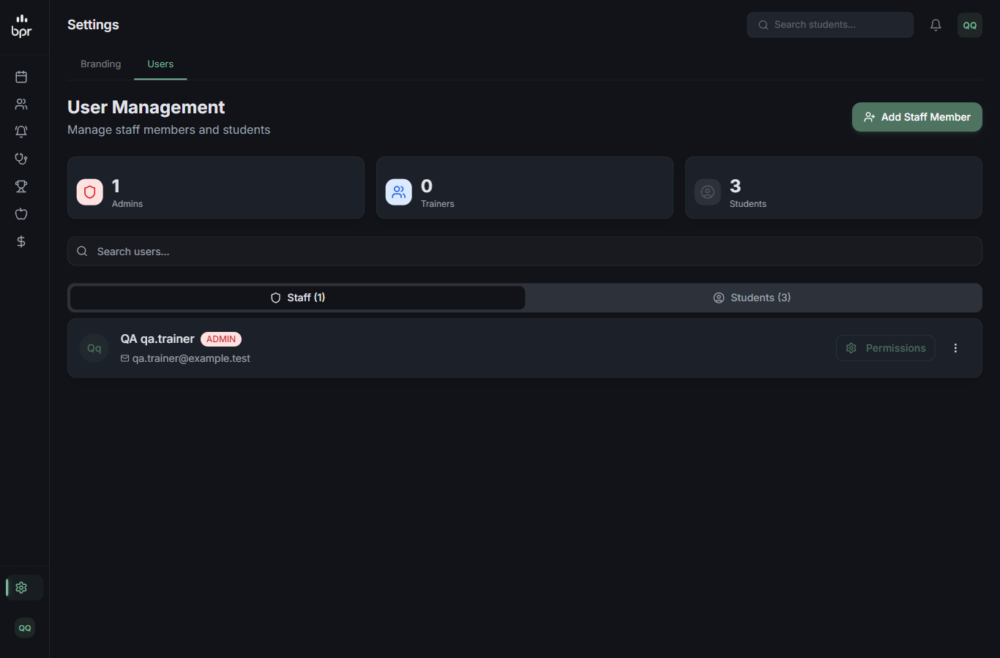 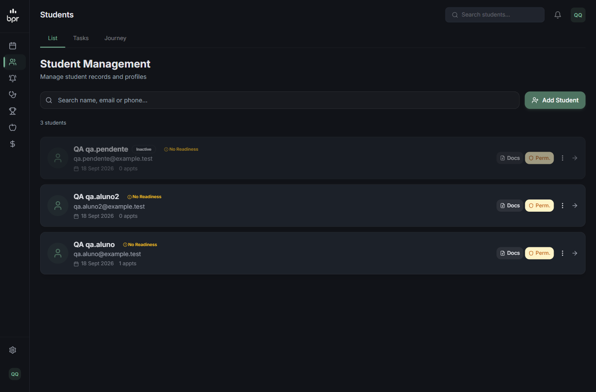 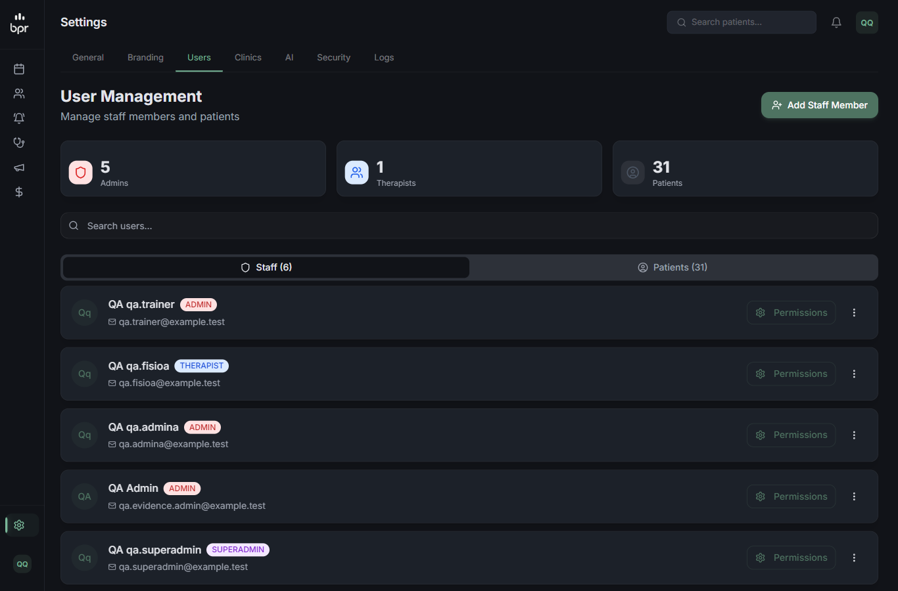 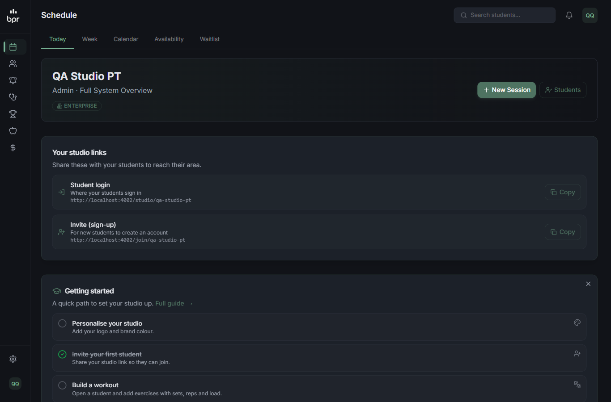

**3.1: troca de marca pelo trainer**
```
nome "QA Studio Azul" + PNG 160x160 -> /api/upload 200 -> /api/image-serve/<id> ; cor #1E6091
Save -> PATCH 200 -> POST /api/auth/session (update) 200 -> "Branding saved."
sem relogar: sessão clinicName/clinicLogoUrl/clinicPrimaryColor novos ; barra lateral com o logo do estúdio ; h1 "QA Studio Azul"
```
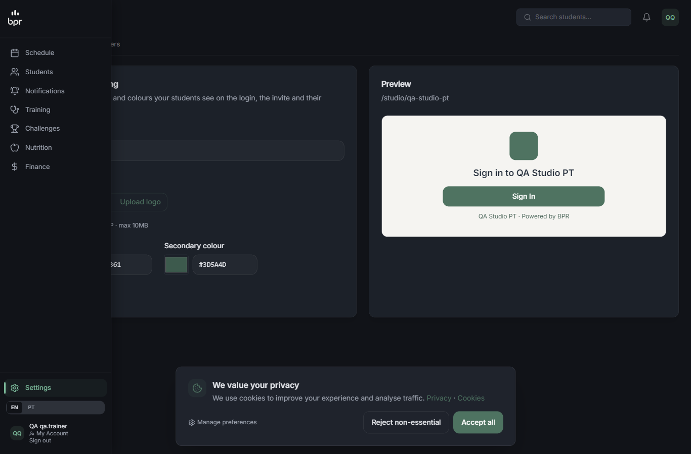  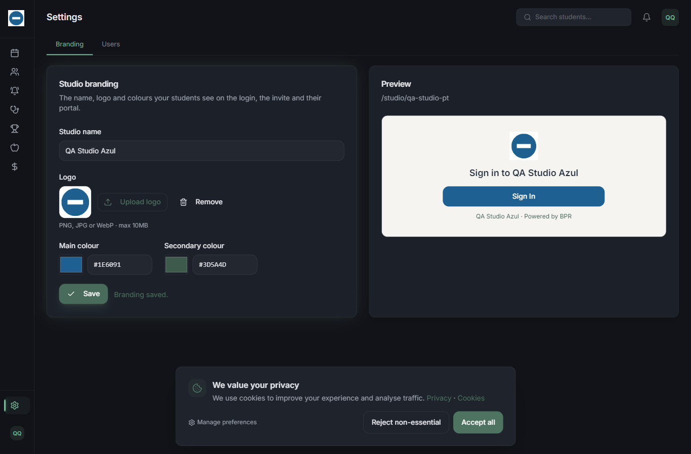

**3.2 / 3.3: o que o aluno e o público veem**
```
/studio/qa-studio-pt -> "Sign in to QA Studio Azul", logo do estúdio, botão em rgb(30,96,145)
/join/qa-studio-pt   -> nome em #1E6091, mas logos da BPR (R-1)
aluno logado depois  -> sessão com logo/cor novos ; "Welcome to QA Studio Azul!" ; aba ativa na cor nova
```
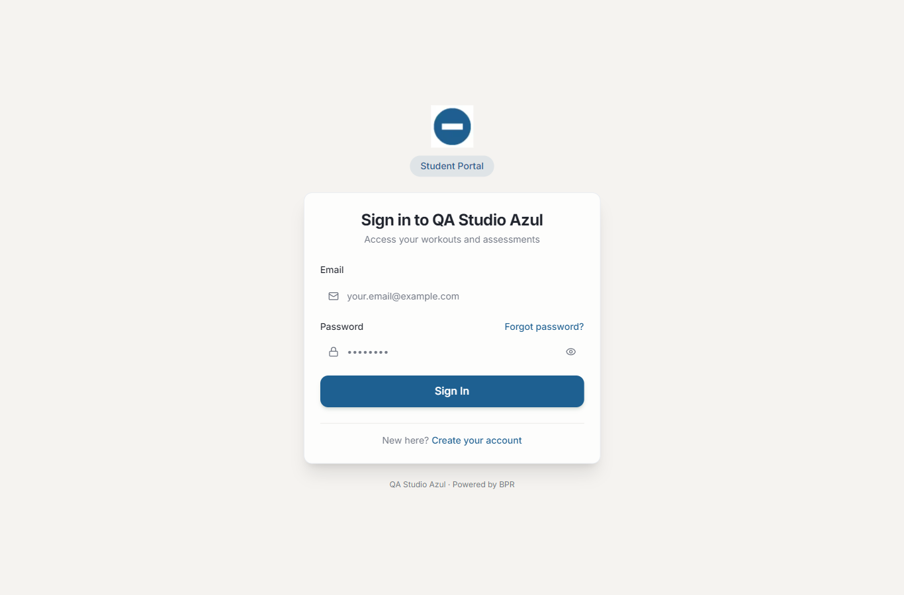 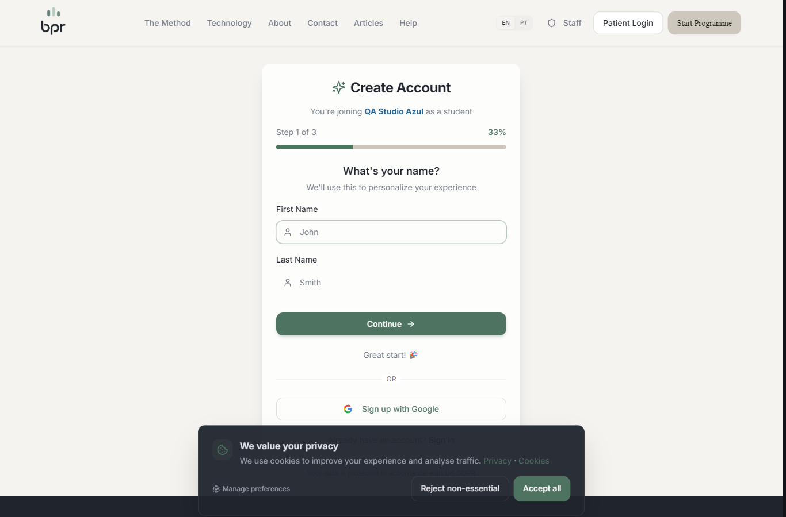 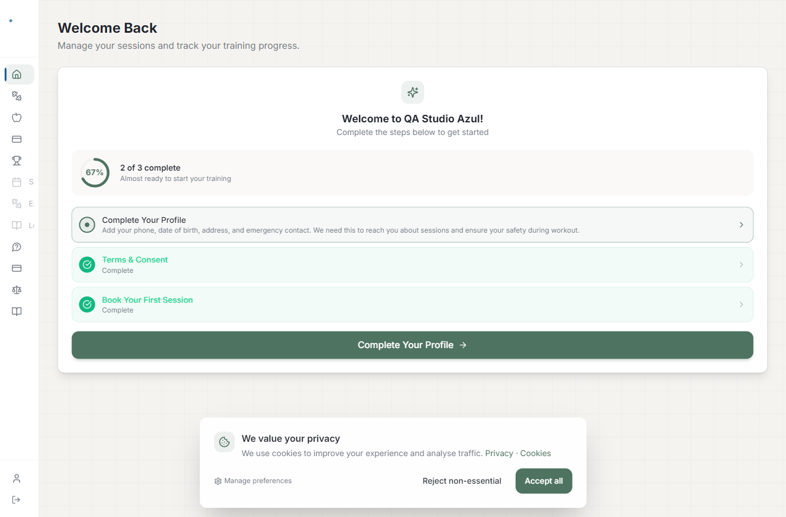

**3.4 / 3.5: validação**
```
PATCH {"slug","type","clinicId","id","isActive","stripeAccountId","primaryColor":"#000000"} -> 200, só a cor mudou
SUPERADMIN com Active Clinic = B -> só B muda ; sem Active Clinic -> 403
cor "vermelho"/"#abc"/123 -> 400 ; nome "A"/81 chars -> 400 ; logo http/javascript:/data:/"//evil" -> 400
```

**R#5: mobile**
```
POST /api/mobile/login (qa.aluno) -> user.clinicLogoUrl = http://localhost:4002/api/image-serve/<id> (absoluto) ; me/refresh idem
```

### Falha e ressalvas da rodada 1
1. **F-1 (D-1, bloqueante): artigo de tenant no site público da BPR.**
   - Um ADMIN do personal publicou um artigo. Ele apareceu em `GET /api/articles`, `/articles`, `/articles/<slug>` (com o layout e o formulário de newsletter da BPR) e no `/sitemap.xml`. O mesmo aconteceu com um THERAPIST de clínica.
   - Causa: a regra de escrita "por tenant" grava o `clinicId`, mas nenhum leitor público filtra por tenant (`app/articles/page.tsx`, `app/articles/[slug]/shared.ts`, `app/page.tsx`, `app/sitemap.ts`, `GET /api/articles`).
   - 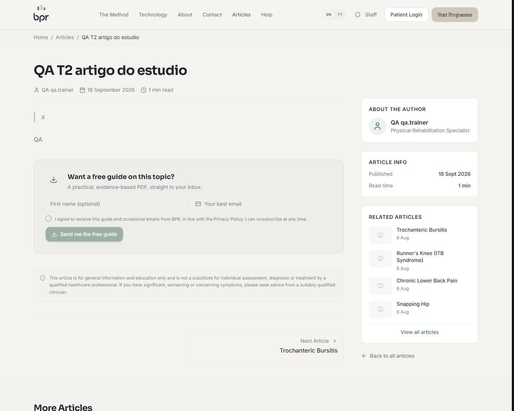
2. **R-1:** `/join/<slug>` não mostrava o logo do estúdio.
3. **R-2:** logo `/api/image-serve/<id próprio>/../../api/admin/patients` era aceito (a checagem de dono lia só o 1º segmento).
4. **R-3:** logo do aluno com a barra lateral recolhida ficava com ~5 px de largura.
5. **R-4:** a aba Branding e o atalho do `/admin` apareciam para THERAPIST, que é recusado ao clicar.
6. **R-5:** SUPERADMIN sem Active Clinic recebe um "Forbidden" genérico na API da marca.
7. **D-2 (anterior):** staff de qualquer tenant lia rascunhos da BPR. **D-4 (anterior):** slug de artigo global; colisão → 500.

### Dados alterados e restaurados (rodada 1)
- **`SiteSettings`:** restaurado byte a byte (inclusive `updatedAt`); a comparação final deu idêntico.
- **QA Studio PT:** marca restaurada ("QA Studio PT", logo null, `#4F7361` / `#3D5A4D`). QA Clinic A nunca foi alterada.
- **Artigos de teste:** apagados (34 → 34). Imagens de teste apagadas (3 → 3).
- **Newsletter:** 0 disparos.

## Correções pós-rodada 1 (sessão principal)

| Item | Correção |
|---|---|
| F-1 / D-1 | Escrita de artigos volta a ser **só SUPERADMIN** (`POST /api/articles`, `PUT`/`DELETE /api/articles/[id]`). O blog público é da BPR e não existe visão por tenant. `/admin/articles` entra em `SUPERADMIN_ONLY_ADMIN_PAGES`; a aba Articles fica `superadminOnly`; o atalho "New article" do `/admin` só aparece para SUPERADMIN. |
| D-2 | Rascunhos (lista e por id) visíveis só para SUPERADMIN. |
| R-1 | `/join/<slug>` lê `logoUrl` e mostra o logo do estúdio acima do formulário (`SimplifiedSignupForm` ganhou `logoUrl`). |
| R-2 | O logo precisa ser exatamente `https://…` ou `/api/image-serve/<id>` (id com `[A-Za-z0-9_-]`, nada depois). |
| R-3 | O contêiner do logo na barra do aluno ganhou `flex-shrink-0`. |
| R-4 | Nova flag `ownerOnly` (ADMIN/SUPERADMIN) na aba Branding, com filtro por papel em `tabAllowedFor`. O atalho do `/admin` some para THERAPIST. |
| D-4, R-5 | Não corrigidos (fora do escopo; registrados). |

## Rodada 2 (re-teste, agente qa-tester) — ❌ REPROVADO por 1 item novo

Os 7 itens do re-teste passaram. A reprovação veio de um cenário derivado novo (D-5).

| # | Cenário | Resultado |
|---|---|---|
| 1a | trainer, fisioa e admina: POST/PUT/DELETE de artigo (publicado, rascunho da BPR, id inexistente) | ✅ 403 em todos; artigos idênticos (sha256 igual) |
| 1b | SUPERADMIN cria, publica e apaga | ✅ aparece em `/articles` e `/api/articles`, depois some |
| 1c/1d | `/admin/articles` e aba/atalho de artigos para quem não é SUPERADMIN | ✅ 307 `/admin`; aba e atalho só para o SUPERADMIN |
| 2 | D-2: rascunhos | ✅ 404 para staff de tenant e anônimo; 200 para o SUPERADMIN |
| 3 | R-1: `/join` com o logo do estúdio | ✅ logo acima do formulário |
| 4 | R-2: variações do `logoUrl` (`../`, sufixos, query, encoding, http) | ✅ 400; id próprio e `https:` → 200 |
| 5 | R-3: logo do aluno com a barra recolhida | ✅ 28 × 38,7 px (antes ~5 px) |
| 6 | R-4: Branding para THERAPIST | ✅ sem aba, sem atalho, página → `/admin`, API 403 |
| 7 | Regressão: `PUT /api/settings` e menus do trainer | ✅ |
| D-5 | Escrita de artigo pelas rotas de importação | ❌ `POST /api/admin/articles/import` e `/bulk-import` aceitavam ADMIN/THERAPIST de qualquer tenant: o trainer criou um rascunho no blog da BPR, e o servidor buscava qualquer URL (`127.0.0.1:1` → 500 "fetch failed", não 403) |

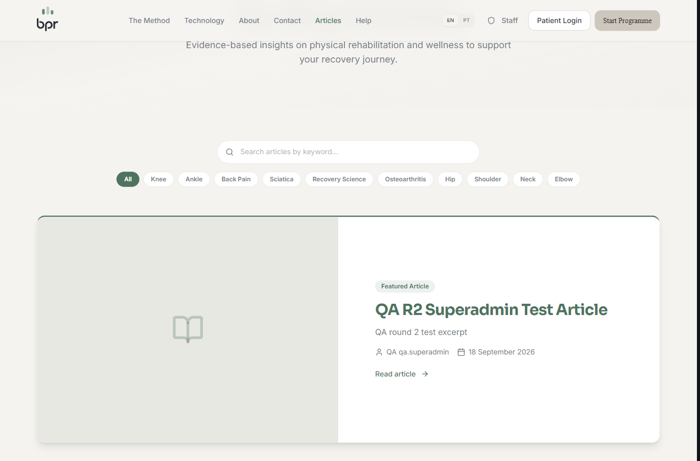 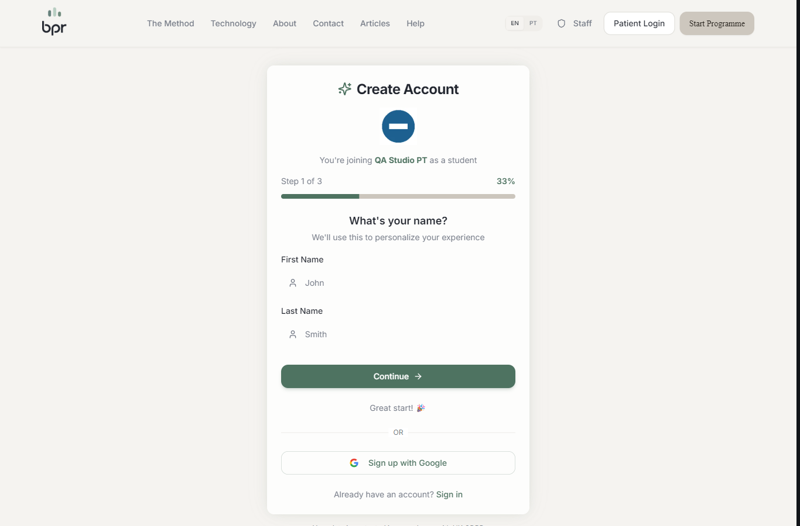 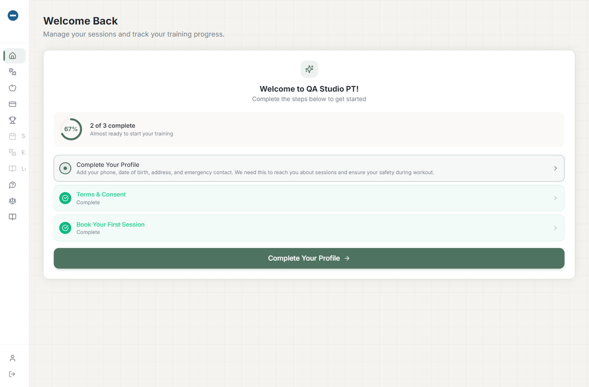 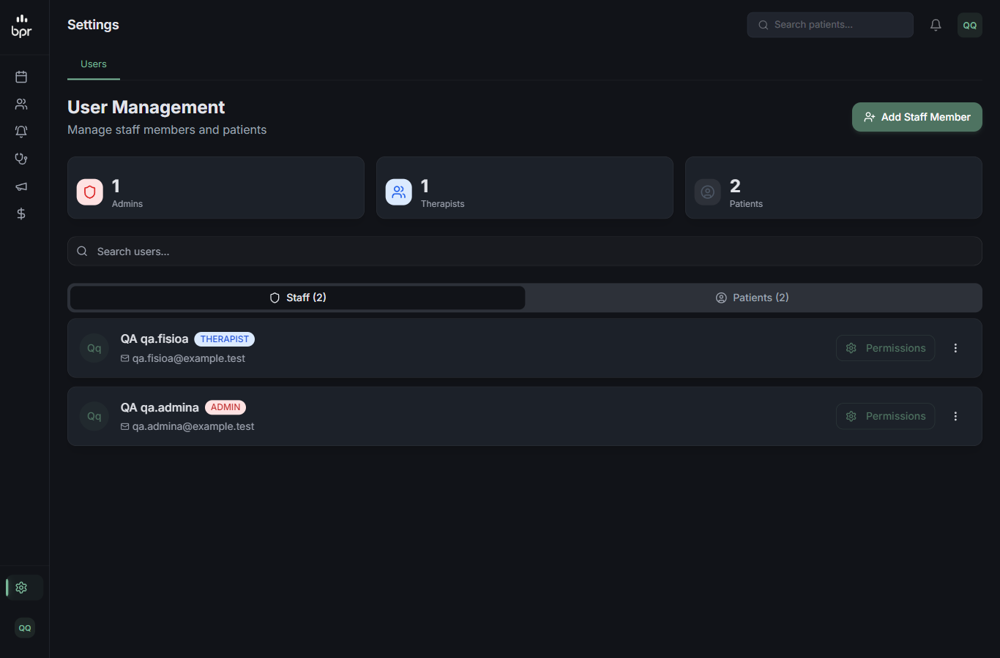 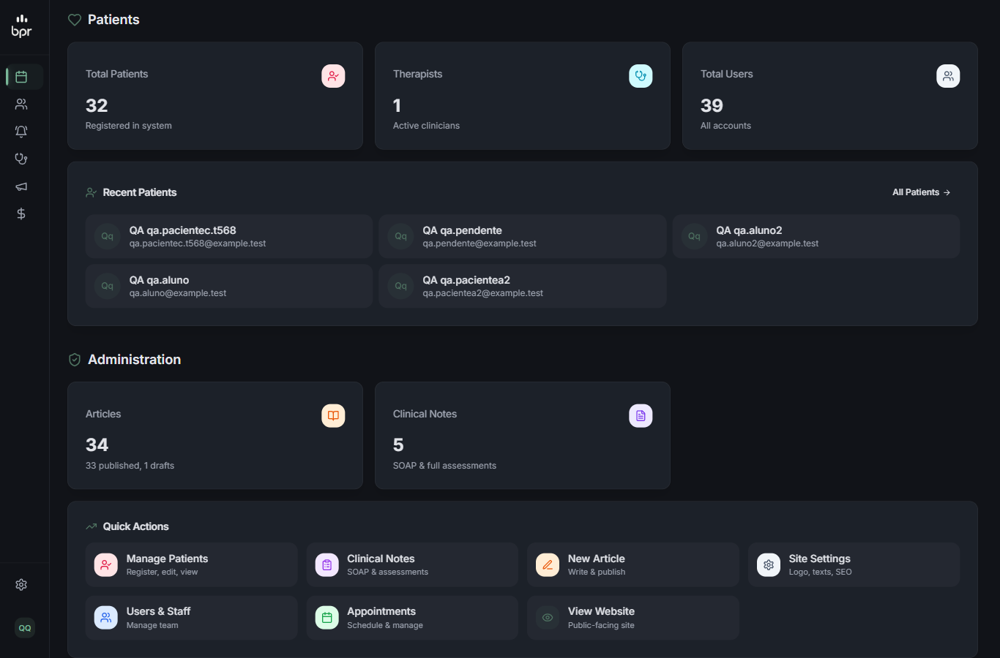

Ressalvas menores da rodada 2:
- **O-1 (clínica):** o card "Articles" do `/admin` leva a uma página que redireciona. Alerta para a frente da clínica, não é desta branch.
- **O-2 (clínica):** `/admin/marketing/articles` abre para ADMIN/THERAPIST de clínica, mas a API recusa. Alerta para a frente da clínica; o personal já é bloqueado em `/admin/marketing`.
- **O-4:** o THERAPIST via a aba Finance, mas a API dá 403 (consequência da T-6). Corrigido abaixo.

Dados: tudo restaurado (`SiteSettings` byte a byte, marca do QA Studio PT, artigos com sha256 igual, 34, imagens 5 → 3, pasta `public/uploads/articles/` removida).

### Correções pós-rodada 2 (sessão principal)
- **D-5:** `POST /api/admin/articles/import` e `/bulk-import` → só SUPERADMIN (`getSuperadminActor`). Todo `/api/admin/articles/*` entra em `PERSONAL_BLOCKED_ROUTES` (ferramentas do blog da BPR que um estúdio nunca usa).
- **O-4:** as abas Finance → Overview e Marketplace ganham `ownerOnly` (somem para THERAPIST).

## Rodada 3 (verificação do D-5, sessão principal) — ✅ APROVADO
```
trainer  POST /api/admin/articles/import {"url":"http://127.0.0.1:1/"}           -> 404 {"error":"Not found"}   (gate personal)
trainer  POST /api/admin/articles/bulk-import {"mode":"discover",...}            -> 404
trainer  POST /api/admin/articles/generate                                       -> 404
admina   POST /api/admin/articles/import                                         -> 403 {"error":"Forbidden"}
admina   POST /api/admin/articles/bulk-import                                    -> 403
fisioa   POST /api/admin/articles/import                                         -> 403 {"error":"Forbidden"}
fisioa   POST /api/admin/articles/bulk-import                                    -> 403
superadmin POST /api/admin/articles/import (URL inalcançável)                    -> 500 "fetch failed" (passou da trava, como esperado)
Article.count antes = depois = 34 (nenhuma escrita)
```
Nenhuma requisição de staff de tenant chegou a buscar a URL: todas foram recusadas antes do handler ou no início dele.

**Veredito final T-2 + T-3: ✅ APROVADO** (rodadas 1–3). Pendências registradas fora do escopo: D-4 (slug global de artigo), R-5 (mensagem do SUPERADMIN sem clínica ativa), O-1/O-2 (clínica).
