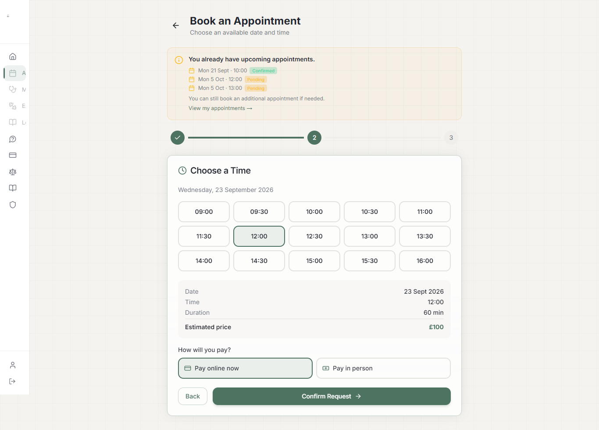
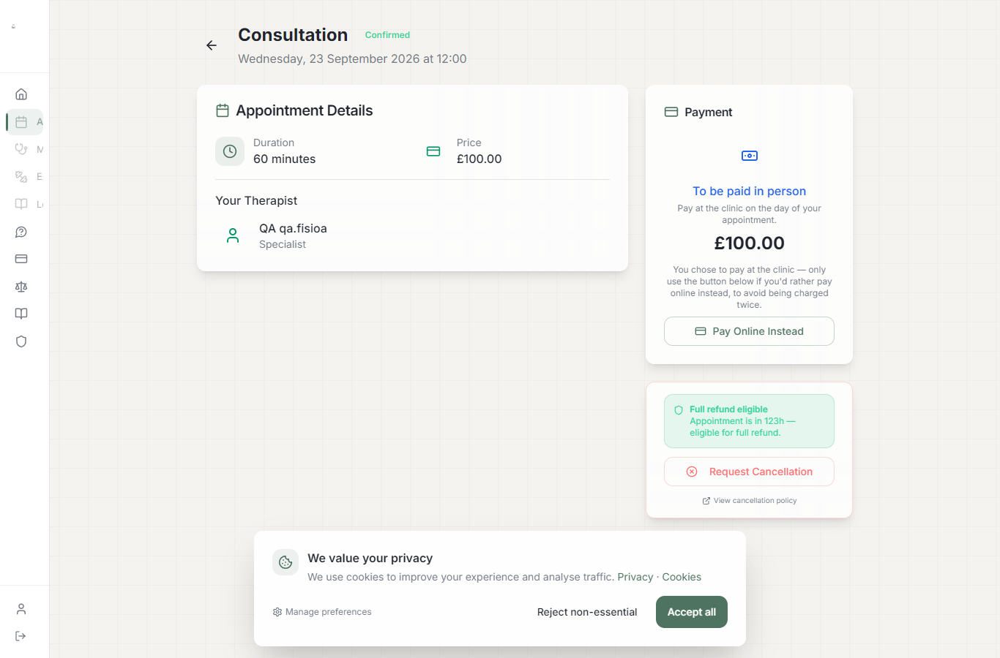
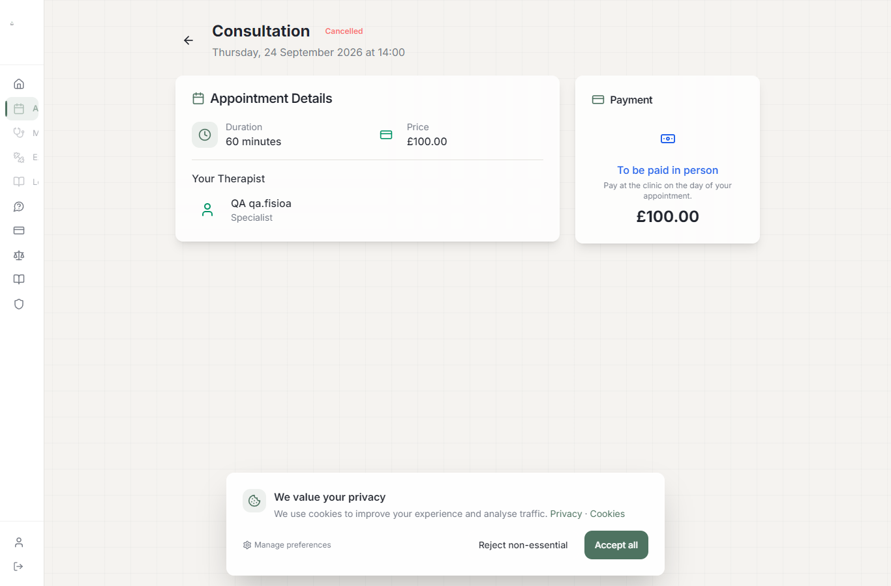
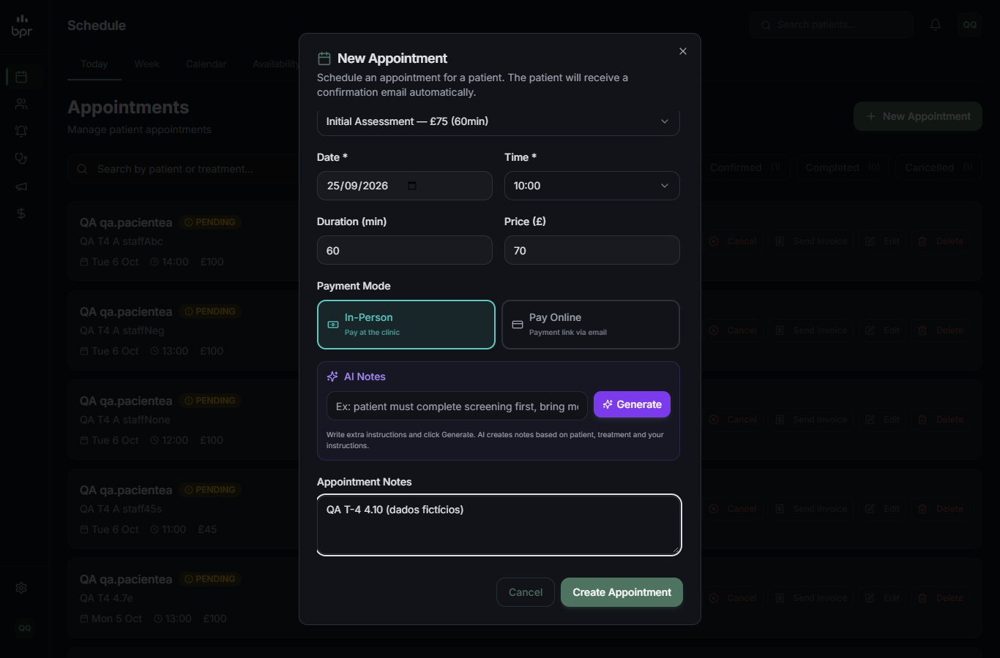
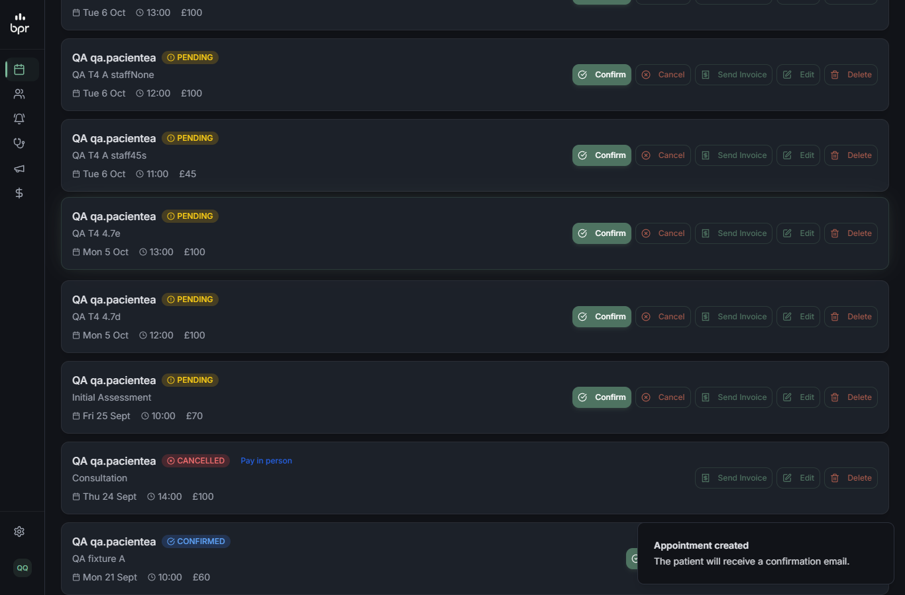
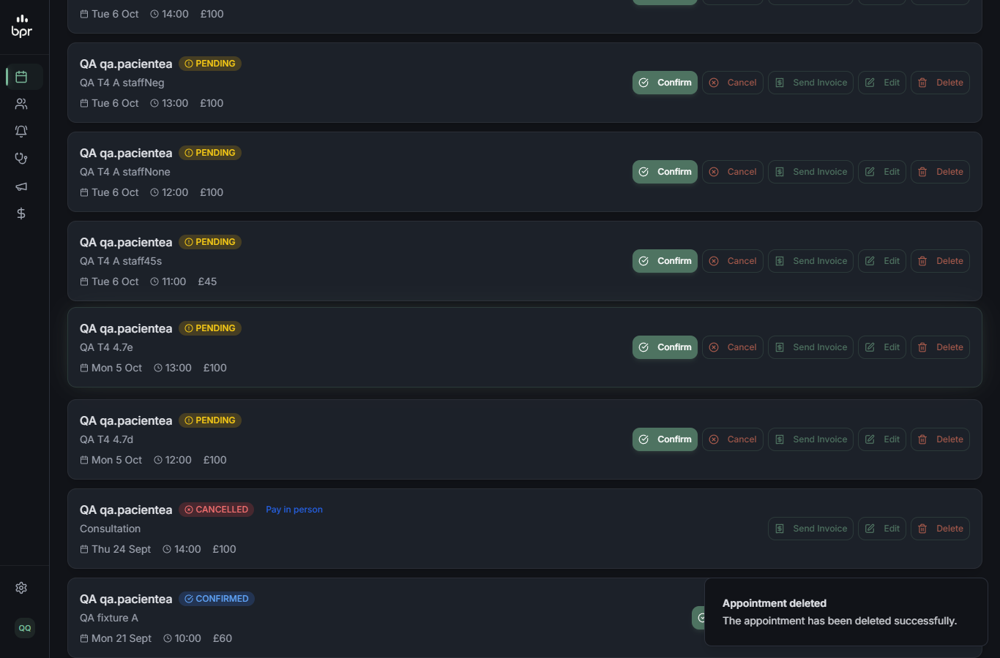
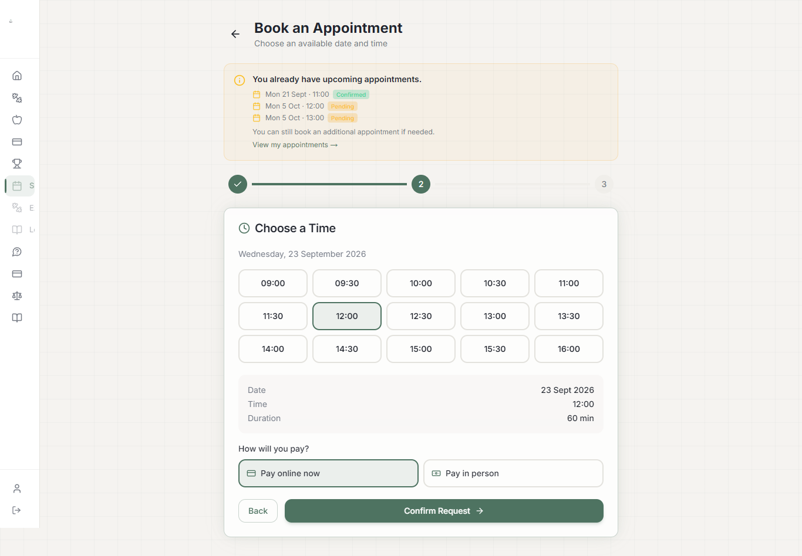

# QA — T-4: Agendamentos — tenant + dono no `[id]`, preço no servidor

**Resultado:** ✅ APROVADO. Os 10 cenários da qa-spec (4.1–4.10) e 10 derivados passaram. 5 ressalvas de baixa severidade (R-1 a R-5) — **R-1, R-2 e R-5 corrigidas depois do QA** (ver adendo) — e 3 achados anteriores à tarefa (F-1 a F-3), fora do escopo.

- **Data:** 18/09/2026
- **Código:** working tree da branch `brunoto02028/Personal`:
  - `app/api/appointments/[id]/route.ts`: `resolveActor` = `getSessionStaffActor ?? getActor` + `assertAppointmentAccess`; paciente só pode mandar `{"status":"CANCELLED"}`;
  - `app/api/appointments/route.ts`: `patientBookingPrice`; preço do staff aceita 0 e string numérica;
  - `app/api/patient/service-prices/route.ts` + `lib/service-price.ts` (novo);
  - `app/api/admin/appointments/route.ts`: `patientId` precisa ser PATIENT da clínica do chamador.
  - As duas correções do code review (`resolveActor`, `Number(price)`) já estavam no disco antes do primeiro teste.
- **Ambiente:** local, Next dev :4002, banco local com fixtures, `RESEND_API_KEY` vazio, WhatsApp sem configuração.
- **Mudanças em paralelo:** durante a rodada a sessão principal alterou `middleware.ts`, `lib/auth-options.ts` e `lib/auth-credentials.ts` (T-2/T-3); por isso os cenários principais foram repetidos no fim sobre a árvore atual, com resultados idênticos.
- **Executado por:** agente qa-tester. Adendo final pela sessão principal.

IDs: sessão B = `cmu6aoc4t001nxz8or65s6p8y` (`qa.aluno`, £60, CONFIRMED); sessão A = `cmu6aoc4q001lxz8olo1j64iy` (`qa.pacientea`). `ServicePrice` inicial: só o padrão da plataforma (CONSULTATION £100, `clinicId` null).

## Resumo

| # | Cenário | Tipo | Resultado |
|---|---|---|---|
| 4.1 | `qa.aluno`: PATCH sessão B `{"price":0.3}` | API | ✅ 403; preço 60; `updatedAt` inalterado |
| 4.2 | `qa.aluno`: PATCH sessão B `{"dateTime":"+1 dia"}` | API | ✅ 403; data inalterada |
| 4.3 | `qa.aluno`: PATCH `{"status":"CANCELLED"}` | API | ✅ 200; restaurada pelo trainer |
| 4.4 | `qa.aluno2`: GET/PATCH sessão B | API | ✅ 404 (DELETE → 403 por papel) |
| 4.5 | `qa.admina` (tenant A): GET/PATCH/PUT/DELETE sessão B | API | ✅ 404 em todos; nenhum dado de B |
| 4.6 | `qa.trainer`: GET/PATCH/PUT/DELETE sessão A | API | ✅ 404 |
| 4.7 | `qa.aluno`: POST com `price: 0.3` | API | ✅ gravado £0 (personal); clínica A → £100 |
| 4.8 | `qa.trainer`: POST admin com `qa.pacientea` | API | ✅ 404 "Patient not found"; 0 sessões; 0 tentativas de e-mail |
| 4.9 | `qa.pacientea`: agenda, remarca, cancela | UI+API | ✅ tudo 200 |
| 4.10 | `qa.admina`: cria, edita, cancela e apaga pelo admin | UI | ✅ tudo 200 |
| D-a | "Estimated price" = preço gravado | UI | ✅ £100 = 100; com preço próprio da clínica, £75 = 75 |
| D-b | Aluno do personal: sem preço no formulário, grava 0 | UI | ✅ |
| D-c | Bearer do mobile: GET sessão B | API | ✅ 200 |
| D-imp | Trainer com "View as Student" ativo: PATCH/DELETE | API | ✅ age como staff; tenant A → 404 |
| D-price | Preço no POST (staff 0/"45"/omitido/inválido; paciente) | API | ✅ 0→0, "45"→45, inválido → preço do servidor; paciente sempre servidor |
| D-tenant-price | `/api/patient/service-prices` por tenant | API | ✅ cada tenant só o seu (+ padrão da plataforma só para clínica) |
| D-sa | SUPERADMIN age na clínica ativa | API | ✅ |
| D-var | 12 variações de corpo do paciente | API | ✅ todas 403; banco inalterado |
| D-staff | Staff no próprio tenant × cruzado | API | ✅ próprio 200, cruzado 404 |
| D-anon | Sem sessão | API | ✅ 307 → `/login` |

## Evidências principais

### 4.1 / 4.2 / D-var — aluno não muda preço nem data
```
DB antes: {"dateTime":"2026-09-21T10:00:00.000Z","status":"CONFIRMED","price":60,"updatedAt":"...07:41:52.864Z"}
[aluno] PATCH {"price":0.3}                       -> 403 {"error":"Patients can only cancel appointments"}
[aluno] PATCH {"dateTime":"2026-09-22T10:00:00Z"} -> 403
variações: {"status":"CANCELLED","price":0.3} / {"status":"CONFIRMED"} / {"status":"cancelled"} /
           {"notes":"x"} / {"treatmentType":"Free"} / {} / null / ["status"] / PUT {...} -> 403
           DELETE -> 403 ; Bearer PATCH {"price":0.3} -> 403
DB depois: idêntico, updatedAt inalterado (nenhuma escrita)
```

### 4.3 — cancelamento do próprio aluno
```
[aluno]   PATCH {"status":"CANCELLED"} -> 200 ; DB status CANCELLED, price 60
[aluno]   PATCH {"status":"CONFIRMED"} -> 403  (não reverte)
[trainer] PATCH {"status":"CONFIRMED"} -> 200  (restaurado)
```

### 4.4–4.6 — isolamento por dono e por tenant
```
[aluno2] GET/PATCH/PUT sessão B -> 404 {"error":"Not found"} ; DELETE -> 403
[admina] GET/PATCH/PUT/DELETE sessão B -> 404 ; [fisioa] idem ; [pacientea] GET/PATCH B -> 404
[trainer] GET/PATCH/PUT/DELETE sessão A -> 404
controles: trainer GET B -> 200 ; admina/fisioa/pacientea GET A -> 200
```

### D-sa — SUPERADMIN segue a clínica ativa
```
sem clínica selecionada: GET B -> 404 ; GET A -> 404
selected-clinic-id = B: GET B -> 200 ; GET A -> 404
selected-clinic-id = A: GET B -> 404 ; GET A -> 200
```

### 4.7 / D-price — preço decidido pelo servidor
```
[aluno]     POST price 0.3 / "0.3" / 1000        -> gravado 0    (personal sem preço próprio)
[aluno]     POST com patientId de outro aluno    -> criada para o próprio aluno
[pacientea] POST price 0.3 / "0.3"               -> gravado 100  (padrão da plataforma)
[trainer]   patientId=aluno: price 0 -> 0 ; "45" -> 45 ; sem price -> 0
[admina]    price 0 -> 0 ; "45" -> 45 ; sem price/-5/"abc" -> 100
[trainer] POST /api/appointments patientId=<pacienteA> -> 404 ; [admina] patientId=<aluno> -> 404
```

### D-tenant-price — preços isolados por tenant
Com preços temporários (A £75, B £40), criados e apagados depois:
```
[pacientea] GET /api/patient/service-prices -> [{"name":"QA T4 temp A","price":75}]  (o padrão £100 some)
[aluno]     GET /api/patient/service-prices -> [{"name":"QA T4 temp B","price":40}]  (nada de A nem da plataforma)
POST pacientea -> 75 ; POST aluno -> 40 ; preço de B desativado: aluno GET -> [] e POST -> 0
```

### 4.8 — staff de um tenant agendando paciente de outro
```
antes: sessões pacienteA=7, aluno=6, EmailMessage=7, WhatsAppMessage=0
[trainer] POST /api/admin/appointments {"patientId":"<pacienteA>","price":10,"paymentMode":"online"} -> 404 {"error":"Patient not found"}
derivados: patientId = fisioA / o próprio trainer / id inexistente -> 404 ; [admina] patientId=<aluno> -> 404 ; [aluno] -> 403 (T-1)
log do servidor: só "POST /api/admin/appointments 404"; tentativas de [EMAIL]: 0
depois: contagens idênticas
```

### 4.9 — paciente da clínica (UI)
- Agendou 23/09 12:00, resumo "Estimated price £100", pagamento presencial → `POST /api/appointments` 200, price 100.
  O browser ainda envia `"price":100` no corpo; o servidor ignora.
- Remarcação pela rota correta: `POST /reschedule` → 200 (`rescheduleNumber:1`, `freeReschedulesRemaining:1`); detalhe passa a 24/09 14:00.
- "Request Cancellation" → `POST /api/patient/cancellation` 200 (`refundEligible:true`).
- `PATCH {"status":"CANCELLED"}` → 200. Console sem erros; nenhuma resposta ≥ 400.

   

### 4.10 — admin da clínica (UI)
```
POST /api/admin/appointments -> 200 (price 70, PENDING) ; PUT (editar data) -> 200 ; PUT (cancelar) -> 200 ; DELETE -> 200
console sem erros; nenhuma resposta >= 400
```
  

### D-a / D-b — o que a tela mostra é o que grava
| Situação | Formulário | Gravado |
|---|---|---|
| Clínica A com padrão da plataforma | £100 | 100 |
| Clínica A com preço próprio | £75 | 75 |
| Aluno do personal | sem "Estimated price" | 0 |

 

### D-c / D-imp
```
Bearer qa.aluno GET /api/appointments/<B> -> 200 (sessão completa) ; Bearer inválido -> 401
[trainer com impersonação ativa] PATCH <B> {"notes":"qa"} -> 200 (age como staff) ; restaurado para null
                                 GET/DELETE sessão A -> 404 ; DELETE sessão de teste -> 200
```

## Ressalvas

| # | Ressalva | Situação |
|---|---|---|
| R-1 | A mensagem do 404 diferenciava id inexistente ("Appointment not found") de sessão de outro tenant ("Not found") | **corrigida** (adendo) |
| R-2 | O paciente podia cancelar sessão já COMPLETED, e o PATCH direto pula a política de 24h do fluxo "Request Cancellation" (comportamento anterior à T-4) | **corrigida** (adendo) |
| R-3 | Clínica sem nenhum preço CONSULTATION ativo: o formulário não mostra preço, mas o servidor grava o fallback de £60 | registrada; só ocorre sem o padrão da plataforma |
| R-4 | Preço inválido vindo do staff (`-5`, `"abc"`) cai em silêncio no preço do servidor em vez de 400 | registrada (aceitável) |
| R-5 | PATCH com JSON malformado → 500 | **corrigida** (adendo) |

## Achados fora do escopo (anteriores; registrados, não corrigidos)
1. **F-1: o app mobile não consegue agendar.** `POST /api/appointments` com Bearer → 401: o guard `getServerSession` (só cookie) em `app/api/appointments/route.ts:116` roda antes do `getActor`. `mobile/src/api/booking.ts` usa essa rota. O GET por id funciona. → vai para a atividade do app mobile.
2. **F-2: o detalhe da sessão do aluno do personal mostra coisas da clínica** (card "Payment" com "Pay Online Instead", banner "Medical Screening Required"). → T-7.
3. **F-3: o portal web não tem botão de remarcar**; `/reschedule` só pela API.

## Adendo — correções pós-QA (sessão principal)
Três ressalvas corrigidas em `app/api/appointments/[id]/route.ts` e re-testadas:
```
R-1  GET /api/appointments/doesnotexist123456 (trainer) -> 404 {"error":"Not found"}   (mesma msg de outro tenant)
R-5  PATCH JSON malformado                               -> 400 {"error":"Invalid JSON body"}
R-2  trainer marca COMPLETED -> aluno PATCH {"status":"CANCELLED"} -> 409 {"error":"Only upcoming appointments can be cancelled"}
     sessão de volta a CONFIRMED -> aluno cancela -> 200   (regressão do 4.3 mantida)
estado final da sessão B: £60 / CONFIRMED / 2026-09-21T10:00Z
```
O cancelamento pelo paciente vale para PENDING, PENDING_PATIENT e CONFIRMED.

## Dados alterados e restaurados
- Sessão B: cancelada e restaurada; `notes` alterado e revertido. Final: **£60 / CONFIRMED / 2026-09-21T10:00Z / notes null**.
- 26 sessões criadas nos testes: todas apagadas. `CancellationRequest` do 4.9: apagado.
- `ServicePrice` temporários (A £75, B £40): criados e apagados; o padrão da plataforma teve `isActive` alternado e restaurado.
- Impersonação encerrada. Nenhum e-mail real, nenhum WhatsApp, nenhum `Payment` criado.
- Snapshot final do banco comparado com o inicial: **idêntico** (ignorando `updatedAt`).

Saídas brutas e scripts: `scratchpad/qa-t4/` da sessão (`s4*.txt`, `s-*.txt`, `ui-*.json`, `db-before.json`, `db-after.json`, `ui-t4.cjs`, `req.sh`, `db.cjs`).
