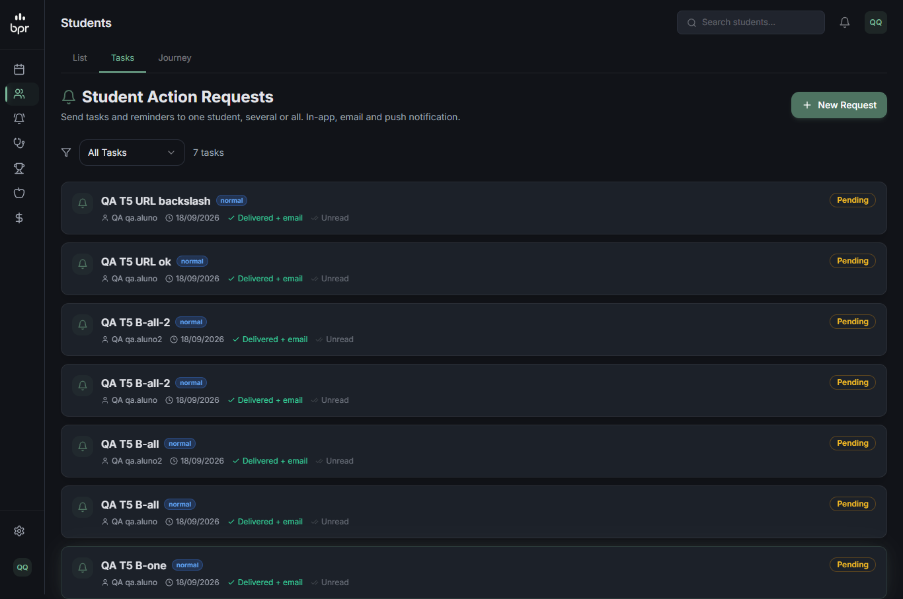
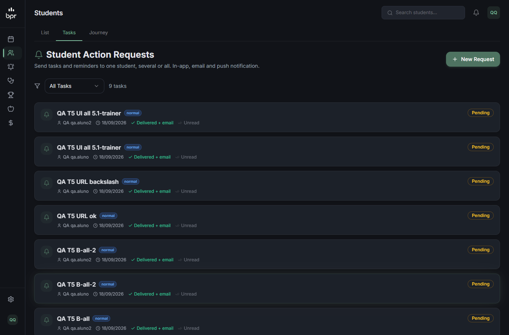
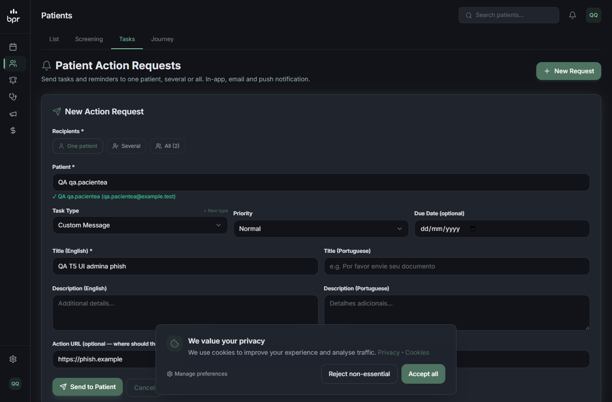
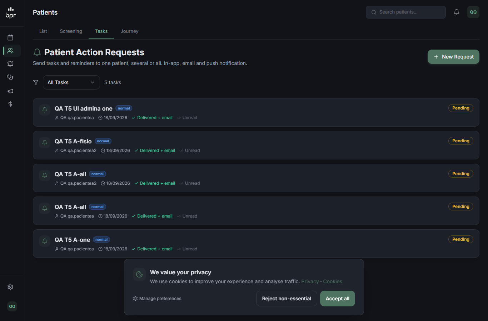

# QA — T-5: Tarefas em massa (`patient-tasks`) presas à clínica de quem chama

**Resultado final:** ✅ APROVADO na rodada 2. A rodada 1 reprovou num derivado (D-a: o `actionUrl` era contornável).

## Rodada 1 — ❌ REPROVADO (agente qa-tester, 18/09/2026)

- **Código:** `app/api/admin/patient-tasks/route.ts` (`getSessionStaffActor`, `MAX_LIMIT = 200`, `isSafeActionUrl`).
- **Ambiente:** local, Next dev :4002, fixtures + clínica C temporária (`qa-clinic-c-t568`, apagada no fim). `RESEND_API_KEY` vazio, WhatsApp e FCM sem configuração.

| # | Cenário | Tipo | Resultado |
|---|---|---|---|
| 5.1 | trainer GET `?limit=100000` | API+UI | ✅ só alunos do B; com 206 tarefas no B, volta 200 |
| 5.2 | trainer POST `{"audience":"all"}` | API+UI | ✅ 2 registros (`qa.aluno`, `qa.aluno2`); `qa.pendente` (inativo) fora; 0 para A |
| 5.3 | trainer POST com `qa.pacientea` | API | ✅ 404 "Patient not found" em 10 variações (mistura aluno + A também recusa tudo) |
| 5.4 | `actionUrl: "https://phish.example"` | API+UI | ✅ 400 (e mais 9 formatos externos → 400) |
| 5.5 | admina POST para `qa.pacientea`; "todos" | API+UI | ✅ 201; "todos" → 2 da clínica A |
| D-a | `actionUrl` com `\`, TAB ou LF depois da barra | API+browser | ❌ `/\phish.example/login`, `/<TAB>/…`, `/<LF>/…` → 201; o navegador resolve os três para `http://phish.example/login` |
| D-b | Tarefa antiga com `clinicId` null (paciente de A) | API | ✅ só A vê |
| D-c | SUPERADMIN: tenant ativo | API | ✅ sem clínica → 403; com B → só B |
| D-d | Cookie/header de clínica forjados pelo trainer | API | ✅ sem efeito |
| D-e | Clínica × clínica | API | ✅ |
| D-f | Aluno / anônimo | API | ✅ 403 / 307 |
| D-g | Nada enviado de verdade | log | ✅ só `RESEND_API_KEY not configured` |
| D-h | `limit` inválido | API | ✅ padrão 50 |

**Evidência da falha D-a:**
```
POST {"patientId":"<aluno>","actionUrl":"/\\phish.example/login"} -> 201
POST {"patientId":"<aluno>","actionUrl":"/\t/phish.example/login"} -> 201
POST {"patientId":"<aluno>","actionUrl":"/\n/phish.example/login"} -> 201
<a href="/\phish.example/login"> dentro do app -> http://phish.example/login   (idem TAB e LF)
```
O valor é renderizado cru em `app/dashboard/tasks/page.tsx:148` e vai para o e-mail e o push.

Outras evidências:
```
[trainer] GET ?limit=100000 -> 200 itens, todos de qa.aluno ; [admina] -> 5 (só A, inclusive a antiga com clinicId null) ; [adminc] -> 0
[trainer] POST all -> 201 count 2 (aluno, aluno2) ; tarefas de A: 4 antes = 4 depois
[trainer] POST patientIds ["<aluno>","<pacientea>"] -> 404 (nada criado)
[super] sem clínica -> 403 ; com B -> só B ; [trainer] cookie selected-clinic-id / header x-clinic-id forjados -> ignorados
```
   

**Ressalvas da rodada 1 (não bloqueiam):**
- **R-1:** a tela mostra "All (3)", mas o servidor manda para 2 (conta o aluno inativo).
- **R-2:** `selected`/`one` aceita aluno **inativo** do próprio tenant.

**Fora do escopo (registrados):**
- `emailSent: true` é gravado mesmo quando o envio falha.
- `/dashboard/tasks` do aluno do personal fica atrás do paywall "Upgrade your plan", cujo botão leva a `/dashboard/membership` (bloqueada). Vai para a atividade 055.
- O template `PATIENT_TASK_CREATED` não existe no banco local.

**Dados:** as 231 tarefas de teste foram apagadas (0 no fim) e a clínica C foi apagada. Snapshot igual ao inicial.

## Correção (sessão principal)
`isSafeActionUrl` agora exige `/` no início, recusa `//` e recusa **qualquer** `\`, espaço ou caractere de controle (≤ 0x20 e 0x7F) em toda a string. Checado também isolado (`scratchpad/check-url.cjs`: 11/11 casos ok).

## Rodada 2 — ✅ APROVADO (sessão principal, chamadas reais)
```
trainer POST patient-tasks {"patientId":"<aluno>","actionUrl": X}
"/\\phish.example/login"   -> 400 {"error":"actionUrl must be an internal path"}
"/\t/phish.example/login"  -> 400
"/\n/phish.example/login"  -> 400
"/\r/phish.example"        -> 400
"//phish.example"          -> 400
"https://phish.example"    -> 400
"/dashboard/workouts"      -> 201   (caminho interno continua aceito)
limpeza: tarefa de teste apagada ; PatientTask = 0
```
Script: `scratchpad/retest-t5-t8.cjs`.
