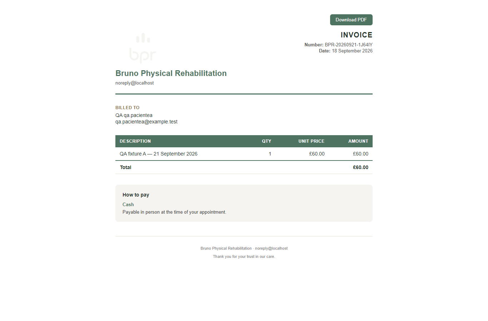
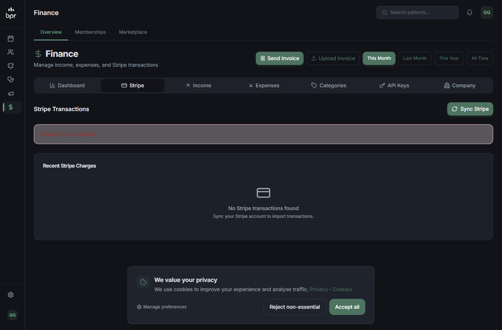
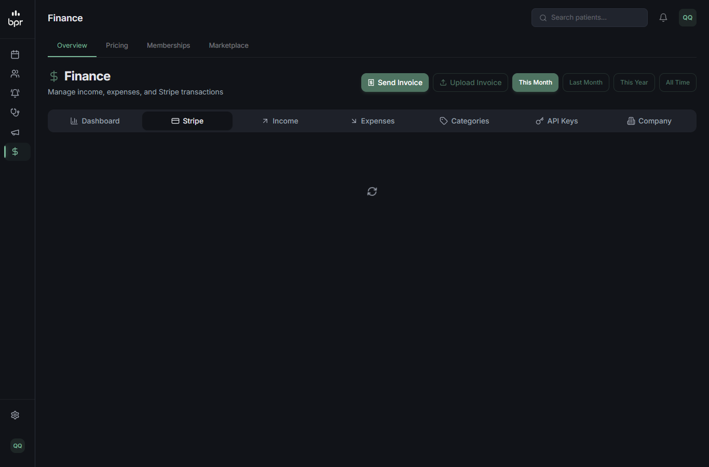
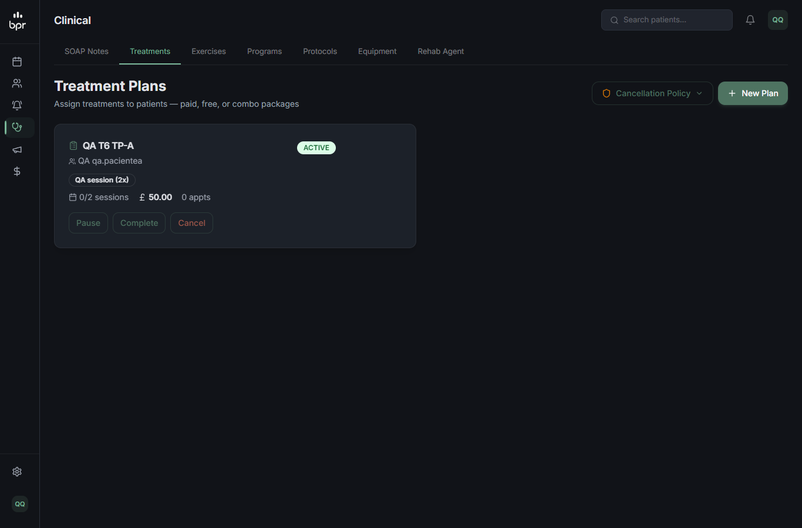
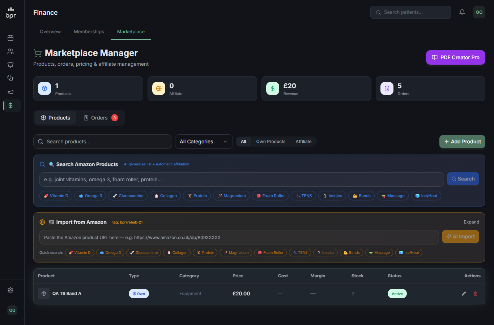
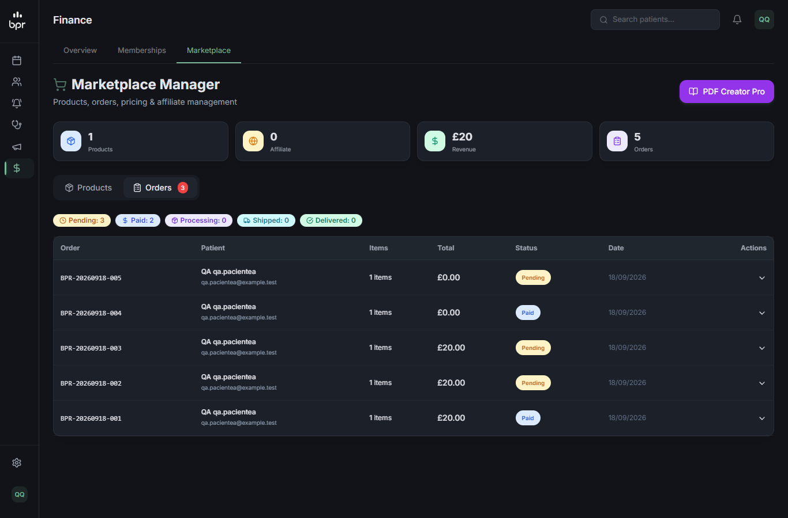

# QA — T-6: Financeiro legado (treatment plans, memberships, invoices, marketplace, finance)

**Resultado final:** ✅ APROVADO no escopo desta branch. 9 dos 10 cenários passaram, e os 6 derivados também. O **6.7** (quantidade negativa no checkout da loja) falhou, mas hoje afeta **só pacientes de clínica**: o personal e o aluno dele estão bloqueados da loja pela T-7. Pela regra do escopo da branch (definida pelo Bruno em 18/09), ele vira **alerta para a frente da clínica** e não é corrigido aqui.

## Rodada 1 (agente qa-tester, 18/09/2026)

- **Código:**
  - `treatment-plans` e `memberships` (`[id]` com `planInTenant`; POST e PUT com `patientInTenant`);
  - `appointments/[id]/invoice` (`staffOfAppointmentTenant`) e `patients/[id]/invoice` (`staffPatientAccess`);
  - `marketplace/products|orders` (`shopStaff`) e `patient/marketplace/checkout`;
  - `finance/stripe` (só SUPERADMIN) e `finance`, `categories`, `api-keys`, `ocr` (ADMIN/SUPERADMIN);
  - `patient/membership/subscribe`.
- **Ambiente:** local, sem chave Stripe (nada chegou à Stripe), `RESEND_API_KEY` vazio. Clínica C temporária (`qa-clinic-c-t568`) para testar clínica × clínica, porque a T-7 já responde 404 no gate para o personal.
- **Como distinguir gate de rota:** o gate responde `{"error":"Not found"}` JSON até em subcaminho inexistente. A rota responde com mensagem própria ("Patient not found", "Product not found", "Plan not found or inactive").

| # | Cenário | Tipo | Resultado |
|---|---|---|---|
| 6.1 | Plano de tratamento e membership de A: GET/PUT/DELETE por outro tenant | API | ✅ trainer 404 (gate T-7); `qa.adminc` 404 (rota); banco inalterado |
| 6.2 | POST com `patientId` de outro tenant | API | ✅ 404 (gate e rota); 0 criados |
| 6.3 | Invoice da sessão A pelo trainer | API | ✅ 404 (rota) |
| 6.4 | `POST patients/<pacientea>/invoice` pelo trainer | API | ✅ 404; fila de aprovação 0 → 0 |
| 6.5 | `finance/stripe` | API+UI | ✅ trainer, admina, fisioa e adminc → 403; SUPERADMIN → 200 |
| 6.6 | Produto e pedido de A por outro tenant | API | ✅ 404 (gate, rota e `journey/products`) |
| 6.7 | Checkout com total 0 num produto pago | API+UI | ❌ `quantity:-1` → pedido `paid`, total £0, estoque +1 → **fora do escopo (clínica)** |
| 6.8 | Aluno assina membership de A | API | ✅ 404 (gate e rota) + 4 casos de escopo |
| 6.9 | Membership paga sem `stripePriceId` | API | ✅ 409; 0 assinaturas e 0 `ServiceAccess` novos |
| 6.10 | Regressão admina/SUPERADMIN | UI+API | ✅ |
| D-a | PUT re-apontando plano ou membership para paciente de outro tenant (correção da review) | API | ✅ 404; paciente do próprio tenant → 200 |
| D-b | Finance por papel e entre tenants | API | ✅ THERAPIST 403 em tudo; ADMIN 200; entrada do B editada por A → 404 |
| D-c | Invoice no próprio tenant | API+UI | ✅ 200 |
| D-d | Checkout com produto de outro tenant | API | ✅ 400 "Some products are unavailable" |
| D-e | Pedidos: THERAPIST e outro tenant | API | ✅ 403 / 0 / 404 |
| D-f | Listas de produtos por tenant | API | ✅ |

### Evidências principais
```
6.1  [adminc] GET/PUT {"totalPrice":0.01}/DELETE plano de A -> 404 {"error":"Not found"} (rota) ; banco idêntico
     prova do gate: [trainer] /treatment-plans/<id>/zzz -> 404 JSON ; [adminc] mesmo path -> 404 HTML do Next
6.2  [adminc] POST treatment-plans/memberships {"patientScope":"specific","patientId":"<pacientea>"} -> 404 {"error":"Patient not found"}
D-a  [admina] PUT /treatment-plans/<TP-A> {"patientScope":"specific","patientId":"<aluno>"} -> 404 ; com <pacientea2> -> 200 (restaurado)
6.3  [trainer] GET /api/admin/appointments/<sessão A>/invoice -> 404 {"error":"Appointment not found"}
6.4  [trainer] POST /api/admin/patients/<pacientea>/invoice -> 404 ; PENDING_APPROVAL 0 -> 0
6.5  [trainer|admina|fisioa|adminc] GET /api/admin/finance/stripe -> 403 ; [super] -> 200 {"configured":false}
6.6  [adminc] PATCH {"price":0.01} / DELETE produto de A -> 404 {"error":"Product not found"} ; PATCH pedido {"status":"paid"} -> 404
6.8  [pacientec] subscribe plano de A -> 404 {"error":"Plan not found or inactive"} ; [pacientea] plano "specific" de outra -> 404
6.9  [pacientea] subscribe plano pago sem stripePriceId -> 409 ; subs 0 -> 0, ServiceAccess 9 -> 9
D-b  [fisioa] finance / categories / api-keys / ocr -> 403 ; [admina] PATCH entrada do B -> 404 (amount inalterado)
```
    

**Evidência do 6.7 (fora do escopo):**
```
[pacientea] checkout {"productId":"<A £20>","quantity":-1} -> 200 pedido {status:"paid", total:0, paymentMethod:"credits"} ; estoque 7 -> 8
[pacientea] quantity "-2" -> 500 com detalhe interno do Prisma
```


### Ressalvas
- **R-1 (clínica):** o ADMIN da clínica ainda vê a aba "Stripe" no Finance, que agora mostra "Forbidden".
- **R-2 (clínica):** `quantity: 0.0001` cria pedido pendente de £0,00. Mesma causa do 6.7.
- **R-3 (muito baixa):** no PUT de plano de tratamento, a reativação na Stripe roda antes da checagem do paciente. Não pôde ser testada sem Stripe.
- **R-4 (anterior):** o finance do SUPERADMIN sem `clinicId` dá 400 "No clinic".

### Achados fora do escopo
1. **Clínica:** telas de treatment-plans e memberships chamam `stripe-branding`, que dá 403 para o ADMIN da clínica (erro no console, a página funciona).
2. **Personal, vai para a 055:** a fatura do estúdio sai como "Bruno Physical Rehabilitation" quando o tenant não tem `CompanyProfile`.
3. **T-7, corrigido:** `/api/admin/journey/products` estava fora do bloqueio do personal. Corrigido e re-testado (ver `report-t-8.md`, rodada 2).
4. **Clínica:** o `ServiceAccess` criado pela assinatura grátis fica com `clinicId` null.

### Dados
A clínica C foi apagada. Planos, memberships, assinaturas, `ServiceAccess`, produtos, pedidos, itens da fila e a entrada de finance de teste foram todos apagados. Nada foi enviado (e-mail, WhatsApp ou Stripe). Snapshot com 92 chaves igual ao inicial.

Saídas brutas: `scratchpad/qa-t568/`.

## Decisão de escopo
O 6.7 (quantidade negativa/fracionária no checkout da loja) não é corrigido nesta branch: fica na lista de alertas para a frente da clínica. O critério "total 0 num produto pago não vira `paid`" da T-6 só vale hoje para clínica, porque o aluno do personal não alcança a loja (T-7).
