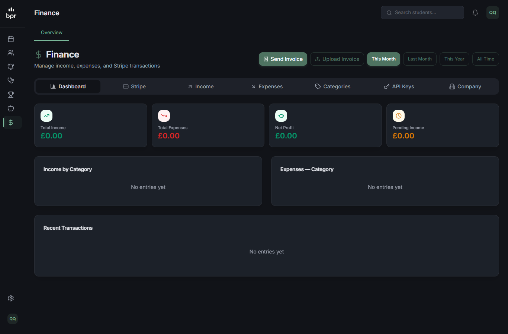
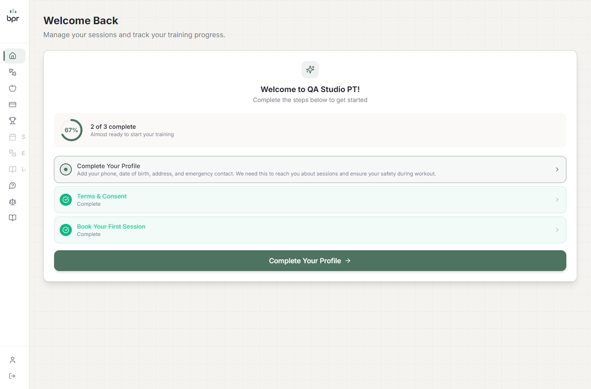
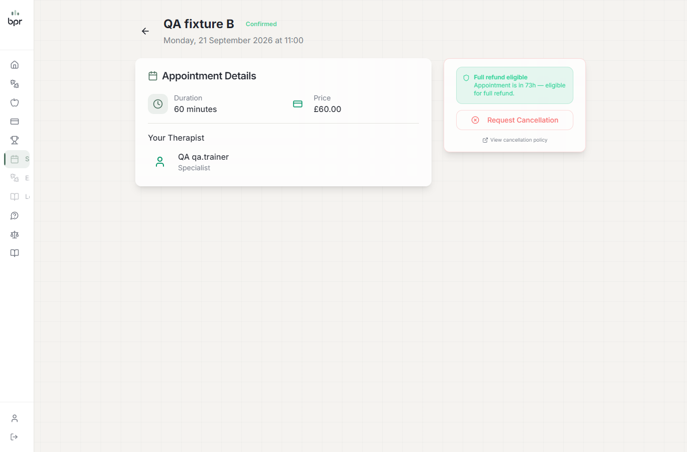
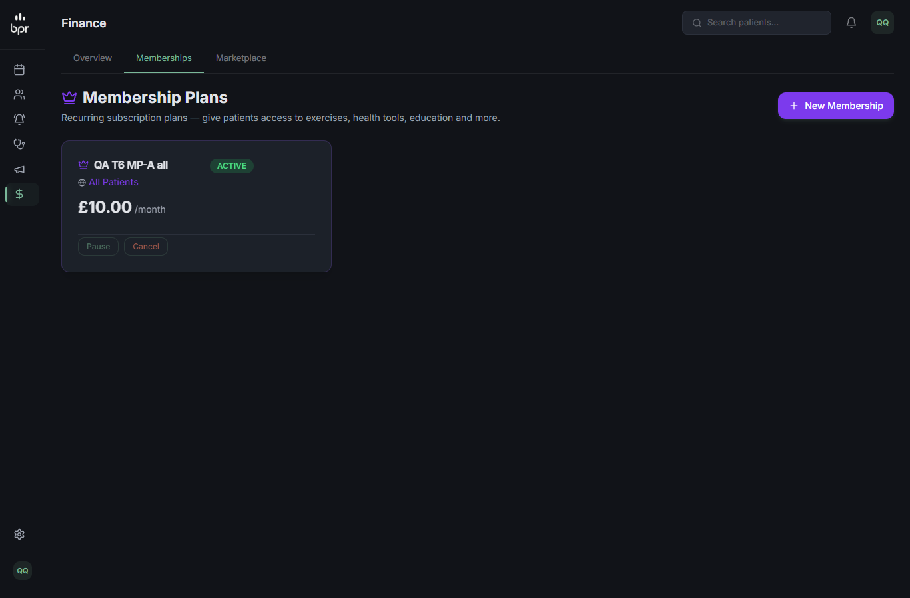

# QA — T-7: Personal isolado do Stripe e das rotas clínicas da BPR

**Resultado final:** ✅ APROVADO. Os 8 cenários da qa-spec (7.1–7.8) e 7 derivados passaram. As ressalvas R-1 e R-2 foram corrigidas depois do QA (ver "Ressalvas e correções").

- **Data:** 18/09/2026 · **Executado por:** agente qa-tester (retomado depois de um limite de uso); correções e verificação pela sessão principal.
- **Ambiente:** Next dev :4002, fixtures locais, sem Stripe, `RESEND_API_KEY` vazio.

| # | Cenário | Resultado |
|---|---|---|
| 7.1 | trainer: `/admin/treatment-plans`, `memberships`, `service-pricing`, `marketplace`, `screening-preview` | ✅ as 5 terminam em `/admin` |
| 7.2 | trainer: APIs clínicas e de cobrança da BPR (21 chamadas) | ✅ 404; `service-prices` 403 (T-2) |
| 7.3 | trainer: menu Finance | ✅ só Overview |
| 7.4 | aluno (cookie e Bearer): checkouts, subscribe, plans, protocol, rehab-plan, create-checkout | ✅ 404; `GET membership/subscription` 200 |
| 7.5 | aluno: `/dashboard/membership` e `/dashboard/marketplace` | ✅ redirecionam; fora do menu (1366 e 390) |
| 7.6 | Pagamento online da sessão | ✅ aluno sempre IN_PERSON; admin "online" → 400 "paid in person"; create-checkout → 404 |
| 7.7 | Ficha do aluno, aba Exercises | ✅ funciona |
| 7.8 | Regressão da clínica | ✅ inalterada |
| D-7a | Variações de caminho | ✅ nenhuma passou |
| D-7b | Bearer renovado / forjado | ✅ renovado → 404; forjado → 401 na rota |
| D-7c | `journey/products`, `articles/*` para o personal | ✅ 404 |
| D-7d | Detalhe da sessão do aluno (F-2 da T-4) | ✅ sem card de pagamento e sem "Medical Screening Required" |
| D-7g | Varredura das telas (personal e clínica) | ✅ nenhum 4xx/5xx novo da T-7 |

Evidências principais:
```
7.4  POST patient/treatment-plans/checkout  aluno 404 (cookie e Bearer) | pacientea 400 (a rota da clínica continua)
     POST patient/membership/subscribe      aluno 404                   | pacientea 400
     GET  patient/membership/subscription   aluno 200 null
7.6  [aluno] POST /api/appointments {"paymentMethod":"ONLINE"} -> gravado IN_PERSON ; [pacientea] -> ONLINE (clínica inalterada)
     [trainer] POST /api/admin/appointments paymentMode "online" -> 400 "Online payment isn't available for studio sessions — they're paid in person."
```
   

## Ressalvas e correções
| # | Ressalva | Situação |
|---|---|---|
| R-1 | O formulário de agendamento do aluno ainda oferecia "Pay online now" (o servidor gravava IN_PERSON) | **corrigido:** `booking-form.tsx` esconde a escolha para o personal e envia IN_PERSON. Verificado por leitura; a regra do servidor já foi testada no 7.6 |
| R-2 | A taxa da 3ª remarcação criaria checkout na Stripe da BPR (`reschedule/route.ts`) | **corrigido:** tenant personal → remarcação sem taxa online (sessões pagas presencialmente) |
| R-3 | Sessão criada pelo trainer com `in_person` é gravada com `paymentMethod: ONLINE` (padrão do schema, já era assim) | registrado; sem efeito para o personal (card escondido, checkout bloqueado) |

Achado do QA da T-9, corrigido aqui: `/api/foot-scans` (biomecânica clínica) entra no bloqueio do personal.
```
aluno GET /api/foot-scans -> 404 ; pacientea (clínica) GET /api/foot-scans -> 200
```

**Dados:** as sessões e os Payments de teste foram apagados. Fixtures intactas. Nenhum e-mail saiu.
