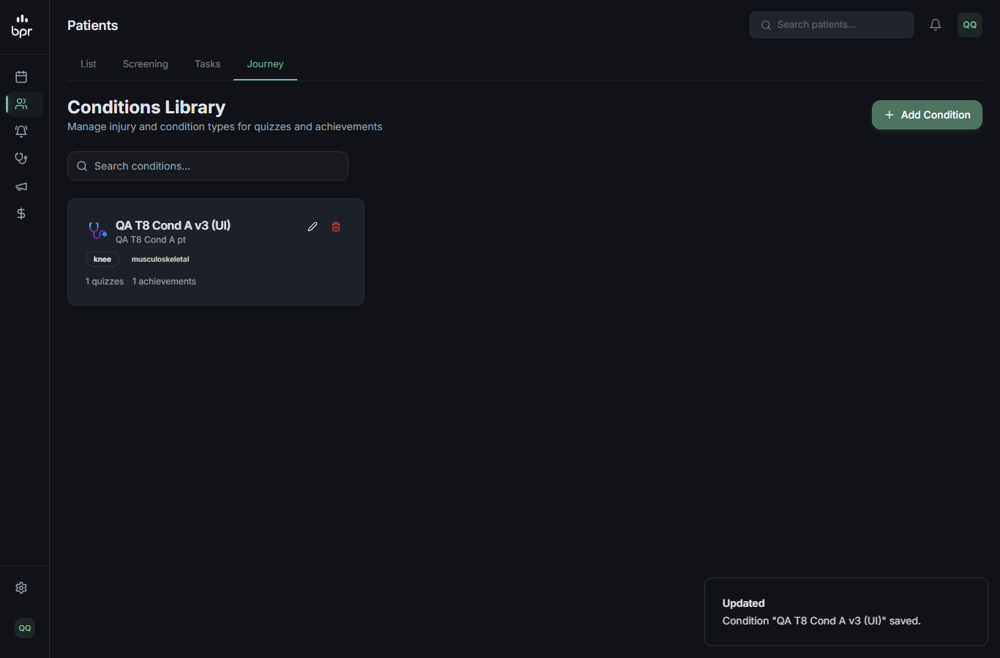
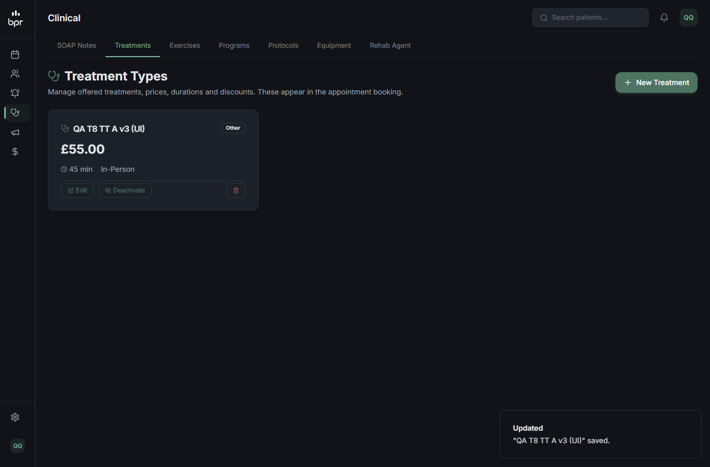
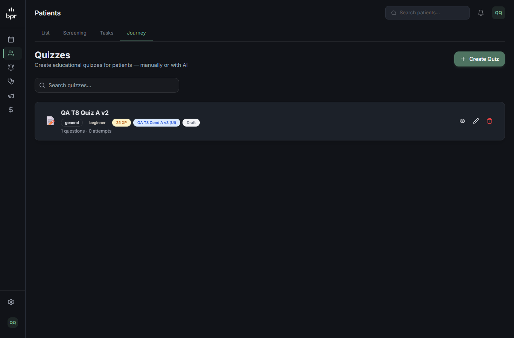

# QA — T-8: Catálogos e listas por id presos ao tenant

**Resultado final:** ✅ APROVADO na rodada 2, no escopo desta branch. A rodada 1 reprovou em dois pontos:
- o PATCH aceitava escrita de relação e movia itens entre tenants. **Corrigido.**
- `rehab-plans/recent` vaza **entre clínicas**. Para o personal está bloqueado pela T-7, então vira alerta para a frente da clínica.

## Rodada 1 — ❌ REPROVADO (agente qa-tester, 18/09/2026)

- **Código:**
  - `lib/tenant-owned.ts` (`tenantStaff`, `ownedByTenant`);
  - `achievements`, `conditions`, `quizzes`, `journey/challenges`, `journey/products`;
  - `treatment-types/[id]`, `equipment/[id]` (GET), `exercises/[id]` (GET), `exercises/translate`.
- **Ambiente:** local, fixtures + clínica C temporária.

| # | Cenário | Tipo | Resultado |
|---|---|---|---|
| 8.1 | `rehab-plans/recent` | API | ❌ trainer 404 (gate T-7, sem dado); admina, fisioa e adminc recebem planos **das duas clínicas** → fora do escopo |
| 8.2 | Update/delete por id de itens de A por outro tenant | API | ✅ trainer e adminc → 404 em 10 chamadas cada; banco idêntico |
| 8.3 | `clinicId` de outro tenant no corpo | API | ✅ ignorado nas 5 rotas |
| 8.4 | trainer GET `exercises/<A>`, `equipment/<A>`, translate de `exerciseA` | API | ✅ 404; nada traduzido |
| 8.5 | admina edita os próprios catálogos | UI | ✅ |
| D-a | `{"clinic":{"connect"/"disconnect"}}` no PATCH | API | ❌ movia achievement/condition/quiz para outro tenant (ou `clinicId` null); quiz injetado aparecia no portal do paciente de C |
| D-b | Cookie/header de clínica forjados | API | ✅ 404 |
| D-c | THERAPIST no próprio tenant | API | ✅ PATCH 200; DELETE 401 |
| D-d | Trainer no próprio catálogo | API | ✅ 200 |
| D-e | SUPERADMIN por clínica selecionada | API | ✅ |
| D-f | `exercises/<B>` lista só prescrições do próprio tenant | API | ✅ |

### Evidências principais
```
8.2  [trainer|adminc] PATCH/DELETE achievements, conditions, quizzes, treatment-types, journey/challenges de A -> 404 ; banco idêntico
8.3  [admina] PATCH {"id":<A>,"clinicId":"<C>",...} nas 5 rotas -> 200, clinicId continua A
8.4  [trainer] GET /api/admin/exercises/<exerciseA> -> 404 ; equipment/<A> -> 404 ; translate {"exerciseId":<A>} -> 404 ; namePt continua null
D-a  [admina] PATCH quizzes {"id":<A>,"isPublished":true,"clinic":{"connect":{"id":"<C>"}}} -> 200 "clinicId":"<C>"
     [pacientec] GET /api/patient/quizzes -> [{"title":"QA T8 Quiz injetado por A"}]
8.1  [admina|fisioa|adminc] GET /api/admin/rehab-plans/recent -> planos de A e de C
```
  

**Ressalvas:**
- **R-1:** `translate {"all":true}` não foi executado, porque chamaria a IA externa.
- **R-2:** o catálogo global (`clinicId` null) não foi verificado: não há linhas assim no banco local.

**Dados:** tudo criado foi apagado; os itens movidos no D-a foram restaurados antes. Snapshot igual ao inicial.

## Correções (sessão principal)
- **D-a:** novo `pickCatalogFields` (`lib/tenant-owned.ts`). O PATCH de achievements, conditions e quizzes só repassa ao Prisma uma **lista branca de campos escalares** do modelo. Relações (`clinic`, `createdBy`, `condition`), ids e timestamps nunca passam. Um `conditionId` precisa ser uma condição do próprio tenant, no PATCH e também no POST de achievements e quizzes.
- **T-7 F-4 (achado no QA da T-6):** `/api/admin/journey/products` entra no bloqueio do personal, igual a `/api/admin/marketplace`, porque sincroniza produtos com o Stripe da BPR.

## Rodada 2 — ✅ APROVADO (sessão principal, chamadas reais)
```
admina cria condition, quiz e achievement em A; depois, em cada rota:
/api/admin/conditions    PATCH {"id","clinic":{"connect":{"id":"<B>"}},"sortOrder":7} -> 200, clinicId continua <A> ; {"clinic":{"disconnect":true},"createdBy":{"connect":…}} -> 200, ignorado
/api/admin/quizzes       idem -> clinicId continua <A>
/api/admin/achievements  idem -> clinicId continua <A>
PATCH quiz {"conditionId":"<id de outro tenant>"}      -> 404 {"error":"Condition not found"}
trainer POST quiz com conditionId de uma condição de A -> 404 {"error":"Condition not found"}
limpeza: DELETE achievement/quiz/condition -> 200 ; sobras "QA RT8" = 0
T-7: trainer GET/POST /api/admin/journey/products -> 404 ; admina GET -> 200
```
Script: `scratchpad/retest-t5-t8.cjs`.

## Decisão de escopo
`rehab-plans/recent` entre clínicas (8.1) não é corrigido nesta branch: fica na lista de alertas para a frente da clínica. Para o personal, a rota já responde 404 (T-7).
