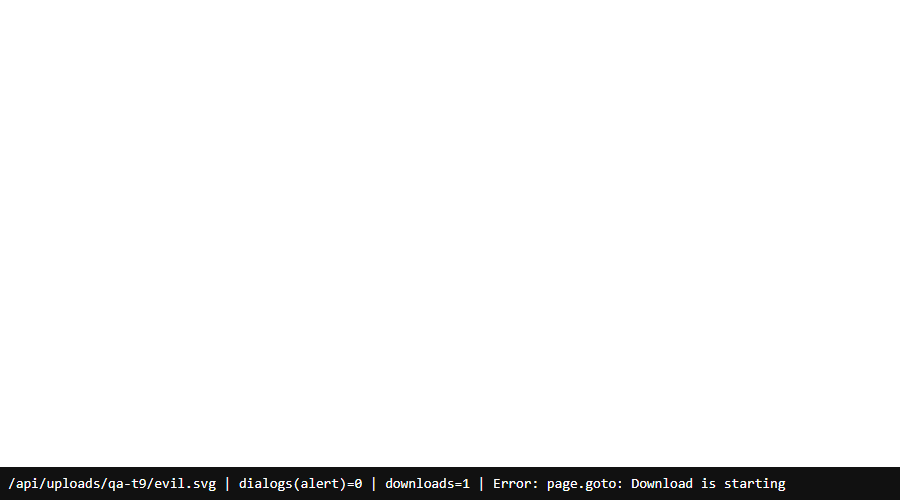

# QA — T-9: Uploads — tipo/tamanho permitidos e SVG/HTML nunca inline

**Resultado final:** ✅ APROVADO no escopo desta branch. Os 5 cenários da qa-spec (9.1–9.5) passaram. A rodada 1 reprovou pelo achado A-1: um paciente gravava SVG com script pelo upload de foot-scan. Foot-scan é módulo clínico: para o personal e o aluno dele ficou **bloqueado** (T-7). Para pacientes de clínica e para a infra de `/uploads/*`, ficou como **alerta** para as outras frentes.

- **Data:** 18/09/2026 · **Executado por:** agente qa-tester; decisão de escopo pela sessão principal.

| # | Cenário | Resultado |
|---|---|---|
| 9.1 | trainer: upload de `x.svg`, `x.html`, `x.exe` | ✅ 400 |
| 9.2 | trainer: `.jpg` válido | ✅ 200 |
| 9.3 | Acima do limite | ✅ 413 (imagem 10 MB+1, vídeo 200 MB+1) |
| 9.4 | SVG com script via `/api/uploads/*` | ✅ attachment + CSP sandbox + nosniff; no browser vira download, 0 alertas |
| 9.5 | Mídias existentes | ✅ imagens e vídeo carregam |
| D-9a/b/c | Extensão × MIME, papéis, path traversal | ✅ |
| D-9d | image-serve (data URL, URL externa, `?bg=`) | ✅ nosniff + sandbox; script bloqueado |
| D-9e | Upload de foot-scan pelo paciente (A-1) | ❌ na rodada 1 → personal bloqueado; clínica = alerta |
| D-9f | Caminho estático `/uploads/*` (A-2) | ⚠️ alerta de infra |

Evidências principais:
```
[trainer] x.svg / x.html / x.exe -> 400 ; ok.jpg -> 200 ; big.jpg 10MB+1 -> 413 ; [aluno] -> 403 ; [fisioa] -> 403
/api/uploads/qa-t9/evil.svg -> image/svg+xml, Content-Disposition: attachment, CSP: sandbox, nosniff (browser: download, 0 alertas)
/api/image-serve/<svg> (data URL e externa) -> CSP: sandbox, nosniff (script bloqueado)
A-1: [pacientea] POST /api/foot-scans/<id>/upload-local x.svg (type image/jpeg) -> 200 /uploads/scans/.../left-top-….svg ; aberto por admin -> o script roda
```
  

## Decisão de escopo e correção
- **Personal/aluno:** `/api/foot-scans` entra em `PERSONAL_BLOCKED_ROUTES`, então o aluno do personal não chega ao upload. Verificado: aluno `GET /api/foot-scans` → 404; paciente de clínica → 200.
- **Alerta, frente da clínica (A-1):** `app/api/foot-scans/[id]/upload-local/route.ts:94-109` (e `body-assessments/[id]/upload-photo/route.ts:75`) tira a extensão do nome enviado pelo cliente. Sugestão: derivar a extensão do MIME validado.
- **Alerta, infra (A-2):** em prod, `/uploads/*` é servido direto (nginx/Coolify) sem nosniff/attachment, e o image-serve com URL relativa redireciona para lá. O passo 4 da T-9 depende de infra: confirmar como o Coolify serve `/uploads/*` e pôr os cabeçalhos ali.

**Dados:** pastas e arquivos de teste removidos; o FootScan temporário e 3 linhas temporárias do ImageLibrary foram apagados.
