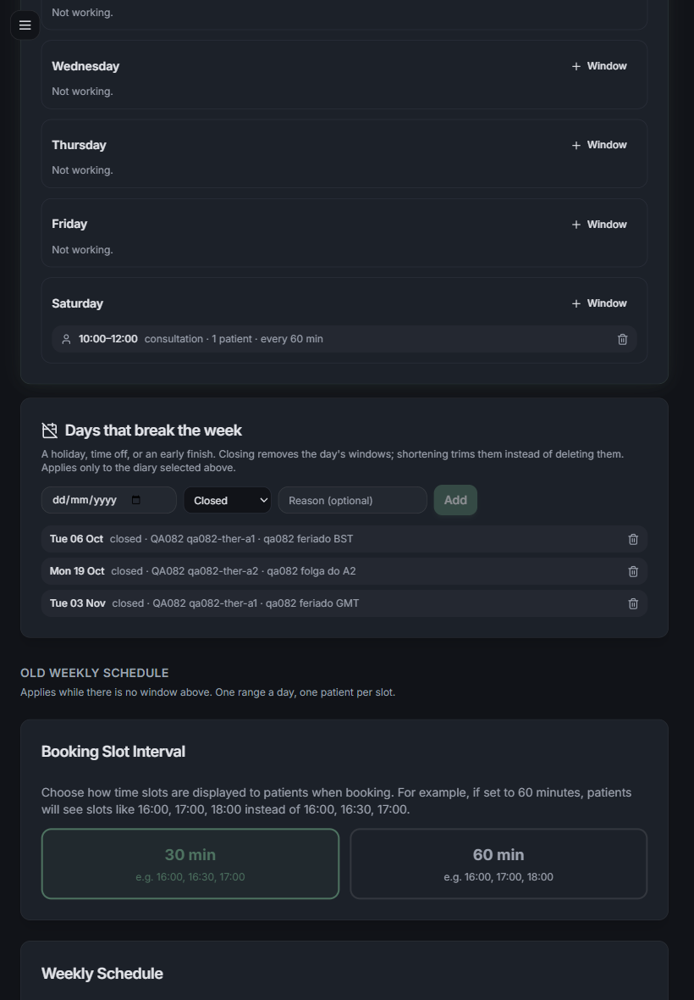
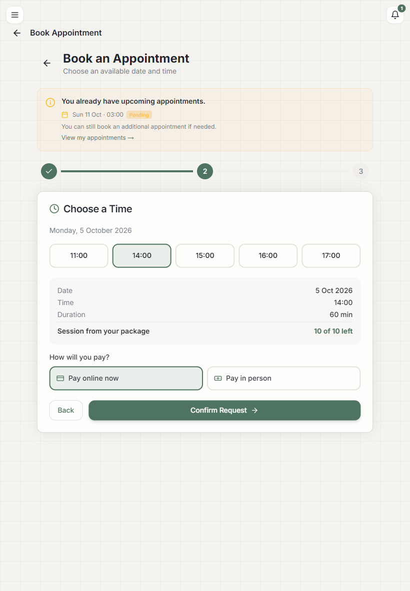
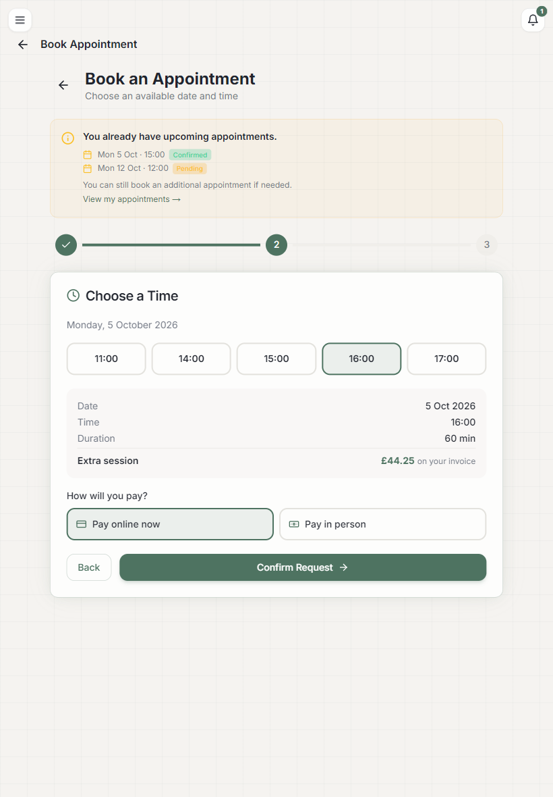
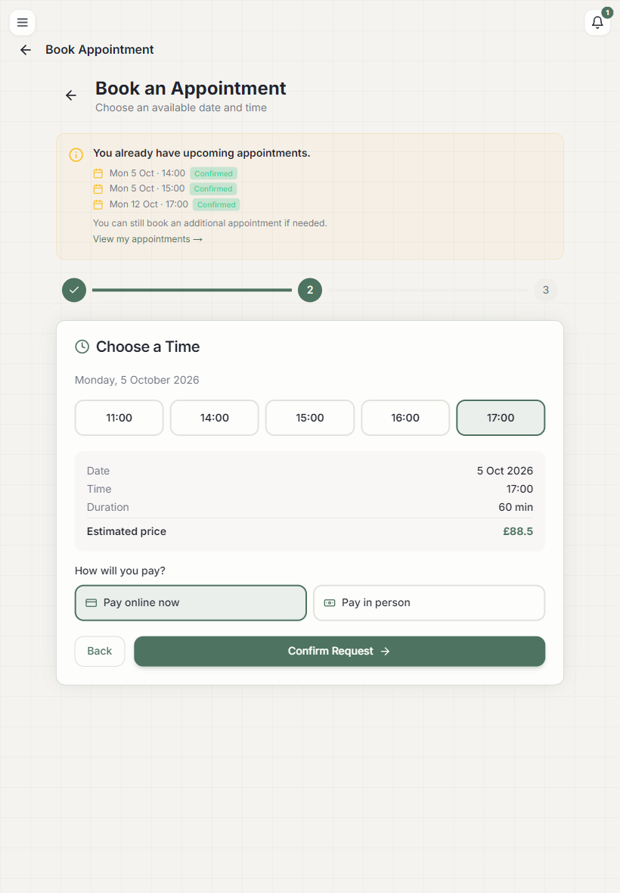
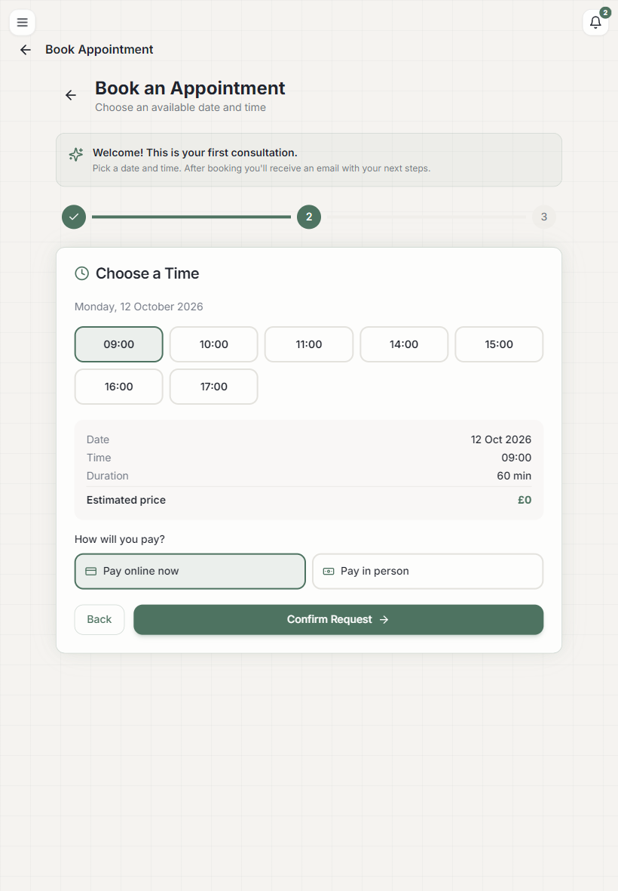
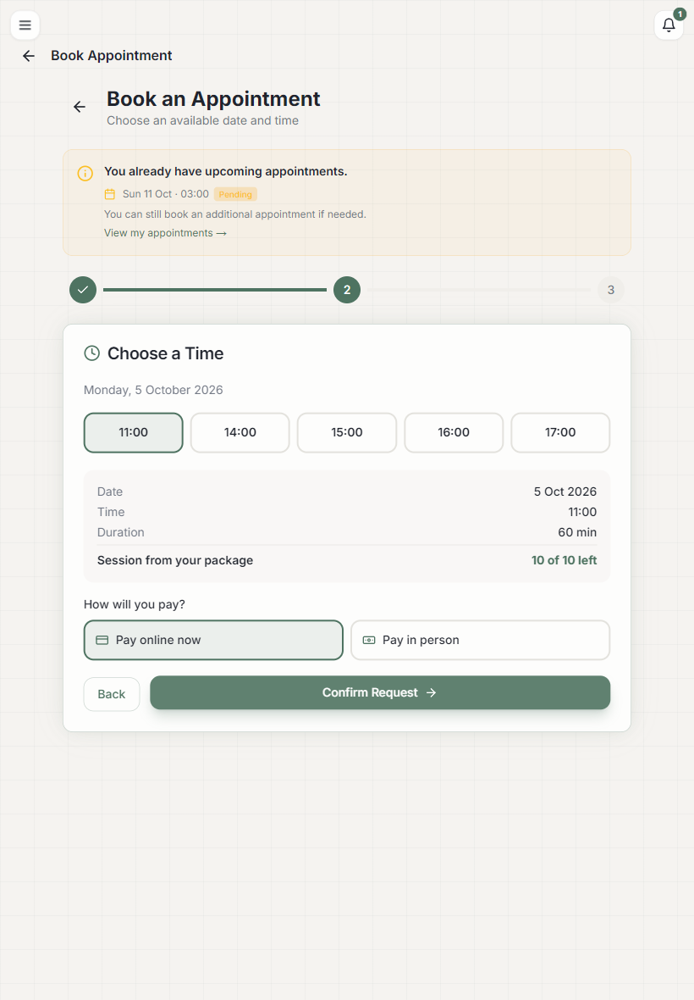

# Re-QA — atividade 080 (rodada 3, tudo em UTC)

**Data:** 25/09/2026 · **Commit medido:** `34f5c150` · **Alvo:** `http://localhost:4087`, este
worktree (`TZ=UTC`, `OUTBOUND_MODE=sink`, `NEXT_DIST_DIR=.next-qa082`).

**A porta foi confirmada antes de medir.** Um marcador escrito no `public/` deste checkout
respondeu 200 na :4087 e 404 na :4000, que está com outro checkout:

```
$ curl -s http://localhost:4087/qa082-marker.json
{"qa":"round3-utc","worktree":"app_clinic","nonce":"qa082-7c41f9"}
$ curl -s -o /dev/null -w "%{http_code}" http://localhost:4000/qa082-marker.json
404
```

**E o processo está mesmo em UTC**, medido de dentro dele. Uma consulta gravada às
`2026-10-05T23:30Z` é 00:30 de **6** de outubro em Londres (BST). O e-mail que o servidor
formatou diz:

```
[OUTBOUND-SINK] email -> qa082-p-race2@x.test: Appointment Confirmed — Monday, 5 October 2026
[OUTBOUND-SINK] email -> qa082-a@x.test: New Appointment: QA082 race2 - 05/10/2026
```

Dia 5 — o dia UTC. (E o `TZ` é honrado pelo Node desta máquina: `TZ=UTC node -e` devolve
`UTC` e hora 9; sem `TZ`, `Europe/London` e hora 10 para o mesmo instante.)

**Nada saiu para a Stripe.** A rota de Checkout foi exercitada **só no caso negativo** (404 de
outra clínica, que responde antes de tocar no SDK). Os eventos de webhook foram assinados com HMAC
local (`constructEvent`), com um segredo de mentira criado só para este servidor.

**Zero DDL.** Criados e removidos com prefixo `qa082-*`: 2 clínicas, 21 usuários, 22 consultas,
5 janelas, 6 exceções, 5 pacotes de paciente, 3 pacotes de serviço, 3 preços, 14 triagens,
2 disponibilidades do modelo antigo e 10 registros de auditoria.

---

## Veredito: reprovado — por três defeitos que só aparecem fora do caminho feliz

**O bloqueador da rodada 2 (N1) está corrigido, e agora foi medido em UTC, que é como produção
roda.** Os dezoito defeitos das rodadas 1 e 2 estão todos de pé. O que reprova são três achados
novos, todos na área que a rodada 2 mexeu:

| # | achado novo | gravidade |
|---|---|---|
| **N10** | feriado e folga **não fecham nada** no dia regido pelo modelo antigo — e o paciente marca nele | alta |
| **N11** | com a porta (`booking-options`) fora do ar, a tela volta a prometer £88,50 e o servidor cobra £44,25 | média |
| **N12** | a tela oferece horário que o servidor recusa (não pergunta a natureza da janela), e o erro vira "tente de novo" | média |

Observações menores ao fim: a guarda do webhook continua inerte quando o metadata não traz o
paciente (N13), o horário solto depois de 30 min pode ficar com dois donos (N14), e a notificação
ao paciente sai com a data/hora **do servidor**, não da clínica (N15).

---

## 1. O que o UTC mudou

A rodada 2 achou o N1 num segundo servidor improvisado. Aqui o UTC foi o padrão desde o primeiro
comando. **Tudo que era fuso-dependente passou.**

| o que | medido em UTC | esperado pelo plano |
|---|---|---|
| segunda 05/10 (BST) com janelas de segunda | `["09:00","10:00","11:00","14:00","15:00","16:00","17:00"]` | as janelas de **segunda** |
| domingo 04/10 (janela distinta de propósito) | `["19:00","20:00"]` | as de domingo, não as de segunda |
| segunda 02/11 (já em GMT) | `["09:00","10:00","11:00","14:00","15:00","16:00","17:00"]` | igual |
| exceção `closed` em 06/10 (BST) | 06/10 `[]`, com 05/10 e 07/10 intactos | fecha **o dia certo** |
| exceção `closed` em 03/11 (depois de 25/10) | 03/11 `[]`, com 02/11 e 04/11 intactos | idem |
| POST às 09:00 de Londres (`08:00Z`), dentro da janela | **200**, gravado `2026-10-05T08:00:00.000Z` | aceita o certo |
| POST às 12:00 de Londres (`11:00Z`), fora da janela | **409** `slot_unavailable` | recusa o errado |
| POST às 14:00 de Londres numa janela de CONSULTATION | **409** `slot_unavailable` | natureza errada |
| ocupação: consulta gravada em `08:00Z` | some **09:00** da oferta, não 08:00 | conta a hora da clínica |
| dia encurtado até 11:00 numa segunda de GMT | `["09:00","10:00"]` | apara, não apaga |

Na rodada 2, em UTC, esta mesma bateria devolvia as janelas de domingo numa segunda, abria um dia
fechado, recusava 09:00 e aceitava 12:00. **Nenhum desses sintomas voltou.**

`TZ=UTC npx jest` dá **59 suítes, 568 testes, todos passando**. Rodado também sem `TZ`
(`Europe/London`) e com `TZ=America/New_York`: **mesmo 568/568 nos três**. Nenhum teste depende do
fuso da máquina. Os dois testes que a rodada 2 escreveu para o N1 existem e são honestos
(`__tests__/tenant/schedule-windows.test.ts:166` e `:178`): checam que o dia da semana sai da
string. O que **nenhum** teste cobre é rota — não há um só teste sobre `app/api/availability` ou o
POST de `app/api/appointments`, que é exatamente onde mora o N10.

---

## 2. Os nove da rodada 2, um por um

| # | o que era | medido agora |
|---|---|---|
| N1 | agenda andava um dia fora de Londres | corrigido — seção 1 inteira |
| N2 | guarda do webhook não valia para o pagamento da web | `create-checkout` escreve `patientId` (`route.ts:135`); evento com dono errado **não confirma** |
| N3 | exceção ia para a clínica toda e a lista não dizia de quem era | salva para o terapeuta selecionado; cada linha diz o dono |
| N4 | tela prometia um preço, servidor cobrava outro | corrigido no caminho feliz — **volta quando a porta cai (N11)** |
| N5 | sessão extra faturada nascia `PENDING`/`ONLINE` | nasce `CONFIRMED` e `IN_PERSON` |
| N6 | uma janela de sábado fechava a segunda inteira | decisão por dia — **e é o que abre o N10** |
| N7 | exceção aceitava terapeuta de outra clínica | 404 nos dois sentidos |
| N8 | `PENDING` segurava o horário para sempre | solta depois de 30 min — **com a ressalva N14** |
| N9 | auditoria com `userEmail` vazio | grava o e-mail de quem autorizou |

**N2 — a guarda do webhook.** Quatro formatos de evento, assinados localmente:

```
W1 dono certo    metadata {appointmentId, patientId: <o proprio>}              -> confirmed
W2 dono errado   metadata {appointmentId, patientId: <paciente da clinica B>}  -> already handled (nao confirmou)
W4 repetido      mesmo evento de novo                                          -> already handled (idempotente)
W5 staff         metadata {appointmentId, patientId: <admin>}                  -> already handled (nao confirmou)
```

**N3 — a exceção pela tela.** Com "Diary of: QA082 qa082-ther-a2" selecionado, a exceção de 19/10
foi gravada com o `therapistId` do A2 (e não nulo), e a lista passou a dizer de quem é cada linha:

```
Tue 06 Oct  closed · QA082 qa082-ther-a1 · qa082 feriado BST
Mon 19 Oct  closed · QA082 qa082-ther-a2 · qa082 folga do A2
Tue 03 Nov  closed · QA082 qa082-ther-a1 · qa082 feriado GMT
```



**N4 — o preço na tela da web.** Paciente com pacote vê a sessão do pacote; paciente em tratamento
vê a sessão extra com o preço que o servidor grava:





Marcado pela tela às 16:00 de Londres, o servidor gravou exatamente o que ela prometeu:

```json
{"dateTime":"2026-10-05T15:00:00.000Z","kind":"EXTRA_SESSION","price":44.25,
 "status":"CONFIRMED","paymentMethod":"IN_PERSON","treatmentType":"Treatment Session"}
```

**N5 — a sessão faturada.** `{"kind":"EXTRA_SESSION","price":44.25,"status":"CONFIRMED","paymentMethod":"IN_PERSON"}`

**N6 — a decisão por dia.** Terapeuta A2, com disponibilidade antiga na segunda e janela nova só no
sábado:

```
segunda 05/10 -> ["09:00","09:30",...,"16:00"]  workingHours 09:00-17:00   (modelo antigo, intacto)
sabado  10/10 -> ["10:00","11:00"] configured:true                          (janela nova)
domingo 11/10 -> [] reason=not_working
```

**N7 — escopo.** Admin B criando exceção para terapeuta A dá 404. Admin A para terapeuta B, 404.
Janela para terapeuta de fora, 404. DELETE de exceção de outra clínica, 404.

**N9 — auditoria.**

```json
{"action":"APPOINTMENT_COURTESY_SESSION","userEmail":"qa082-admin-a@x.test","userRole":"ADMIN",
 "metadata":{"price":0,"reason":"qa082 cortesia","patientPackageId":"cmuhaqfk1001fxzasbfeqhh7f"}}
{"action":"APPOINTMENT_CHARGE_WAIVED","userEmail":"qa082-admin-a@x.test","userRole":"ADMIN",
 "metadata":{"price":0,"reason":"qa082 isencao"}}
```

---

## 3. Os nove da rodada 1 — reteste rápido

| # | cenário | medido |
|---|---|---|
| 1 | o enum (`PatientPackageStatus`) | `booking-options` 200 nas quatro portas, com o pacote lido |
| 2 | exceção consegue ser criada | 201 pela API e pela tela, com `therapistId` nulo e não-nulo |
| 3 | exceção no horário de verão | seção 1 |
| 4 | janela nova vence o "not working" antigo | domingo 04/10 do A1 (sem disponibilidade antiga) devolve `["19:00","20:00"]` |
| 5 | folga do terapeuta vence a da clínica | clínica fecha 26/10, A1 tem "curto até 11:00" e sobra `["09:00","10:00"]` |
| 6 | contador depois do DELETE | 2 → cancelou → 1 → `NO_SHOW` → 1 → DELETE → **0** |
| 7 | webhook de outra clínica | W2 acima |
| 8 | paciente confirma a própria consulta | `PATCH {"status":"CONFIRMED"}` → 403 "Patients can only cancel appointments"; `{"price":0.30}` → 403 |
| 9 | `treatmentType` e `price` forjados | enviado `price: 0.30` + "Massagem gratis" + `paymentMethod: IN_PERSON`; gravado £88.5, "Initial Consultation", `ONLINE`, `PENDING` |

Capacidade e fora-de-janela, também retestados: quatro pessoas entram no horário de capacidade 4,
a quinta leva 409 `slot_unavailable`, e o horário some da oferta quando lota.

As quatro portas, com os preços da clínica:

```
p_new       FIRST_CONSULTATION  88.5   requiresPayment=true
p_pkg       PACKAGE_SESSION     0      restam 10 de 10
p_extra     EXTRA_SESSION       44.25  requiresPayment=false (fatura)
p_noscreen  null                blockedReason=screening_required
p_noclinic  null                blockedReason=no_clinic
p_b         FIRST_CONSULTATION  10     (preco da clinica B, nao o da A)
```

E os casos de pacote: vencido não oferece sessão, pacote de outra clínica não entra na conta,
pacote não pago idem, e o de 2 sessões esgotado vira `EXTRA_SESSION`.

---

## 4. Os três defeitos novos

### N10 · alta — o feriado não fecha a clínica, e a folga não é folga

`lib/schedule.ts:207` (`hasConfiguredSchedule`) · `app/api/availability/route.ts:71` ·
`app/api/appointments/route.ts:235`

A correção do N6 fez a escolha entre agenda nova e modelo antigo ser **por dia**. Mas as exceções
("Days that break the week": feriado, férias, expediente curto) só existem **dentro** do ramo da
agenda nova. Num dia que caiu no modelo antigo, `ScheduleException` não é lido por ninguém — e o
POST também não valida nada, porque a checagem de horário mora no mesmo `if`.

Resultado: o painel salva a exceção, a lista a exibe com o dono certo, e ela **não faz nada**.

Como reproduzir (medido):

```
# 1) folga do terapeuta, salva pela propria tela, para uma segunda que e do modelo antigo
   excecao gravada: {"date":"2026-10-19","closed":true,"therapistId":"<ther-a2>"}

GET /api/availability?date=2026-10-19&therapistId=<ther-a2>
    {"slots":["09:00","09:30",...,"16:00"],"available":true,"workingHours":{"start":"09:00","end":"17:00"}}

POST /api/appointments  {"dateTime":"2026-10-19T09:00:00.000Z", ..., "therapistId":"<ther-a2>"}
    HTTP 200  -> consulta criada no dia de folga

# 2) pior: feriado da CLINICA (therapistId null) contra um terapeuta que nunca configurou janela
   excecao gravada: {"date":"2026-10-26","closed":true,"therapistId":null}

GET /api/availability?date=2026-10-26&therapistId=<ther-a3>
    {"slots":["09:00","09:30",...,"16:00"],"available":true}

POST /api/appointments  {"dateTime":"2026-10-26T10:00:00.000Z", ..., "therapistId":"<ther-a3>"}
    HTTP 200  -> CRIADA no feriado
```

Para comparar, no mesmo servidor e no mesmo minuto, o feriado da clínica **funciona** num dia
configurado: sábado 31/10 do A2 devolve `{"slots":[],"available":false,"configured":true}`.

**Por que isto importa agora:** hoje, em produção, ninguém tem janela configurada — é o estado
inicial de todo mundo. Nesse estado, a T-5 inteira ("a clínica anula o dia quando quiser") é
decorativa: o admin fecha o dia, vê a linha na lista, e o paciente marca assim mesmo.

Uma parte disto é anterior (para quem nunca configurou nada, o POST nunca validou hora nenhuma).
O que a rodada 2 acrescentou foi o caso do meio: **quem configura um dia perde a proteção nos
outros**. Antes do N6, qualquer janela fazia todos os dias passarem pelo ramo novo — e ali a
exceção valia.

### N11 · média — com a porta fora do ar, a tela volta a mentir o preço

`components/appointments/booking-form.tsx:108-124` (o `.catch` que cai em `service-prices`)

O N4 foi corrigido fazendo a tela ler `booking-options`. Quando essa chamada **falha**, o `catch`
volta a buscar `service-prices` e a mostrar o preço de `CONSULTATION` — que é exatamente o defeito
que o N4 era.

Como reproduzir (medido): logado como um paciente em tratamento (`EXTRA_SESSION`, £44,25), com
`booking-options` respondendo 503:

```js
window.fetch = (input, init) => url.includes('/api/patient/booking-options')
  ? Promise.resolve(new Response('{"error":"down"}', { status: 503 }))
  : orig(input, init);
```

A tela mostrou **"Estimated price £88.5"**, e a consulta confirmada por ela foi gravada como:

```json
{"dateTime":"2026-10-05T16:00:00.000Z","kind":"EXTRA_SESSION","price":44.25,"status":"CONFIRMED"}
```



O mesmo ramo pega o paciente **sem triagem**: `booking-options` responde 200 com `kind: null` e
`price: 0`, e a tela mostra **"Estimated price £0"** com o botão "Confirm Request" ativo. O
servidor recusa com 409 `screening_required`, e a tela só diz "Failed to book appointment. Please
try again." — nunca menciona a triagem. A qa-spec pede o contrário ("triagem pendente leva à
triagem").



### N12 · média — a tela oferece horário que o servidor recusa

`components/appointments/booking-form.tsx` (a chamada de `availability` não passa `kind`) ·
`app/api/appointments/route.ts:236`

O servidor decide a porta e, com ela, **qual natureza de janela** o paciente pode ocupar. A tela
pede os horários sem dizer a natureza, então recebe consulta e tratamento misturados.

Como reproduzir (medido): paciente com pacote (`PACKAGE_SESSION`, só janela de TREATMENT),
segunda 05/10:

```
GET /api/availability?date=2026-10-05&duration=60&therapistId=...   (sem &kind=)
    -> 11:00, 14:00, 15:00, 16:00, 17:00     <- 11:00 e CONSULTATION
POST /api/appointments  (11:00)              -> 409 Conflict
alerta na tela: "Failed to book appointment. Please try again."
```



A rota já aceita `&kind=CONSULTATION|TREATMENT` — é o cliente que não usa. E o 409 traz
`error`/`errorPt` prontos ("Esse horário não está mais disponível."), que a tela descarta.

---

## 5. Observações menores

**N13 — a guarda do webhook continua condicional.** `app/api/webhooks/stripe/route.ts:67-70` diz
`(!metaPatientId || alvo.patientId === metaPatientId)`. Quando o metadata **não** traz paciente
nenhum, a comparação é pulada: ler o dono da própria consulta e compará-lo consigo mesmo não
decide nada. Medido — um evento assinado com `{appointmentId}` e nada mais confirmou a consulta de
outro paciente (W3, confirmed). O relatório da rodada 2 afirma que "a guarda deixou de ser
condicional"; o que mudou de fato, e é real, é que a rota da web passou a escrever `patientId`.

**N14 — o horário solto pode ficar com dois donos.** `lib/schedule.ts:155` solta a vaga depois de
30 min, mas nada impede a consulta abandonada de ser confirmada depois: a sessão de Checkout da
Stripe vive horas. Medido: um `PENDING` de 31 minutos liberou as 10:00, outro paciente marcou, e
depois o webhook confirmou o primeiro. Ficaram **dois** no mesmo horário de capacidade 1:

```
cmuhavy7s000lxzi4p7d61ebt  PENDING    qa082-p-race2@x.test
cmuhavdzm0009xzwwm03jjzao  CONFIRMED  qa082-p-abandon@x.test
```

A fronteira em si está certa: 29 min ainda segura, 31 min solta.

**N15 — a notificação sai com a hora do servidor.** `app/api/appointments/route.ts:350-351` usa
`toLocaleDateString`/`toLocaleTimeString` **sem `timeZone`**. Em produção (UTC) isso é a hora UTC,
não a da clínica: medido, a consulta das 00:30 de 6/10 em Londres saiu como "Monday, 5 October
2026". Durante o BST, toda confirmação sai uma hora adiantada. O resto do código já resolve isso
com `getZonedDateString`/`getZonedMinutesOfDay`.

**N16 — "Pagar Agora" para quem não tem o que pagar.** O bloco "How will you pay?" aparece também
na sessão do pacote (£0) e na extra faturada, logo abaixo do texto "on your invoice". O servidor
ignora a escolha (correto, desde o N5), mas a tela pergunta.

**N17 — o paciente não vê quantas vagas restam.** O plano diz que "o paciente vê 'restam 2 vagas'".
A API devolve `detailedSlots` com `spacesLeft`, e a tela da web usa só a lista de horas.

**N18 — a lista de exceções filtra o "hoje" pelo relógio do processo.**
`app/api/admin/schedule/route.ts:53` usa `new Date().toISOString().slice(0,10)`, o mesmo padrão da
falha 3 da rodada 1. Em UTC, entre 00:00 e 01:00 de Londres no verão, a lista mostra o dia
anterior. Cosmético, e só no painel.

---

## 6. Escopo entre clínicas

Tudo que a rodada 2 tocou, testado com duas clínicas:

| caminho | resultado |
|---|---|
| exceção: admin B para terapeuta A | 404 `Therapist not found` |
| exceção: admin A para terapeuta B | 404 `Therapist not found` |
| janela: admin B para terapeuta A | 404 `Therapist not found` |
| DELETE de exceção da clínica A pelo admin B | 404 `Not found` |
| `availability` com terapeuta de outra clínica | 404 `No therapist available` |
| POST de consulta com terapeuta de outra clínica | 404 `No therapist available` |
| `create-checkout` de consulta de outra clínica | 404 `Appointment not found` (antes de tocar na Stripe) |
| admin B marcando paciente da clínica A | 404 `Patient not found` |
| webhook com paciente de outra clínica no metadata | não confirma |
| `booking-options` do paciente da clínica B | preço da B (£10), não o da A (£88,50) |
| pacote comprado na clínica B para paciente da A | ignorado na conta |

Nenhum vazamento novo. A única travessia que existe é **dentro** da mesma clínica e é deliberada:
a lista de exceções mostra as de todos os terapeutas, agora com o dono escrito na linha (N3).

---

## 7. Console do navegador

Zero erro de JavaScript nas telas exercitadas. As únicas entradas de erro são os dois 409 das
marcações que o servidor recusou de propósito (N11/N12) e um `ENOENT` de
`.next-qa081/server/edge-instrumentation.js`, que é lixo do servidor da **rodada anterior**,
capturado na primeira página aberta antes de o navegador ser apontado para a :4087.

---

## 8. O que não foi medido, e por quê

| item | motivo |
|---|---|
| T-3 inteira (a tela do **app**) | app nativo, exige iPhone. O equivalente na web foi medido, e é onde estão N11, N12, N16 e N17 |
| Checkout criando sessão real na Stripe | proibido. A rota só foi chamada no caso negativo (404), que responde antes do SDK. Um Checkout de verdade, e o retorno dele ao app, continua sem medição desde a rodada 1 |
| `create-checkout` no caminho feliz, para conferir o `patientId` no metadata | mesma razão. A linha foi lida (`route.ts:135`) e o efeito dela foi medido pelo webhook, com os dois formatos de metadata |
| N10 em produção | medido na forma do container (`TZ=UTC`), não em produção. Depois do deploy dá para confirmar em um minuto: crie uma exceção `closed` para amanhã e peça `GET /api/availability` desse dia |
| corrida de capacidade com mais de uma instância | segue de pé, como na rodada 2: o código é ler-depois-escrever, sem transação nem índice único. Um processo Node só serializa e esconde o problema |
| N14 com a Stripe real | a janela entre soltar a vaga e o Checkout vencer depende do tempo real da sessão da Stripe; aqui foi reproduzida com um `PENDING` datado na inserção |
| idiomas EN e PT no app | só a web foi vista; os textos existem nos dois idiomas no componente |

---

## Nota de método

A rodada 2 disse que **correção é onde bug novo nasce**. Esta rodada mostra a forma seguinte disso:
**correção estreita o caminho feliz e deixa o resto de fora.** Os três defeitos novos estão todos
no "resto" — o dia que ainda não foi configurado, a chamada que falha, o horário da natureza
errada. Nenhum deles aparece se você seguir o roteiro de quem implementou; todos aparecem no
primeiro dia de uso real, que é quando a clínica fecha no feriado e ninguém percebe.
