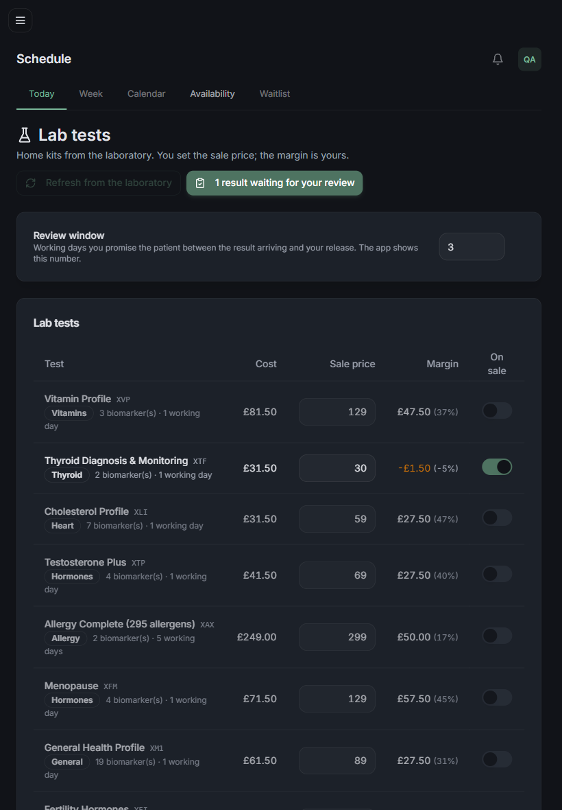
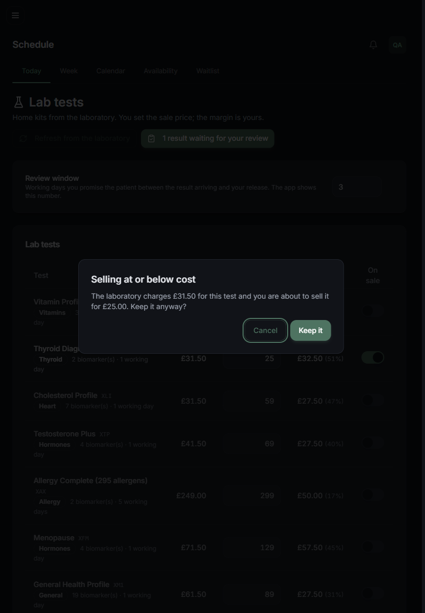
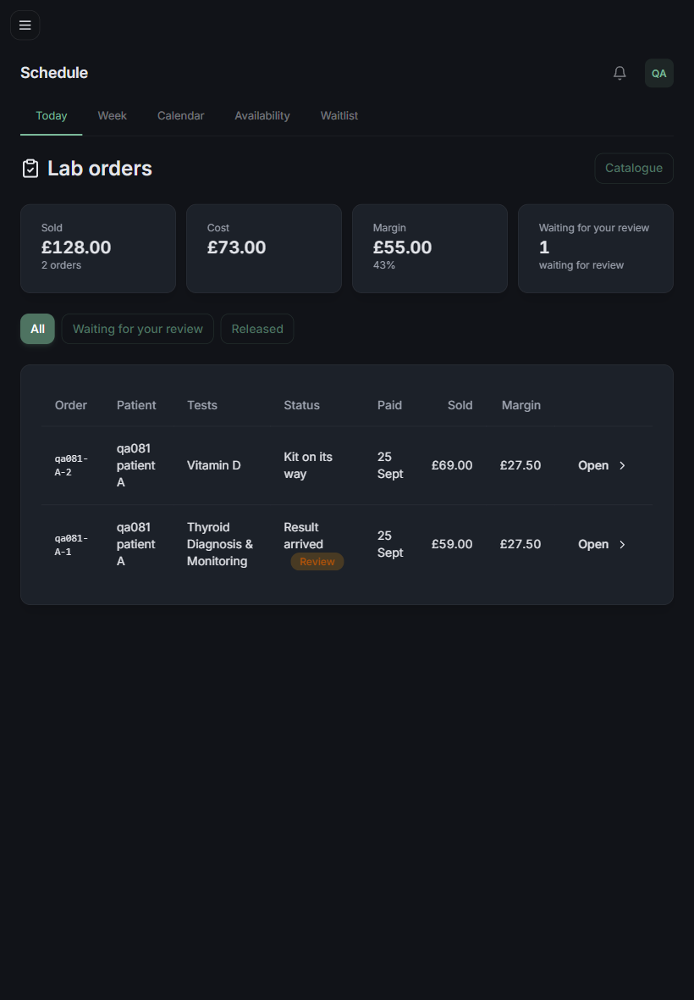
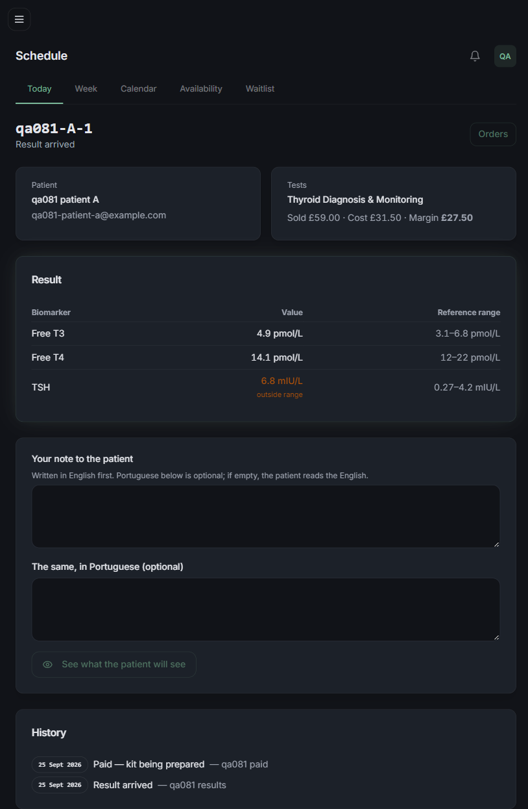
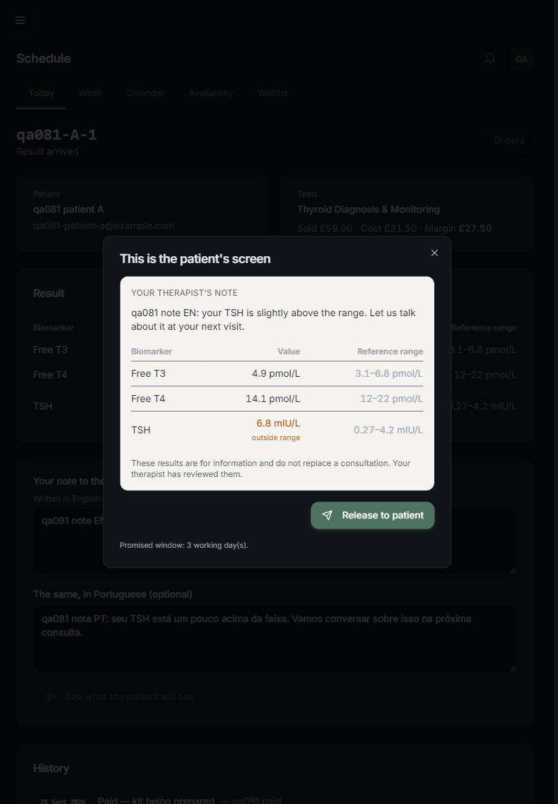
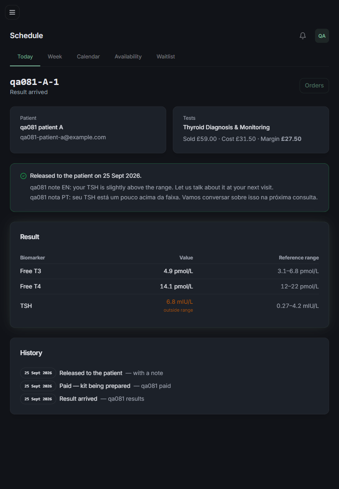
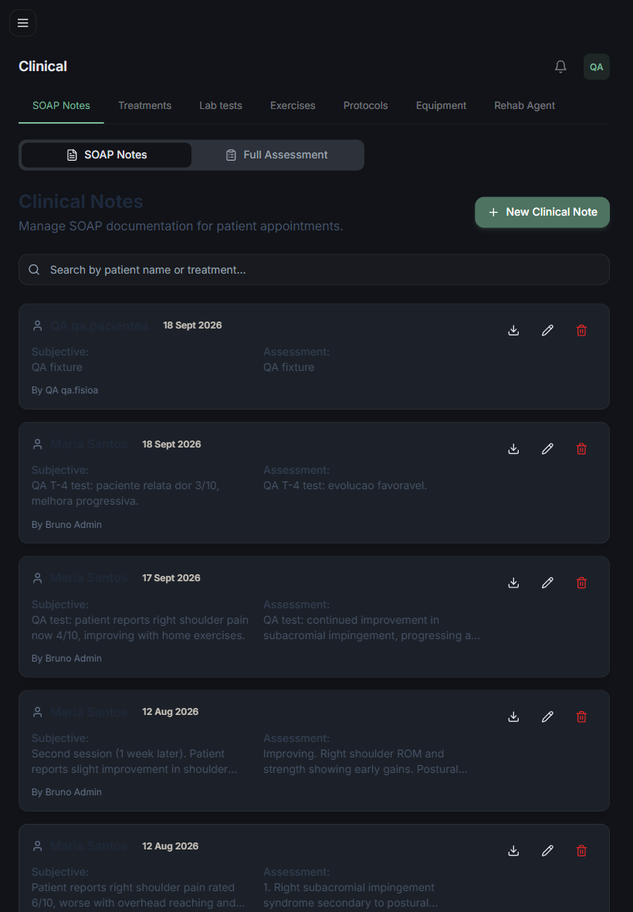
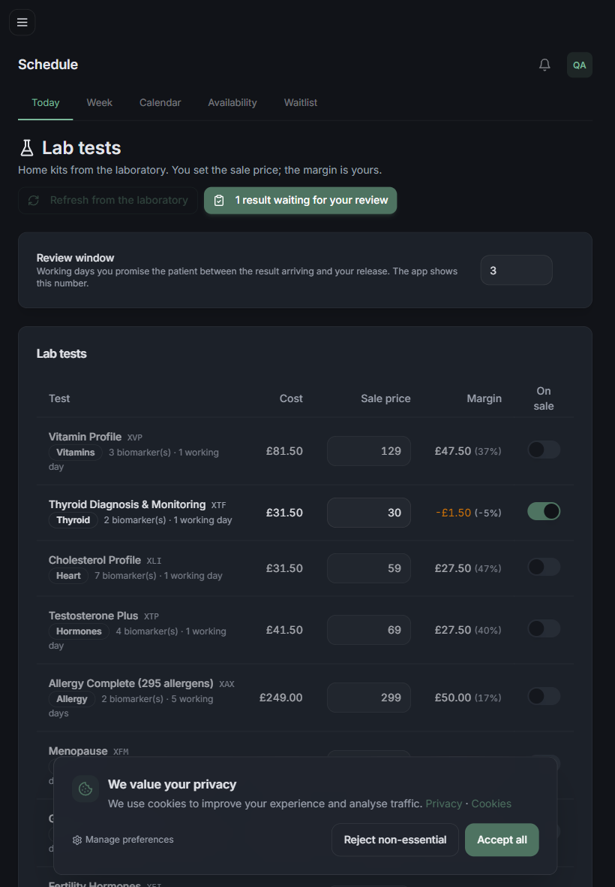

# QA Report — T-2: Painel da clínica — preço de venda, margem, pedidos e fila de liberação

**Data:** 2026-09-25
**Resultado geral:** ⚠️ aprovado com ressalvas
**Worktree medido:** `C:\Users\bruno\orca\workspaces\clinic\app_clinic` (branch `brunoto02028/app_clinic`)
**Servidor:** `next dev -p 4086` com `NEXT_DIST_DIR=.next-qa081t2` e `OUTBOUND_MODE=sink`. Marcador `public/qa081-marker.txt` → `GET :4086/qa081-marker.txt` **200** (conteúdo `qa081-t2 marker 2026-09-25T21:36:57Z worktree=app_clinic`); `GET :4000/qa081-marker.txt` **500** (a :4000 é outro checkout/servidor e não serve o marcador). Nada foi medido na :4000.
**Banco:** `bpr_clinic_local` (compartilhado). Zero DDL. Fixtures só `qa081-*`, apagadas no fim. Único produto tocado: **XTF** (`cmuhh6kcp0001xzpks5i50ps0`), original `retailPrice 59 / costPrice 31.5 / isActive false`, restaurado no fim.
**Login:** NextAuth credentials via curl (`GET /api/auth/csrf` → `POST /api/auth/callback/credentials` com `csrfToken`, `email`, `password`, `json=true`; cookie jar por usuário; `GET /api/auth/session` confirmou `role` e `clinicId` dos quatro). UI: `/staff-login` pelo Playwright com admin-A. App: `POST /api/mobile/login` (Bearer) para os pacientes A e B.

> Aviso de contexto: durante este QA outra sessão (escopo T-3) editou `app/api/mobile/labs/catalog/route.ts`, `catalog/[id]/route.ts`, `orders/route.ts` e `orders/[id]/route.ts` (mtime 22:37 +0100, um minuto depois do início). O dev server compila deste checkout, então as medições do lado do app (8.1, 6.5, 6.6) refletem a versão **atual** desses arquivos, não a que estava no início.

## Fixtures

| o quê | valor |
|---|---|
| Clínica A | `qa081-a` (type CLINIC) — ADMIN `qa081-admin-a@example.com`, THERAPIST `qa081-therapist-a@example.com`, PATIENT `qa081-patient-a@example.com` |
| Clínica B | `qa081-b` (type CLINIC) — ADMIN, THERAPIST e PATIENT `qa081-*-b@example.com` |
| Pedido `qa081-A-1` | clínica A, `RESULTS_READY`, `paidAt`, item XTF `unitPrice 59 / unitCost 31.5`, registro `qa081-reg-1` SUCCESS/resultsReady, 3 `LabResultValue` (TSH 6.8 mIU/L **outOfRange**, Free T4 14.1, Free T3 4.9) |
| Pedido `qa081-A-2` | clínica A, `KIT_DISPATCHED`, pago, item XVD `69 / 41.5` (só referência ao produto; XVD não foi alterado) |
| Pedido `qa081-B-1` | clínica B, `RESULTS_READY`, pago, registro SUCCESS **sem valores** |

Senha bcrypt conhecida (`Qa081!pass`), `emailVerified` preenchido, `isActive: true`.

## Resumo

| # | Cenário | Tipo | Resultado |
|---|---------|------|-----------|
| 8.6 | PATIENT em cada rota `/api/admin/labs/*` | API | ✅ 403 nas 7 chamadas |
| 8.5 | ADMIN da B: lista só o dela; `GET`/`POST release` de pedido da A | API | ✅ lista só `qa081-B-1`; 404 e 404 |
| 8.1 | Editar preço de venda → app reflete sem deploy; JSON do app sem `costPrice` | UI + API | ✅ |
| 8.2 | Preço abaixo do custo: 409 sem confirmação, AlertDialog na UI, 200 com confirmação, `AuditLog` | UI + API | ✅ |
| 8.2b | THERAPIST fazendo PATCH de preço | API | ✅ 403 |
| 8.3 | Margem do pedido congelada após mudar o preço do produto | API | ✅ 27,5 na lista e no detalhe com XTF a £30 |
| 8.4 | Lista de pedidos: paciente, exame, estado, custo, venda, margem; totais | UI | ⚠️ sem coluna **custo** por linha (só no total); resto ok |
| 6.7 | Staff de outra clínica lendo o pedido | API | ✅ 404 (mesma medição do 8.5) |
| 6.8 | Liberação: `releasedToPatientAt`, `releasedById`, `LabOrderEvent RELEASED`, `AuditLog` com e-mail | UI + DB | ✅ |
| 6.8b | Liberar de novo / `KIT_DISPATCHED` / sem valores | API | ✅ 409 `already_released` / `not_ready` / `no_results` |
| 6.10 | Tela do resultado: valor, unidade, faixa, fora-da-faixa em âmbar, notas EN/PT, prévia com frase de não-diagnóstico | UI | ✅ |
| 6.5 | Paciente pedindo resultado próprio **não liberado** | API (rota T-3) | ⚠️ 200 com `result: null` / `stage: in_review` — spec diz 403 |
| 6.6 | Paciente pedindo pedido de outro | API (rota T-3) | ✅ 404 |
| P | Prazo: PATCH settings 0 e 15 → 400; 3 → 200 e `Clinic.labReviewDays = 3`; THERAPIST → 403 | API + DB | ✅ |
| C | Contador `labResultsAwaitingRelease` (pending-count, `getClinicWaiting`) 1 → 0 após liberar; linha do e-mail diário | API + script | ✅ |
| N | Aba "Lab tests" na seção Clinical | UI | ⚠️ a aba existe, mas em `/admin/labs*` o cabeçalho e a tablist mostram **Schedule** |
| Push | Texto do push sem exame/valor | log/DB | ⚠️ não medido em runtime (paciente sem aparelho); texto estático conferido no código |

Os cenários "P", "C", "N" e "Push" foram derivados do pedido da sessão principal e dos critérios de aceite da tarefa (não têm id na qa-spec).

## Detalhes

### 8.6 PATIENT em `/api/admin/labs/*` ✅
Sessão NextAuth do `qa081-patient-a@example.com`:
```
GET   /api/admin/labs/products                          → 403 {"error":"Forbidden"}
PATCH /api/admin/labs/products/<XTF> {"retailPrice":60} → 403 {"error":"Forbidden"}
GET   /api/admin/labs/settings                          → 403
PATCH /api/admin/labs/settings {"labReviewDays":3}      → 403
GET   /api/admin/labs/orders                            → 403
GET   /api/admin/labs/orders/<A-1>                      → 403
POST  /api/admin/labs/orders/<A-1>/release              → 403
```

### 8.5 ADMIN da clínica B ✅
```
GET /api/admin/labs/orders (admin-B) → 200
{"orders":[{"orderNumber":"qa081-B-1","status":"RESULTS_READY","patient":{"firstName":"qa081 patient","lastName":"B"},
  "products":["Thyroid Diagnosis & Monitoring"],"total":59,"cost":31.5,"margin":27.5,"awaitingRelease":true,...}],
 "totals":{"orders":1,"sold":59,"cost":31.5,"margin":27.5,"awaitingRelease":1}}
GET  /api/admin/labs/orders/<A-1>         (admin-B) → 404 {"error":"Not found"}
POST /api/admin/labs/orders/<A-1>/release (admin-B) → 404 {"error":"Not found"}
```
Nenhum pedido da A aparece para a B.

### 8.1 Editar preço de venda → app reflete sem deploy ✅
- Antes (XTF inativo): `GET /api/mobile/labs/catalog` com token do paciente A → `{"products":[],"orderingEnabled":false,"reviewDays":3}`.
- Ativado o XTF via `PATCH {"isActive":true}` (admin-A) → 200.
- Preço via API a 30 (ver 8.2) → catálogo do app: `[{"code":"XTF","price":30,"currency":"GBP"}]`, chaves do produto: `id,code,name,category,biomarkers,sampleType,turnaroundDays,price,currency,description,notUnder16` — **`costPrice` ausente** (`contém costPrice? false`). Sem token → 401.
- **Pela UI** (`/admin/labs`, input `lab-price-XTF`, digitado `64` + Enter): `GET /api/admin/labs/products` → `{"retailPrice":64,"costPrice":31.5,"margin":{"gbp":32.5,"pct":0.5078}}`; catálogo do app → `[{"code":"XTF","price":64}]`, sem `costPrice`; linha na tela: `£31.50 | £32.50 (51%)`. Nenhum restart.
- **Evidência:**  (estado com XTF a £30 e margem `-£1.50 (-5%)` em âmbar, antes da edição para 64)

### 8.2 Preço abaixo do custo ✅
API (admin-A, custo 31,5):
```
PATCH /products/<XTF> {"retailPrice":30}
→ 409 {"error":"The sale price is at or below cost. Confirm to keep it.","errorPt":"O preço de venda está igual ou abaixo do custo. Confirme para manter.","code":"below_cost","costPrice":31.5,"retailPrice":30}
PATCH /products/<XTF> {"retailPrice":30,"confirmBelowCost":true}
→ 200 {"id":"cmuhh6kcp0001xzpks5i50ps0","retailPrice":30,"isActive":true,"margin":{"gbp":-1.5,"pct":-0.05}}
```
UI: digitado `25` + Enter no input do XTF → AlertDialog "Selling at or below cost — The laboratory charges £31.50 for this test and you are about to sell it for £25.00. Keep it anyway?" com botões Cancel / Keep it. Clicado "Keep it" → diálogo fechou, linha `£31.50 | -£6.50 (-26%)`, API `retailPrice: 25`.
- **Evidência:** 

`AuditLog` (`action = LAB_PRODUCT_CHANGED`, ordem cronológica):
```
{"userEmail":"qa081-admin-a@example.com","userRole":"ADMIN","description":"XTF Thyroid Diagnosis & Monitoring: activated","metadata":{"after":{"isActive":true,"retailPrice":59},"before":{"isActive":false,"retailPrice":59},"belowCost":false,"costPrice":31.5}}
{"userEmail":"qa081-admin-a@example.com","userRole":"ADMIN","description":"XTF ...: price 59 → 30 (confirmed below cost)","metadata":{...,"belowCost":true,"costPrice":31.5}}
{"userEmail":"qa081-admin-a@example.com","userRole":"ADMIN","description":"XTF ...: price 30 → 64","metadata":{...,"belowCost":false,"costPrice":31.5}}
{"userEmail":"qa081-admin-a@example.com","userRole":"ADMIN","description":"XTF ...: price 64 → 25 (confirmed below cost)","metadata":{"after":{"isActive":true,"retailPrice":25},"before":{"isActive":true,"retailPrice":64},"belowCost":true,"costPrice":31.5}}
```
`userEmail` preenchido em todas (a falha da 080 não se repetiu).

THERAPIST: `PATCH /products/<XTF> {"retailPrice":61}` (therapist-A) → **403** `{"error":"Only the clinic owner sets prices","errorPt":"Só o dono da clínica define preços"}`.

### 8.3 Margem congelada ✅
Com o XTF a **£30** (margem de hoje `-1,5`):
```
lista (admin-A):  qa081-A-1 RESULTS_READY total 59 cost 31.5 margin 27.5
                  qa081-A-2 KIT_DISPATCHED total 69 cost 41.5 margin 27.5
                  totals {"orders":2,"sold":128,"cost":73,"margin":55,"awaitingRelease":1}
detalhe A-1:      total 59 cost 31.5 margin 27.5  items [{"unitPrice":59,"unitCost":31.5,"total":59}]
```
Nem a lista nem o detalhe recalcularam com o preço novo.

### 8.4 Lista de pedidos ⚠️
`/admin/labs/orders` (admin-A): cards **Sold £128.00 (2 orders) · Cost £73.00 · Margin £55.00 (43%) · Waiting for your review 1**; filtros All / Waiting for your review / Released; tabela com colunas **Order, Patient, Tests, Status, Paid, Sold, Margin** e botão Open. Linhas: `qa081-A-2 | qa081 patient A | Vitamin D | Kit on its way | 25 Sept | £69.00 | £27.50` e `qa081-A-1 | ... | Thyroid Diagnosis & Monitoring | Result arrived [Review] | 25 Sept | £59.00 | £27.50`.
- Totais batem com os dois pedidos pagos e não cancelados (59+69 = 128; 31,5+41,5 = 73; 128−73 = 55).
- **Ressalva:** o passo 4 da tarefa pede "paciente, exame, estado, pago em, **custo**, venda, margem" e a qa-spec 8.4 idem; a tabela não tem coluna de custo por pedido (a API devolve `cost`; a tela só mostra o custo agregado no card).
- **Evidência:** 

### 6.10 / 6.8 Tela de liberação e liberação ✅
`/admin/labs/orders/<A-1>` antes de liberar: paciente (nome + e-mail), "Sold £59.00 · Cost £31.50 · Margin £27.50", tabela Biomarker / Value / Reference range: `Free T3 4.9 pmol/L 3.1–6.8`, `Free T4 14.1 pmol/L 12–22`, `TSH 6.8 mIU/L outside range 0.27–4.2`. Célula fora-da-faixa: classe `text-amber-700`, cor computada `rgb(180, 83, 9)` (âmbar, não vermelho). Campos "Your note to the patient" (EN) e "The same, in Portuguese (optional)", botão "See what the patient will see". Histórico com os dois eventos da fixture.
- **Evidência:** 

Prévia (Dialog "This is the patient's screen"): "Your therapist's note" + a nota EN digitada, a mesma tabela com "outside range", a frase **"These results are for information and do not replace a consultation. Your therapist has reviewed them."**, botão "Release to patient", "Promised window: 3 working day(s)." (prazo vindo do settings).
- **Evidência:** 

Clique em "Release to patient": log do servidor `POST /api/admin/labs/orders/cmuhhg6ic000fxz5kchqu2le4/release 200 in 632ms`. Tela passou a mostrar "Released to the patient on 25 Sept 2026." com as notas EN e PT e o evento "Released to the patient — with a note" no histórico.
- **Evidência:** 

Banco após liberar:
```
LabOrder qa081-A-1: releasedToPatientAt 2026-09-25T21:45:32.648Z, releasedById cmuhhg6gl0003xz5k4r8euk3f (admin-A),
  releaseNote "qa081 note EN: ...", releaseNotePt "qa081 nota PT: ..."
LabOrderEvent: {"status":"RELEASED","note":"with a note","metadata":{"by":"cmuhhg6gl0003xz5k4r8euk3f"}}
AuditLog: {"action":"LAB_RESULT_RELEASED","userEmail":"qa081-admin-a@example.com","userRole":"ADMIN","userName":"qa081 admin A",
  "entity":"LabOrder","entityId":"cmuhhg6ic000fxz5kchqu2le4","description":"result of qa081-A-1 released to the patient with a note"}
```
API depois: `GET /orders/<A-1>` → `awaitingRelease: false`; `POST /orders/<A-1>/release` → **409** `{"code":"already_released"}`; totals `awaitingRelease: 0`.

Guardas (antes da liberação):
```
POST /orders/<B-1>/release (admin-B; RESULTS_READY sem valores) → 409 {"code":"no_results","error":"There are no values to release","errorPt":"Não há valores para liberar"}
POST /orders/<A-2>/release (admin-A; KIT_DISPATCHED)             → 409 {"code":"not_ready","error":"The result has not arrived yet","errorPt":"O resultado ainda não chegou"}
```

### 6.5 / 6.6 Lado do paciente (rota `/api/mobile/labs/orders/[id]`, escopo T-3) ⚠️ / ✅
```
paciente B, pedido próprio B-1 não liberado → 200 {"order":{...,"status":"RESULTS_READY","stage":"in_review","released":false,...},"result":null,"reviewDays":2}
paciente B, pedido A-1 (de outro paciente/clínica) → 404 {"error":"Order not found","errorPt":"Pedido não encontrado"}
paciente A, pedido A-1 liberado → 200 {"order":{...,"stage":"released","released":true},"result":{"releasedAt":...,"noteEn":"qa081 note EN: ...",...}}
```
6.5: nenhum valor vaza (`result: null`), mas a resposta é 200 com estado "em revisão" em vez do 403 que a qa-spec escreve. É coerente com o plano ("em revisão com o seu terapeuta", com prazo) — a spec ou a rota precisam se alinhar; a rota é da T-3 e mudou durante este QA.

### P Prazo de revisão ✅
```
PATCH /settings {"labReviewDays":3}  (therapist-A) → 403 {"error":"Forbidden"}
GET   /settings                       (admin-A)     → {"labReviewDays":2,"canEdit":true}
PATCH /settings {"labReviewDays":0}   (admin-A)     → 400 {"error":"Between 1 and 14 working days","errorPt":"Entre 1 e 14 dias úteis"}
PATCH /settings {"labReviewDays":15}  (admin-A)     → 400 (idem)
PATCH /settings {"labReviewDays":3}   (admin-A)     → 200 {"labReviewDays":3}
Prisma: Clinic A labReviewDays = 3;  AuditLog LAB_REVIEW_DAYS_CHANGED "lab review window 2 → 3 working days" (userEmail qa081-admin-a@example.com)
Restaurado no fim: PATCH {"labReviewDays":2} → 200; Prisma: 2 (antes de a clínica ser apagada)
```
O catálogo do app passou a devolver `reviewDays: 3` sem restart; a prévia mostrou "Promised window: 3 working day(s)".

### C Contador e e-mail diário ✅
Com A-1 em `RESULTS_READY` não liberado:
```
GET /api/admin/pending-count (admin-A)     → {...,"labResultsAwaitingRelease":1}
GET /api/admin/pending-count (therapist-A) → {...,"labResultsAwaitingRelease":1}
tsx: getClinicWaiting(A) = {"exerciseVideos":0,...,"labResultsAwaitingRelease":1,"total":1}
     waitingEmailBlock → href=https://bpr.clinic/admin/labs/orders n=1 texto="lab result waiting for your review"
```
Depois de liberar: `pending-count` → `labResultsAwaitingRelease: 0`; `getClinicWaiting(A)` → `total: 0`; `waitingEmailBlock` vazio (sem a linha). A tela `/admin/labs` mostra o botão "1 result waiting for your review" ligado a `/admin/labs/orders`.

### N Aba "Lab tests" na seção Clinical ⚠️
- Em `/admin/clinical-notes` a tablist "Clinical" lista **SOAP Notes, Treatments, Lab tests, Exercises, Protocols, Equipment, Rehab Agent** — a aba existe e leva a `/admin/labs`. 
- Porém em `/admin/labs`, `/admin/labs/orders` e `/admin/labs/orders/<id>` o cabeçalho é **"Schedule"** e a tablist é a do Schedule (Today, Week, Calendar, Availability, Waitlist) — a aba "Lab tests" não aparece como ativa. 
- Causa (código, não corrigido): `getActiveAdminNav` em `lib/admin-sections.ts` casa a **seção** pelo `matchRoutes` do nível da seção antes de olhar as abas; o `matchRoutes` da seção `clinical` (linhas ~316-326) lista `/admin/clinical-notes`, `/admin/treatment-plans`, `/admin/exercises`, `/admin/protocols`, … mas **não** `/admin/labs`. Só a aba tem `matchRoutes: ["/admin/labs"]`. Resultado: fallback para `ADMIN_SECTIONS[0]` (Schedule).

### Push ⚠️ não medido em runtime
`PushDeviceToken` do paciente A = 0, então `pushDocumento` não teve destino e nenhuma linha `[OUTBOUND-SINK] push` apareceu no log do servidor; não há registro de push em `OutboundMessage` (o modelo não tem `subject`/`body` genéricos — a consulta com esses campos falhou; o push não passa por ele). O texto é fixo em `lib/push-notify.ts` (`pushDocumento`): EN "Your clinic / A new document is in your app.", PT "Sua clínica / Um novo documento está no seu app." — não contém exame nem valor, por construção. Fica a medir com um aparelho registrado.

## Erros de console
- `/admin/labs`: 1 erro — `Failed to load resource: 409 (Conflict) @ /api/admin/labs/products/<XTF>` — é o log de rede do 409 `below_cost` esperado; a UI tratou (abriu o AlertDialog).
- `/admin/labs/orders/<id>`: 0 erros; 2 warnings do Radix: `Missing Description or aria-describedby={undefined} for {DialogContent}` (diálogo de prévia sem `DialogDescription`).
- `/staff-login`, `/admin`, `/admin/labs/orders`: nenhum erro.

## Falhas e recomendações

1. **Navegação em `/admin/labs*` mostra "Schedule"** (escopo T-2). Onde olhar: `lib/admin-sections.ts`, `matchRoutes` da seção `clinical` — falta `/admin/labs`. Sem isso o Bruno abre "Lab tests" e vê cabeçalho e abas da Agenda.
2. **Lista de pedidos sem coluna de custo** (escopo T-2, passo 4 / cenário 8.4). Onde olhar: `app/admin/labs/orders/page.tsx`, tabela — a API já devolve `cost` por linha.
3. **6.5 diverge da qa-spec** (escopo T-3): resultado não liberado responde 200 com `result: null` e `stage: in_review`, não 403. Decidir qual dos dois é a regra e alinhar spec ou rota (`app/api/mobile/labs/orders/[id]/route.ts`).
4. **Diálogo de prévia sem `DialogDescription`** (acessibilidade; warning do Radix). Onde olhar: `app/admin/labs/orders/[id]/page.tsx`, `<DialogContent>`.
5. Menor: a string `ui.none` ("First time this is measured.") existe nos dois idiomas mas nada a renderiza quando não há resultados anteriores — a tela simplesmente omite a linha. Se a intenção era mostrar, está morta.

### Achado fora do escopo (não corrigido, só reportado)
**Vazamento entre clínicas em `/admin/clinical-notes`.** Logado como ADMIN da clínica `qa081-A` (recém-criada, sem pacientes), a página listou notas SOAP de "Maria Santos", "Qa TestPatient" e "QA qa.pacientea" — pacientes de outras clínicas (print `t2-clinical-aba-lab-tests.png`). Rota: `app/api/admin/clinical-notes/route.ts` usa `getClinicContext()` (lê o header `x-clinic-id`) + `withClinicFilter(where, clinicId)`, que **não filtra nada quando `clinicId` é null**. Mesma família das rotas legadas com `session.user.clinicId` (memória de 16/09 e 18/09). Recomendo migrar para `getActor`/`tenantWhere`.

## O que não foi medido e por quê

| item | motivo |
|---|---|
| Texto real do push na liberação | paciente de teste sem `PushDeviceToken`; `OUTBOUND_MODE=sink` de qualquer forma. Texto conferido no código. |
| Botão "Refresh from the laboratory" (sync, passo 3) | desabilitado na tela; depende da T-5 (token da LML). |
| Resultados anteriores na tela de liberação (plano, item 2) | fixture com um único pedido liberado por paciente; `previous: []` na API. Não há dado para exercer a linha do tempo. |
| Nota PT vazia caindo no EN na tela do paciente | tela do app é T-3. |
| Concorrência de duas abas liberando ao mesmo tempo | não simulada; o `updateMany` com guarda `releasedToPatientAt: null` está no código. |

## Limpeza executada

- Prazo da clínica A restaurado para 2 via API antes de apagar (`{"labReviewDays":2}`, Prisma confirmou 2).
- XTF restaurado via Prisma: antes do restore `{"retailPrice":25,"isActive":true}` → depois `{"retailPrice":59,"costPrice":31.5,"isActive":false}` (igual ao original registrado no início).
- Apagados: `labOrders: 3` (cascata em items, events, registrations, values), `auditLogs: 14` (todas com `userEmail` `qa081-*`, incluindo LOGIN_SUCCESS), `users: 6`, `clinics: 2`.
- Contagens finais: `{"usersQa":0,"clinicsQa":0,"ordersQa":0,"regsQa":0,"valuesOrfaos":0,"eventsQa":0,"auditQa":0,"labProducts":22,"labProductsActive":0,"labOrdersTotal":0}`.
- Dev server na :4086 parado (`taskkill` na PID 12900 que ouvia a porta; 0 listeners depois). `public/qa081-marker.txt` apagado. `.next-qa081t2` removido (já era ignorado pelo git). `tsconfig.json` revertido (o `next dev` tinha inserido `.next-qa081t2/types/**/*.ts` no `include`; `git diff` vazio depois).
- Browser do Playwright fechado. Cookie jars, tokens e scripts ficaram só no scratchpad da sessão.

### `git status --short` final
Este QA acrescentou **somente** `specs/081-exames-de-laboratorio-pelo-app/qa/report-t-2.md` e os prints `qa/screenshots/t2-*.png` (dentro da pasta `specs/081-.../` que já estava untracked). Os demais itens abaixo já estavam modificados no início ou foram tocados por outras sessões no mesmo worktree durante o QA (`mobile/`, `app/privacy/page.tsx`, `app/api/mobile/labs/*`, `lib/lab-consent.ts`, `lib/lab-ordering.ts`, `lib/lab-patient.ts`, `lib/lab-stage.ts`, `app/api/patient/lab-consent/`, `public/version.json`):
```
 M __tests__/email/clinic-waiting-block.test.ts
 M app/api/admin/pending-count/route.ts
 M app/api/mobile/labs/catalog/[id]/route.ts
 M app/api/mobile/labs/catalog/route.ts
 M app/api/mobile/labs/orders/[id]/route.ts
 M app/api/mobile/labs/orders/route.ts
 M app/privacy/page.tsx
 M lib/admin-sections.ts
 M lib/clinic-waiting.ts
 M mobile/app/(app)/(lab)/(tabs)/_layout.tsx
 M mobile/app/(app)/(lab)/(tabs)/index.tsx
 M mobile/app/(app)/(lab)/(tabs)/orders.tsx
 M mobile/app/(app)/(lab)/[id].tsx
 M mobile/app/(app)/(lab)/checkout.tsx
D  mobile/app/(app)/(lab)/collection-method.tsx
 M mobile/app/(app)/(lab)/order/[id].tsx
 M mobile/app/(app)/(lab)/result/[id].tsx
 M mobile/src/api/labs.ts
 M mobile/src/components/ui/Card.tsx
 M prisma/schema.prisma
 M public/version.json
 M specs/README.md
 M start.sh
?? __tests__/labs/
?? app/admin/labs/
?? app/api/admin/labs/
?? app/api/patient/lab-consent/
?? lib/lab-admin.ts
?? lib/lab-catalog.ts
?? lib/lab-consent.ts
?? lib/lab-ordering.ts
?? lib/lab-patient.ts
?? lib/lab-registration-status.ts
?? lib/lab-stage.ts
?? mobile/src/lib/lab-stage-copy.ts
?? scripts/seed-lab-products.js
?? specs/080-primeira-consulta-sessao-e-extra/qa/report-online.md
?? specs/081-exames-de-laboratorio-pelo-app/
```