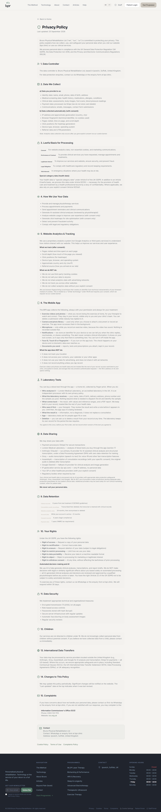
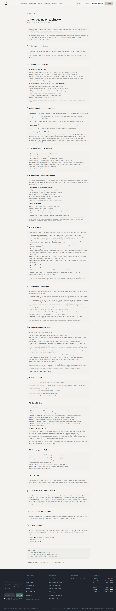

# QA Report — T-3: Telas do app · T-4: Privacidade, consentimento e liberação

**Data:** 2026-09-25
**Resultado geral:** ✅ **T-3 aprovado** (lado servidor + `tsc`; telas nativas não medidas) · ✅ **T-4 aprovado**
**Worktree medido:** `C:\Users\bruno\orca\workspaces\clinic\app_clinic` (branch `brunoto02028/app_clinic`)
**Servidor:** `next dev -p 4087` com `NEXT_DIST_DIR=.next-qa081t3` e `OUTBOUND_MODE=sink`. Marcador `public/qa081t3-marker.txt` → `GET :4087/qa081t3-marker.txt` **200** (`qa081-t3 marker 2026-09-25T21:56:04Z worktree=app_clinic`); `GET :4000/qa081t3-marker.txt` **500** (a :4000 é outro checkout). Nada foi medido na :4000.
**Banco:** compartilhado, zero DDL. Fixtures só `qa081t3-*`, apagadas no fim. Único produto tocado: **XTF** (`cmuhh6kcp0001xzpks5i50ps0`), original `isActive false / retailPrice 59 / costPrice 31.5`, restaurado.
**Login do app:** `POST /api/mobile/login` (Bearer) para os três pacientes. Senha bcrypt conhecida, `emailVerified` preenchido, `isActive: true`.

## Fixtures

| o quê | valor |
|---|---|
| Clínica A | `qa081t3-a` (CLINIC, `labReviewDays: 3`) — pacientes `qa081t3-patient-a@example.com` (A) e `qa081t3-patient-c@example.com` (C) |
| Clínica B | `qa081t3-b` (CLINIC) — paciente `qa081t3-patient-b@example.com` (B) |
| Pedidos do paciente A (item XTF `unitPrice 59 / unitCost 31.5`, pagos exceto o BASKET) | `qa081t3-confirmed` CONFIRMED · `qa081t3-kit-noreg` KIT_DISPATCHED sem registro · `qa081t3-kit-pending` KIT_DISPATCHED + registro PENDING · `qa081t3-sample` SAMPLE_RECEIVED · `qa081t3-in-review` RESULTS_READY **não liberado**, registro SUCCESS, 2 `LabResultValue` (TSH 6.8 `outOfRange: true`, Free T4 14.1), `releaseNote: "SEGREDO-QA"` · `qa081t3-released` RESULTS_READY liberado (`releasedToPatientAt`, `releaseNote "Tudo bem"`, `releaseNotePt "Tudo certo"`, 2 valores, Free T4 25 `outOfRange`, evento RELEASED) · `qa081t3-cancelled` CANCELLED_LAB · `qa081t3-basket` BASKET |

## Resumo

| # | Cenário | Tipo | Tarefa | Resultado |
|---|---|---|---|---|
| 7.1 | Catálogo do app: sem `costPrice`/`margin`, só ativos, `description` EN+PT, `orderingEnabled`, `reviewDays`; sem bearer 401; inativo por id 404 | API | T-3 | ✅ |
| 7.5 | Cada estado do pedido → `stage` certo; texto EN e PT por estágio (servidor e app); BASKET fora da lista; `jest __tests__/labs` | API + código + teste | T-3 | ✅ |
| 7.6 / 6.5 | Resultado não liberado: `result: null`, `stage: in_review`, nada da nota, do custo, dos valores, nem evento RELEASED | API | T-3 (T-9) | ✅ |
| 6.6 | Paciente de outra clínica e paciente da mesma clínica lendo o pedido → 404 | API | T-3 (T-9) | ✅ |
| — | Pedido liberado: `result.values` (2), `outOfRange`, `noteEn`/`notePt`, `pdfAvailable: false`; sem `unitCost`; sem RELEASED em `events` | API | T-3 | ✅ |
| — | `PATCH /api/mobile/labs/orders/<id>` → 410 | API | T-3 | ✅ |
| 9.1 | `POST /orders` sem consentimento → 403 `consent_required` EN+PT (antes de qualquer outra checagem, loja fechada **e** aberta) | API | T-4 | ✅ |
| 9.2 | `POST /api/patient/lab-consent` → 200; `ConsentLog` `LAB_TESTS_CONSENT_ACCEPTED`, `termsVersion "1.0"`, `metadata.where "labs"`; `GET ?locale=pt-BR` / `en-GB` | API + DB | T-4 | ✅ |
| — | Com consentimento e loja fechada → 503 `ordering_unavailable` | API | T-3/T-4 | ✅ |
| — | Loja aberta (env só no processo): sem CEP 400 `shipping_required` EN+PT; qtd 0/-1 400; inativo 400; items vazio 400; válido com `price: 0.30` → 201 com `unitPrice 59`, `unitCost 31.5`, `clinicId`, BASKET | API + DB | T-3 | ✅ |
| 9.3 | `/privacy` web sem login: "London Medical Laboratory", "7. Laboratory Tests", seções 1–15 sem número repetido; PT "7. Exames de Laboratório" | UI | T-4 | ✅ (PT só por `localStorage`; ver ressalva) |
| 9.4 | Frase de não-diagnóstico na tela de resultado e no consentimento; e-mail | código | T-4 | ✅ · e-mail **N/A** |
| 9.5 | `eas.json` continua `EXPO_PUBLIC_SHOW_LAB: "false"`, diff vazio, t-4 documenta o adiamento | código | T-4 | ✅ |
| 7.8 | `npx tsc --noEmit` em `mobile/` | build | T-3 | ✅ exit 0 |
| 7.2 / 7.3 / 7.4 / 7.7 / 6.10 (tela) | Telas nativas | UI | T-3 | ⚠️ **não executado** (ver "O que não foi medido") |

Os cenários sem id ("—") foram derivados do pedido da sessão principal e dos critérios de aceite das tarefas.

## Detalhes

### 7.1 Catálogo do app ✅
```
GET /api/mobile/labs/catalog                       (sem bearer)  → 401 {"error":"Unauthorised"}
GET /api/mobile/labs/catalog                       (paciente A)  → 200
{"products":[{"id":"cmuhh6kcp0001xzpks5i50ps0","code":"XTF","name":"Thyroid Diagnosis & Monitoring","category":"Thyroid",
  "biomarkers":["Free T4","TSH"],"sampleType":"capillary","turnaroundDays":1,"price":59,"currency":"GBP",
  "description":{"en":"Is your thyroid under- or overactive? TSH and free T4 answer it, and track treatment if you are already on it.",
                 "pt":"Sua tireoide está lenta ou acelerada? TSH e T4 livre respondem, e acompanham o tratamento se você já faz."},
  "notUnder16":false}],"orderingEnabled":false,"reviewDays":3}
```
- 22 produtos no banco, 21 inativos → só o XTF (ativado para o teste) veio na lista.
- Chaves do produto: `id, code, name, category, biomarkers, sampleType, turnaroundDays, price, currency, description, notUnder16`. `contém costPrice? false | margin? false | "31.5"? false`.
- `reviewDays: 3` = `labReviewDays` da clínica A (não o default 2).
```
GET /api/mobile/labs/catalog/<XTF>          (A)          → 200 {"product":{...mesmas chaves...},"orderingEnabled":false}   costPrice? false | margin? false | 31.5? false
GET /api/mobile/labs/catalog/<XTF>          (sem bearer) → 401
GET /api/mobile/labs/catalog/<XVD inativo>  (A)          → 404 {"error":"Product not found","errorPt":"Exame não encontrado"}
GET /api/mobile/labs/catalog/nao-existe     (A)          → 404 (mesmo corpo)
```

### 7.5 Estados do pedido ✅
`GET /api/mobile/labs/orders` (A) → 200, `reviewDays: 3`, `orderingEnabled: false`, **7 pedidos** (o BASKET não veio):
```
qa081t3-cancelled    status=CANCELLED_LAB   stage=cancelled        registration=null
qa081t3-released     status=RESULTS_READY   stage=released         registration={"status":"SUCCESS","registered":true,"canRegister":false}
qa081t3-in-review    status=RESULTS_READY   stage=in_review        registration={"status":"SUCCESS","registered":true,"canRegister":false}
qa081t3-sample       status=SAMPLE_RECEIVED stage=at_lab           registration={"status":"PENDING",...}
qa081t3-kit-pending  status=KIT_DISPATCHED  stage=collect_and_post registration={"status":"PENDING",...}
qa081t3-kit-noreg    status=KIT_DISPATCHED  stage=register_kit     registration=null
qa081t3-confirmed    status=CONFIRMED       stage=kit_preparing    registration=null
BASKET na lista? false
contém SEGREDO-QA? false | unitCost? false | releaseNote? false | costPrice? false | RELEASED? false
keys de um item: [ 'id', 'productId', 'productName', 'quantity', 'unitPrice', 'total' ]
```
Sem bearer → 401.

Texto por estágio: os 8 estágios (`basket, kit_preparing, register_kit, collect_and_post, at_lab, in_review, released, cancelled`) existem uma vez cada em `mobile/src/lib/lab-stage-copy.ts` e em `lib/lab-stage.ts`, cada um com bloco `en: { title, body }` e `pt: { title, body }`; o `in_review` interpola `reviewDays` nas duas línguas. `collection-method.tsx` foi removido (`D` no git), como o passo 8 da T-3 pedia.
```
npx jest __tests__/labs
PASS __tests__/labs/patient-shape.test.ts
PASS __tests__/labs/registration-status.test.ts
PASS __tests__/labs/catalog-seed.test.ts
PASS __tests__/labs/stage-copy-parity.test.ts
PASS __tests__/labs/stage.test.ts
Test Suites: 5 passed, 5 total
Tests:       58 passed, 58 total
```

### 7.6 / 6.5 Resultado não liberado ✅
```
GET /api/mobile/labs/orders/cmuhi3h1r000yxz64v6byx4kq   (in_review, paciente A) → 200
{"order":{"id":"cmuhi3h1r000yxz64v6byx4kq","orderNumber":"qa081t3-in-review","status":"RESULTS_READY","stage":"in_review","total":59,
  "currency":"GBP",...,"items":[{"id":"...","productId":"cmuhh6kcp0001xzpks5i50ps0","productName":"Thyroid Diagnosis & Monitoring","quantity":1,"unitPrice":59,"total":59}],
  "shipping":{"name":"qa081t3 patient A","address":"1 Test Street","postcode":"SW1A 1AA"},
  "registration":{"status":"SUCCESS","registered":true,"canRegister":false},"released":false,"releasedAt":null,
  "events":[{"status":"CONFIRMED",...},{"status":"RESULTS_READY",...}]},
 "result":null,"reviewDays":3}
result: null | stage: in_review | reviewDays: 3
contém SEGREDO-QA? false | unitCost? false | releaseNote? false | TSH? false | 6.8? false | outOfRange? false
events: ["CONFIRMED","RESULTS_READY"]
```
Nada no corpo sugere valor, nota ou fora-da-faixa. (A spec original do 6.5 dizia 403; a decisão da T-3, registrada na qa-spec, é 200 com `result: null` e `stage: in_review` — é o que foi medido.)

### 6.6 Isolamento ✅
```
GET /orders/<in_review>  paciente B (clínica B)        → 404 {"error":"Order not found","errorPt":"Pedido não encontrado"}
GET /orders/<in_review>  paciente C (mesma clínica A)  → 404 (mesmo corpo)
GET /orders/<in_review>  sem bearer                    → 401
GET /orders/<released>   paciente B                    → 404
GET /orders/<LB-2026-00001 criado no teste> paciente B → 404
```

### Pedido liberado ✅
```
GET /api/mobile/labs/orders/cmuhi3h1u0017xz64060l1o17 (A) → 200
"result":{"releasedAt":"2026-09-25T21:56:40.337Z","noteEn":"Tudo bem","notePt":"Tudo certo",
  "values":[{"id":"...","biomarker":"Free T4","value":25,"valueText":null,"unit":"pmol/L","minRange":12,"maxRange":22,"outOfRange":true,"measuredAt":"..."},
            {"id":"...","biomarker":"TSH","value":2.1,"valueText":null,"unit":"mIU/L","minRange":0.27,"maxRange":4.2,"outOfRange":false,"measuredAt":"..."}],
  "pdfAvailable":false}
stage: released | result.values: 2 | outOfRange: [ 'Free T4=true', 'TSH=false' ] | pdfAvailable: false
contém unitCost? false | RELEASED em events? false   events: ["CONFIRMED","RESULTS_READY"]
```
O evento `RELEASED` da fixture foi filtrado da linha do tempo do paciente.

### PATCH removido ✅
```
PATCH /api/mobile/labs/orders/<in_review> (A) {"status":"CONFIRMED"}
→ 410 {"error":"Orders are confirmed by payment, not by the app.","errorPt":"O pedido é confirmado pelo pagamento, não pelo app.","code":"gone"}
```

### 9.1 Pedido sem consentimento ✅
```
POST /api/mobile/labs/orders (A, sem consentimento, loja fechada)
  {"items":[{"productId":"<XTF>","quantity":1}],"shippingAddress":"1 Test Street","shippingPostcode":"SW1A 1AA"}
→ 403 {"error":"Please read and accept the laboratory test notice before ordering.",
       "errorPt":"Leia e aceite o aviso sobre exames de laboratório antes de pedir.","code":"consent_required"}
POST /api/mobile/labs/orders (B, sem consentimento, loja ABERTA) → 403 consent_required (mesmo corpo)
POST /api/mobile/labs/orders (sem bearer) → 401
```
O portão do consentimento vem antes do `labOrderingEnabled()`: com a loja fechada a resposta é 403, não 503.

### 9.2 Aceitar o consentimento ✅
```
GET  /api/patient/lab-consent?locale=pt-BR (A, antes) → 200 accepted:false acceptedAt:null version:"1.0" title:"Antes de pedir um exame de laboratório"
POST /api/patient/lab-consent (A, User-Agent: qa081t3-curl) → 200 {"accepted":true,"acceptedAt":"2026-09-25T21:58:08.717Z","version":"1.0"}
```
`ConsentLog` do paciente A no banco:
```
[{"action":"LAB_TESTS_CONSENT_ACCEPTED","termsVersion":"1.0","metadata":{"where":"labs"},"userAgent":"qa081t3-curl","ipAddress":"::1","createdAt":"2026-09-25T21:58:08.717Z"}]
```
```
GET /api/patient/lab-consent?locale=pt-BR (depois) → 200 {"accepted":true,"acceptedAt":"2026-09-25T21:58:08.717Z","version":"1.0",
  "text":{"title":"Antes de pedir um exame de laboratório","points":["Seu exame é analisado pela London Medical Laboratory, ...","O resultado é informativo. Não é diagnóstico, ...","Seu terapeuta revisa resultados em horário comercial, ...","Exames de laboratório são para maiores de 16 anos.","Você pode pedir para apagarmos um resultado ..."],"accept":"Entendi e concordo"}}
GET /api/patient/lab-consent?locale=en-GB → 200 {..."text":{"title":"Before you order a laboratory test","points":["Your test is analysed by London Medical Laboratory, ...","The result is for information. It is not a diagnosis, ...",...,"Laboratory tests are for people aged 16 or over.",...],"accept":"I understand and agree"}}
```
Depois do aceite, com a loja fechada:
```
POST /api/mobile/labs/orders (A) → 503 {"error":"Ordering is not open yet.","errorPt":"A compra ainda não está aberta.","code":"ordering_unavailable"}
```

### Loja aberta — validações e criação ✅
Dev server reiniciado com `LAB_ORDERING_ENABLED=true LML_API_KEY=x STRIPE_SECRET_KEY=sk_test_x` só no ambiente do processo (`.env` intocado; `OUTBOUND_MODE=sink`, nada saiu para serviço externo). Catálogo passou a `orderingEnabled: true`.
```
sem CEP                 → 400 {"error":"The kit goes by post: address and postcode are required.","errorPt":"O kit vai pelo correio: endereço e CEP são obrigatórios.","code":"shipping_required"}
sem endereço nem CEP    → 400 shipping_required (mesmo corpo)
quantidade 0            → 400 {"error":"Quantity must be between 1 and 5","errorPt":"A quantidade precisa estar entre 1 e 5"}
quantidade -1           → 400 (mesmo corpo)
produto inativo (XVD)   → 400 {"error":"One or more products not found or inactive","errorPt":"Um dos exames não está disponível"}
items vazio             → 400 {"error":"items array is required","errorPt":"Escolha ao menos um exame"}
válido, corpo com "price":0.30 (no item e na raiz), "total":0.30, postcode "sw1a 1aa"
→ 201 {"order":{"id":"cmuhi8cjj0009xzok71x8aey5","orderNumber":"LB-2026-00001","status":"BASKET","stage":"basket","total":59,"currency":"GBP","paidAt":null,
   "items":[{"productId":"<XTF>","productName":"Thyroid Diagnosis & Monitoring","quantity":1,"unitPrice":59,"total":59}],
   "shipping":{"name":"qa081t3 patient A","address":"1 Test Street","postcode":"SW1A 1AA"},"registration":null,"released":false,"releasedAt":null,"events":[]}}
```
No banco:
```
{"orderNumber":"LB-2026-00001","status":"BASKET","clinicId":"cmuhi3h120000xz6485mdpg40" (clínica A),"patientId":"cmuhi3h190003xz64i2sj7rkr",
 "subtotal":59,"total":59,"shippingPostcode":"SW1A 1AA",
 "items":[{"productId":"<XTF>","quantity":1,"unitPrice":59,"unitCost":31.5,"total":59}],
 "events":[{"status":"BASKET","note":"Order created"}]}
```
O `price: 0.30` foi ignorado; `unitPrice` = `retailPrice` (59), `unitCost` = `costPrice` (31.5), `clinicId` gravado, CEP normalizado para maiúsculas. A lista de A continuou com 7 pedidos (o BASKET novo não aparece). Pedido apagado no fim.

### 9.3 `/privacy` ✅
Playwright, sem login, `GET :4087/privacy`. EN (`localStorage clinic-locale = en-GB`):
```
h2: ["1. Data Controller","2. Data We Collect","3. Lawful Basis for Processing","4. How We Use Your Data","5. Website Analytics & Tracking",
     "6. The Mobile App","7. Laboratory Tests","8. Data Sharing","9. Data Retention","10. Your Rights","11. Data Security","12. Children",
     "13. International Data Transfers","14. Changes to This Policy","15. Complaints"]
duplicados: []   temLML: true   temSecao7: true
```
Seção 7 (EN): "You can buy a blood test through the app — a home kit, collected by finger-prick. … **Who analyses it** — London Medical Laboratory, an accredited laboratory in the UK. … **What the laboratory receives** — your name, date of birth, delivery address, phone number and the sample you post. … **What comes back** — the result, with values and reference ranges, and a PDF report. … **Who sees it first** — your therapist. … **What the result is** — information, not a diagnosis. … **Age** — 16 or over. **Deletion** — you can ask us to delete a result … You agree to this once, before your first order, and we record which version of this text you agreed to." A seção 8 (Data Sharing) também lista "London Medical Laboratory — analysis of blood tests you buy through the app (section 7)".
- **Evidência:** 

PT (`localStorage clinic-locale = pt-BR` + reload):
```
h2: ["1. Controlador de Dados",...,"6. O Aplicativo","7. Exames de Laboratório","8. Compartilhamento de Dados",...,"15. Reclamações"]
duplicados: []   temLML: true   temSecao7PT: true
```
Seção 7 (PT): "Você pode comprar um exame de sangue pelo aplicativo — um kit de coleta em casa, por picada no dedo. … **Quem analisa** — a London Medical Laboratory … **O que vai para o laboratório** — seu nome, data de nascimento, endereço de entrega, telefone e a amostra … **O que o resultado é** — informação, não diagnóstico. … **Idade** — maiores de 16 anos. **Apagar** — …"
- **Evidência:** 
- Console do browser: **0 erros, 0 warnings** nas duas cargas.
- **Ressalva (não é falha da tarefa):** não existe toggle de idioma na página `/privacy` nem rota `/pt/privacy` (`GET /pt/privacy` → 307 para `/login?callbackUrl=%2Fpt%2Fprivacy`). A versão PT só aparece para quem já trocou o idioma em outra tela (chave `clinic-locale` no `localStorage`).

### 9.4 Frase de não-diagnóstico ✅ (e-mail N/A)
`mobile/app/(app)/(lab)/result/[id].tsx` linhas 116–119 (`testID="lab-non-diagnostic"`):
```
en: "These results are for information and do not replace a consultation. Your therapist has reviewed them.",
pt: "Estes resultados são informativos e não substituem uma consulta. Seu terapeuta os revisou.",
```
`lib/lab-consent.ts` linhas 32 e 43: "The result is for information. It is not a diagnosis, and it does not replace a consultation. …" / "O resultado é informativo. Não é diagnóstico, e não substitui uma consulta. …".
E-mail: nenhum e-mail de laboratório existe nesta atividade (`grep -rn "LabOrder|labs" lib/email*.ts` → vazio) — **N/A**.

### 9.5 `eas.json` ✅
```
mobile/eas.json:33:        "EXPO_PUBLIC_SHOW_LAB": "false"
git diff --stat mobile/eas.json        → (vazio)
git diff --stat HEAD -- mobile/eas.json → (vazio)
```
`t-4-privacidade-consentimento-liberacao.md` (linhas 35–36): "O passo 5 (`EXPO_PUBLIC_SHOW_LAB=true` no `eas.json`) **não** entra nesta tarefa. Ele muda o fingerprint do app e corta o canal de update do binário instalado, então só acontece num build planejado". `mobile/src/lib/feature-flags.ts:28` continua lendo `process.env.EXPO_PUBLIC_SHOW_LAB !== "false"`.

### 7.8 `tsc` no mobile ✅
```
cd mobile && npx tsc --noEmit
tsc exit: 0   (nenhuma saída)
```

## Erros de console
Nenhum (`/privacy` EN e PT: 9 mensagens, 0 erros, 0 warnings).

## Observações (sem impacto no veredito)
1. `GET /api/mobile/labs/orders/<id de um BASKET>` responde **200** com `stage: "basket"` e `result: null`. A lista exclui BASKET (como pedido), o detalhe por id não. Não contradiz a spec, mas se a intenção é "um pedido não pago não existe para o app", o detalhe também deveria filtrar — a decidir na revisão.
2. `GET /api/patient/lab-consent` sem credencial responde **307** para `/login?callbackUrl=…` (middleware da web), não 401 JSON. O app sempre manda bearer, então na prática não pesa; registro para não surpreender quem testar à mão.
3. A resposta do `POST /orders` (201) traz `events: []` — o evento `BASKET` gravado no banco não está na lista que o serializador do paciente deixa passar. Coerente com "só o ciclo do kit"; só anoto.
4. `/privacy` sem toggle de idioma e sem `/pt/privacy` (ver 9.3).
5. Durante este QA apareceu `tsconfig.json` como modificado no `git status` (não estava no início e não foi tocado por mim) — outra sessão neste checkout.

## O que não foi medido e por quê
| item | cenários | motivo |
|---|---|---|
| Telas nativas do app: catálogo, detalhe, checkout sem CEP na tela, texto de cada estado na UI, PDF dentro do app, tela de resultado renderizada | 7.2, 7.3, 7.4, 7.7, 6.10 (UI) e a parte visual de 7.5/7.6 | O app é Expo/React Native e exige iPhone; não há simulador nesta máquina. Medi o que as telas consomem (API), o texto que elas renderizam (`lab-stage-copy.ts`, `result/[id].tsx`) e o `tsc`. O comportamento visual precisa do build EAS. |
| Cartão de aceite do consentimento na tela do exame | T-4 "cartão de aceite" | mesmo motivo; a rota GET/POST que o cartão usa foi medida |
| E-mail com frase de não-diagnóstico | 9.4 | não existe e-mail de laboratório nesta atividade — N/A |
| Push sem nome de exame/valor | T-4 passo 4 | nenhum push é disparado pelas rotas desta entrega; fora do que T-3/T-4 mudaram |

## Limpeza executada
```
dev server :4087 parado (taskkill, "4087: nada escutando")
public/qa081t3-marker.txt apagado
labOrder apagados (cascade em items/events/registrations/values): 9   (8 fixtures + LB-2026-00001)
consentLog apagados: 1
users apagados: 3
clinics apagadas: 2
XTF restaurado: {"lmlProductId":"XTF","isActive":false,"retailPrice":59,"costPrice":31.5}
--- contagens finais
labOrder qa081t3-*: 0 · labOrder LB-2026-00001: 0 · labTestRegistration qa081t3-*: 0
users qa081t3-*: 0 · clinics qa081t3-*: 0 · consentLog LAB_TESTS_CONSENT_ACCEPTED (total): 0
labProduct ativos: 0 / total: 22
.next-qa081t3 removido (ignorado pelo git)
.env nunca foi tocado (LAB_ORDERING_ENABLED/LML_API_KEY ausentes: 0 ocorrências); as variáveis só existiram no processo do dev server, já encerrado
```
Scripts de fixture/limpeza ficaram no scratchpad da sessão, fora do repositório. `git status --short` não ganhou nenhuma entrada nova além deste relatório e dos dois prints (a pasta `specs/081-…/` já estava inteira como untracked).