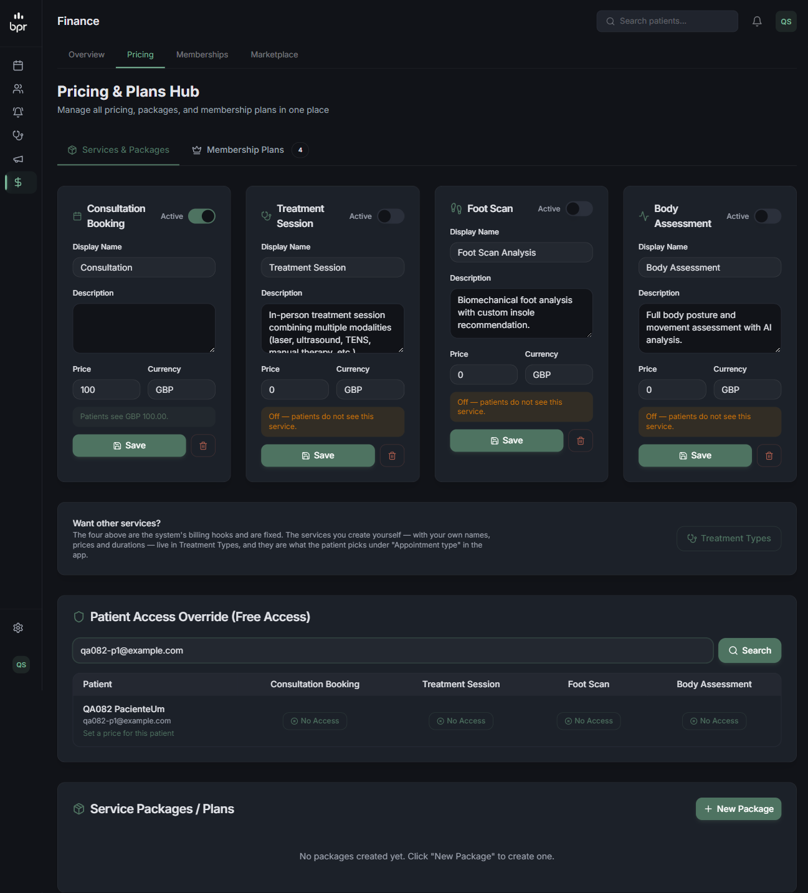
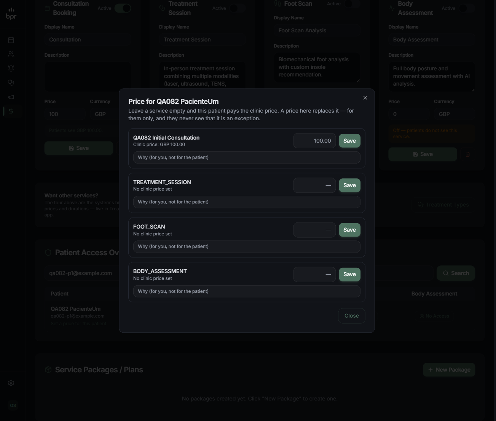
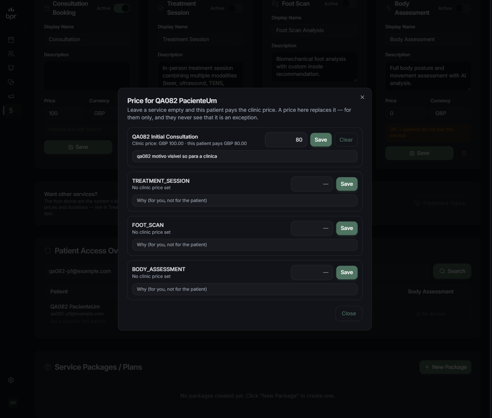
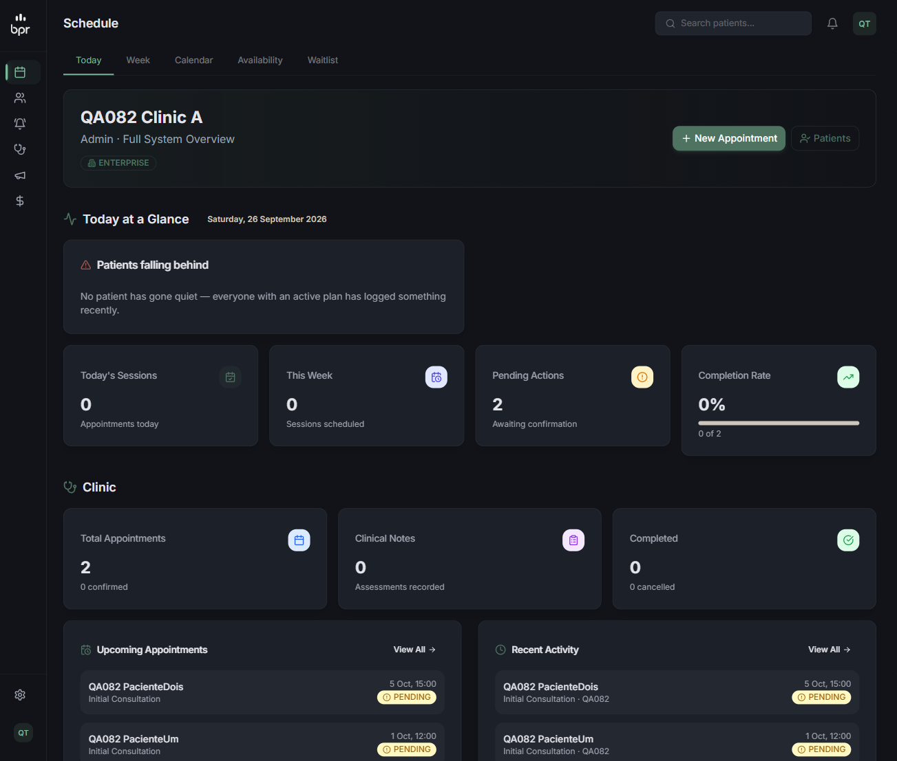

# QA — atividade 082 (preço e plano por paciente) — T-1, T-2, T-3

**Data:** 26/09/2026
**Escopo:** todos os cenários 1.x, 2.x e 3.x da `qa/qa-spec.md`, menos os declarados não mensuráveis.

## Veredito

| tarefa | veredito | cenários |
|---|---|---|
| **T-1** — modelo, resolução e API | ⚠️ **aprovado com ressalvas** | 15/15 passaram no comportamento; 2 achados (F2, F3) |
| **T-2** — preço por paciente no painel | ⚠️ **aprovado com ressalvas** | 5/5 passaram — **mas só o SUPERADMIN alcança a tela** (F1) |
| **T-3** — planos no app do paciente | ✅ **aprovado** | 7/7 mensuráveis; 3 telas nativas fora de alcance |

**Geral: ⚠️ aprovado com ressalvas.** A resolução de preço, o corte de tenant, o
fim do £60 e o filtro de escopo dos planos fazem exatamente o que o plano diz.
As ressalvas são três: a tela do painel não é alcançável por um ADMIN de
clínica (F1), o 409 de `price_not_set` chega ao paciente com a frase errada
(F2), e a guarda que deveria produzi-lo é código morto (F3).

## Como foi medido

| item | valor |
|---|---|
| checkout | `C:\Users\bruno\orca\workspaces\clinic\app_clinic` (worktree `brunoto02028/app_clinic`) |
| servidor | `next dev -p 4088`, `NEXT_DIST_DIR=.next-qa082`, `OUTBOUND_MODE=sink`, `NEXTAUTH_URL=http://localhost:4088` |
| prova da porta | `GET :4088/qa082-marker.txt` → **200** `qa082 marker 2026-09-26T06:42:14Z`; o mesmo caminho na `:4000` → **500** (aquele checkout não serve o marcador). A porta media este checkout. |
| banco | `postgresql://…@localhost:5432/bpr_clinic_local` — **zero DDL**: nenhum `db push`, `migrate dev`, `migrate reset` |
| login de staff | NextAuth credentials (`/api/auth/callback/credentials`, cookie) |
| login de paciente | `POST /api/mobile/login` (bearer) |
| fixtures | 2 clínicas CLINIC, ADMIN + THERAPIST em cada, 2 pacientes na A, 1 na B, 5 planos, preços de serviço — todos com prefixo `qa082-` |
| fixture extra | `qa082-superadmin@example.com` — foi preciso criar: sem SUPERADMIN a tela de T-2 não abre (F1) |

---

## T-1 — Preço por paciente: modelo, resolução e API

| # | cenário | resultado |
|---|---|---|
| 1.1 | `migrate diff` contra `main` → zero `DROP` | ✅ |
| 1.2 | paciente sem exceção vê o preço da clínica | ✅ |
| 1.3 | exceção de £80 com clínica em £100 | ✅ |
| 1.4 | exceção de £0 é cortesia, não "não precificado" | ✅ |
| 1.5 | exceção de serviço que a clínica não precificou vale por si | ✅ |
| 1.6 | nada configurado → `null`, nunca 60 | ✅ (com F2) |
| 1.7 | `/api/patient/service-prices` não vaza `note` nem a exceção | ✅ |
| 1.8 | `booking-options` e `POST /api/appointments` no mesmo número | ✅ |
| 1.9 | `PUT` com paciente de outra clínica → 404 | ✅ |
| 1.10 | `PUT` por THERAPIST → 403; por paciente → recusado | ✅ (ver nota) |
| 1.11 | `PUT` com preço negativo / não-número → 400 | ✅ |
| 1.12 | `PUT` duas vezes no mesmo serviço substitui | ✅ |
| 1.13 | `DELETE` com id de outra clínica → 404 | ✅ |
| 1.14 | `DELETE` devolve o paciente ao preço da clínica | ✅ |
| 1.15 | auditoria com e-mail real do autor | ✅ |

### 1.1 — `migrate diff` contra `main`: zero `DROP`

```
npx prisma migrate diff --from-schema-datamodel <schema de main> \
                        --to-schema-datamodel prisma/schema.prisma --script

-- CreateTable
CREATE TABLE "PatientServicePrice" (
    "id" TEXT NOT NULL,
    "clinicId" TEXT NOT NULL,
    "patientId" TEXT NOT NULL,
    "serviceType" "ServiceType" NOT NULL,
    "price" DOUBLE PRECISION NOT NULL,
    "currency" TEXT NOT NULL DEFAULT 'GBP',
    "note" TEXT,
    "createdById" TEXT,
    "createdAt" TIMESTAMP(3) NOT NULL DEFAULT CURRENT_TIMESTAMP,
    "updatedAt" TIMESTAMP(3) NOT NULL,
    CONSTRAINT "PatientServicePrice_pkey" PRIMARY KEY ("id")
);
-- CreateIndex  PatientServicePrice_clinicId_idx
-- CreateIndex  PatientServicePrice_patientId_idx
-- CreateIndex  PatientServicePrice_patientId_serviceType_key  (UNIQUE)
-- AddForeignKey  clinicId  -> Clinic(id)  ON DELETE CASCADE
-- AddForeignKey  patientId -> User(id)    ON DELETE CASCADE

$ grep -ci DROP  ->  0
```

A decisão de não tocar no `@@unique([clinicId, serviceType])` do `ServicePrice`
se confirma na prática: o diff é puramente aditivo.

### 1.2 / 1.3 / 1.7 — o preço que o paciente vê, e o que ele não vê

Sem exceção (p2, clínica A em £100):

```
GET /api/patient/service-prices  (bearer do p2) -> 200
[{"id":"cmui0yoye000nxzv8vwyioa6u","serviceType":"CONSULTATION","name":"QA082 Initial Consultation","description":null,"price":100,"currency":"GBP"}]
```

Gravada a exceção de £80 para o p1:

```
PUT /api/admin/patient-prices  (cookie do ADMIN da A) -> 200
{"exception":{"id":"cmui129s9000pxz04ykacsw33","clinicId":"cmui0y3vm0000xzgwumejek0p",
"patientId":"cmui0y43t000bxzgwihf8rzc5","serviceType":"CONSULTATION","price":80,
"currency":"GBP","note":"qa082 motivo secreto da clinica",
"createdById":"cmui0y3xh0003xzgww6ur0g2p","createdAt":"2026-09-26T06:47:36.969Z",
"updatedAt":"2026-09-26T06:47:36.969Z"}}
```

**O JSON que chega ao paciente que TEM a exceção** (1.7 — este é o número que
importa):

```
GET /api/patient/service-prices  (bearer do p1) -> 200
[{"id":"cmui129s9000pxz04ykacsw33","serviceType":"CONSULTATION","name":"QA082 Initial Consultation","description":null,"price":80,"currency":"GBP"}]
```

Varredura do corpo, sem distinguir maiúsculas:

| termo procurado | presente? |
|---|---|
| `note` | não |
| `exception` | não |
| `clinicPrice` | não |
| `motivo secreto` (o texto do motivo) | não |
| `discount` | não |
| `desconto` | não |

O paciente recebe seis campos: `id`, `serviceType`, `name`, `description`,
`price`, `currency`. Vê £80 e nada mais. A decisão 3 do plano ("o paciente
nunca sabe que é exceção") está cumprida no corpo da resposta, não só na tela.

### 1.8 — coerência: `booking-options` e o preço realmente gravado

```
GET /api/patient/booking-options  (bearer do p1) -> 200
{"kind":"FIRST_CONSULTATION","price":80,"currency":"GBP","requiresPayment":true,
"sessionsRemaining":null,"sessionsIncluded":null,"patientPackageId":null}
```

O `POST` foi feito de propósito mandando `price: 5` no corpo:

```
POST /api/appointments  (bearer do p1, body {"dateTime":"2026-10-01T11:00:00.000Z",
                                            "treatmentType":"Initial Consultation","price":5}) -> 200
{"success":true,"message":"Appointment booked successfully","appointment":{
 "id":"cmui12b0x000sxz040da7xth9", … "treatmentType":"Initial Consultation",
 "kind":"FIRST_CONSULTATION","status":"PENDING","paymentMethod":"ONLINE",
 "price":80, …}}
```

**`booking-options.price = 80` e `appointment.price = 80`.** O `5` do corpo foi
ignorado, e a clínica está em £100 — os dois lados leem a exceção pela mesma
função. É o defeito da N4 da 080 fechado.

### 1.4 / 1.5 — zero é preço; exceção sem preço de clínica vale por si

```
PUT p2 CONSULTATION 0 -> 200 {"exception":{…,"price":0,"note":"qa082 cortesia"}}
GET /api/patient/service-prices (p2) -> 200 [{…,"price":0,"currency":"GBP"}]
GET /api/patient/booking-options (p2) -> 200 {"kind":"FIRST_CONSULTATION","price":0,…}
```

`kind` é `FIRST_CONSULTATION`, não `null` com `price_not_set`: zero é uma
decisão da clínica, e o servidor a trata como tal.

FOOT_SCAN, que a clínica A nunca precificou:

```
PUT p1 FOOT_SCAN 45 -> 200
GET /api/patient/service-prices (p1) -> 200
[{"id":"cmui129s9000pxz04ykacsw33","serviceType":"CONSULTATION",…,"price":80,…},
 {"id":"cmui12c47000zxz04o81mf3lv","serviceType":"FOOT_SCAN","name":"FOOT_SCAN","description":null,"price":45,"currency":"GBP"}]
```

A exceção aparece sozinha, sem depender de um preço geral. (O `name` sai como
`FOOT_SCAN` cru — achado F4.)

### 1.6 — sem preço ativo: `null`, `price_not_set`, e a clínica ainda marca

Estado registrado **antes** de mexer (3 linhas no banco inteiro):

```
cmu5npyhj0000xzikdxlh97hu | clinicId=NULL               | CONSULTATION | 100 GBP | isActive=true | "Consultation"
cmui0yoye000nxzv8vwyioa6u | clinicId=…clinica A (qa082) | CONSULTATION | 100 GBP | isActive=true | "QA082 Initial Consultation"
cmui0yoyg000pxzv8z6jamo2g | clinicId=…clinica B (qa082) | CONSULTATION | 150 GBP | isActive=true | "QA082 B Consultation"
```

Todas as exceções apagadas e **todas** as linhas com `isActive=false`
(`todas desativadas? -> true ( 3 linhas )`):

```
GET /api/patient/booking-options (p2, sem histórico) -> 200
{"kind":null,"blockedReason":"price_not_set","price":0,"currency":"GBP","requiresPayment":false,
"sessionsRemaining":null,"sessionsIncluded":null,"patientPackageId":null}

GET /api/patient/booking-options (p1, com histórico) -> 200
{"kind":null,"blockedReason":"price_not_set","price":0,"currency":"GBP","requiresPayment":false,
"sessionsRemaining":null,"sessionsIncluded":null,"patientPackageId":null}

GET /api/patient/service-prices (p2) -> 200
[]                        <- lista vazia. Não 60.
```

Os dois ramos de `bookingOptionsFor` (primeira consulta e sessão extra)
bloqueiam. O £60 morreu nos dois.

Marcação pelo paciente, no horário `2026-10-05T14:00:00.000Z`:

```
POST /api/appointments (p2, paciente) -> 409
{"error":"This account is not linked to a clinic",
 "errorPt":"Esta conta não está ligada a uma clínica",
 "code":"price_not_set"}

POST /api/appointments (p1, paciente) -> 409
{"error":"This account is not linked to a clinic",
 "errorPt":"Esta conta não está ligada a uma clínica",
 "code":"price_not_set"}
```

**409 com `code: "price_not_set"`: correto. A frase: errada.** É o achado F2.

A clínica, no **mesmo horário**:

```
POST /api/appointments (ADMIN da A em nome do p2, mesmo 2026-10-05T14:00:00.000Z) -> 200
{"success":true,…,"id":"cmui13q9a001kxz04jr2ek7ux","kind":"CLINIC_BOOKED",
 "price":0,"status":"PENDING","paymentMethod":"ONLINE",…}
```

Restauração conferida linha por linha:

```
cmu5npyhj0000xzikdxlh97hu | isActive=true | igual ao antes? -> true
cmui0yoye000nxzv8vwyioa6u | isActive=true | igual ao antes? -> true
cmui0yoyg000pxzv8z6jamo2g | isActive=true | igual ao antes? -> true

confirmação pós-restauração: GET booking-options (p2) -> {"kind":"EXTRA_SESSION","price":100,…}
```

### 1.9 / 1.10 / 1.13 — tenant e papel

```
PUT    adminA -> paciente p3 (clínica B)       -> 404 {"error":"Not found"}
GET    adminA -> ?patientId=p3 (clínica B)     -> 404 {"error":"Not found"}
DELETE adminA -> id de exceção da clínica B    -> 404 {"error":"Not found"}

PUT    THERAPIST da própria clínica            -> 403 {"error":"Only the clinic owner sets prices",
                                                       "errorPt":"Só o dono da clínica define preços"}
DELETE THERAPIST                               -> 403 {"error":"Only the clinic owner sets prices"}
GET    THERAPIST (só vê)                       -> 200  (com clinicPrice, exception e note — correto:
                                                        o motivo é da clínica, e o terapeuta é clínica)

PACIENTE com sessão NextAuth (cookie):
  PUT    -> 403 {"error":"Forbidden"}
  DELETE -> 403 {"error":"Forbidden"}
  GET    -> 403 {"error":"Forbidden"}

PACIENTE com bearer do app (sem cookie):
  PUT    -> 307 -> /login?callbackUrl=%2Fapi%2Fadmin%2Fpatient-prices
  DELETE -> 307 -> /login?callbackUrl=%2Fapi%2Fadmin%2Fpatient-prices
```

**Nota sobre o pedido "paciente → 403":** com sessão web é 403, exato. Com
bearer do app é **307 para /login** — o middleware lê a sessão por cookie
(`getToken`), não conhece o bearer, e cai na regra "sem token, redireciona".
Nenhum dos dois chega à rota e nada vaza, mas o número é 307, não 403. Se a
intenção é que o app receba um JSON de recusa em vez de um redirecionamento de
navegador, isso é uma decisão a tomar — não é desta atividade.

### 1.11 / 1.12 — validação e substituição

```
price=-5              -> 400 {"error":"Price must be zero or more","errorPt":"O preço precisa ser zero ou mais"}
price="abc"           -> 400 {"error":"Price must be zero or more","errorPt":"O preço precisa ser zero ou mais"}
serviceType inválido  -> 400 {"error":"patientId and a known serviceType are required"}

2º PUT no mesmo serviço (70) -> 200, mesmo id cmui129s9000pxz04ykacsw33
linhas PatientServicePrice p1/CONSULTATION: 1
  [{"id":"cmui129s9000pxz04ykacsw33","price":70,"note":"qa082 segunda vez"}]
```

Uma linha, `note` trocada junto com o preço. O `@@unique([patientId, serviceType])`
faz o que a suposição 1 do plano diz.

### 1.14 — `DELETE` devolve ao preço da clínica

```
DELETE cmui129s9000pxz04ykacsw33 -> 200 {"ok":true}

GET /api/patient/service-prices (p1) -> 200
[{"id":"cmui0yoye000nxzv8vwyioa6u",…,"price":100,…},   <- volta ao id e ao preço da clínica
 {"id":"cmui12c47000zxz04o81mf3lv","serviceType":"FOOT_SCAN",…,"price":45,…}]

GET /api/patient/booking-options (p1) -> {"kind":"EXTRA_SESSION","price":100,…}
```

### 1.15 — auditoria com e-mail real

```
PATIENT_PRICE_REMOVED | userEmail="qa082-superadmin@example.com" | SUPERADMIN | exception removed — the patient goes back to the clinic price for CONSULTATION
PATIENT_PRICE_SET     | userEmail="qa082-superadmin@example.com" | SUPERADMIN | QA082 PacienteUm: CONSULTATION at GBP 80 — qa082 motivo visivel so para a clinica
PATIENT_PRICE_REMOVED | userEmail="qa082-admin-a@example.com"    | ADMIN      | exception removed — the patient goes back to the clinic price for CONSULTATION
PATIENT_PRICE_REMOVED | userEmail="qa082-admin-a@example.com"    | ADMIN      | exception removed — the patient goes back to the clinic price for FOOT_SCAN
PATIENT_PRICE_SET     | userEmail="qa082-admin-a@example.com"    | ADMIN      | QA082 PacienteDois: CONSULTATION at GBP 0 — qa082 cortesia
PATIENT_PRICE_SET     | userEmail="qa082-admin-a@example.com"    | ADMIN      | QA082 PacienteUm: FOOT_SCAN at GBP 45 — qa082 foot scan so dele
PATIENT_PRICE_SET     | userEmail="qa082-admin-b@example.com"    | ADMIN      | QA082 PacienteTresB: CONSULTATION at GBP 90 — qa082 clinica B
PATIENT_PRICE_SET     | userEmail="qa082-admin-a@example.com"    | ADMIN      | QA082 PacienteUm: CONSULTATION at GBP 80 — qa082 motivo secreto da clinica
PATIENT_PRICE_SET     | userEmail="qa082-admin-a@example.com"    | ADMIN      | QA082 PacienteUm: CONSULTATION at GBP 70 — qa082 segunda vez

com userEmail vazio: 0
```

Nove entradas, nenhuma com `userEmail` vazio, e a `description` guarda o motivo
escrito — que é justamente o ponto: daqui a seis meses o motivo está gravado
duas vezes (na linha e no log), e nenhuma delas do lado do paciente.

---

## T-2 — Preço por paciente no painel

| # | cenário | resultado |
|---|---|---|
| 2.1 | buscar paciente → "Set a price for this patient" abre com os quatro serviços | ✅ |
| 2.2 | cada linha mostra o preço da clínica e, quando há, o do paciente | ✅ |
| 2.3 | salvar £80 com motivo: salva, recarrega, o motivo persiste | ✅ |
| 2.4 | "Clear" faz a exceção sumir e a linha volta ao preço da clínica | ✅ |
| 2.5 | terapeuta não consegue salvar | ✅ |
| — | **ADMIN de clínica consegue abrir a tela** | ❌ **não** — F1 |

### 2.1 / 2.2 — a janela





Os quatro serviços abrem, cada um com a sua origem escrita:

```
QA082 Initial Consultation   Clinic price: GBP 100.00     [ 100.00 ] [Save]
TREATMENT_SESSION            No clinic price set          [   —    ] [Save]
FOOT_SCAN                    No clinic price set          [   —    ] [Save]
BODY_ASSESSMENT              No clinic price set          [   —    ] [Save]
```

"Clinic price: GBP 100.00" e "No clinic price set" são exatamente o que impede
que "£80" seja lido como regra quando é troco. Os três serviços sem preço saem
com o nome do enum (F4).

### 2.3 — salvar £80 com motivo



Depois de `Save`, a janela recarrega do servidor e a linha passa a dizer:

```
QA082 Initial Consultation
Clinic price: GBP 100.00 · this patient pays GBP 80.00
[ 80 ] [Save] [Clear]
Why (for you, not for the patient): qa082 motivo visivel so para a clinica
```

Não é estado do navegador: a janela foi **fechada e reaberta**, e o preço e o
motivo voltaram do banco iguais. O `Clear` só aparece quando existe exceção.

### 2.4 — "Clear"


```
QA082 Initial Consultation
Clinic price: GBP 100.00          <- o "· this patient pays" desapareceu
[        ] [Save]                 <- sem botão Clear, campo vazio, motivo vazio
```

E no banco, `PatientServicePrice` do p1: nenhuma linha.

### 2.5 — terapeuta



Duas camadas, medidas separadamente: o servidor recusa (`PUT`/`DELETE` → 403
`Only the clinic owner sets prices`, colado em 1.10) e a tela nem abre — o
THERAPIST em `/admin/service-pricing` é devolvido para `/admin`.

---

## T-3 — Planos no app do paciente da clínica

| # | cenário | resultado |
|---|---|---|
| 3.1 | plano `patientScope: "all"` aparece para qualquer paciente da clínica | ✅ |
| 3.2 | plano `"specific"` de outro paciente **não** aparece | ✅ |
| 3.3 | plano `"specific"` dele aparece | ✅ |
| 3.4 | plano de outra clínica não aparece | ✅ |
| 3.5 | `subscribe` em plano não oferecido a ele → 404 | ✅ |
| 3.6 | `subscribe` em plano pago sem `stripePriceId` → recusa | ✅ |
| 3.7 | menu da clínica tem "Plans"/"Planos" e abre a tela | ⚠️ não executado (tela nativa) |
| 3.8 | sem planos, texto honesto e sem card vazio | ⚠️ não executado (tela nativa) |
| 3.9 | com assinatura ativa, mostra o plano e o botão de cancelar | ⚠️ não executado (tela nativa) |
| 3.10 | `tsc` do mobile limpo | ✅ |

### 3.2 — o plano do outro paciente não aparece (o número pedido)

Os cinco planos semeados na atividade:

```
planAll   = cmui0yoyi000rxzv881mg5kt3   clínica A, scope=all,           ACTIVE, grátis
planP2    = cmui0yoyk000txzv89af7asvx   clínica A, scope=specific -> p2, ACTIVE
planP1    = cmui0yoyl000vxzv84qack908   clínica A, scope=specific -> p1, ACTIVE, £30 SEM stripePriceId
planB     = cmui0yoym000xxzv840v3tjhf   clínica B, scope=all,           ACTIVE
planDraft = cmui0yoyo000zxzv8x7pjhakg   clínica A, DRAFT, scope=none
```

**Bearer do p1:**

```
GET /api/patient/membership/plans -> 200
[{"id":"cmui0yoyi000rxzv881mg5kt3","name":"qa082-plan-all","description":"QA082 para todos","price":0,"interval":"MONTHLY","isFree":true,"features":[],"status":"ACTIVE","stripeProductId":null,"stripePriceId":null},
 {"id":"cmui0yoyl000vxzv84qack908","name":"qa082-plan-spec-p1","description":"QA082 só do p1, pago sem stripePriceId","price":30,"interval":"MONTHLY","isFree":false,"features":[],"status":"ACTIVE","stripeProductId":null,"stripePriceId":null}]
```

**Bearer do p2:**

```
GET /api/patient/membership/plans -> 200
[{"id":"cmui0yoyi000rxzv881mg5kt3","name":"qa082-plan-all","description":"QA082 para todos","price":0,"interval":"MONTHLY","isFree":true,"features":[],"status":"ACTIVE","stripeProductId":null,"stripePriceId":null},
 {"id":"cmui0yoyk000txzv89af7asvx","name":"qa082-plan-spec-p2","description":"QA082 só do p2","price":0,"interval":"MONTHLY","isFree":true,"features":[],"status":"ACTIVE","stripeProductId":null,"stripePriceId":null}]
```

**Bearer do p3 (clínica B):**

```
GET /api/patient/membership/plans -> 200
[{"id":"cmui0yoym000xxzv840v3tjhf","name":"qa082-plan-clinic-b","description":"QA082 clínica B","price":0,"interval":"MONTHLY","isFree":true,"features":[],"status":"ACTIVE","stripeProductId":null,"stripePriceId":null}]
```

Lado a lado:

| | vê `planAll` | vê `planP1` | vê `planP2` | vê `planB` | vê `planDraft` |
|---|---|---|---|---|---|
| p1 (clínica A) | ✅ | ✅ | **não** | não | não |
| p2 (clínica A) | ✅ | não | ✅ | não | não |
| p3 (clínica B) | não | não | não | ✅ | não |

O plano específico do p2 **não** aparece para o p1, o "para todos" aparece para
os dois da clínica A e para nenhum da B, e o rascunho não aparece para ninguém.

### 3.5 / 3.6 — assinar o que não é seu, e o pago sem preço na Stripe

```
p1 -> planId do plano específico do p2   -> 404 {"error":"Plan not found or inactive"}
p1 -> planId do rascunho (DRAFT/none)    -> 404 {"error":"Plan not found or inactive"}
p3 (clínica B) -> planId da clínica A    -> 404 {"error":"Plan not found or inactive"}

estado do plano: {"name":"qa082-plan-spec-p1","price":30,"isFree":false,
                  "stripePriceId":null,"status":"ACTIVE","patientScope":"specific"}
p1 -> assinar esse plano                 -> 409 {"error":"This plan can't be purchased online
                                                  right now. Please contact the clinic."}

assinaturas do p1 antes: 0   depois: 0
assinaturas criadas em qualquer paciente qa082: 0
```

O plano pago sem `stripePriceId` é recusado com 409 e **nada é ativado de
graça** — a suposição 5 do plano se sustenta. Nenhuma chamada saiu para a
Stripe (o 409 acontece antes de `checkout.sessions.create`).

### 3.10 — `tsc` do mobile e a suíte de tenant

```
$ cd mobile && npx tsc --noEmit
EXIT=0          (nenhuma linha de saída)
```

```
$ npx jest __tests__/tenant
Test Suites: 25 passed, 25 total
Tests:       220 passed, 220 total
Snapshots:   0 total
Time:        4.864 s
EXIT=0
```

Inclui os dois arquivos novos desta leva (`patient-price.test.ts`,
`membership-scope.test.ts`).

---

## Achados

### F1 — a tela de T-2 é inalcançável para um ADMIN de clínica ⚠️ grave

`app/admin/service-pricing/page.tsx` é a única porta do "Set a price for this
patient". Essa página está em `lib/superadmin-routes.ts`
(`SUPERADMIN_ONLY_ADMIN_PAGES`) e a aba em `lib/admin-sections.ts` é
`superadminOnly: true` — o middleware devolve qualquer não-SUPERADMIN para
`/admin`.

Medido: o ADMIN da clínica A (`qa082-admin-a@example.com`) foi redirecionado.


Mas a rota que a janela chama autoriza **SUPERADMIN ou ADMIN** de propósito, e
recusa o terapeuta com a frase *"Only the clinic owner sets prices" / "Só o dono
da clínica define preços"*. E a suposição 3 do `plan.md` diz: *"Quem define é o
dono. Mesma regra dos preços de serviço: SUPERADMIN/ADMIN definem, terapeuta
vê."*

Ou seja: a API diz que o dono da clínica define; a tela não deixa o dono da
clínica chegar nela. Quem consegue usar a entrega de T-2 é só o SUPERADMIN da
plataforma. Foi preciso criar um SUPERADMIN de fixture para medir 2.1–2.4.

Nada disto é regressão — `/admin/service-pricing` já era superadmin-only antes
da 082 (`git diff main -- lib/superadmin-routes.ts` é vazio). É a escolha do
lugar. A decisão é do Bruno: ou a janela sai desta página para uma que o ADMIN
alcance (`/admin/patients/[id]`, por exemplo), ou a autorização da rota deixa
de mencionar ADMIN.

**Onde olhar:** `lib/superadmin-routes.ts:9`, `lib/admin-sections.ts:477-484`,
`app/api/admin/patient-prices/route.ts:82-85`.

### F2 — o 409 de `price_not_set` mente para o paciente

Comprovado em 1.6: o `code` está certo (`price_not_set`) e o `error`/`errorPt`
dizem *"This account is not linked to a clinic" / "Esta conta não está ligada a
uma clínica"*.

A causa é o ternário de duas pontas em `app/api/appointments/route.ts:205-218`:
ele distingue `screening_required` e joga **todo o resto** — incluindo
`price_not_set` — na frase do `no_clinic`.

```js
error:
  opcao.blockedReason === "screening_required"
    ? "Complete your medical screening before booking."
    : "This account is not linked to a clinic",
```

Um app que mostre `error`/`errorPt` (o que é o normal) dirá ao paciente que a
conta dele não tem clínica. Ele vai procurar o problema no lugar errado, e a
clínica não vai descobrir que esqueceu o interruptor "Active" — que é
exatamente o buraco que a correção do £60 existia para fechar.

**Onde olhar:** `app/api/appointments/route.ts:205-218`.

### F3 — a guarda de `price_not_set` na marcação é código morto

`app/api/appointments/route.ts:281`:

```js
const precoConfigurado = await patientBookingPrice(actor.clinicId, patientId);
if (isPatient && !opcao && precoConfigurado === null) { /* ... 409 price_not_set ... */ }
```

`opcao` vem de `const opcao = isPatient ? await bookingOptionsFor(patientId) : null`
— e `bookingOptionsFor` **sempre** devolve um objeto. Logo `isPatient && !opcao`
nunca é verdadeiro, e este bloco nunca executa.

Na prática não falta nada hoje: a recusa acontece 70 linhas antes, no
`if (opcao && !opcao.kind)`. Mas a guarda que o comentário descreve ("A clínica
pode marcar sem preço configurado; o paciente, não") não é a que funciona — e é
nela que a próxima pessoa vai confiar. Ou se juntam as duas, ou se apaga a morta.

### F4 — serviço sem preço de clínica aparece com o nome do enum

No painel: `TREATMENT_SESSION`, `FOOT_SCAN`, `BODY_ASSESSMENT` (print 02).
Origem: `app/api/admin/patient-prices/route.ts` → `name: base?.name ?? t`.

E na resposta ao paciente, quando a exceção é de um serviço sem preço de
clínica (1.5): `{"serviceType":"FOOT_SCAN","name":"FOOT_SCAN",...}` — origem
`lib/service-price.ts` → `name: String(e.serviceType)`. Esse chega ao app do
paciente, o que o torna mais que cosmético se alguma tela exibir `name`.

### F5 — `servicePricesForAdmin` nasceu sem ninguém para chamá-la

`lib/service-price.ts:118` foi adicionada nesta leva (está no `git diff main`) e
não tem um único consumidor no repositório:

```
grep -rn "servicePricesForAdmin" --include=*.ts --include=*.tsx .
./lib/service-price.ts:118:export async function servicePricesForAdmin(clinicId: string | null) {
```

O comentário dela diz que existe para "a tela precisa mostrar o de onde ela
sai... para o interruptor deixar de ser invisível" — ou a tela ficou de fora, ou
a função ficou sobrando.

### F6 — fora do escopo, pré-existente: a clínica marcando sem preço nasce `PENDING/ONLINE`

Em 1.6, o ADMIN marcou e o resultado foi `price: 0`, `paymentMethod: "ONLINE"`,
`status: "PENDING"`. É um horário de £0 esperando um webhook da Stripe que
nunca vem, preso até alguém mexer à mão. O caminho é anterior à 082
(`resolvedPaymentMethod` cai em `ONLINE` por omissão), mas é o mesmo corredor
"sem preço configurado" que esta atividade abriu — vale um olhar.

### F7 — fora do escopo, pré-existente: console de `/admin/service-pricing`

Dois erros, nenhum no caminho do preço por paciente:

```
[ERROR] Failed to load resource: 403 (Forbidden) @ /api/alerts?status=OPEN   (2x)
[ERROR] Warning: `value` prop on `textarea` should not be null.
        ... at ServicePricingPage (app/admin/service-pricing/page.tsx)
```

O `textarea` é o da descrição do preço de serviço, `value={sp.description}` com
`description` anulável (`app/admin/service-pricing/page.tsx:581`) — não foi
tocado pela 082 (`git diff main` não mostra alteração ali).

### F8 — ambiente: uma linha `ServicePrice` de outra sessão apareceu no banco local

Às 06:51:45 surgiu, no banco local compartilhado, uma linha que não existia no
estado registrado às 06:44 e que não é minha:

```
cmui17lpt0001xzncpi0z2fgd | clinicId=cmspbifpx... (bruno-physical-rehab)
                          | CONSULTATION | 100 GBP | isActive=true | "Initial Consultation"
createdAt 2026-09-26T06:51:45.714Z   updatedAt 2026-09-26T06:52:07.511Z
```

Nenhum ator `qa082-` a criou (não há entrada de auditoria correspondente), e a
clínica não é nenhuma das minhas. Veio de outro checkout/sessão que usa o mesmo
banco. **Não foi tocada** — apagar linha que não é minha seria pior que
reportá-la. Ela não interferiu em nada: nasceu às 06:51, e o teste que desativa
`ServicePrice` rodou às 06:48 sobre as 3 linhas que existiam então, todas
restauradas e conferidas idênticas.

---

## Erros de console

Só na tela do painel, e nenhum do fluxo de 082: os dois de F7 (`/api/alerts` 403
e o aviso de `value` nulo no `textarea`). Nenhum erro de JavaScript no salvar,
no recarregar ou no `Clear`.

## O que não foi medido, e por quê

| item | por quê |
|---|---|
| 3.7 menu da clínica abre "Plans"/"Planos" | tela nativa — exige build novo no aparelho (declarado na qa-spec). O que se pôde prender está preso em `__tests__/tenant/membership-scope.test.ts`: a entrada existe em `profile.tsx` com `href: "/(app)/(clinica)/plans"` e os dois idiomas |
| 3.8 texto honesto quando não há planos | idem. No código, `plans.tsx` tem o ramo `outros.length === 0` com dois textos distintos ("Your clinic has no plans for you at the moment." / "Nothing else to add right now.") e `testID="plans-empty"`, sem card vazio |
| 3.9 assinatura ativa com botão de cancelar | idem. No código, o `Card variant="highlight" testID="plans-current"` com o selo Active/Ends soon e o `testID="plans-cancel"` existem, e o cancelamento pede confirmação |
| Checkout real da Stripe | proibido (declarado na qa-spec). Só a recusa foi medida — 3.6, 409 antes de qualquer chamada |
| ADMIN usando a janela de T-2 pela tela | impossível: o middleware o redireciona (F1). Medido pela API, com cookie de ADMIN |
| `PUT`/`DELETE` de paciente com bearer devolvendo 403 | o middleware devolve **307 → /login** para bearer sem cookie. Recusa confirmada, número diferente do pedido — ver nota em 1.10 |

## Limpeza executada

```
=== 1. ServicePrice: estado anterior voltou intacto ===
  cmu5npyhj0000xzikdxlh97hu | clinicId=NULL | CONSULTATION
    | antes: 100 GBP isActive=true | agora: 100 GBP isActive=true | IDENTICO? true

=== 2. Consultas criadas pelo QA ===
  apaga appointment cmui12b0x000sxz040da7xth9 price=80 2026-10-01T11:00:00.000Z
  apaga appointment cmui13q9a001kxz04jr2ek7ux price=0  2026-10-05T14:00:00.000Z
  total: 2 apagadas

=== 3. Exceções, planos, assinaturas, triagens ===
  PatientServicePrice apagadas: 1
  PatientSubscription apagadas: 0
  MembershipPlan apagados: 5
  MedicalScreening apagadas: 3
  ServiceAccess apagados: 0
  ServicePrice das clínicas qa082 apagados: 2

=== 4. Auditoria e logs do QA ===
  AuditLog apagados: 30
  SystemLog apagados: 27
  MobileRefreshToken apagados: 8

=== 5. Usuários e clínicas ===
  User apagados: 8
  Clinic apagadas: 2

=== 6. CONTAGENS FINAIS (todas têm de ser 0) ===
  User qa082-:                           0 OK
  Clinic qa082-:                         0 OK
  MembershipPlan qa082-:                 0 OK
  PatientServicePrice (total no banco):  0 OK
  ServicePrice das clínicas qa082:       0 OK
  AuditLog com qa082:                    0 OK
```

Além do banco:

- `public/qa082-marker.txt` — apagado.
- `tsconfig.json` — o `next dev` acrescentou `".next-qa082/types/**/*.ts"` ao
  `include`; revertido com `git checkout --`.
- `.next-qa082/` — apagado (era ignorado pelo git de todo modo).
- servidor de dev da `:4088` — encerrado, porta livre.
- `ServicePrice` de terceiros — nenhuma apagada; a de F8 ficou onde estava.

O que sobra desta atividade no `git status` é este relatório e os seis prints em
`qa/screenshots/` com prefixo `082-`.

## Nota — outra sessão editou este worktree durante o QA

Entre o início e o fim desta rodada apareceram no `git status` 17 arquivos que
não são meus nem da 082: a frente de laboratório (`__tests__/labs/*`,
`lib/lab-*`, `app/api/*/labs/*`, `mobile/src/api/labs.ts`) e dois de marcação no
app (`mobile/app/(app)/(clinica)/book-appointment.tsx`, `mobile/src/api/booking.ts`).
Outro agente trabalha no mesmo checkout.

Nada disso foi tocado por mim. Como `tsc` e `jest` correram antes de parte
dessas edições, foram **repetidos no fim, sobre a árvore atual**, com o mesmo
resultado:

```
mobile: npx tsc --noEmit                      -> EXIT=0, nenhuma saída
raiz:   npx jest __tests__/tenant             -> 25 suítes, 220 testes, todos passaram
```

Os cenários de API e de UI, porém, foram medidos contra o servidor que subiu às
06:42 e caiu às 07:55. Se as edições daquela outra frente tocarem
`mobile/src/api/booking.ts` ou a marcação, vale repetir 1.6 e 1.8.
