# QA Report — T-2: Tela do cupom no painel da clínica

**Data:** 26/09/2026
**Worktree:** `C:\Users\bruno\orca\workspaces\clinic\app_clinic`
**HEAD:** `db1290d3` · **main:** `4078c0f4` (o cupom continua no working tree, não commitado)
**Servidor medido:** `http://localhost:4100` — **confirmado deste checkout** antes de qualquer teste (ver "Ambiente")
**Escopo:** só a seção **T-2 — Painel** do `qa-spec.md`, cenários 2.1 a 2.11.

**Resultado geral:** ⚠️ **aprovado com ressalvas** — **11 de 11** cenários aprovados (2.1 com ressalva), **0 reprovados**, e **6 achados** que não derrubam cenário nenhum. Um deles é um **500 com corpo vazio** numa rota de escrita, e é o que eu levaria antes do deploy.

---

## Ambiente

**Qual checkout serve a porta 4100.** Conferido antes de medir, porque worktrees paralelos disputam porta:

```
$ netstat -ano | grep ":4100"
  TCP    0.0.0.0:4100    0.0.0.0:0    LISTENING    18560

$ Get-CimInstance Win32_Process -Filter "ProcessId=18560" | Select CommandLine
"C:\Program Files\nodejs\node.exe"
  C:\Users\bruno\orca\workspaces\clinic\app_clinic\node_modules\next\dist\server\lib\start-server.js

$ (processo pai, 49936)
"node" "C:\Users\bruno\orca\workspaces\clinic\app_clinic\node_modules\.bin\..\next\dist\bin\next"
  dev -p 4100 -H 0.0.0.0
```

O `node_modules` é o deste worktree. É este checkout. **O dev server não foi reiniciado em momento algum** — a DLL do Prisma nunca precisou ser solta.

**Banco:** `postgresql://…@localhost:5432/bpr_clinic_local`. Nenhum `db push`, `migrate dev`, `migrate reset` nem DDL. Só `SELECT`, `INSERT` e `UPDATE` de linha, todos em contas e clínicas de teste. **Produção não foi tocada** em nenhum momento; `bpr.clinic` não foi aberto.

**Contas de teste usadas** (todas `@example.test`, nenhuma real):

| conta | papel | clínica |
|---|---|---|
| `qa.superadmin@example.test` | SUPERADMIN | nenhuma (`clinicId: null`) |
| `qa.admina@example.test` | ADMIN | QA Clinic A (`cmu6aoc2j…`) |
| `qa.fisioa@example.test` | THERAPIST | QA Clinic A |
| `qa.pacientea@example.test`, `qa.pacientea2@example.test` | PATIENT | QA Clinic A |

**Nota sobre o banco compartilhado:** enquanto eu rodava, apareceu no banco uma clínica `QA084 Coupon Clinic` (`cmui88zwu…`) com sete cupons `QA084-*` que **não são meus** — é outra sessão fazendo QA da T-3/T-4 no mesmo Postgres. Por isso tudo o que está abaixo foi feito em **QA Clinic A**, e os cupons desta sessão são `SPRING20`, `USEDCODE`, `NEVERUSED`, `ONEPATIENT` e `OTHERCLINIC` (este último em QA Clinic C, só para o teste de isolamento).

---

## O obstáculo do SUPERADMIN sem clínica — resolvido sem mexer no clinicId

O único SUPERADMIN do banco local não tem `clinicId`, e as três rotas respondem 403. Confirmado:

```
$ curl -s -b super.jar -w "\nHTTP %{http_code}\n" http://localhost:4100/api/admin/coupons
{"error":"No clinic"}
HTTP 403
```

**Não precisei inventar nada.** O produto já tem a resposta: o seletor de clínica da sidebar (`POST /api/admin/switch-clinic`), que grava o cookie httpOnly `selected-clinic-id`, e `resolveActorTenant` faz esse cookie vencer para um SUPERADMIN:

```
$ curl -s -b super.jar -c super.jar -X POST http://localhost:4100/api/admin/switch-clinic \
    -H "Content-Type: application/json" -d '{"clinicId":"cmu6aoc2j0000xz8oaserpn4m"}'
{"success":true}   HTTP 200

$ curl -s -b super.jar -w "\nHTTP %{http_code}\n" http://localhost:4100/api/admin/coupons
{"coupons":[]}
HTTP 200
```

Na tela é a mesma coisa: **Active Clinic → QA Clinic A** no rodapé da sidebar, e a página passa a carregar (screenshot 02). O `clinicId` do SUPERADMIN ficou como estava.

**A única escrita que precisei fazer no banco** foi redefinir a senha de três contas de teste (`qa.superadmin`, `qa.admina`, `qa.fisioa`) para `QaTenant#2026` — o hash delas não batia com nenhuma senha documentada nas specs anteriores (alguma sessão antiga trocou), e sem isso o login respondia 401. `UPDATE` de linha em conta `@example.test`, nada de schema.

### É bug um SUPERADMIN sem clínica não conseguir administrar cupons?

**Não. A recusa está certa; o jeito de recusar é que está errado.** Três coisas separadas:

**1. Exigir clínica é correto, e eu não mudaria.** `Coupon.clinicId` é obrigatório e a unicidade é `@@unique([clinicId, code])`. Não existe "cupom de nenhuma clínica". Se a pergunta é *de quem é este cupom*, sem clínica selecionada **não há resposta** — e o `SPRING20` da BPR e o `SPRING20` do Manu Training são dois cupons diferentes de propósito. Um cupom global seria outra feature, com outra regra de colisão. Recusar é o certo.

**2. O SUPERADMIN não está trancado para fora** — ele só ainda não disse de quem. Um clique no seletor de clínica resolve, e foi assim que rodei o QA inteiro. Então o problema real não é permissão, é **a tela não dizer isso**.

**3. O que eu trataria como bug (dois, e o segundo é o pior):**

- **A frase.** `{"error":"No clinic"}` vira o toast vermelho *"Could not load coupons / No clinic"*. Isso se lê como "a sua conta não tem clínica" e manda a pessoa procurar problema de conta, quando a correção está a um clique na barra lateral. É exatamente a forma da **F2 da 082** — a recusa mandando quem lê para o lugar errado. A frase devia ser *"Pick a clinic first — a coupon belongs to one"* / *"Escolha uma clínica primeiro — um cupom é de uma"*.

- **O estado vazio mente.** O `GET` respondeu 403 e a tela ainda assim renderiza *"No coupons yet. A patient who types a code will simply be told we do not recognise it."* — screenshot 01, onde o toast de erro e essa frase aparecem **juntos**, com a QA Clinic A tendo três cupons naquele instante. A página não distingue *"não há nenhum"* de *"não consegui perguntar"*. É assim que alguém cria um `SPRING20` duplicado numa clínica que já tem um. É o achado **F2** abaixo, e é pequeno de corrigir: `carregar()` já tem o `catch`, falta um estado de erro ao lado do `loading`.

**4. Duas coisas de contexto que pesam na sua decisão:**

- O 403 que eu vi é **do `.env` local**, não do produto. `DEFAULT_CLINIC_SLUG=qa-075-default` aponta para uma clínica que **não existe** neste banco, então `getDefaultClinicId()` devolve `null` e o fallback morre. Em produção a variável está certa (resolvida em 16/09), e lá o SUPERADMIN em "Global View" **não** tomaria 403.
- E é justamente aí que fica a pergunta que eu deixaria com você: em produção, com o fallback funcionando, o SUPERADMIN em **Global View** cria o cupom **na clínica padrão** — e a faixa *"Viewing X as platform admin"* só aparece quando ele **selecionou** uma clínica. Ou seja: a mesma tela que aqui recusa dizendo "No clinic" lá **escreve em algum lugar sem dizer qual**. Isso eu **não executei** (exigiria mexer no `.env` e reiniciar o dev server); é leitura de `lib/actor-tenant.ts` + `lib/default-tenant.ts` + `components/admin/tenant-view-banner.tsx`. Se for confirmar, o teste é de um minuto em prod com uma clínica de teste.

---

## Resumo dos cenários

| # | tipo | o que fiz | resultado obtido | veredito |
|---|---|---|---|---|
| 2.1 | UI | SUPERADMIN abre `/admin/coupons` | **com clínica selecionada:** a lista carrega, a aba "Coupons" aparece em Finance, sem erro de JS. **Sem clínica (Global View):** 403 e a tela diz que não há cupom nenhum | ⚠️ aprovado **com ressalva** (achado F2/F3) |
| 2.2 | API | `POST /api/admin/coupons` como ADMIN de QA Clinic A | `403` + `"Only the clinic owner manages coupons"` / `"Só o dono da clínica administra cupons"`; nada gravado | ✅ |
| 2.3 | API | mesmo POST como THERAPIST de QA Clinic A | `403`, frase idêntica; nada gravado | ✅ |
| 2.4 | UI | criar `SPRING20`, 20%, alcance Consultation, aberto a todos, 26/09 → 26/10 | toast "Coupon created"; card `SPRING20 · 20% off · everyone · Consultation — 26/09/2026 → 26/10/2026 — 0 used`, switch **Active** ligado | ✅ |
| 2.5 | UI | criar de novo digitando `spring20` (minúsculas) | `409` e toast **"Not saved / The code SPRING20 already exists here."** — frase, não erro de banco | ✅ |
| 2.6 | UI | salvar sem marcar alcance nenhum | toast **"Not saved / Choose where the code applies, or it applies to nothing."**, diálogo continua aberto | ✅ |
| 2.7 | API | `discountPercent:20` **e** `discountAmount:15` no mesmo corpo | `400` + `"Set either a percentage or a fixed amount, not both."`; **na tela é impossível** — há um só campo de valor e um alternador `%`/`£` | ✅ |
| 2.8 | UI | contar a lista de alcance | exatamente **5**: Consultation, Treatment session, Session package, Treatment plan, Membership. Exame **ausente**, e a linha existe em **dois** lugares (cartão da página e rodapé do formulário) | ✅ |
| 2.9 | UI | clicar "Ativo" e recarregar a página inteira | desligou → F5 → continuou desligado, com badge `off`; religou → F5 → continuou ligado. **Sem Save separado** | ✅ |
| 2.10 | UI | apagar `USEDCODE`, que tem 1 resgate confirmado | o aviso **antes** já explica, e depois o cupom **continua na lista**, desligado, com os resgates intactos | ✅ |
| 2.11 | API | conferir `logAudit` em toda escrita | **8 escritas bem-sucedidas → 8 linhas** em `AuditLog` (entity `Coupon`); as recusadas (400/409/403) não geraram linha, porque nada foi escrito | ✅ |

**Suíte do projeto:** `npx jest __tests__/coupon/admin-route.test.ts` → **20 de 20 passaram** (0,29 s).

---

## Detalhes

### 2.1 — SUPERADMIN abre /admin/coupons ⚠️

**Passos:** login real pela UI em `/staff-login` como `qa.superadmin@example.test` → `/admin/coupons`.

**Sem clínica selecionada (Global View)** — a tela renderiza, mas o `GET` responde 403:

```
console do browser:
[ERROR] Failed to load resource: the server responded with a status of 403 (Forbidden)
        @ http://localhost:4100/api/admin/coupons

toast:        "Could not load coupons / No clinic"
estado vazio: "No coupons yet. A patient who types a code will simply be told we do not recognise it."
```

Os dois **ao mesmo tempo**, com QA Clinic A tendo três cupons naquele instante.

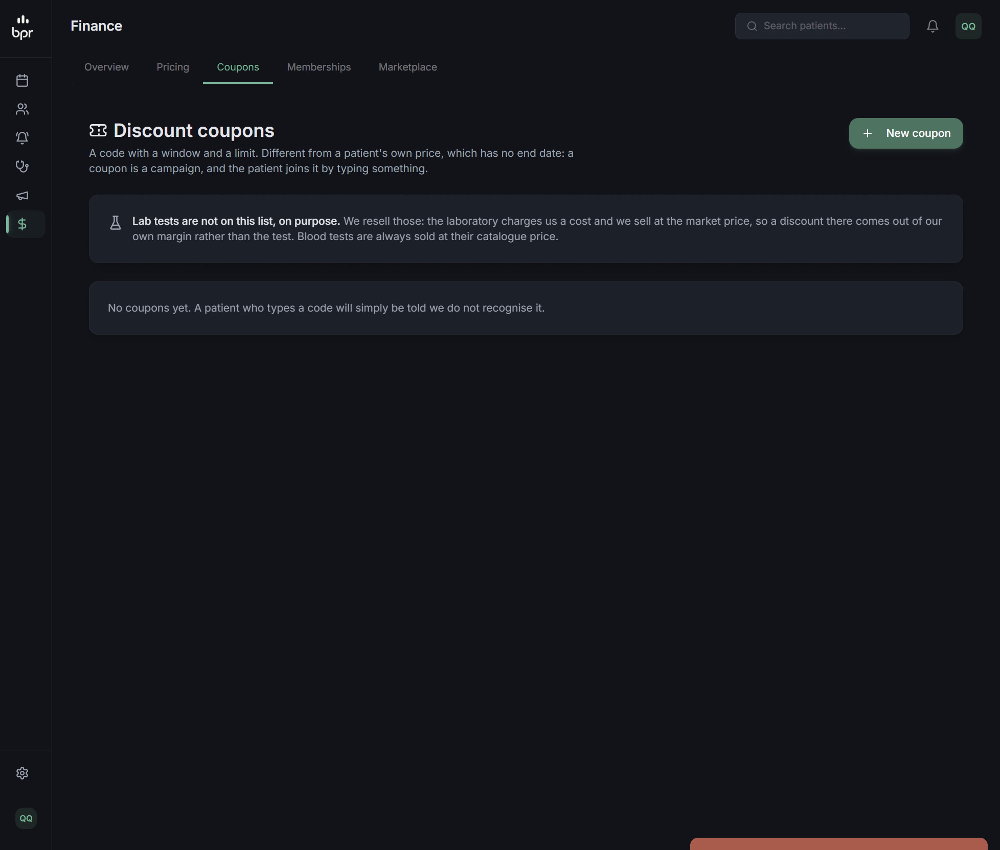

**Com QA Clinic A selecionada** — a página carrega, a faixa diz *"Viewing QA Clinic A as platform admin"*, e a entrada de menu está onde a T-2 prometeu: **Finance → Coupons**.


Aprovado com ressalva: o cenário do qa-spec ("lista carrega") acontece; o caminho vizinho mente.

---

### 2.2 e 2.3 — ADMIN e THERAPIST recebem 403 ✅

**Comando** (repetido para as duas contas):

```
$ curl -s -b admin.jar -w "\nHTTP %{http_code}\n" \
    -X POST http://localhost:4100/api/admin/coupons \
    -H "Content-Type: application/json" \
    -d '{"code":"ADMINTRY","discountPercent":20,"appliesTo":["CONSULTATION"]}'
```

**Output:**

```
===== admin =====
-- POST /api/admin/coupons --
{"error":"Only the clinic owner manages coupons","errorPt":"Só o dono da clínica administra cupons"}
   HTTP 403
-- GET /api/admin/coupons --
{"error":"Only the clinic owner manages coupons","errorPt":"Só o dono da clínica administra cupons"}
   HTTP 403
-- GET /admin/coupons (pagina) --
HTTP 307 -> http://localhost:4100/admin

===== therapist =====
-- POST /api/admin/coupons --
{"error":"Only the clinic owner manages coupons","errorPt":"Só o dono da clínica administra cupons"}
   HTTP 403
-- GET /api/admin/coupons --
{"error":"Only the clinic owner manages coupons","errorPt":"Só o dono da clínica administra cupons"}
   HTTP 403
-- GET /admin/coupons (pagina) --
HTTP 307 -> http://localhost:4100/admin
```

Duas camadas, e as duas seguram: a rota responde 403 e o middleware nem deixa a página abrir (307 → `/admin`, via `SUPERADMIN_ONLY_ADMIN_PAGES`). Os dois estão na **mesma** clínica em que o SUPERADMIN estava operando, então o 403 é por **papel**, não por falta de tenant.

---

### 2.4 — Criar cupom de 20% em consulta, aberto, 30 dias ✅

Preenchido pela tela: código `SPRING20`, nome `QA084 spring campaign`, `%` / `20`, alcance **Consultation**, "Who it is for" vazio (= todos), Starts `26/09/2026`, Ends `26/10/2026`.

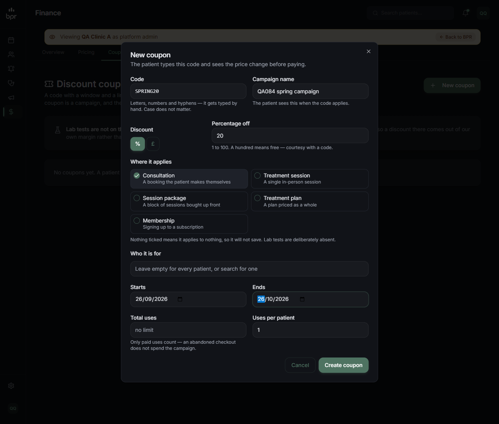

Depois do Create, o card:

```
SPRING20 · 20% off · everyone
QA084 spring campaign
Consultation — 26/09/2026 → 26/10/2026 — 0 used
Active [x]
```

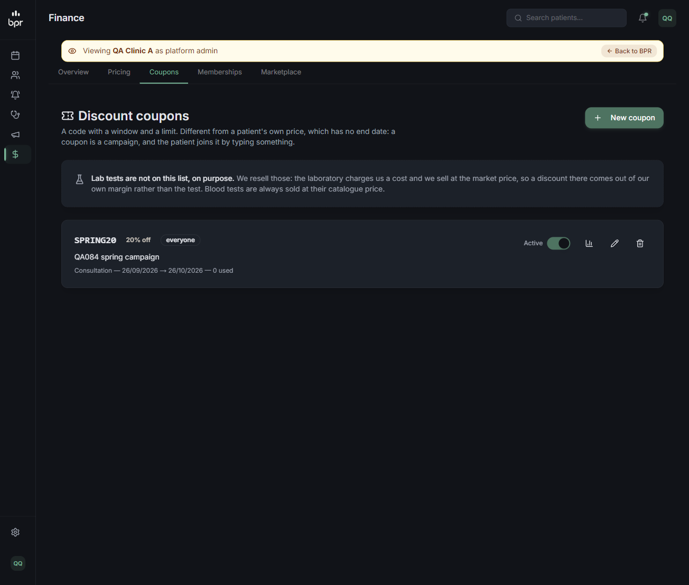

---

### 2.5 — Código repetido ✅

Digitei **`spring20`**, em minúsculas — o campo normalizou para `SPRING20` enquanto eu digitava, e o servidor recusou pela unicidade `(clinicId, code)`:

```
HTTP 409
toast: "Not saved
        The code SPRING20 already exists here."
```

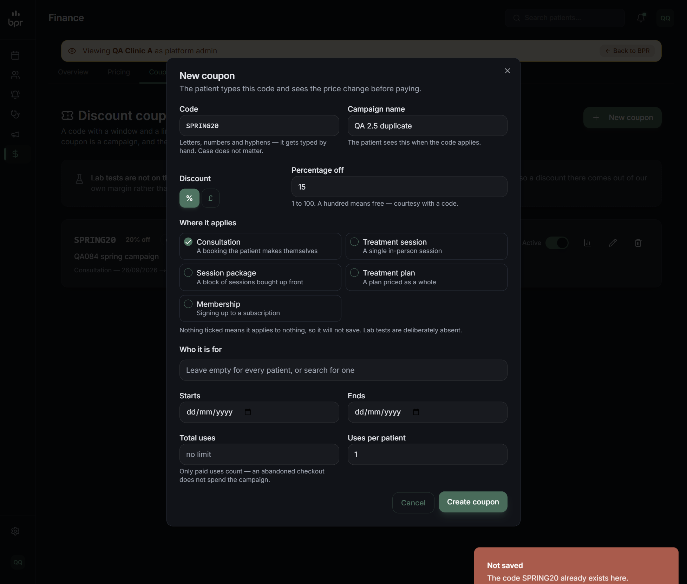

Pela API, a mesma coisa com o corpo em minúsculas:

```
$ curl ... -d '{"code":"spring20","discountPercent":5,"appliesTo":["CONSULTATION"]}'
{"error":"The code SPRING20 already exists here.","errorPt":"O código SPRING20 já existe aqui."}
HTTP 409
```

É `find-then-write`, não o erro P2002 do Postgres vazando para a tela — a frase é da aplicação.

---

### 2.6 — Salvar sem alcance ✅

```
HTTP 400
toast: "Not saved
        Choose where the code applies, or it applies to nothing."
```

O diálogo **continua aberto** com o que foi digitado, então ninguém perde o formulário.

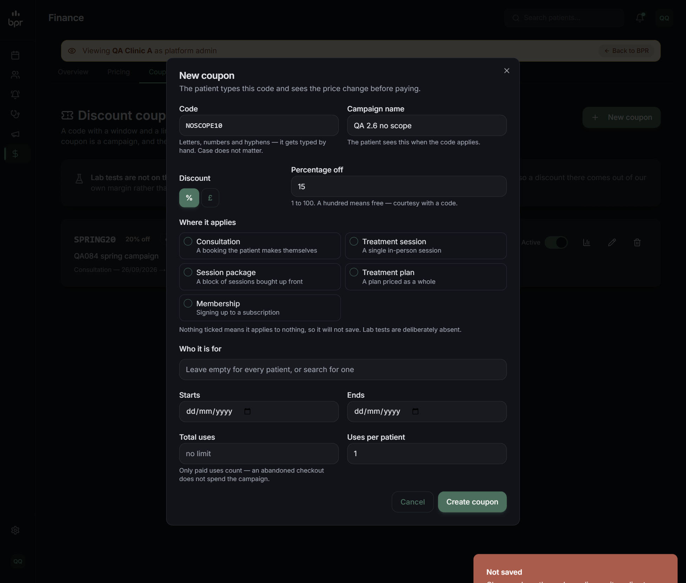

---

### 2.7 — Percentual e valor fixo juntos ✅

**Na tela isto não é alcançável**, e essa é a resposta mais forte: existe **um** campo de valor e um alternador `%` / `£`; trocar de `%` para `£` só muda o rótulo de "Percentage off" para "Amount off" (`valueInputs: 1` nos dois estados). O corpo enviado sempre tem um dos dois em `null`.

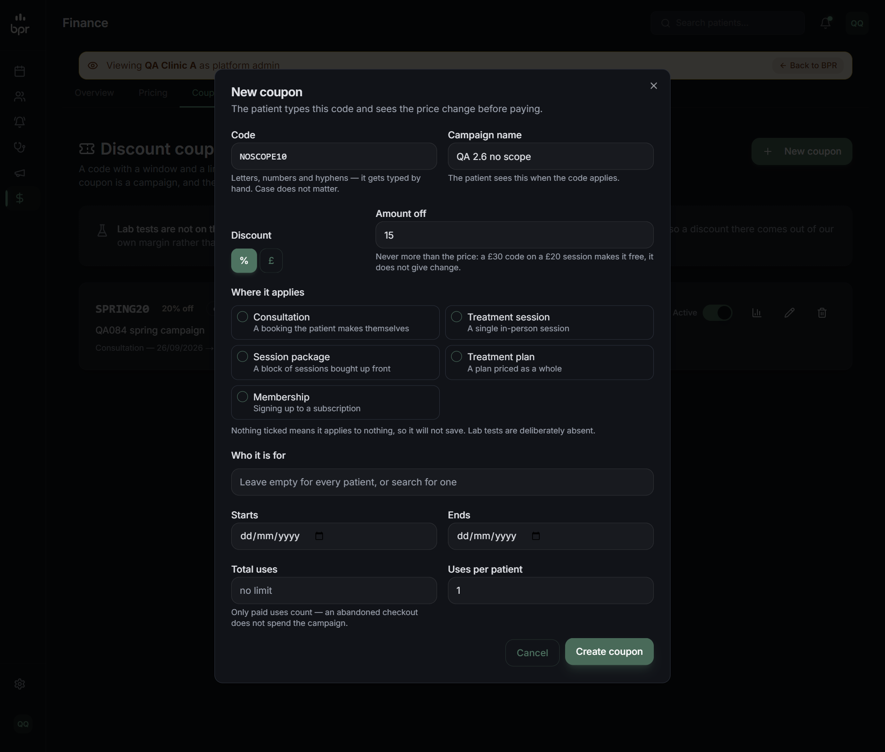

**Pela API**, que é onde o corpo pode vir torto:

```
-- 2.7 percentual E valor fixo juntos
   {"code":"BOTH20","discountPercent":20,"discountAmount":15,"appliesTo":["CONSULTATION"]}
   {"error":"Set either a percentage or a fixed amount, not both.",
    "errorPt":"Defina ou um percentual ou um valor fixo, não os dois."}
   HTTP 400

-- 2.7b nenhum dos dois
   {"code":"NEITHER","appliesTo":["CONSULTATION"]}
   {"error":"Set either a percentage or a fixed amount, not both.", ...}
   HTTP 400
```

**Outras recusas de escrita que rodei junto**, porque são o mesmo botão:

```
-- alcance de exame (LAB_TEST)
   {"error":"That is not something a code can apply to."}                          HTTP 400
-- percentual 101
   {"error":"A percentage goes from 1 to 100."}                                    HTTP 400
-- codigo com espaco ("BAD CODE")
   {"error":"Use letters, numbers and hyphens only - a code gets typed by hand."}  HTTP 400
-- fim antes do inicio
   {"error":"The end date comes after the start."}                                 HTTP 400
-- corpo vazio {}
   {"error":"A code needs at least 3 characters."}                                 HTTP 400
```

---

### 2.8 — A lista de alcance tem cinco opções, sem exame ✅

Lido do DOM do diálogo aberto:

```json
{
  "count": 5,
  "testids": ["coupon-scope-CONSULTATION","coupon-scope-TREATMENT_SESSION",
              "coupon-scope-PACKAGE","coupon-scope-TREATMENT_PLAN","coupon-scope-MEMBERSHIP"],
  "labels":  ["Consultation","Treatment session","Session package","Treatment plan","Membership"],
  "anyLabWord": false,
  "dialogLabLine": "Nothing ticked means it applies to nothing, so it will not save. Lab tests are deliberately absent."
}
```

`anyLabWord: false` é a checagem de que, tirando a linha que **explica** a ausência, as palavras "lab/exam/blood/test" não aparecem em lugar nenhum do formulário — não há campo escondido.

E a explicação existe **duas** vezes, o que é mais do que o qa-spec pediu:

- no cartão tracejado da página: *"Lab tests are not on this list, on purpose. We resell those: the laboratory charges us a cost and we sell at the market price, so a discount there comes out of our own margin rather than the test. Blood tests are always sold at their catalogue price."*
- no rodapé do bloco de alcance, dentro do formulário: *"…Lab tests are deliberately absent."*

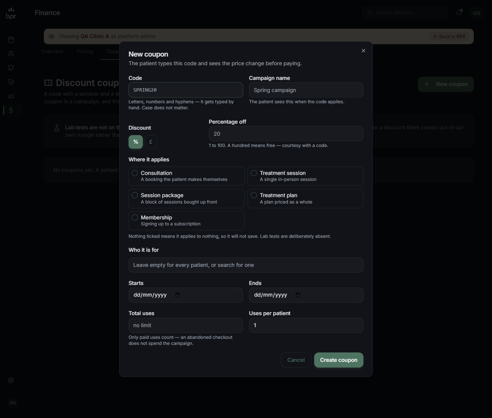

---

### 2.9 — "Ativo" persiste ao primeiro clique ✅

Sem nenhum Save. Ida e volta, cada uma com **reload completo** da página (`page.reload`, não navegação SPA):

```
antes do clique:       data-state = "checked"
depois do clique:      data-state = "unchecked"
depois do reload:      data-state = "unchecked"
  card: "SPRING20 · 20% off · everyone · off · ... · Active"

clique de volta + reload:  data-state = "checked"
  card: "SPRING20 · 20% off · everyone · ... · Active"     (sem o badge "off")
```

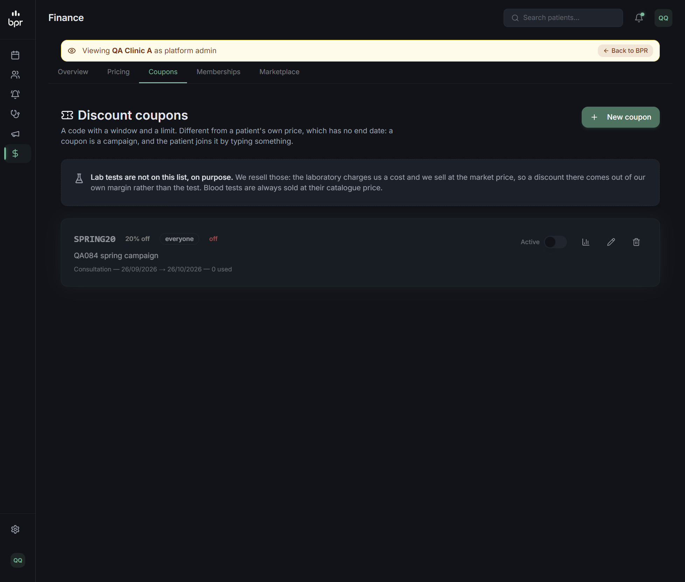


Confirmado também pela auditoria (2.11): `COUPON_DISABLED` às 10:16:04 e `COUPON_ENABLED` às 10:16:19 — uma linha por clique, no instante do clique. É o defeito da tela de preços de 26/09 corrigido.

---

### 2.10 — Apagar cupom com resgate desativa e explica ✅

**Montagem:** criei `USEDCODE` (25%, Consultation + Session package, limite 5) pela API, e inseri **dois** `CouponRedemption` direto no banco — um **confirmado** (`confirmedAt` preenchido, 100 → 75) e um **abandonado** (`confirmedAt: null`, 400 → 300), cada um num paciente de teste diferente. `INSERT` de linha, sem DDL.

A lista soube contar os dois separado:

```
USEDCODE · 25% off · everyone
Consultation · Session package — no end date — 1/5 used, 1 abandoned
```

O painel "quem usou" (passo 4 da T-2) abre e fecha a conta:

```
Who used USEDCODE
1 paid · 1 abandoned · GBP 25.00 given away
QA qa.pacientea   26/09/2026, 11:16:45 · PACKAGE · not paid      -GBP 100.00
QA qa.pacientea2  26/09/2026, 11:16:45 · CONSULTATION            -GBP 25.00
```

Os 100 do abandonado aparecem na linha dele mas **não** entram no "given away" — está certo.

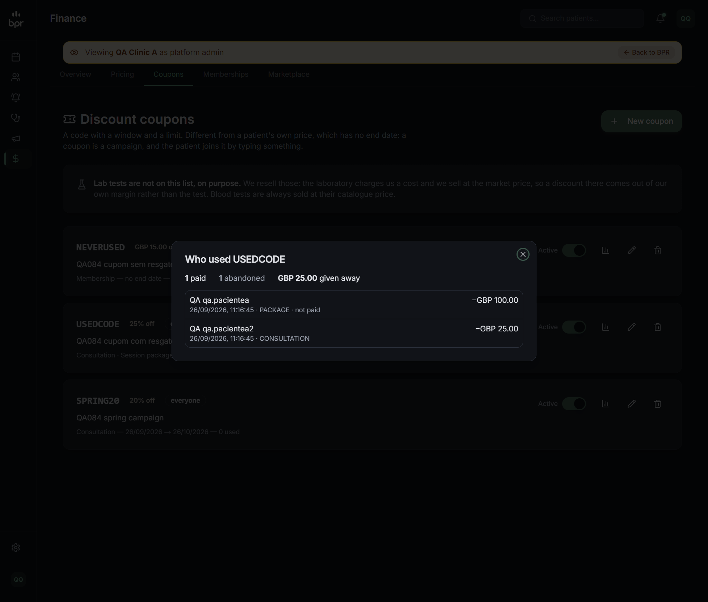

**A exclusão explica antes e depois.** O aviso, antes de confirmar:

> **Delete USEDCODE?**
> This code has been used 1 time, so it will be switched off instead of deleted — the record of why those people paid less stays.
> [Keep it] [**Switch it off**]

O próprio botão muda de "Delete" para "Switch it off", então não há como confirmar achando que vai apagar.

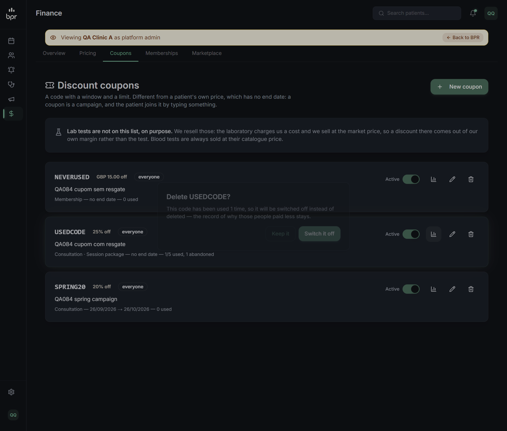

Depois de confirmar:

```
toast: "Switched off instead of deleted
        USEDCODE has been used 1 time, so it was switched off instead of deleted -
        the record of those charges stays."

estado: o card continua na lista, com badge "off", toggle unchecked,
        e "1/5 used, 1 abandoned" intacto
```

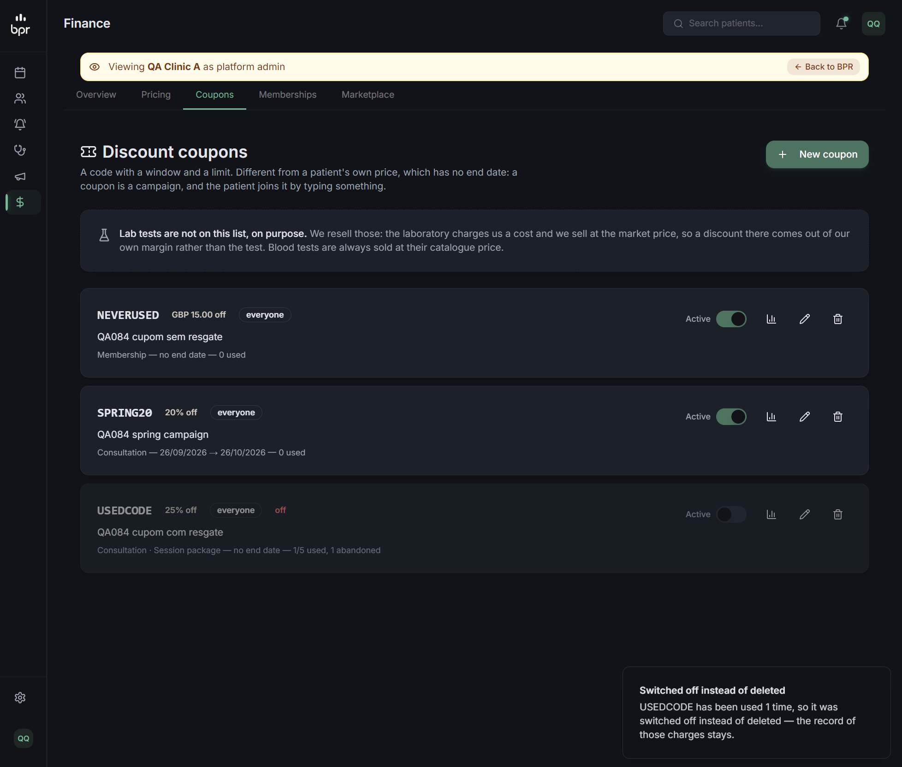

**O outro ramo também confere.** `NEVERUSED`, sem resgate nenhum:

```
aviso: "It has never been used, so it will be removed completely."  [Keep it] [Delete]
toast: "Coupon deleted"
estado: sumiu da lista (count = 0)
```

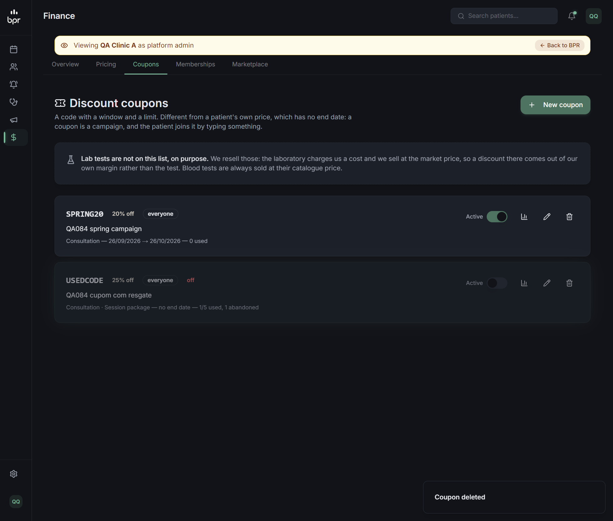

---

### 2.11 — Toda escrita gera logAudit ✅

Oito escritas bem-sucedidas na sessão, oito linhas. Dump direto de `AuditLog` onde `entity="Coupon"`:

```
10:12:58.624 | COUPON_CREATED   | qa.superadmin@example.test (SUPERADMIN) | SPRING20: 20% on CONSULTATION            | {"code":"SPRING20","appliesTo":["CONSULTATION"],"patientId":null}
10:16:04.028 | COUPON_DISABLED  | qa.superadmin@example.test (SUPERADMIN) | SPRING20 no longer accepted              | {"code":"SPRING20","isActive":false}
10:16:19.069 | COUPON_ENABLED   | qa.superadmin@example.test (SUPERADMIN) | SPRING20 accepting again                 | {"code":"SPRING20","isActive":true}
10:16:35.839 | COUPON_CREATED   | qa.superadmin@example.test (SUPERADMIN) | USEDCODE: 25% on CONSULTATION, PACKAGE   | {"code":"USEDCODE","appliesTo":["CONSULTATION","PACKAGE"],"patientId":null}
10:16:36.187 | COUPON_CREATED   | qa.superadmin@example.test (SUPERADMIN) | NEVERUSED: GBP 15 on MEMBERSHIP          | {"code":"NEVERUSED","appliesTo":["MEMBERSHIP"],"patientId":null}
10:17:08.174 | COUPON_DISABLED  | qa.superadmin@example.test (SUPERADMIN) | USEDCODE disabled instead of deleted (1 charged) | {"code":"USEDCODE","redemptions":1}
10:17:21.405 | COUPON_DELETED   | qa.superadmin@example.test (SUPERADMIN) | NEVERUSED deleted (never used)           | {"code":"NEVERUSED"}
10:17:30.349 | COUPON_UPDATED   | qa.superadmin@example.test (SUPERADMIN) | SPRING20 edited                          | {"was":{"code":"SPRING20","discountAmount":null,"discountPercent":20},"code":"SPRING20"}
TOTAL Coupon audit rows: 8
```

Cobre criar (3), ligar/desligar (2), desativar-em-vez-de-apagar (1), apagar (1) e editar (1). As tentativas recusadas (403, 400, 409) **não** geraram linha — correto, porque nada foi escrito.

---

## Testes extras (fora do qa-spec, rodados porque são a mesma rota)

### Isolamento entre clínicas — as três rotas

Criei `OTHERCLINIC` em **QA Clinic C** (pelo seletor de clínica), voltei para **QA Clinic A** e pedi aquele id:

```
GET    /api/admin/coupons                        -> a lista de A nao contem OTHERCLINIC (0 ocorrencias)
PATCH  /api/admin/coupons/cmui8l0ls...           -> {"error":"Not found"}   HTTP 404
DELETE /api/admin/coupons/cmui8l0ls...           -> {"error":"Not found"}   HTTP 404
GET    /api/admin/coupons/cmui8l0ls.../redemptions -> {"error":"Not found"} HTTP 404
```

Nunca "existe mas não é sua". É a regra da `1b4109a5` aplicada.

### A mira só alcança paciente da própria clínica

```
patientId de paciente de OUTRA clinica   -> {"error":"Patient not found"}  HTTP 404
patientId de um THERAPIST da propria     -> {"error":"Patient not found"}  HTTP 404
patientId inexistente                    -> {"error":"Patient not found"}  HTTP 404
```

E pela tela a mira funciona: busca por "pacientea" devolveu os dois pacientes de teste de QA Clinic A, e o cupom saiu com o nome no badge em vez de "everyone":

```
ONEPATIENT · 50% off · QA qa.pacientea
QA084 mirado num paciente
Treatment plan — no end date — 0 used
```

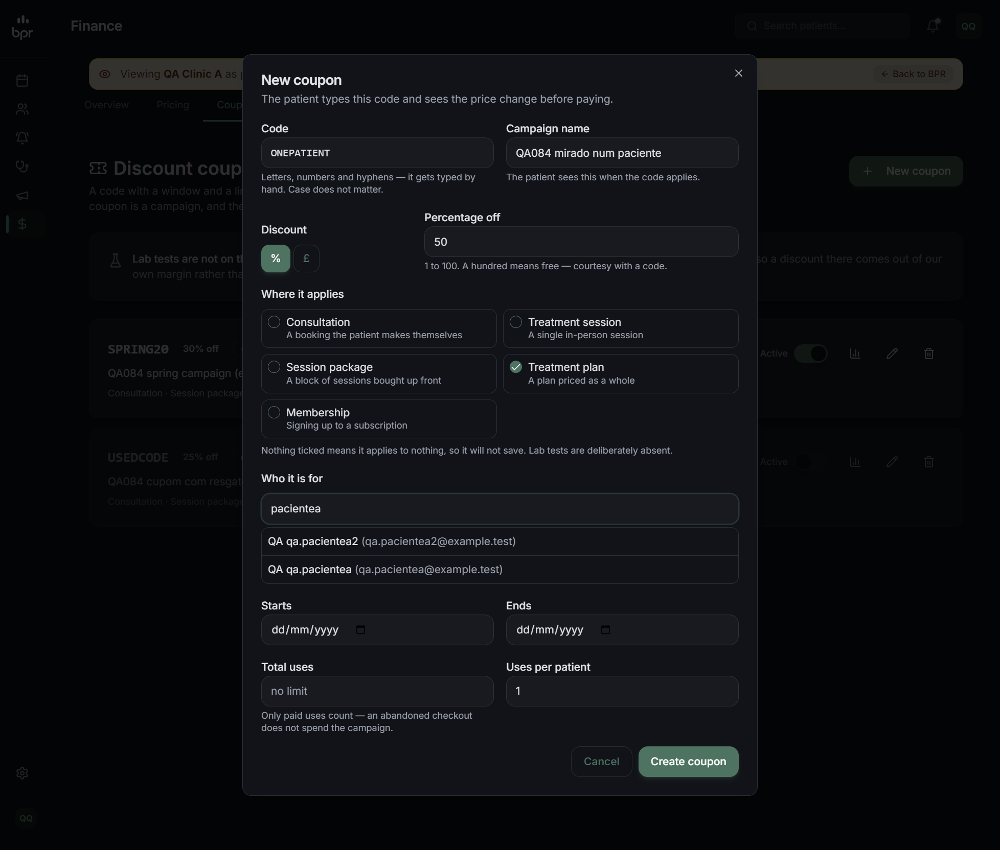
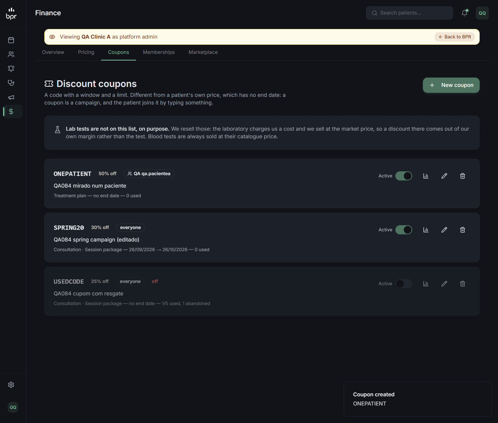

### Edição pelo formulário completo

`SPRING20` de 20% → 30%, nome alterado, alcance `PACKAGE` acrescentado: toast "Coupon updated" e o card refeito (`30% off`, `Consultation · Session package`). A janela de datas foi preservada.

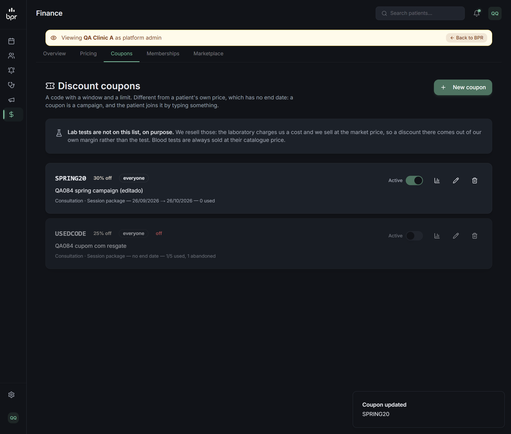

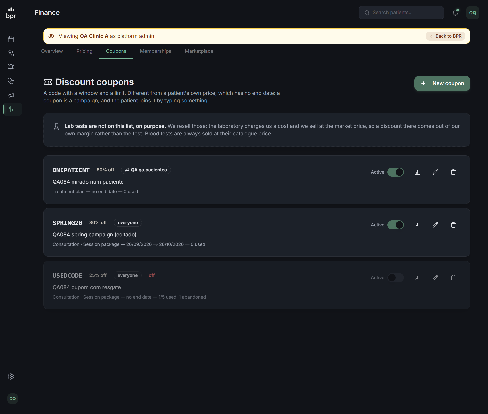

---

## Erros de console

**Nenhum erro de JavaScript** — nenhuma exceção, nenhum `Unhandled`, nenhum erro de render. Tudo o que o console registrou foram status HTTP das próprias chamadas de teste:

| origem | o que é |
|---|---|
| `403 /api/admin/coupons` (2x) | o cenário 2.1 sem clínica selecionada — esperado |
| `400 /api/admin/coupons` (2x) | o cenário 2.6 — esperado |
| `409 /api/admin/coupons` (4x) | o cenário 2.5, repetido para capturar o toast — esperado |
| `403 /api/admin/notifications`, `/api/alerts`, `/api/admin/adherence/*` | **pré-existente**, fora da T-2: outros widgets do shell do admin também respondem 403 quando não há clínica resolvida. Mesma causa raiz que o F3 |

Dois `warning` do Radix, não-fatais:

```
Warning: Missing `Description` or `aria-describedby={undefined}` for {DialogContent}
```

São do diálogo **"Who used {code}"**, que tem `DialogTitle` mas não `DialogDescription` (achado F6).

---

## Achados

Nenhum derruba um cenário numerado. Ordenados por quanto me incomodam.

### F1 — Data inválida em POST e PATCH devolve **500 com corpo vazio** (média)

```
$ curl ... -X POST /api/admin/coupons \
    -d '{"code":"DATEJUNK","discountPercent":10,"appliesTo":["CONSULTATION"],"endsAt":"banana"}'
(corpo vazio)
HTTP 500

$ curl ... -X PATCH /api/admin/coupons/<id> \
    -d '{"code":"CURRJUNK","discountAmount":15,"appliesTo":["CONSULTATION"],"startsAt":"nao-e-data"}'
(corpo vazio)
HTTP 500
```

**Causa provável:** `validateCouponInput` protege o caso "fim antes do início" com `Number.isNaN`, mas as rotas fazem `new Date(String(body.endsAt))` **sem** essa proteção; `Invalid Date` chega ao Prisma, que lança, e não há `try/catch` na rota.

**Onde olhar:** `app/api/admin/coupons/route.ts` (bloco `startsAt`/`endsAt` do `create`) e `app/api/admin/coupons/[id]/route.ts` (o mesmo no `update`). A correção natural é a própria `validateCouponInput` recusar data inválida — ela já tem o `Number.isNaN` na mão.

**Por que importa** mesmo sem quebrar cenário: a tela usa `<input type="date">` e nunca manda isso, então o Bruno não vai topar com o bug. Mas o critério de aceite da T-2 é *"recusado com frase, não com erro de banco"*, e 500 de corpo vazio é o oposto disso — e a rota é contrato para o que vier depois (app, script, integração).

### F2 — A tela diz "No coupons yet" quando o GET falhou (média)

Descrito acima, em 2.1, com screenshot. `app/admin/coupons/page.tsx` tem `loading` e `coupons`, mas não tem estado de **erro**: quando `carregar()` cai no `catch`, `setLoading(false)` roda e a lista fica `[]`, indistinguível de "a clínica não tem cupom". A tela afirma uma coisa sobre a campanha do Bruno que ela não sabe.

### F3 — "No clinic" é a frase errada (baixa, mas é a F2 da 082 de novo)

`{"error":"No clinic"}` vira *"Could not load coupons / No clinic"*. Lê-se como problema de conta; a solução é um clique no seletor de clínica. E não é só o cupom — `/api/admin/notifications`, `/api/alerts` e `/api/admin/adherence/*` respondem 403 pelo mesmo motivo, então talvez o lugar certo não seja a rota do cupom e sim o shell do admin.

### F4 — currency arbitrária é aceita na criação (baixa)

```
$ curl ... -d '{"code":"CURRJUNK","discountAmount":15,"currency":"banana","appliesTo":["CONSULTATION"]}'
{"coupon":{... "discountAmount":15,"currency":"banana" ...}}
HTTP 200
```

`validateCouponInput` não olha `currency`, e a rota grava o que vier. O cupom que nasce assim é **inutilizável e silencioso**: a T-1 compara `currency !== achado.currency` e recusa todo paciente com `wrong_currency` — *"That code is issued in another currency."* — sem que nada na tela do painel mostre que o cupom está quebrado. Não alcançável pela UI (que nunca envia `currency`), então é só disciplina de rota. **Limpei o `CURRJUNK` do banco** ao fim do teste.

### F5 — A auditoria não guarda de qual clínica é o cupom (baixa)

`AuditLog` não tem `clinicId`, e as rotas não colocam o tenant no `metadata` (colocam `code`, `appliesTo`, `patientId`). Com um SUPERADMIN que troca de clínica, ler o log depois não responde *em qual clínica este `SPRING20` foi criado* — e `SPRING20` pode existir em várias. Uma chave a mais no `metadata` resolve, sem tocar no schema.

### F6 — Aviso de acessibilidade no diálogo "Who used {code}" (cosmética)

`DialogContent` sem `DialogDescription` nem `aria-describedby`. Os outros dois diálogos da tela têm.

---

## O que ficou no banco local

Em **QA Clinic A**, de propósito, para o caso de você querer olhar:

| código | o quê | estado |
|---|---|---|
| `SPRING20` | 30%, Consultation + Session package, 26/09 → 26/10, todos | ativo |
| `ONEPATIENT` | 50%, Treatment plan, mirado em `qa.pacientea@example.test` | ativo |
| `USEDCODE` | 25%, Consultation + Session package, limite 5, 1 resgate confirmado + 1 abandonado | **desligado** (pelo cenário 2.10) |

Em **QA Clinic C**: `OTHERCLINIC` (10%, Consultation), só para o teste de isolamento. `NEVERUSED` e `CURRJUNK` foram apagados. Os cupons `QA084-*` da clínica `QA084 Coupon Clinic` são de outra sessão, não mexi neles.

Se quiser o banco limpo, é um `DELETE` nesses quatro cupons — os resgates saem por cascade.

---

## Veredito

**⚠️ Aprovado com ressalvas.** Os 11 cenários da seção T-2 acontecem como o qa-spec pede, e os oito critérios de aceite da tarefa estão cumpridos, incluindo os dois que existem por causa de defeitos anteriores: o "Ativo" que salva no primeiro clique (a tela de preços de 26/09) e o cupom cobrado que se desliga em vez de sumir.

O que eu resolveria antes do deploy é **F1** (500 de corpo vazio numa rota de escrita) e **F2** (a tela afirmando que não há cupom quando não conseguiu perguntar). **F3** é a mesma frase de sempre mandando a pessoa para o lugar errado, e vale arrumar junto porque é uma linha.

**Sobre a decisão que você pediu:** exigir clínica para administrar cupom está **certo** e eu manteria — o que precisa mudar é a frase e o estado vazio, não a regra. E vale confirmar, com uma clínica de teste em produção, se o SUPERADMIN em "Global View" não acaba criando cupom na clínica padrão sem a tela dizer qual é.
