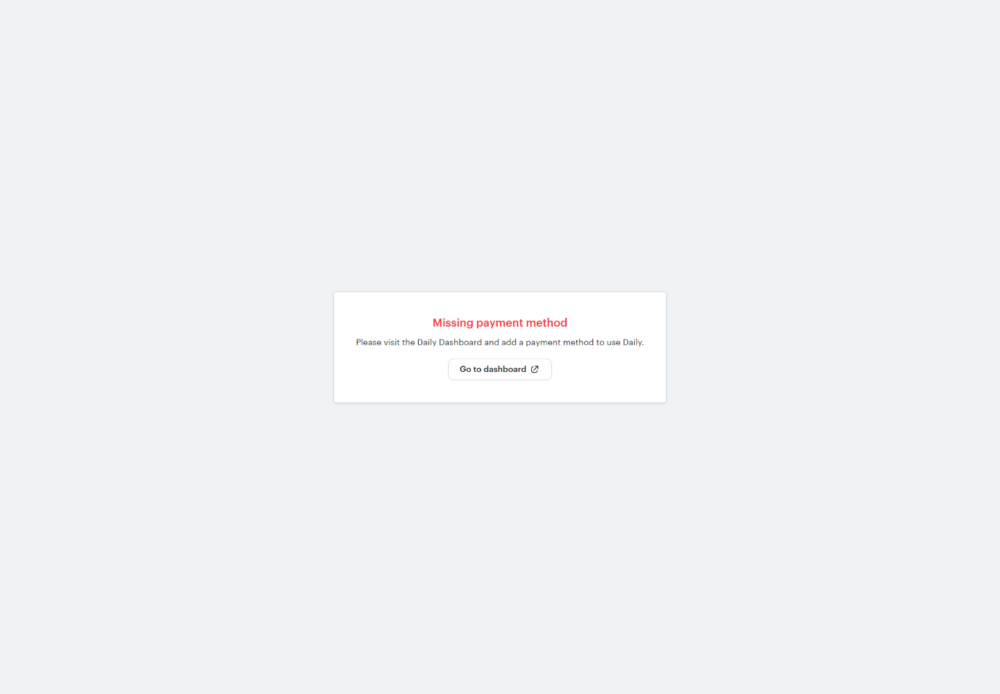
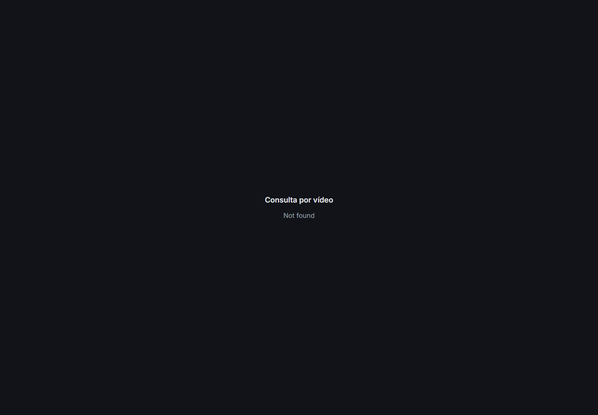
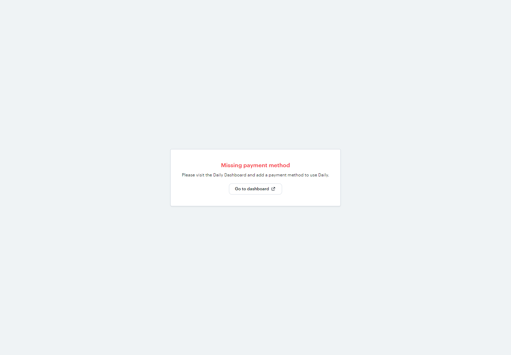
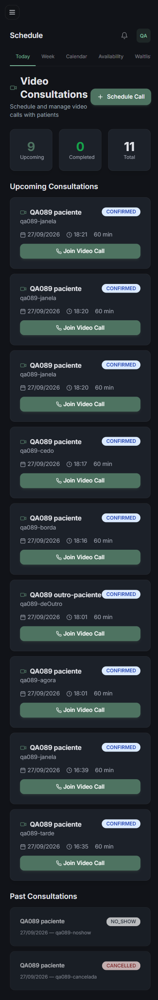
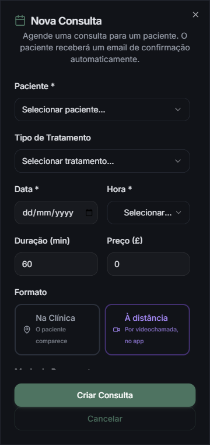

# QA Report — Atividade 089: a consulta por vídeo + o desfazer do recado

**Data:** 27/09/2026
**Worktree:** `C:\Users\bruno\orca\workspaces\clinic\app_clinic`
**Commit medido:** `f2ca5d8e3` — *fix: the review's findings, and booking a consultation for someone you look after*

**Resultado geral:** ⚠️ **aprovado com ressalvas** — e as duas frases abaixo precisam aparecer juntas, senão uma delas mente:

> T-1, T-2 e T-3 estão **corretas no que constroem**: 35 dos 42 cenários passaram com evidência, incluindo os cinco que o Bruno pediu para atacar.
> E a **funcionalidade não funciona para o paciente** enquanto a conta Daily não tiver forma de pagamento — a chamada não abre para ninguém, nem para o terapeuta com token válido.

> **Nota do main, 27/09 às 19h:** o cartão foi cadastrado depois deste QA, e a parede de pagamento caiu — conferido criando uma sala de teste e pedindo a página dela. O painel da Daily mostra **10.000 minutos-participante inclusos por mês, 0 usados**, renovando em 1º de outubro. O **1.4 comportamental continua pendente** e agora é executável.

---

## Como ler este relatório

**Dois defeitos reais foram encontrados e consertados durante a medição.** O código mudou no disco enquanto ele media, então cada resultado diz contra qual versão foi tirado. A tabela e os detalhes refletem o **estado final congelado**:

| arquivo | md5 final |
|---|---|
| `lib/video-call.ts` | `fc8292ca9f56d50602e095842ebd89bd` |
| `lib/apagar-recado.ts` | `adbc82bb30a7f23ca444f515d62a50ff` |
| `app/api/appointments/[id]/video/route.ts` | `705192b0da77442eb57163e8224a709b` |
| `app/video-room/[id]/page.tsx` | `105250db8089e2af8e9b395c957ab3d8` |
| `app/api/patient/messages/route.ts` | `7645e0f9ae44e64f1e7455f69e1aa796` |

**Servidor medido:** confirmado em cada troca de porta que o processo era deste checkout, lendo a linha de comando do PID que ouvia a porta. A porta **:4000 é o checkout principal** e nunca foi usada. A passagem final rodou no **:4146**, com `.next` recém-criado.

---

## Resumo

**35 passaram · 0 reprovados · 6 não executados · 1 parcial**

| # | Cenário | Resultado |
|---|---------|-----------|
| 1.1 / 1.2 | o portão exige chave **e** interruptor | ✅ |
| 1.3 | portão fechado → 503 **antes do banco** | ✅ |
| 1.4 | a sala é privada | ✅ API / ⚠️ comportamento **não executável** |
| 1.5 | `exp` e `eject_at_room_exp` | ✅ |
| 1.6 | nada grava | ✅ *(esperado atualizado)* |
| 1.7 | criar duas vezes → uma sala só | ✅ |
| 1.8 | o nome não carrega nada do paciente | ✅ |
| 2.1 / 2.2 | paciente e terapeuta entram | ✅ |
| **2.3** | **um admin da clínica NÃO entra** | ✅ |
| 2.4 / 2.5 | outro paciente → 404; sem sessão → 401 | ✅ |
| 2.6 / 2.7 / 2.8 | as bordas da janela, ao segundo | ✅ **(2.6 e 2.8 eram defeito)** |
| 2.9 / **2.10** | presencial → `not_video`; **cancelada → `not_scheduled`** | ✅ |
| 2.11 / 2.12 | `is_owner` falso para paciente, verdadeiro para terapeuta | ✅ |
| **2.13** | **a linha guarda a URL, nunca o token** | ✅ |
| 3.1 a 3.6 | a página da sala e o painel | ✅ *(3.4 com ressalva de texto)* |
| 4.1–4.4 | telas do app | ⚠️ **não executado** |
| 4.5 / 4.6 | o formulário oferece o formato, e ele chega ao servidor | ✅ |
| **5.1 / 5.6 / 5.7** | **apagar leva mensagem, documento e arquivo** | ✅ |
| 5.2 a 5.5 | já lido, de outro, da clínica, impersonação | ✅ |
| A.1 / A.2 | o tema no aparelho | ⚠️ **não executado** |

---

## O achado que vale a atividade: a chamada não abre

**A conta Daily não tinha forma de pagamento.** A API funciona inteira — sala criada, token emitido, rota devolvendo 200 — e mesmo assim ninguém conseguia se falar.

Montado o `iframe` como o **terapeuta**, na consulta dentro da janela, com token `is_owner: true`:

> **Missing payment method**
> Please visit the Daily Dashboard and add a payment method to use Daily.



```
GET https://api.daily.co/v1/  ->  200
{"domain_name":"bpr", "account_suspended":false, "allow_plan_free":false}
```

**Por que só apareceu agora:** uma medição que parasse na resposta HTTP teria dado tudo verde. O `200` com `url` e `token` é real e correto. O defeito só existe a partir do momento em que um navegador tenta de fato entrar. Foi preciso renderizar o `iframe`, não ler o JSON.

---

## Os cinco que o Bruno pediu para atacar

### 2.3 — o admin da clínica não entra

Testado com um admin que tem `canManageUsers`, `canManageAppointments`, `canManageSettings` e `canViewAllPatients` — **da mesma clínica da consulta**. Recebe `404 Not found`, o mesmo que um estranho.

```
2.3  ADMIN DA CLINICA        HTTP 404
2.3b admin de OUTRA clinica  HTTP 404
2.4  outro paciente          HTTP 404
2.5  sem sessao              HTTP 401
```



### 2.10 — cancelada não abre

`CANCELLED` e `NO_SHOW` recusam com `409 not_scheduled` **dentro da janela**, e **nenhuma sala é criada**.

### 1.4 e 1.6 — sala privada, nada grava

```
GET /v1/rooms/consulta-<id>  ->  200
{"privacy":"private",
 "config":{"exp":1790533919,"enable_chat":true,"eject_at_room_exp":true,"enable_prejoin_ui":true}}

salas com QUALQUER propriedade de gravacao: 0
salas publicas: 0
```

**A metade comportamental do 1.4 não foi executável:** abrir a URL sem token devolvia a mesma tela de cobrança, não a recusa de sala privada — o bloqueio de pagamento vem **antes** da checagem de privacidade.



**O 1.6 mudou de esperado durante a medição.** O `enable_recording: false` voltava da Daily como `er: ""` — string vazia, não `false`: eles esperam string (`"cloud"`, `"local"`) e engoliram o booleano. O campo foi removido, e a garantia passou a ser explicitamente **a sala**.

### 5.6 / 5.7 — apagar leva o áudio junto

```
ANTES
  GET /api/patient/documents         -> 200, o audio ESTA na lista
  GET /api/files/<doc>?t=<assinado>  -> 200, audio/mp4, 4120 bytes

DELETE /api/patient/messages?id=...  -> 200 {"deleted":true,"documentRemoved":true}

DEPOIS
  a mensagem saiu da conversa                  OK
  o audio saiu da lista de documentos          OK
  a MESMA URL assinada -> 404 "Not Found"      OK
```

A URL que entregava 4120 bytes um segundo antes passa a responder 404. Confirma na prática que **apagar a linha é apagar o áudio**: os bytes moram em `fileData`.

### 2.13 — o token não é gravado

Depois de ~15 entradas na mesma consulta:

```
videoRoomId : consulta-cmuk2mn0y000dxzbkvtkmcwdn
videoRoomUrl: https://bpr.daily.co/consulta-cmuk2mn0y000dxzbkvtkmcwdn
updatedAt   : 17:07:23.949Z   <- so a 1a gravacao
algum JWT na linha? NAO
```

---

## As bordas da janela, ao segundo

A medição por HTTP escorrega no relógio, então `tokenParaEntrar` foi chamada com `agora` fixo:

```
601s antes -> too_early    600s (a borda) -> emite    599s -> emite
1s antes do fim -> emite   no fim -> emite            1s depois -> too_late
```

## 1.3 — o portão responde antes do banco

A medição caiu por acaso num momento em que o Postgres estava recusando conexões, **e isso virou evidência melhor que a planejada**:

```
POST .../<id que EXISTE>/video    -> 503 video_unavailable
POST .../naoexiste000000000/video -> 503  (identico)
controle, MESMO servidor: GET /api/patient/messages -> 200 com dados reais
```

Resposta idêntica para id existente e inexistente: a rota não chegou a perguntar ao banco.

## 1.7 — uma sala só

Cinco POSTs seguidos: `URLs distintas: 1`, `salas com esse nome na conta: 1`. O log mostra o caminho idempotente: `400 "already exists"` → `GET` → devolve a existente.

## 3.5 / 3.6 — o painel, medido por comportamento

Interceptando `window.open` e clicando nos nove botões: todos abrem `/video-room/<id da consulta>` — o id real, conferido contra o banco. **Prova comportamental, não leitura de fonte:** o id que o botão abre *é* o id da consulta.



## 4.5 / 4.6 — marcar à distância



```
{"id":"cmuk3c4l80003xzesieps9l1i", "mode":"VIDEO", "status":"PENDING",
 "videoRoomId":null, "videoRoomUrl":null}
```

`videoRoomId`/`videoRoomUrl` **nulos** — a sala não nasce ao marcar, só quando alguém pede para entrar.

## T-5 — o desfazer, inteiro

```
5.2  ja lido (PATCH do painel)  -> 409 already_read   | mensagem, audio e arquivo SOBREVIVEM
5.3  recado de outro paciente   -> 404 not_found      | o de B sobreviveu
5.4  mensagem da clinica        -> 404 not_found
5.4b senderId dele, senderRole staff -> 404           | (cenario dele, fora da spec)
5.5  onBehalfOf=<admin>         -> 403 on_behalf_read_only | e o proprio paciente apaga em seguida: 200
```

---

## Extra medido a pedido: `dependentId` em `POST /api/appointments`

```
A  a mae marca para A PROPRIA FILHA         -> 200, no nome de "QA089 filha-da-paciente"
B  a mae marca para a filha DE OUTRA pessoa -> 404
C  a mae marca para um ADULTO nao gerido    -> 404
D  dependentId inexistente                  -> 404
E  sem dependentId                          -> 200, no nome DELA
```

**Um detalhe que vale registrar:** o portão de triagem checa a triagem **da criança**, não a da mãe — antes de enviar a triagem da filha, o caso A recusava com `409 screening_required`. É a resposta clinicamente correta: quem vai ser atendido é ela.

---

## Falhas e recomendações

### 1. 🔴 A chamada não abre — conta Daily sem forma de pagamento

Descrito acima. **Não é código.** *(Resolvido às 19h — ver a nota do topo.)*

### 2. 🟡 A tela mostrava "Not found" cru

`/video-room/<id>` recusava certo, mas o texto era a string de desenvolvedor **"Not found"**, em inglês, numa página em português. *(Consertado: as respostas 404 e 401 ganharam `errorPt`, e a página deixou de usar `data.error` como reserva.)*

### 3. 🟡 O painel oferecia entrar numa consulta que já terminou

`/admin/video-consultations` listava sob "Upcoming" uma consulta das 16:35 cuja janela fechou às 17:05, com o botão ativo. O filtro era por **dia**, não pela janela. *(Consertado: `upcoming` passou a usar a mesma folga do servidor.)*

### 4. 🟡 "Na Clínica" aparecia duas vezes no mesmo diálogo

No formulário de Nova Consulta, em português, era ao mesmo tempo o **Formato** e o **Modo de Pagamento**. *(Consertado: o formato virou "Presencial".)*

### 5. 🟡 A mãe não entrava na consulta da filha

Quem recusava era o **`middleware.ts`**, que barra todo método de escrita para sessão emprestada. *(Consertado antes deste relatório: exceção explícita, e quem entra assim aparece como "Ana (com Maria)".)*

### 6. 🟢 Dois defeitos encontrados e consertados durante a medição

**(a) Consulta expirada devolvia `502 provider_error` em vez de `409 too_late`:**

```
[video-call] Daily /rooms 400: exp was '1790528759', which is in the past
[video-call] Daily /rooms/consulta-<id> 404: room not found
-> 502 "O servico de video recusou o pedido. Tente de novo."
```

E a tela mostra "Tentar de novo" para `provider_error` — a pessoa entrava num laço.

**(b) Um POST recusado com `too_early` criava a sala mesmo assim** — contradizendo o *"a sala só existe se alguém de fato vai usá-la"* do docstring da própria rota.

Hoje **nenhuma recusa cria sala**: `GET /v1/rooms/consulta-<id>` responde 404 depois de `too_early`, `too_late`, `not_video` e `not_scheduled`.

### 7. 🟢 Um comentário que apontava para a rota errada (corrigido)

O docstring de `lib/apagar-recado.ts` dizia que `readAt` é marcado no **GET**. Era o **PATCH**. **Isto custou uma medição errada:** o QA seguiu o comentário e quase reportou que o paciente apagava recado já visto pela clínica.

---

## Erros de console

**Nenhuma exceção de JavaScript.** Só as falhas de rede esperadas dos cenários negativos. Um detalhe do dev: cada 404/409 aparece **duas vezes** — StrictMode chamando o efeito duas vezes, ou seja **dois POSTs por carregamento**. Inofensivo porque a criação é idempotente, mas vale saber ao ler o log.

---

## Notas de ambiente

1. **O Postgres local estourou o limite de conexões** — oito `next dev` vivos e 100 conexões (o `max_connections` padrão). `/admin/patients/<id>` chegou a responder 500. Com autorização, foram encerrados os seis ociosos deste worktree; as conexões caíram de 100 para 13.
2. **`npm run build` derrubou o dev duas vezes** — `.next` compartilhado. A passagem contaminada foi descartada e refeita em porta nova. Na segunda vez o `.next` ficou **sem `BUILD_ID`**.
3. **`NEXTAUTH_URL=http://localhost:3000`** enquanto o dev roda em outra porta: o "Sign Out" redireciona para uma porta morta.

---

## Limpeza

```
Banco  ANTES : {"consultas":15,"mensagens":9,"documentos":6,"triagens":2}
       DEPOIS: {"clinicas":0,"usuarios":0,"consultas_qa":0,"mensagens_qa":0,"documentos_qa":0}
Daily  as 7 salas criadas foram apagadas — salas restantes na conta: 0
Dados  nenhum dado real usado; so contas @example.com
Codigo git status limpo; so os screenshots foram acrescentados
```
