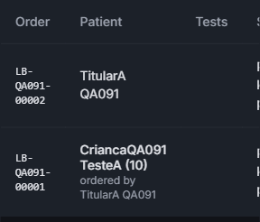
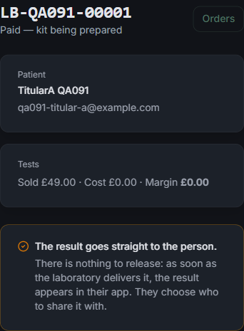

# QA Report — Atividade 091 (exame para quem você cuida)

**Data:** 27/09/2026
**Ambiente:** `http://localhost:4137` (Next dev, worktree `app_clinic`, branch `brunoto02028/app_clinic`),
Postgres local compartilhado. `LAB_ORDERING_ENABLED` ausente → **compra fechada** (`labOrderingEnabled() === false`).
**Resultado geral:** ⚠️ **aprovado com ressalvas** — as garantias centrais da T-7 se sustentam
(a criança não entra de jeito nenhum; o token emprestado não compra nem gere pessoas), mas há
**4 cenários reprovados** e 2 ressalvas.

## Placar

| | |
|---|---|
| ✅ passou | 34 |
| ❌ reprovou | 4 |
| ⚠️ ressalva | 2 |
| ⏸️ não executado | 18 |

Os não executados são, na quase totalidade, telas do app React Native — **não testáveis por
Playwright** (ver "O que não deu para executar").

---

## Dados de teste usados

| | |
|---|---|
| `qa091-titular-a@example.com` | TitularA QA091, PATIENT, QA Clinic A, **sem** código postal no cadastro |
| `qa091-titular-b@example.com` | TitularB QA091, PATIENT, QA Clinic C, código postal `W1G 9QD` |
| `qa091-admin@example.com` | AdminQA091 Teste, ADMIN, QA Clinic A (só para o painel web) |
| `CriancaQA091 TesteA` | pessoa gerida por A, nascida 04/05/2016 (10 anos) |
| `CriancaQA091 TesteB` | pessoa gerida por B (cenários de conta alheia) |
| `DesligadaQA091 TesteA` | pessoa gerida por A, desligada de propósito para 7.11/7.12 |
| `LB-QA091-00001` | pedido de exame com `subjectId` = CriancaQA091 |
| `LB-QA091-00002` | pedido de exame sem sujeito (o titular) |

Nenhum paciente real foi tocado. Tudo apagado no fim (ver "Limpeza").

---

## T-7 — A criança como paciente, e a área do responsável

| # | cenário | resultado | evidência |
|---|---|---|---|
| 7.1 | `POST /api/mobile/dependents` | ✅ | HTTP 201; linha no banco com `password:null`, `email:"managed-757634f7-…@no-mail.invalid"`, `role:"PATIENT"`, `clinicId:"cmu6aoc2j…"` (= o do responsável), `pushEnabled:false`, `emailVerified` preenchido |
| 7.2 | login com o e-mail sintético | ✅ | HTTP 401 `{"error":"Invalid email or password"}` — **idêntico** ao de um e-mail inexistente (comparação na mesma rodada) |
| 7.3 | "esqueci minha senha" para esse e-mail | ⚠️ | HTTP 200 com a frase neutra e **nenhum envio** (`destinosEntregaveis` corta antes do provedor) — mas **um `PasswordResetToken` foi criado** e ele funciona. Ver achado 2 |
| 7.4 | `POST …/<id>/session` com o token do responsável | ✅ | HTTP 200; payload `{"sub":"cmujj123a…"(a criança),"onBehalfOf":"cmujizwey…"(o responsável),"role":"PATIENT","email":"","permissions":{todas false}}`, TTL 900s, **sem `refreshToken` na resposta** |
| 7.5 | o mesmo, com o id da criança de outra conta | ✅ | HTTP 404 `{"error":"Not found"}` |
| 7.6 | o mesmo, com um token já emprestado | ✅ | HTTP 403 `{"code":"already_on_behalf"}` |
| 7.7 | `POST /api/mobile/labs/orders` com o token emprestado | ✅ | HTTP 403 `{"code":"on_behalf_read_only","error":"Switch back to your own account to order a test."}` |
| 7.8 | criar/editar/remover pessoa gerida com o token emprestado | ✅ | POST, PATCH e DELETE → todos HTTP 403 `{"code":"on_behalf_read_only"}`; nome da criança inalterado depois das três tentativas |
| 7.9 | `DELETE /api/patient/account` com o token emprestado | ✅ | HTTP 403 `{"error":"Cannot delete an account while impersonating"}`; e `POST /api/patient/delete-account` → HTTP 403 `{"error":"Read-only during impersonation"}` |
| 7.10 | ler agenda/protocolo/exercícios com o token emprestado | ❌ | HTTP **403 `consent_required`** em `/api/patient/appointments`, `/protocol` e `/tasks`. Ver achado 1 |
| 7.11 | remover pessoa gerida | ✅ | HTTP 200; linha no banco `{"deletedAt":"2026-09-27T08:01:43.508Z","isActive":false,"managedById":"cmujizwey…","role":"PATIENT"}`; sai da lista; PATCH e session nela → 404 |
| 7.12 | pedido com `dependentId` de pessoa desligada | ✅ | HTTP 404 `{"error":"Not found"}` — e o mesmo para `dependentId` de outra conta |
| 7.13–7.16 | a área do responsável no app (olho, faixa, voltar, reabrir) | ⏸️ | app React Native; mecanismo confirmado **por leitura de código** |

**Extra (fora da qa-spec), tentando furar a sessão de leitura:**

| tentativa com o token emprestado | resultado |
|---|---|
| `PATCH /api/patient/profile` | ✅ 403 `Cannot modify profile while impersonating` |
| `POST /api/patient/consent` | ✅ 403 `Read-only during impersonation` |
| `POST /api/patient/lab-consent` | ✅ 403 `Read-only during impersonation` |
| `POST /api/patient/change-email/request` | ✅ 400 (exige a senha atual, que não existe) |
| **`POST /api/patient/change-password`** | ❌ **HTTP 200 `{"success":true}` — e a senha da criança foi gravada.** Ver achado 3 |
| `GET /api/patient/profile` | ⚠️ 200 com os dados da criança — inclusive o **e-mail sintético**. Ver achado 4 |

---

## T-1 — Onde se faz o exame

`GET /api/mobile/labs/collection-points`

| # | cenário | resultado | evidência (corpo real) |
|---|---|---|---|
| 1.1 | `?postcode=SW1A 1AA`, token de quem **não tem** código postal no cadastro | ✅ | `{"estado":"laboratorio_desconectado","postcode":"SW1A 1AA","local":"Westminster","pontos":[]}` — e o cadastro depois de todas as buscas continuava `{"postcode":null,"address":null,"city":null}` |
| 1.2 | `?postcode=sw1a1aa` | ✅ | `{"estado":"laboratorio_desconectado","postcode":"SW1A 1AA","local":"Westminster","pontos":[]}` |
| 1.3 | `?postcode=onde fica` | ✅ | `{"estado":"postcode_desconhecido","postcode":"onde fica","local":null,"pontos":[]}` — devolve o texto **cru**, que é a assinatura do retorno antecipado, antes do postcodes.io |
| 1.4 | `?postcode=ZZ1A 1AA` (forma certa, não existe) | ✅ | `{"estado":"postcode_desconhecido","postcode":"ZZ1A 1AA",…}` — com o código **normalizado**, ou seja o serviço externo foi consultado e respondeu 404 (que ele está alcançável está provado por 1.1/1.2 devolverem `local:"Westminster"`) |
| 1.5 | `?postcode=` (vazio) | ✅ | cai no cadastro: titular sem código → `sem_postcode`; titular com `W1G 9QD` → `{"postcode":"W1G 9QD","local":"Westminster"}` |
| 1.6 | sem parâmetro | ✅ | idêntico a 1.5 no mesmo titular |
| 1.7 | sem token | ✅ | HTTP 401 `{"error":"Unauthorised"}` |
| 1.8 | sem código postal e sem busca | ✅ | `{"estado":"sem_postcode","postcode":null,"local":null,"pontos":[]}` |
| 1.13 | segundo código postal na sequência | ✅ | `EC1A 1BB` → `{"postcode":"EC1A 1BB","local":"Islington"}` (não devolveu o Westminster do cache anterior) |
| 1.15 | `abc` | ✅ | `{"estado":"postcode_desconhecido","postcode":"abc",…}` |
| 1.9, 1.9b, 1.9c, 1.10–1.12, 1.14, 1.16–1.18 | telas do app | ⏸️ | não testáveis por Playwright |

Sobre 1.9b/1.9c (o cartão de ponto só em pedido venoso): a regra foi verificada **na API**, não na
tela — `GET /api/mobile/labs/orders/<id>` devolveu `"precisaDePontoDeColeta":false`, e a regra
(`lib/lab-patient.ts`) lê `sampleType` do produto procurando `venous`, sem lista fixa. Isso confirma
o critério "sai do banco, não de uma lista"; **não** confirma o desenho da tela.

---

## T-2 — Dependente (desenho substituído pela T-7, testado de todo modo)

| # | cenário | resultado | evidência |
|---|---|---|---|
| 2.1 | cadastrar e ver na lista do titular | ✅ | `GET /api/mobile/dependents` → `{"dependents":[{"id":"cmujj123a…","firstName":"CriancaQA091","idade":10,"menorDeIdade":true}]}` |
| 2.2 | tentar logar com o nome/e-mail do dependente | ✅ | não há o que tentar: o único endereço que existe é o sintético, e ele é recusado (7.2) |
| 2.3 | titular A pede o dependente de B | ✅ | 404 em **cinco** caminhos: `…/session`, `PATCH`, `DELETE`, `lab-consent?for=`, `labs/orders {dependentId}`. No banco, `childB` intacto (`{"firstName":"CriancaQA091","deletedAt":null}`) depois das tentativas |
| 2.4 | apagar a conta do titular → "os dependentes vão junto" | ❌ | **não vão.** Ver achado 5 |
| 2.5 | data de nascimento no futuro | ✅ | HTTP 400 `{"error":"The date of birth is in the future.","errorPt":"A data de nascimento está no futuro."}` |

---

## T-3 — O pedido sabe de quem é

| # | cenário | resultado | evidência |
|---|---|---|---|
| 3.1 | pedido sem sujeito escolhido | ✅ | `LB-QA091-00002` → `"subject":null` na resposta do app, e o painel admin mostra só `TitularA QA091` |
| 3.2 | escolher um dependente no checkout | ⏸️ | **o caminho de escrita não é executável**: `POST /api/mobile/labs/orders` com `dependentId` válido e consentimento em ordem para no portão da compra — HTTP 503 `{"code":"ordering_unavailable"}`. O que dá para afirmar é que o pedido **guarda** e **devolve** o sujeito (linha criada via Prisma, lida pela API: `"subject":{"id":"cmujj123a…","firstName":"CriancaQA091","idade":10}`) |
| 3.3 | escolher um dependente de outra conta | ✅ | HTTP 404, **antes** do portão da compra (a ordem das checagens está certa: dono → consentimento → loja aberta) |
| 3.4 | o que iria à LML | ✅ | `identidadeParaOLaboratorio("LB-QA091-00001")` → `{"firstName":"CriancaQA091","lastName":"TesteA","dateOfBirth":"2016-05-04","ehGerido":true}` enquanto quem pagou é `{"firstName":"TitularA","lastName":"QA091","dateOfBirth":null}`. No pedido sem sujeito devolve o titular. **Ressalva:** nenhum código chama essa função ainda (a integração espera o token da LML) |

---

## T-5 — O resultado arquiva sob o sujeito

| # | cenário | resultado | evidência |
|---|---|---|---|
| 5.1 | resultado de exame de dependente arquivado sob ele | ⚠️ | o vínculo existe (`LabOrder.subjectId`), mas `patientId` continua o do responsável: com o **token emprestado** (vendo como a criança) `GET /api/mobile/labs/orders` devolve `{"orders":[]}`. É coerente com o texto do consentimento ("o resultado é dela e chega a você"), só não é "arquivado sob o dependente" no sentido de aparecer na área dela |
| 5.2 | o titular abre e vê o nome do dependente | ✅ (API + web) / ⏸️ (app) | `GET /api/mobile/labs/orders/<id>` → `"subject":{"firstName":"CriancaQA091","lastName":"TesteA","idade":10}`. Painel admin: . Token de outra conta no mesmo pedido → 404 |
| 5.3 | faixa de referência pela idade do sujeito | ⏸️ | não há `LabTestRegistration`/resultado nenhum para exercitar — a faixa vem da LML, bloqueada pelo token |
| — | **o detalhe do pedido no admin** | ❌ | mostra `Patient: TitularA QA091` e nenhuma menção à criança. Ver achado 6 e  |

---

## T-4 — Consentimento em duas vozes

| # | cenário | resultado | evidência |
|---|---|---|---|
| 4.1 | consentir para si | ✅ | `"title":"Before you order a laboratory test"`, `"accept":"I understand and agree"`, `"forName":null`; as cinco cláusulas na segunda pessoa ("The result is yours", "Collecting the sample is yours to do", "Nobody is watching your results") |
| 4.2 | consentir por um dependente | ✅ | `?for=<id>` → `"title":"Before you order a test for CriancaQA091"`, `"accept":"I understand and agree, for CriancaQA091"`, e as cinco cláusulas trocadas: *"they receive CriancaQA091's name and date of birth, your address and phone"*, *"The result is CriancaQA091's, and it comes to you"*, *"Collecting the sample is yours to do, with CriancaQA091 present throughout"*, *"If CriancaQA091 is unwell…"*. Registro: `ConsentLog{patientId:"cmujj123a…"(a criança), action:"LAB_TESTS_CONSENT_ACCEPTED", termsVersion:"1.2", metadata:{"where":"labs","onBehalf":true,"consentedById":"cmujizwey…"}}` |
| 4.3 | a cláusula de idade | ✅ | voz própria: *"most tests have no age limit. Some — the hormone and sexual-health ones — are from 16, and each test page says so before you pay."* Voz de responsável: *"…and anyone under 18 is ordered for by whoever is responsible for them — which is what you are doing here."* **Nenhum número prometido para o caso geral**, e a regra geral dos 16 não aparece |
| 4.4 | EN e PT | ✅ | as duas versões dizem a mesma coisa nas dez cláusulas, nas duas vozes; **nenhum `{nome}` sobrou** em nenhuma das quatro combinações testadas |
| — | criança de outra conta | ✅ | `GET` e `POST` com `?for=<childB>` → 404, nada gravado |
| — | impersonação | ✅ | `POST` com o token emprestado → 403 `Read-only during impersonation` |
| — | **o pedido confere o aceite do sujeito** | ✅ | prova cruzada na mesma rodada: com `dependentId` da criança (que aceitou) o pedido **passa** do consentimento e para no portão da loja (503 `ordering_unavailable`); sem `dependentId` o mesmo titular (que não aceitou para si) leva 403 `consent_required` |
| — | o aceite da criança não vale para o titular | ✅ | depois de aceitar por ela, `GET /api/patient/lab-consent` (para si) segue `"accepted":false`; `ConsentLog` de exame no nome do titular = 0 |

---

## T-6 — Termos, consentimento e a ficha da Apple

| # | cenário | resultado | evidência |
|---|---|---|---|
| 6.1 | `/api/terms` | ✅ (⚠️ lido em **local**, não em produção) | `{"version":"1.2","locale":"en-GB","total":27}`, item **22** — *"Age, and ordering for someone you look after: Most tests have no age limit. Some — the hormone and sexual-health ones — are from 16, and each test page says so before you pay. Anyone under 18 is ordered for, and consented for, by whoever is responsible for them: you add that person to your account, the test is issued in their name, and the result comes to you. **Holding an account here is for people aged 16 or over.**"* |
| 6.1b | o mesmo em PT | ✅ | `{"version":"1.2","locale":"pt-BR","total":27}`, item 22: *"…Ter conta aqui é para maiores de 16 anos."* — mesma substância, mesma numeração |
| 6.2 | termos × consentimento × ficha da Apple | ✅ | as três dizem a mesma coisa: termos item 22 (acima); `lib/lab-consent.ts` (cláusula citada em 4.3); `specs/090-pronto-para-a-apple/categoria-e-classificacao.md` linhas 38–44 (*"o 16 mudou de sujeito… o app é 16+ porque a conta é 16+, e o exame serve a qualquer idade porque quem responde pela criança é que pede"*) e linha 29 registrando que a regra antiga caiu. `npx jest __tests__/terms` → **30 testes, 30 passaram** |
| 6.3 | classificação etária declarada | ✅ | `categoria-e-classificacao.md` linha 16 "**16+**", com os dois caminhos que levam a 16+ (linhas 46–49) batendo com o texto publicado |

Suíte completa relacionada: `npx jest __tests__/labs __tests__/email __tests__/terms __tests__/mobile`
→ **45 suítes, 655 testes, 655 passaram** (6,17s).

---

## Achados

### 1 — ❌ A área do responsável não consegue ler nada da criança: o portão do paciente barra

**O que fiz.** Peguei o token emprestado (7.4) e chamei as rotas clínicas que a área do responsável
existe para mostrar.

**O que esperava.** Pela qa-spec: *"responde 200 com lista vazia, e não com dados do responsável"*.

**O que aconteceu.**

```
GET /api/patient/appointments  [token emprestado]  → HTTP 403
{"error":"You must accept the Terms of Use and Privacy Policy before using this.",
 "errorPt":"É preciso aceitar os Termos de Uso e a Política de Privacidade antes de usar isto.",
 "code":"consent_required"}
```

O mesmo em `/api/patient/protocol` e `/api/patient/tasks`. **Não vaza** dado do responsável — isso
está certo —, mas a mãe vendo como a filha receberia "aceite os termos" em toda tela clínica.

**Causa.** `criarPessoaGerida` (`lib/managed-patients.ts`) não grava `consentAcceptedAt`, e
`lib/patient-gate.ts:89` recusa quando ele é nulo. Fecha-se num ponto só, e o ponto tem de ser
escolhido de propósito: gravar o `consentAcceptedAt` na criação (o responsável aceitou os termos por
ela, que é o que o item 22 dos termos descreve) **ou** o portão passar a olhar o `consentAcceptedAt`
do responsável quando a sessão é emprestada. A primeira é mais simples e deixa registro; a segunda
evita afirmar um aceite que a criança não deu.

Onde olhar: `lib/managed-patients.ts` (`criarPessoaGerida`), `lib/patient-gate.ts:67-89`.

**Nota:** não é regressão — é a última alínea aberta da própria T-7 ("a área do responsável"). Mas
como está, a área não funciona.

### 2 — ⚠️ "Esqueci minha senha" cria um token de reset válido para uma conta gerida

**O que fiz.** `POST /api/auth/forgot-password` com o e-mail sintético; depois busquei o token no
banco e usei em `POST /api/auth/reset-password`.

**O que esperava.** 7.3: nenhum envio acontece.

**O que aconteceu.** O envio de fato **não acontece** (`destinosEntregaveis()` em `lib/email.ts`
corta `@no-mail.invalid` antes do provedor) — essa metade passa. Mas:

```
POST /api/auth/forgot-password → HTTP 200 {"message":"If an account exists with that email, a reset link has been sent."}
  PasswordResetToken com esse e-mail: antes=0 depois=1
POST /api/auth/reset-password  → HTTP 200 {"message":"Password updated successfully"}
  password da criança depois do reset: DEFINIDA (camada 1 caiu)
POST /api/mobile/login (e-mail sintético + a senha nova) → HTTP 401 {"error":"Invalid email or password"}
```

A camada 3 segurou, e o log prova que foi ela e não a senha nula:

```
2026-09-27T08:01:45.913Z [WARN] Login refused: managed account cmujj123a… {"reason":"managed_account"}
```

Ou seja: **o desenho de três camadas funcionou exatamente como a T-7 previu** — a terceira é a que
não depende das outras. Mas `forgot-password` grava linha por uma conta que nunca poderá usá-la. O
conserto natural é a rota tratar `user.managedById` como "usuário não encontrado", ao lado do
`if (!user)` que já existe em `app/api/auth/forgot-password/route.ts:62`.

### 3 — ❌ `POST /api/patient/change-password` escreve durante a sessão de leitura

**O que fiz.** Com o **token emprestado** (que existe para ler, não para agir):

```
POST /api/patient/change-password  body={"currentPassword":"x","newPassword":"QA091novaSenha!"}
→ HTTP 200 {"success":true}
```

E no banco, a criança passou de `password: null` para `password: "$2a$12$M8xiz3owHCictdbf8X129…"`.

**O que esperava.** 403, como as outras doze recusas. O docstring de `lib/get-effective-user.ts`
afirma isso com todas as letras: *"Reusar `isImpersonating` faz doze recusas de escrita já
endurecidas valerem de imediato: consentimento, apagar conta, editar perfil, confirmar consulta,
gravação, medidas de desfecho."*

**O que aconteceu.** `app/api/patient/change-password/route.ts` chama `getEffectiveUser()` e **nunca
lê `isImpersonating`**. Dois agravantes no mesmo arquivo:

- a senha atual só é conferida se houver senha — `if (currentPassword && user.password)` — então
  numa conta gerida (`password: null`) não há nada a provar;
- **não é só da 091**: a mesma rota está aberta a um ADMIN impersonando um paciente, que pode trocar
  a senha do paciente e passar a entrar como ele por credencial própria. A 091 não criou o buraco,
  mas foi ela que pôs um segundo tipo de sessão dentro dele.

O arquivo não está no diff da 091, e o achado vale para `main` também — registrando em vez de
consertar, conforme a regra de escopo.

Onde olhar: `app/api/patient/change-password/route.ts:19-56`.

### 4 — ⚠️ `/api/patient/profile` entrega o e-mail sintético da criança

**O que fiz.** `GET /api/patient/profile` com o token emprestado.

**O que esperava.** Que o endereço sintético não aparecesse. `lib/mobile-tokens.ts` explica que ele
é deixado fora do token de propósito: *"O e-mail sintético não vai no token: nada deve tentar
escrever para ele, e mostrá-lo faria uma tela sugerir que a criança tem caixa de entrada."*

**O que aconteceu.** HTTP 200, e no corpo:

```json
{"user":{"id":"cmujj123a…","firstName":"CriancaQA091","email":"managed-757634f7-c21d-45ab-8ccc-22909b7d024b@no-mail.invalid","pushEnabled":false}}
```

A rota lê o banco, não o token, então a intenção declarada no token é desfeita um passo depois — e a
tela de perfil do app teria esse texto para mostrar. Sugestão: o recorte do perfil devolver
`email: null` quando `ehEmailSintetico(email)`.

### 5 — ❌ Apagar a conta do responsável deixa quem ele cuidava ativo e inalcançável

**O que fiz.** `DELETE /api/patient/account` com o token do titular B, que tinha uma pessoa gerida.

**O que esperava.** A qa-spec 2.4 diz "os dependentes vão junto".

**O que aconteceu.**

```
DELETE /api/patient/account → HTTP 200 {"success":true,"deletedAt":"2026-09-27T08:08:39.676Z"}
  titular B depois:          {"deletedAt":"2026-09-27T08:08:39.676Z","isActive":false}
  quem ele cuidava depois:   {"deletedAt":null,"isActive":true,"managedById":"cmujizwgs…","role":"PATIENT","clinicId":"cmu8eebct…"}
  login de B depois:         HTTP 401 {"error":"Account is deactivated. Please contact support."}
```

A criança fica **ativa**, apontando para um responsável apagado, sem nenhuma sessão possível — e
continua contando como paciente ativo da clínica para qualquer rotina que varra pacientes.

Parte disso é decisão consciente da T-7 (*"apagar um responsável nunca pode destruir o prontuário de
quem ele cuidava"*, `onDelete: SetNull`), e nesse sentido a qa-spec 2.4 é texto da T-2, que a T-7
substituiu. Mas "não destruir o prontuário" e "deixar `isActive: true`" não são a mesma coisa: o
caminho coerente é a exclusão do responsável **desligar** quem ele cuidava do mesmo jeito que o
`DELETE /api/mobile/dependents/<id>` faz (`deletedAt` + `isActive: false`), preservando a linha.

Onde olhar: `app/api/patient/account/route.ts` (a transação), `prisma/schema.prisma`
(`User.managedById`, `onDelete: SetNull`).

### 6 — ❌ O detalhe do pedido no painel admin mostra quem pagou, não de quem é o exame

**O que fiz.** Logado como admin de QA Clinic A, abri `/admin/labs/orders` e depois o pedido
`LB-QA091-00001`, que tem `subjectId` = CriancaQA091 (10 anos).

**O que esperava.** O mesmo cuidado da lista, que a T-5 acertou: *"Sem isto a clínica veria o nome da
mãe num exame da filha — e a faixa de referência do laudo é por idade."*

**O que aconteceu.** Na **lista**, certo:

> `CriancaQA091 TesteA (10)` / `ordered by TitularA QA091`


No **detalhe**, o sujeito desaparece:

> `Patient` → `TitularA QA091` → `qa091-titular-a@example.com`


**Causa.** `labOrderInclude()` em `lib/lab-admin.ts:66` não inclui `subject` — só o `patient`. A rota
da lista (`app/api/admin/labs/orders/route.ts`) foi corrigida na 091; a do detalhe
(`app/api/admin/labs/orders/[id]/route.ts:21`, que usa `labOrderInclude()`) não. É a tela onde a
equipe lê o laudo, que é justamente onde o nome errado dói mais.

---

## O que não deu para executar, e por quê

**Telas do app (React Native / Expo) — não testáveis por Playwright.** O app roda em Metro/Hermes;
as ferramentas `mcp__playwright__*` dirigem um Chromium sobre o Next. Não existe caminho para tocar
no olho de uma lista, ver a faixa fixa ou reabrir o app. São 16 cenários: 1.9, 1.9b, 1.9c, 1.10,
1.11, 1.12, 1.14, 1.16, 1.17, 1.18, 5.2 (a parte do app), 7.13, 7.14, 7.15, 7.16, e a tela de
checkout da T-4. Precisam de aparelho ou de build.

Do lado do código eu confirmei que o mecanismo existe — e isto é leitura, **não é aprovação**:

| | |
|---|---|
| 7.14 | `FaixaVendoComo` (`mobile/src/components/FaixaVendoComo.tsx`), com `testID="faixa-vendo-como"`, montada em `mobile/app/(app)/_layout.tsx:72` — fora de qualquer tela, portanto em todas |
| 7.13/7.15 | o store `vendo-como` limpa o cache do react-query na transição de volta, não só no toque do botão (`useEffect` observando `pessoa`) |
| 7.16 | `mobile/src/lib/emprestimo.ts` guarda o token emprestado **só em memória** (`let token: string \| null`), sem `AsyncStorage` — fechar o app devolve o responsável à conta dele |

**Bloqueado pela compra fechada.** `LAB_ORDERING_ENABLED` não está no `.env`, então
`POST /api/mobile/labs/orders` devolve 503 antes de gravar. Isso impede o caminho de escrita de 3.2
(escolher o dependente e o pedido nascer com ele). Contornei criando a linha pelo Prisma para poder
exercitar a leitura, e verifiquei a **ordem** das checagens pelas recusas.

**Bloqueado pela LML.** 5.3 (faixa de referência) e a lista de pontos em 1.12/1.18 dependem do token
da LML. Em 1.1/1.2/1.5/1.6/1.13 o estado voltou `laboratorio_desconectado` **com a área confirmada**
(`local:"Westminster"`, `local:"Islington"`) — exatamente o que a qa-spec manda aceitar, e em nenhum
caso a resposta disse "nenhum ponto encontrado".

**6.1 fala de produção; eu li o local.** Os termos conferidos são os do servidor em `:4137`, que é o
código desta branch. Vale como conferência do conteúdo, não do deploy.

## Erros de console

O painel admin (`/admin/labs/orders` e o detalhe do pedido) carregou com **0 erros e 0 avisos** de
console na navegação.

Havia erros no histórico da sessão do browser, mas **nenhum é da 091 nem das páginas que abri**: vêm
de outras abas (Expo web em `:8081`/`:8082` contra um servidor em `:4400`) — CORS e 401 de
`/api/mobile/session/ping`, e dois erros de compilação de HMR já obsoletos
(`(lab)/(tabs)/index.tsx` "Unterminated JSX", `messages.tsx` sem achar `@/components/AudioDaMensagem`).
Conferi os dois arquivos no disco: o primeiro está fechado e completo (227 linhas), e
`mobile/src/components/AudioDaMensagem.tsx` existe. Eram estados de HMR de um momento anterior, não
defeitos atuais.

## Limpeza

Apagado do banco no fim do ensaio (nada criado por mim ficou):

| o que | quantidade |
|---|---|
| `User` titulares/admin de teste (`qa091-titular-a@`, `qa091-titular-b@`, `qa091-admin@example.com`) | 3 |
| `User` pessoas geridas (`CriancaQA091` ×2, `DesligadaQA091`) | 3 |
| `LabOrder` (`LB-QA091-00001`, `LB-QA091-00002`) + itens e eventos | 2 |
| `ConsentLog` (o aceite por conta da criança) | 1 |
| `MobileRefreshToken` das sessões de teste | 13 |
| `PasswordResetToken` do e-mail sintético | 0 restantes (consumido no achado 2) |
| `AuditLog` das ações de teste | 14 |

Conferência final: `usuarios QA091 restantes=0`, `pedidos LB-QA091 restantes=0`.

**Nenhum `prisma db push`, `migrate` ou DDL foi executado.** Nenhum paciente real foi lido, alterado
ou usado. O `consentAcceptedAt` que marquei para passar pelo portão do paciente foi apenas nos dois
titulares de teste, que já não existem.
