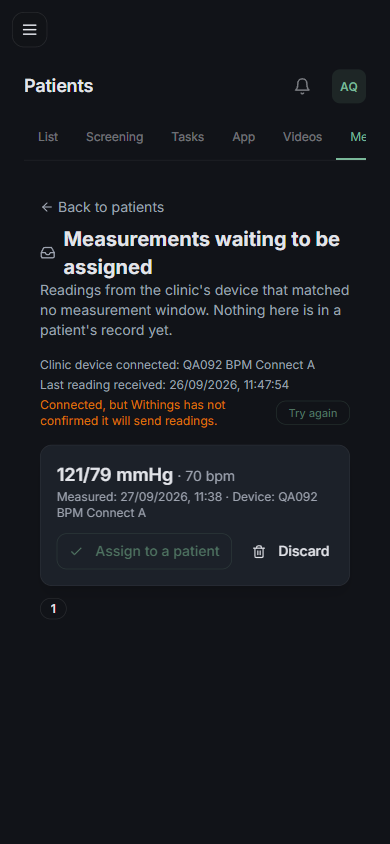
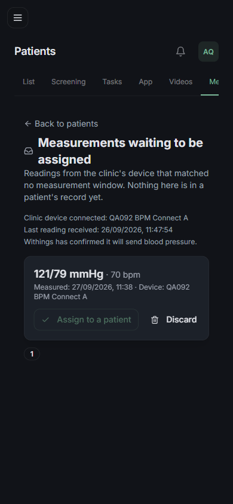
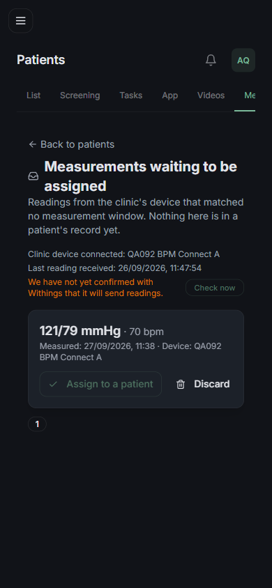

# QA Report — Atividade 092

**Data:** 27/09/2026
**Servidor:** `http://localhost:4141` (Next dev). Confirmado que é **este** worktree antes de qualquer medição:

```
PID 52060  node .../app_clinic/node_modules/next/dist/server/lib/start-server.js
PARENT     node .../app_clinic/node_modules/.bin/../next/dist/bin/next dev -p 4141
```

**Banco:** `postgresql://…@localhost:5432/bpr_clinic_local`. Nenhum `db push`, `migrate` ou DDL manual. Só linhas `QA092`, todas removidas (ver **Limpeza**).

**Resultado geral:** ⚠️ **aprovado com ressalvas**

**24 passaram · 2 reprovaram · 13 não executados.**

T-1 e T-4 passaram **inteiras**. As duas reprovações estão fora do roteamento: uma é T-3, que ainda não foi implementada; a outra é um achado novo no middleware.

> **Nota de 27/09, depois do relatório:** os dois reprovados e mais dois achados foram corrigidos na
> mesma tarde — ver **O que foi feito depois deste relatório**, no fim.

### Versão medida

O código foi reescrito quatro vezes durante o QA (review de 27/09). Esta rodada é a definitiva, feita **depois** de a sessão principal congelar tudo:

```
lib/withings-routing.ts                                sha1=8dbfb41beba2  mtime=11:45:57Z
lib/clinic-device.ts                                   sha1=200c9e73fdeb  mtime=11:03:39Z
lib/withings-ingest.ts                                 sha1=2b344fce5b59  mtime=11:03:47Z
app/api/wearables/withings/webhook/route.ts            sha1=d03772d5b2f1  mtime=11:04:20Z
app/api/admin/measurement-sessions/[id]/fetch/route.ts sha1=0c142aa9bed0  mtime=11:03:25Z
app/api/admin/measurement-sessions/route.ts            sha1=60b80fdc9229  mtime=09:44:11Z
prisma/schema.prisma                                   sha1=a52de2e70e5a  mtime=10:50:09Z
                                                       (lido em 11:10:31Z)
```

---

## Resumo

✅ passou · ❌ reprovou · ⏸️ não executado

### T-1 — O webhook para de sortear

| # | cenário | tipo | |
|---|---|---|---|
| 1.1 | clínica, sessão aberta → paciente da sessão | banco | ✅ |
| 1.2 | clínica, sem sessão → caixa, nunca o dono | banco | ✅ |
| 1.3 | pessoal cuja conta **também** é da clínica → não grava pressão | banco + ingest | ✅ |
| 1.4 | pessoal de conta que **não** é da clínica → prontuário do dono | banco + ingest | ✅ |
| 1.5 | duas sessões abertas → caixa, `ambiguous` | banco | ✅ |
| 1.6 | pessoal sem `providerUserId` → grava normal | banco + ingest | ✅ |
| 1.7 | `providerUserId` desconhecido → `{"status":0}`, nada gravado | HTTP | ✅ |
| 1.8 | clínica e pessoal casando → escolhe a da clínica, sempre | banco | ✅ |
| 1.9 | `ignoraPressao` é **chamada** pelo ingest, não reimplementada | código + comportamento | ✅ |

### T-2 — "Já medi — busca agora"

| # | cenário | tipo | |
|---|---|---|---|
| 2.1 | medir e tocar no botão → traz a leitura | API | ⏸️ exige token Withings válido |
| 2.2 | tocar sem ter medido → "nenhuma leitura nesta janela" | API | ⏸️ idem |
| 2.3 | aparelho desconectado → 409 `device_disconnected` | API | ✅ |
| 2.4 | sessão de outra clínica → 404 | API | ✅ |
| 2.5 | sem sessão de equipe → 401 | API | ❌ devolve **307** |
| 2.6 | webhook + botão → uma leitura só | API | ⏸️ exige webhook real |
| 2.7 | cancelar a sessão → janela fecha, leitura posterior não entra | API + banco | ✅ |
| *novo* | janela vencida → 409 `session_closed`, **antes** da Withings | API | ✅ |
| *novo* | provedor fora → 502 `provider_unavailable` | API | ✅ |

### T-3 — Descarte faz barulho

| # | cenário | tipo | |
|---|---|---|---|
| 3.1a | conexão não conectada → continua `status: 0`, não grava | HTTP | ✅ |
| 3.1b | …**e registra o motivo** | HTTP | ❌ nada registra |
| 3.2 | painel mostra estado e quando chegou a última leitura | API + tela | ✅ |
| 3.3 | a caixa diz de que aparelho veio e quando | API + tela | ✅ |

### T-4 — O índice que não protegia

| # | cenário | tipo | |
|---|---|---|---|
| 4.1 | `migrate diff` não propõe nada | CLI | ✅ |
| 4.2 | schema sem `(provider, providerUserId, userId)` nem `(provider, providerUserId)` | código + banco | ✅ |
| 4.3 | schema explica a trava certa (`isClinicDevice`) e por que não está lá | código | ✅ |
| 4.4 | duas pessoais na mesma conta → permitido, e **as duas** ignoram | banco | ✅ |

### T-5 / T-6 / T-7 / T-8 / Fora de tarefa

| # | | |
|---|---|---|
| 5.1–5.4, 5.6 | videochamada | ⏸️ **não implementada** — só `DAILY_API_KEY` no `.env`, sem `VIDEO_CALLS_ENABLED` e sem código |
| 5.5 | a chave da Daily não vaza | ✅ estático (ver Achado 5) |
| 6.x, 7.x | tema, pagamento £1 | ⏸️ sem cenários na spec |
| 8.1, 8.2 | push de quem se cuida | ⏸️ app RN |
| A.1–A.3 | Face ID | ⏸️ app RN |
| A.4, A.5 | bolinhas do calendário | ⏸️ visual no aparelho (números no Achado 4) |
| A.6 | recado de voz | ⏸️ app RN (ver Achado 5) |

---

## Detalhes com evidência

### T-1 — 1.1 a 1.6, chamando o código de verdade

Montei no Postgres local duas `WearableConnection` WITHINGS com o **mesmo** `providerUserId` (`QA092-CONTA-COMPARTILHADA`) — uma `isClinicDevice: true` + `clinicId`, outra `isClinicDevice: false` de um paciente de teste — e chamei `attributeClinicReading` por script (`npx tsx`), com e sem `ClinicMeasurementSession` aberta. Cada cenário com o seu `withingsMeasureId` e o banco limpo entre um e outro.

```
PASSOU | 1.1 | outcome={"kind":"assigned","patientId":"cmujpw85g0005xzp8tssg3ppe",
               "readingId":"cmujpw879000pxzp8yqf1il3w","sessionId":"cmujpw865000nxzp8z80j6dmh"}
             | row={"patientId":"cmujpw85g0005xzp8tssg3ppe","source":"CLINIC_DEVICE",
               "context":"PRE_SESSION","method":"CLINIC_DEVICE","recordedById":"cmujpw85c0003xzp8q9jo1k0m"}
             | patientId==PacienteA:true

PASSOU | 1.2 | outcome={"kind":"unassigned","reason":"no-session","id":"cmujpw8gd000wxzp8to2p2scy"}
             | caixa={"id":"cmujpw8gd000wxzp8to2p2scy","clinicId":"cmujpw8560000xzp8s6es99wf",
               "connectionId":"cmujpw8g8000sxzp8eomb4hfi","systolic":118,"diastolic":76,
               "measuredAt":"2026-09-27T11:10:31.882Z","receivedAt":"2026-09-27T11:10:31.886Z"}
             | prontuario do dono=0 leitura(s)

PASSOU | 1.5 | outcome={"kind":"unassigned","reason":"ambiguous","id":"cmujpw8hp001exzp8kw67axlw"}
             | naCaixa=1 | prontuario do dono=0 (o dono existia e nao venceu)
```

**1.2 é o atalho derrubado, e passou pelo motivo certo:** a conexão pessoal do dono **existia** e a leitura foi para a caixa mesmo assim. `prontuario do dono=0` é a asserção que importa — contei o prontuário dele inteiro, não só a medida deste cenário. O mesmo em 1.5: com duas janelas abertas e um dono disponível, a ambiguidade não virou palpite em favor dele.

### T-1 — 1.3 e 1.4: o par que prova que a regra está no caminho do ingest

Este é o desenho de que mais gostei, porque as duas metades se provam uma contra a outra. Selei os tokens com `seal()` (a chave sai de `NEXTAUTH_SECRET`), então `withingsAccessToken` abre sem chamar ninguém, e o que decide se há requisição é **só** a regra.

```
PASSOU | 1.3 | contaTambemEhDaClinica=true ignoraPressao=true
             | ingestWithings(kinds:["bp"]) -> {"bloodPressure":0,"bloodPressureRead":0,
               "activityDays":0,"sleepNights":0,"vitalsDays":0,"ecgRecords":0}
             | prontuario do dono=0 (a busca nem saiu: por isso nao deu erro de token)

PASSOU | 1.4 | contaTambemEhDaClinica=false ignoraPressao=false
             | o ingest TENTOU buscar (Withings connection needs to be reauthorised)
               -> prova de que o bp nao foi filtrado
             | saveBloodPressure=1 row={"patientId":"cmujpw85q000dxzp8lp82px9f",
               "source":"PATIENT_DEVICE","context":"HOME"} | naCaixa=0
```

Leia as duas linhas juntas. Em 1.3 o `ingestWithings` **retornou limpo** com `bloodPressureRead: 0` — não houve erro de token porque a busca nunca foi tentada. Em 1.4, com a mesma função e um token que não abre, ele **levantou erro** — e o erro é a evidência de que ali o `bp` continuava na lista de coisas a buscar. Ou seja: o filtro não é só uma variável calculada, ele muda o que sai para a rede.

**1.6** fecha a terceira ponta — `providerUserId: null` → `ignoraPressao=false` → o ingest tentou buscar. "Na dúvida, não se cala" está implementado como está escrito.

### T-1 — 1.9, a regra num lugar só

```
lib/withings-ingest.ts:9    import { ignoraPressao } from "@/lib/withings-routing";
lib/withings-ingest.ts:233  const pulaPressaoDaClinica = ignoraPressao({
--- alguma reimplementacao inline sobrou? ---
   nenhuma
```

Confirmado, e 1.3/1.4 são a prova comportamental de que a chamada é a que decide, não um enfeite.

### T-1 — 1.7 e 1.8, pelo webhook HTTP

```
PASSOU | 1.7 | HTTP 200 body={"status":0} | caixa 0->0 bp 60->60
PASSOU | 1.8 | 30 consultas com a query do webhook -> 1 conexao(oes) distinta(s),
               e a da clinica=true [clinica=cmujpw9oh001qxzp8y56dj2m9 pessoal=cmujpw9oi001sxzp8sgflkktn]
```

Contei `UnassignedMeasurement` e `BloodPressureReading` antes e depois de cada chamada: nada entrou, e a resposta foi exatamente `{"status":0}`.

**Uma honestidade sobre 1.8:** o `orderBy` faz o que promete, mas quando rodei a mesma consulta **sem** ele, o Postgres também devolveu sempre a mesma linha em 25 tentativas. Com duas linhas numa tabela pequena o plano é estável. O sorteio do `findFirst` sem ordenação é real — não existe garantia nenhuma, e é isso que o conserto elimina — mas eu **não consegui provocá-lo** aqui. Quem quiser a prova precisa de uma tabela grande o bastante para o planner mudar de ideia.

### T-2 — os três consertos novos do review

```
PASSOU | 2.3 | HTTP 409 body={"error":"The device is not connected. Reconnect it in Settings.",
               "errorPt":"O aparelho não está conectado. Reconecte em Configurações.",
               "code":"device_disconnected"}

PASSOU | 2.4 | sessao da clinica B -> HTTP 404 body={"error":"Not found"}

PASSOU | 2.7 | botao na sessao cancelada -> HTTP 409 {"error":"This measurement window is closed.
               Open a new one and measure again.","errorPt":"Esta janela de medição está fechada.
               Abra outra e meça de novo.","code":"session_closed","status":"CANCELLED"}
             | leitura posterior: outcome={"kind":"unassigned","reason":"no-session"}
               no PacienteA=0 naCaixa=1

PASSOU | T-2 novo: provider_unavailable | token que nao abre -> HTTP 502
               body={...,"code":"provider_unavailable"}

PASSOU | T-2 novo: janela vencida recusa ANTES da Withings | HTTP 409
               {...,"code":"session_closed","status":"OPEN"}
               (502 aqui significaria que foi a Withings primeiro)
```

Duas coisas que vale destacar:

**2.4 é o teste de vazamento.** A sessão da Clínica B respondeu **igual a inexistente** para o admin da Clínica A — 404 com `{"error":"Not found"}`, sem confirmar que existe.

**A ordem do `session_closed` é verificável, e verifiquei.** No último caso montei uma sessão vencida **e** troquei o token por um que não abre. Se a rota fosse à Withings antes de checar a janela, eu receberia 502. Recebi 409 `session_closed` com `status:"OPEN"` — a recusa vem antes, como o comentário do código promete.

**2.7 tem duas metades e as duas passaram:** o botão recusa (409) *e* uma leitura que caia dentro daquele intervalo de tempo não entra na sessão cancelada — foi para a caixa, com `no PacienteA=0`.

### T-3 — 3.2 e 3.3

```
PASSOU | 3.2 | HTTP 200 | lastReadingAt=2026-09-26T11:10:34.732Z checkedAt=2026-09-26T11:10:34.732Z
               confirmedAppli=[4,1] delivery=partial silent=false daysSilent=1
PASSOU | 3.2-bis (nenhum token vaza) | chaves devolvidas: id,label,delivery,daysSilent,silent,
               lastReadingAt,checkedAt,confirmedAppli
PASSOU | 3.3 | HTTP 200 count=2 | item={"id":"cmujpwcdf0028xzp8quac2pyc","systolic":121,
               "diastolic":79,"heartRate":70,"measuredAt":"2026-09-27T11:00:36.963Z",
               "receivedAt":"2026-09-27T11:10:36.964Z","connection":{"deviceLabel":"QA092 BPM Connect"}}
```

Os três campos que T-3 pede estão lá. Conferi a **lista de chaves**, não só a ausência de erro: nenhum token sai na resposta. A caixa devolve `measuredAt` **e** `receivedAt` — fatos diferentes, os dois necessários.

### T-3 — a tela, nos três estados de entrega

Logado como admin da QA092 Clínica A, com uma leitura plantada na caixa.



A linha da leitura diz o que 3.3 pede, junto:

> `121/79 mmHg · 70 bpm`
> `Measured: 27/09/2026, 11:38 · Device: QA092 BPM Connect A`

E o cartão do aparelho, o que 3.2 pede:

> `Clinic device connected: QA092 BPM Connect A`
> `Last reading received: 26/09/2026, 11:47:54`

Exercitei os três estados mexendo em `notifyConfirmedAppli`/`notifyCheckedAt` e recarregando:

| estado | o que a tela diz |
|---|---|
| `partial` (`[4,1]`) | âmbar: "Connected, but Withings has not confirmed it will send readings." + **Try again** |
| `receiving` (`[4,1,16,44]`) | verde: "Withings has confirmed it will send blood pressure." |
| `unchecked` (`checkedAt` null) | "We have not yet confirmed with Withings that it will send readings." + **Check now** |




Isto confirma a correção que o código anuncia: os quatro estados agora dizem algo, e "está tudo certo" deixou de ser visualmente igual a "não fazemos ideia". **Mas** `partial` mente para um manguito — Achado 2.

**Console:** nenhum erro e nenhum warning na página (0 de 13 mensagens), em todas as recargas.

### T-4

```
$ npx prisma migrate diff --from-schema-datasource prisma/schema.prisma \
    --to-schema-datamodel prisma/schema.prisma --script
-- This is an empty migration.
```

4.1 ✅. E confirmei no banco, por `pg_indexes`, que o índice não existe de fato nem lá:

```
PASSOU | 4.2-banco | unicos no banco: WearableConnection_pkey,
                     WearableConnection_terraUserId_key, WearableConnection_userId_provider_key
PASSOU | 4.3 | o bloco cita a trava certa (isClinicDevice)=true e explica o db push=true
PASSOU | 4.4 | 3 conexoes na mesma conta (pessoal1=cmujpw8im001mxzp8vnr0z7lb
               pessoal2=cmujpw8ip001oxzp82dfs7oca) | as pessoais ignoram=true
             | a da clinica nao ignora=true
```

**4.2 — e um erro meu que vale registrar.** Meu primeiro teste reprovou este cenário: o regex achou `@@unique([provider, providerUserId, userId])` no schema. Falso positivo — a string existe só num comentário `///`, justamente o que explica por que o índice **não** está lá. Conferindo o que é declaração e o que é texto:

```
$ awk '/^model WearableConnection /,/^}/' prisma/schema.prisma | grep -nE "@@unique|provider, providerUserId"
64:  /// Tentei acrescentar `@@unique([provider, providerUserId, userId])` na 092
71:  /// `(provider, providerUserId, isClinicDevice)`. Ela não está aqui de
78:  @@unique([userId, provider])
```

Uma única declaração, e é `[userId, provider]`. **4.2 passa.** É a armadilha que o helper `lerCodigo` do projeto existe para evitar, e eu caí nela — anoto para o próximo QA não repetir.

**4.4 é o cenário que justifica a ausência do índice, e o mais interessante de T-4:** três conexões para a mesma conta Withings, duas pessoais, **nenhuma** delas grava pressão. O roteamento não depende de unicidade nenhuma — então a trava que não existe também não é necessária.

### Testes unitários

```
$ npx jest __tests__/wearables/
Test Suites: 7 passed, 7 total
Tests:       89 passed, 89 total
```

---

## Achados

### Achado 1 — o descarte continua silencioso (3.1b) ❌

**Gravidade: média.** É o defeito que T-3 existe para consertar, e T-3 está `pendente` — então é "ainda não feito", não "feito e quebrado". Registro porque 3.1 é a metade que falta para T-1 estar completa em observabilidade.

`app/api/wearables/withings/webhook/route.ts`:

```ts
if (!connection || connection.status !== "CONNECTED") return ok();
```

Um `return` seco. Sem `console.warn`, sem `logAudit`, sem `systemLog`. Medi:

```
PASSOU   | 3.1a (responde status 0 e nao grava) | HTTP 200 body={"status":0} | caixa 0->0 bp 60->60
REPROVOU | 3.1b (registra o motivo) | SystemLog delta=0 | AuditLog para a conexao=0
```

O efeito é a pior falha que esta rota pode ter: a Withings recebe `{"status":0}` e fica contente, a leitura é jogada fora, e **não existe lugar nenhum onde alguém descubra isso**. É plausivelmente o "Problema 1" que o `plan.md` diz não ter diagnóstico.

**Onde olhar:** o mesmo `return ok()`. `lib/system-logger.ts` já tem `logAudit` e `systemLog`.

### Achado 2 — o painel diz "a Withings não confirmou" para um manguito que ela confirmou

**Gravidade: média.** Achado novo, não está em cenário nenhum, e morde justamente a tela que T-3 acabou de melhorar.

`app/admin/measurements/inbox/page.tsx:315`:

```tsx
{(device.delivery === "silent" || device.delivery === "partial") && (
  <span>{ui.deviceSilent}</span>   // "Connected, but Withings has not confirmed it will send readings."
)}
```

E `deliveryState` devolve `partial` quando falta **qualquer** um dos quatro `appli` de `WITHINGS_APPLI_WE_WANT` — que inclui `ACTIVITY` (16) e `SLEEP` (44).

Um BPM Connect não produz passos nem sono. Então, para o manguito da recepção, `partial` é o estado **normal e permanente**, e a tela vai dizer para sempre que a Withings não confirmou — mesmo com a pressão (`appli` 4) confirmada. Medi as duas pontas:

| `notifyConfirmedAppli` | `deliveryState` | o que a tela diz |
|---|---|---|
| `[4, 1]` (o que um manguito dá) | `partial` | âmbar: "has not confirmed it will send readings" |
| `[4, 1, 16, 44]` | `receiving` | verde: "has confirmed it will send blood pressure" |

Alarme permanente é pior que nenhum alarme: treina a clínica a ignorá-lo, e o dia em que a pressão realmente não estiver confirmada passa batido.

**A predicada certa já existe e não é usada aqui.** `lib/withings-subscriptions.ts:171` tem `bloodPressureMissing()`, com o comentário *"Whether blood pressure specifically is not coming — the one that matters here"*. Ela é chamada em `app/api/wearables/connections/route.ts:61` e em nenhum outro lugar — nem em `/api/admin/measurement-sessions`, nem na tela.

**Onde olhar:** `app/admin/measurements/inbox/page.tsx:315` e o objeto `device` de `app/api/admin/measurement-sessions/route.ts` (pode devolver `missingBloodPressure`, como a outra rota já faz).

### Achado 3 — o 401 de T-2 é inalcançável: o middleware responde 307 antes (2.5) ❌

**Gravidade: média.** A rota está certa; quem não deixa é a camada de cima.

```ts
const actor = await getSessionStaffActor(req);
if (!actor) return NextResponse.json({ error: "Unauthorized" }, { status: 401 });
```

Mas nenhum chamador sem sessão chega lá:

```
$ curl -s -i -X POST http://localhost:4141/api/admin/measurement-sessions/<id>/fetch
HTTP/1.1 307 Temporary Redirect
location: /login?callbackUrl=%2Fapi%2Fadmin%2Fmeasurement-sessions%2F…%2Ffetch
```

O mesmo vale para o `GET /api/admin/measurement-sessions` de T-3. `middleware.ts` casa `/api/admin` (matcher na linha 574, tratamento na 291) e redireciona.

Por que importa, e não é só o número: quem consome isto é `fetch()` de uma tela. Um 307 é **seguido** pelo cliente, que recebe 200 e o HTML do `/login` — então o botão tenta `res.json()` num documento HTML, e o erro que a terapeuta vê não é "sua sessão expirou", é um erro de parse. Um 401 seria tratável, e o esforço de hoje em dar `code` e `errorPt` a cada falha morre nesse caso.

**Onde olhar:** `middleware.ts` — rotas `/api/**` deviam responder 401/403 em JSON em vez de redirecionar; o redirect faz sentido para páginas. Há precedente no próprio arquivo: as linhas 163–164 listam `/api/admin/maintenance` e `/api/admin/backup` como exceções.

### Achado 4 — as bolinhas do calendário ficaram **piores** no tema claro (A.4 / A.5)

**Gravidade: baixa, mas é contra-intuitiva.** Calculei a razão de contraste WCAG de cada token contra o fundo do seu tema. O mínimo para elemento não-textual é **3:1**.

| tema | token | cor | contraste | |
|---|---|---|---|---|
| claro | `agendaLivre` (novo) | `#2F8F5B` | **3,67:1** | passa |
| claro | `agendaQuaseCheio` (novo) | `#C07A16` | **3,16:1** | passa, no limite |
| claro | `ok` (o antigo) | `#55705F` | 4,93:1 | — |
| claro | `warn` (o antigo) | `#826637` | 4,89:1 | — |
| escuro | `agendaLivre` (novo) | `#63D39B` | **9,19:1** | passa |
| escuro | `agendaQuaseCheio` (novo) | `#E8B45F` | **9,03:1** | passa |
| escuro | `ok` (o antigo) | `#84A791` | 6,43:1 | — |
| escuro | `warn` (o antigo) | `#C6A26A` | 7,13:1 | — |

Duas coisas que os números dizem e o plano não:

1. **No escuro os tokens antigos já passavam de 3:1** (6,43 e 7,13). O diagnóstico do `plan.md` — *"escuras e dessaturadas de propósito, e por isso invisíveis como ponto de 5px no escuro"* — não é sustentado pela razão de contraste. O que provavelmente resolveu foi o **tamanho** (5px → 7px) e a saturação.
2. **No claro o token novo é pior que o que substituiu:** 3,67 contra 4,93, e 3,16 contra 4,89. O âmbar `agendaQuaseCheio` a **3,16:1** é a margem mais fina do conjunto — 5% acima do piso.

Nada reprovou; os quatro passam. Mas **A.5 (tom claro) merece mais atenção que A.4** — o inverso do que a spec sugere.

**Onde olhar:** `mobile/src/theme/index.ts` linhas 159–160 (claro) e 234–235 (escuro); `mobile/src/components/CalendarioDeAgenda.tsx` linhas 296–310.

### Achado 5 — dois alarmes falsos que eu persegui, para ninguém repetir o caminho

**A chave da Daily (5.5).** `DAILY_API_KEY` está no `.env` e **nenhuma linha de código a lê** — `grep` em todo `*.ts`/`*.tsx`/`*.json` fora de `node_modules` não devolve nada, e ela não existe como `NEXT_PUBLIC_*` nem `EXPO_PUBLIC_*`. 5.5 passa, mas por um motivo que não conta como mérito: a videochamada não foi implementada. **Quando T-5 chegar, este cenário precisa ser refeito.**

**Os erros do Expo no console.** O bundler em `:8082` reportava dois erros deste worktree: `Unterminated JSX contents` em `mobile/app/(app)/(lab)/(tabs)/index.tsx:211` e `Unable to resolve module @/components/AudioDaMensagem` em `mobile/app/(app)/(clinica)/messages.tsx:28`. O segundo assustou, porque é exatamente o componente de A.6. Conferi:

```
$ node -e "babel.parseSync(...)"
OK parse  app/(app)/(lab)/(tabs)/index.tsx
OK parse  app/(app)/(clinica)/messages.tsx
$ ls mobile/src/components/AudioDaMensagem.tsx   -> existe
```

Os dois arquivos parseiam e o componente existe em `mobile/src/components/`. São erros **obsoletos** de HMR, de antes de o arquivo ser criado, que o bundler segurou em cache — o mesmo padrão já conhecido do Next dev.

**Recomendação:** antes de testar A.6 no aparelho, reiniciar o bundler do Expo. Se esses erros voltarem num bundler novo, então é defeito de verdade e o app não sobe.

---

## O que falta para T-1..T-4 fecharem

1. **T-1 e T-4 estão prontas** do ponto de vista de QA: 9 de 9 e 4 de 4 exercitados de verdade contra o banco. A única pendência de T-1 é 3.1b, que é T-3.
2. **T-3 implementada** resolve 3.1b (Achado 1). Considere o Achado 2 na mesma passada — é a mesma tela.
3. **T-2 tem uma ressalva não-bloqueante** (2.5 / Achado 3) e três cenários que dependem de credencial: **2.1, 2.2, 2.6** precisam de uma conta Withings de teste com token válido, ou do Bruno medindo no manguito com a tela aberta. Não há como simular a resposta da Withings sem inventar dados, e inventar dados aqui seria dizer que passou sem ter passado.
4. **Telas do app** (8.x, A.1–A.6): Bruno com o telefone. E se for medir em prod, confirmar o commit pela lista de deployments do Coolify — o que está no ar ainda não tem os consertos de hoje.

---

## Limpeza

Tudo prefixado `QA092` / `qa092-`. **Nenhum paciente, clínica ou conexão real foi lido, alterado ou usado.** Nenhum `db push`, `migrate` ou DDL.

Criado durante os testes: 2 `Clinic` (`qa092-teste-clinic-a/-b`), 8 `User` (`qa092-*@example.com`, entre eles um ADMIN com senha bcrypt para o login), até 3 `WearableConnection` por cenário (`providerUserId` começando com `QA092`), `ClinicMeasurementSession`, `UnassignedMeasurement` e `BloodPressureReading` de teste (`withingsMeasureId` começando com `QA092-`).

Verificação final, por consulta direta ao banco:

```
VERIFICACAO FINAL: {"clinicas_qa092":0,"usuarios_qa092":0,"conexoes_qa092":0,
                    "leituras_qa092":0,"caixa_qa092":0}
OK - nada de QA092 restou no banco
```

Os scripts de QA viveram em `.qa092/` (fora de `app/`, então o Next não os compilou) e **foram removidos** no fim. Os artefatos do Playwright ficam em `.playwright-mcp/`, que já está no `.gitignore`.

O único arquivo novo que vale versionar são os três screenshots em `qa/screenshots/`.

---

## O que foi feito depois deste relatório

Escrito em 27/09/2026, à tarde, pela sessão principal. Os dois reprovados e dois dos achados
foram corrigidos na mesma sessão; os testes que guardam cada conserto estão indicados.

| achado | conserto | teste |
|---|---|---|
| **1** (3.1b ❌) | o `return ok()` seco virou `logSystem` com nível WARN, categoria API, o motivo (`conta desconhecida` × `conexão <status>`) e um campo `esperado` que separa a assinatura órfã do defeito real. O log que falha não derruba a resposta à Withings | `__tests__/wearables/o-descarte-e-o-401.test.ts` |
| **3** (2.5 ❌) | `middleware.ts`: sem token e `pathname` começando com `/api` → **401 em JSON** com `code: 'session_expired'` e `errorPt`. Página continua indo ao `/login` | idem, com asserção de **ordem** (o 401 antes do redirect) |
| **2** | `deliveryState(conn, { soPressao: true })`, pedido pelo painel da clínica: num manguito, pressão confirmada é `receiving`. Pressão faltando continua `partial` — o alarme que serve. As telas do paciente seguem pedindo tudo | idem, 7 cenários |
| **4** | `agendaLivre` `#2F8F5B` → **`#25784A`** (3,67 → 4,94:1) e `agendaQuaseCheio` `#C07A16` → **`#9A5F0E`** (3,16 → 4,75:1). Volta ao contraste de antes mantendo a saturação; o escuro não muda | `__tests__/mobile/tema-claro-escuro.test.ts` |

Depois dos quatro: **`npx jest` → 1595 passed, 118 suites**; `tsc --noEmit` sem erro nos arquivos
tocados.

### E uma coisa que o Achado 4 destapou, e que não foi consertada

Escolher duas cores com o **mesmo contraste** contra o mesmo fundo dá a elas, por construção, quase
a mesma luminância — o par novo mede 1,04:1 entre si. E o ponto colorido é a **única** coisa na
célula que diz se há vaga (`CalendarioDeAgenda.tsx`: *"ela e a unica coisa na celula que diz se ha
vaga"*). Para quem não distingue verde de âmbar, dois pontos de mesmo brilho são o mesmo ponto.

Isso **já valia** para `ok`/`warn` (4,93 e 4,89) — não é regressão desta atividade. A saída é um
segundo canal: forma, anel, ou o número de vagas. É decisão de produto, anotada para o Bruno, não
consertada por conta própria.
