# QA — 102 T-8: o que o profissional devolve (receita e documento)

**Data:** 29/09/2026
**Veredito:** ✅ **aprovado** — 30 de 31 cenários medidos passaram. Os achados 1, 2
e 3 foram corrigidos pela sessão principal e **remedidos** (§14). Resta **1
cenário não medido**: a tela do app do paciente (§8.5).
**Duas rodadas:** a primeira em 29/09 às 02h (§0 a §13); a remedição dos
achados, na mesma noite, em §14.
**Onde:** local, worktree `app_clinic`, banco local `bpr_clinic_local`.
**Tokens e cookies:** nenhum valor neste relatório — só tamanho, `code` e status.

---

## 0. Qual checkout serviu a porta

Medido antes de qualquer outra coisa, porque medir o servidor errado já
aconteceu aqui.

```
netstat -ano | grep 4011
  TCP  0.0.0.0:4011  LISTENING  17924

PID 17924 -> C:\Users\bruno\orca\workspaces\clinic\app_clinic\node_modules\next\...\start-server.js
PID 4924 (pai) -> ...\app_clinic\node_modules\.bin\..\next\dist\bin\next dev -p 4011
```

E a `:4000`, que **não** foi tocada:

```
PID 52568 -> C:\Users\bruno\Documents\clinic\node_modules\next\...\start-server.js
```

Duas precauções a mais, pela regra de "dois QA em paralelo colidem":

- o navegador do Playwright trabalhou em **`127.0.0.1:4011`**, não em
  `localhost:4011`. Cookie é por **host**, não por porta: entrar como o admin de
  teste em `localhost` teria derrubado a sessão de quem estiver usando a `:4000`.
  Havia mesmo uma sessão viva ali (`QA095B Clinica · Admin`), e ela continuou de pé.
- o Expo (`:8081`, PID 22960) é deste worktree mas foi iniciado por outra
  sessão. **Não foi reiniciado** — ver a ressalva 8.5.

## 1. Paciente e inquilinos de teste

Nenhum dado real. Tudo com prefixo `QA102T8` e e-mail `@example.com`.

| papel | quem | inquilino | registro na clínica |
|---|---|---|---|
| **paciente de teste** | `Qa102t8 Paciente Teste` · `qa102t8.paciente@example.com` | QA102T8 Clinica A | — |
| paciente 2 (só para o cenário 7) | `Qa102t8 Paciente Dois` · `qa102t8.paciente2@example.com` | QA102T8 Clinica A | — |
| clínica que cuida | `Qa102t8 AdminA` | A (`CLINIC`) | CREFITO QA-CREFITO-111111 |
| médico externo **sem** registro | `Beto SemRegistro` | B (`DOCTOR`) | **nenhum** |
| médico externo **com** registro | `Carla ComRegistro` | C (`DOCTOR`) | CRM QA-CRM-654321 |
| médico externo **sem vínculo** | `Dora SemVinculo` | D (`DOCTOR`) | CRM QA-CRM-999999 |

B e C alcançam o paciente por **vínculo de cuidado vivo** (T-3), semeado direto
na tabela como o webhook da Stripe faria. D não tem vínculo — é o controle
negativo.

---

## 2. Resumo

| # | cenário | tipo | resultado |
|---|---|---|---|
| 1.1 | POST nasce com `sentAt: null` | API | ✅ |
| 1.2 | o paciente **não** vê o rascunho | API | ✅ |
| 2.1 | `PRESCRIPTION` sem registro → 400 `registry_required` | API | ✅ |
| 2.2 | `REPORT` sem registro → 400 `registry_required` | API | ✅ |
| 2.3 | `EXAM_REQUEST` sem registro → 400 `registry_required` | API | ✅ |
| 2.4 | `PRESCRIPTION` com registro → cria, assinatura com nome + registro | API | ✅ |
| 3.1 | `GUIDANCE` sem registro → cria | API | ✅ |
| 3.2 | `kind` inválido / título vazio / corpo vazio → 400 | API | ✅ |
| 3.3 | sem sessão → 401 | API | ✅ |
| 4.1 | `/send` → o paciente passa a ver | API | ✅ |
| 4.2 | segundo toque no mesmo `/send` → 404 `not_sendable` | API | ✅ |
| 4.3 | enviar rascunho **encerrado** → 404 `not_sendable` | API | ✅ |
| 5.1 | DELETE sem `reason` (e com `reason` em branco) → 400 `reason_required` | API | ✅ |
| 5.2 | DELETE com motivo → 200, paciente continua vendo com `revokedAt`/`revokedReason` | API | ✅ |
| 5.3 | a linha **não** foi apagada do banco | banco | ✅ |
| 5.4 | segundo DELETE no mesmo documento → 404 | API | ✅ |
| 6.1 | lista de B não traz documento de A nem de C | API + UI | ✅ |
| 6.2 | `/send` de B sobre documento de A → **404**, não 403 | API | ✅ |
| 6.3 | DELETE de B sobre documento de A → **404** | API | ✅ |
| 6.4 | inquilino **sem vínculo** (D): GET/POST/send/DELETE → **404** | API | ✅ |
| 6.5 | vínculo **encerrado**: C perde a lista e o próprio rascunho → **404** | API | ✅ |
| 7.1 | `appointmentId` válido (mesmo paciente, mesmo inquilino) → gravado | API | ✅ |
| 7.2 | `appointmentId` de outro paciente / outro inquilino / inexistente / objeto → **nulo** | API | ✅ |
| 8.1 | UI: card, prévia com logo, dois botões, "Close this" | UI | ✅ |
| 8.2 | UI: rascunho salvo e não enviado **não tinha como ser enviado** | UI | ❌ achado 1 — **corrigido, ver §14** |
| 14.1 | rascunho salvo entra na lista **sem reload**, com os dois botões | UI | ✅ |
| 14.2 | depois de **recarregar**, a linha Draft mantém os dois botões | UI | ✅ |
| 14.3 | "Send this" na linha → vira Sent, paciente vê, sobra só "Close this" | UI | ✅ |
| 14.4 | "Discard this" → rótulo de descarte, e depois **nenhum botão** | UI | ✅ |
| 14.5 | trocar o `Kind` depois de salvar não perde mais o rascunho | UI | ✅ |
| 14.6 | console sem erro na tela | UI | ✅ |
| 8.3 | tela do app do paciente | app | ⚠️ **não medido** |

**Erros de console:** nenhum na tela `/admin/patients/<id>/documents`
(0 erros, 0 avisos). Dois erros fora do escopo desta tarefa — ver §9.

---

## 3. Detalhes — a regra "nada sai sozinho"

### 3.1 O POST nasce rascunho, e o paciente não vê ✅

```
POST /api/admin/patients/<paciente>/professional-documents   (sessão do admin A)
{"kind":"GUIDANCE","title":"QA102T8 orientacao inicial","body":"Beber agua e alongar 10 minutos por dia."}

HTTP 200
{"document":{"id":"cmum0sbjy…","kind":"GUIDANCE","signerName":"Qa102t8 AdminA",
 "registryKind":"CREFITO","registryNumber":"QA-CREFITO-111111",
 "appointmentId":null,"sentAt":null,"revokedAt":null,…}}
```

E, no mesmo segundo, pelo bearer do app do paciente:

```
GET /api/patient/professional-documents   ->  HTTP 200   {"documents":[]}
```

`sentAt: null` e lista vazia. **A criação não entrega nada.**

### 3.2 O botão entrega — uma vez só ✅

```
POST …/<docId>/send        HTTP 200   {"sent":true}

GET /api/patient/professional-documents   HTTP 200
  [{"title":"QA102T8 orientacao inicial",
    "signature":"Qa102t8 AdminA · CREFITO QA-CREFITO-111111",
    "from":"QA102T8 Clinica A","sentAt":"2026-09-29T01:51:00.115Z","revokedAt":null}]

POST …/<docId>/send   (segundo toque)
  HTTP 404   {"code":"not_sendable","error":"That document is not waiting to be sent."}
```

A idempotência é real e por `where`, não por estado de tela: o `sentAt: null`
na cláusula é o que faz o segundo toque não achar linha nenhuma. O telefone
não toca duas vezes pela mesma receita.

### 3.3 Um rascunho **encerrado** também não sai ✅

```
POST   …/professional-documents         -> 200 (rascunho novo)
DELETE …/<docId>/send {"reason":"rascunho descartado - QA102T8"} -> 200 {"revoked":true}
POST   …/<docId>/send                   -> 404 {"code":"not_sendable"}
GET    /api/patient/professional-documents -> n=1 (o rascunho encerrado NAO aparece)
```

O `revokedAt: null` no `where` do `/send` segura isso. E o paciente não vê um
rascunho que nunca foi enviado, mesmo encerrado — correto: o que ele precisa
saber é sobre o que chegou nele.

---

## 4. A assinatura e o registro

### 4.1 Sem registro, os três tipos clínicos recusam ✅

Médico B, cuja clínica tem `professionalRegistry: null`:

```
POST {"kind":"PRESCRIPTION",…}   HTTP 400
  {"code":"registry_required",
   "error":"This kind of document needs your professional registry number.",
   "errorPt":"Este tipo de documento exige o seu número de registro profissional."}

POST {"kind":"REPORT",…}         HTTP 400  {"code":"registry_required"}
POST {"kind":"EXAM_REQUEST",…}   HTTP 400  {"code":"registry_required"}
```

### 4.2 `GUIDANCE` passa sem registro ✅

```
POST {"kind":"GUIDANCE","title":"QA102T8 orientacao do medico B",…}   HTTP 200
{"document":{…,"signerName":"Beto SemRegistro","registryKind":null,"registryNumber":null,…}}
```

Orientação é texto de acompanhamento; a assinatura sai com o nome e sem número,
que é o que corresponde à verdade.

### 4.3 Com registro, a assinatura é congelada ✅

Médico C:

```
{"document":{…,"kind":"PRESCRIPTION","signerName":"Carla ComRegistro",
  "registryKind":"CRM","registryNumber":"QA-CRM-654321",…}}
```

Os três campos foram **copiados** para a linha, não lidos por relação. Confirmado
no banco (§5.3): a linha guarda `signerName`/`registryKind`/`registryNumber`, e
o paciente recebe pronto: `"signature":"Qa102t8 AdminA · CREFITO QA-CREFITO-111111"`.

### 4.4 A recusa aparece na tela ✅

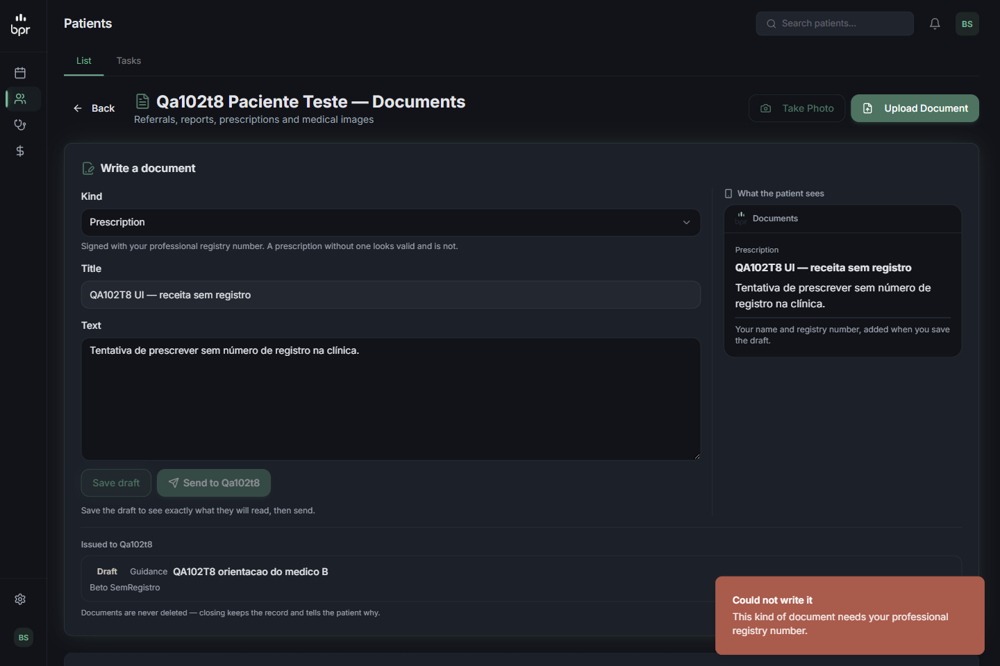

Médico B tentando "Save draft" numa `Prescription`: toast **"Could not write it —
This kind of document needs your professional registry number."**, e nada é
criado. Repare, na mesma imagem, que a lista "Issued to Qa102t8" de B mostra
**um único documento — o dele** (§6.1).

---

## 5. Encerrar, e nunca apagar

### 5.1 Sem motivo não encerra ✅

```
DELETE …/<docId>/send {}               HTTP 400 {"code":"reason_required"}
DELETE …/<docId>/send {"reason":"   "} HTTP 400 {"code":"reason_required"}
```

Espaços em branco também não passam — é `String(...).trim()`, não um teste de
veracidade.

### 5.2 Com motivo, o paciente continua vendo ✅

```
DELETE …/<docId>/send {"reason":"Substituída por outra receita — QA102T8"}   HTTP 200 {"revoked":true}

GET /api/patient/professional-documents   HTTP 200
  - QA102T8 UI — Ibuprofeno 400 mg | revokedAt=2026-09-29T01:55:26.515Z
                                   | reason="Substituída por outra receita — QA102T8"
```

Continua na lista, com data e motivo. É o que a pessoa precisa para parar de
tomar o que foi suspenso.

Segundo DELETE no mesmo documento: **404** (`revokedAt: null` no `where`).

### 5.3 A linha continua no banco ✅ — conferido por query

Consulta direta ao Postgres, contando **todas** as linhas do paciente de teste:

```
total de linhas no banco para o paciente de teste: 9

encerrado | GUIDANCE     | QA102T8 orientacao inicial     | sig=Qa102t8 AdminA · CREFITO QA-CREFITO-111111 | ap=null
rascunho  | PRESCRIPTION | QA102T8 receita com registro   | sig=Carla ComRegistro · CRM QA-CRM-654321      | ap=null
rascunho  | GUIDANCE     | QA102T8 orientacao do medico B | sig=Beto SemRegistro                           | ap=null
rascunho  | GUIDANCE     | QA102T8 ap valido              | sig=Qa102t8 AdminA · CREFITO QA-CREFITO-111111 | ap=cmum0qqas…
rascunho  | GUIDANCE     | QA102T8 ap de outro paciente   | sig=Qa102t8 AdminA · CREFITO QA-CREFITO-111111 | ap=null
rascunho  | GUIDANCE     | QA102T8 ap de outro inquilino  | sig=Qa102t8 AdminA · CREFITO QA-CREFITO-111111 | ap=null
rascunho  | GUIDANCE     | QA102T8 ap inexistente         | sig=Qa102t8 AdminA · CREFITO QA-CREFITO-111111 | ap=null
rascunho  | GUIDANCE     | QA102T8 ap objeto              | sig=Qa102t8 AdminA · CREFITO QA-CREFITO-111111 | ap=null
encerrado | GUIDANCE     | QA102T8 rascunho encerrado     | sig=Qa102t8 AdminA · CREFITO QA-CREFITO-111111 | ap=null

--- a receita encerrada continua no banco?
  id=cmum0sbjy… revokedAt=2026-09-29T01:51:02.482Z  reason="Trocada por outra orientacao ? QA102T8"
  id=cmum0sv1a… revokedAt=2026-09-29T01:51:22.983Z  reason="rascunho descartado - QA102T8"

--- contagem por clinica emissora
  QA102T8 Clinica A: 7
  QA102T8 Medico B (sem registro): 1
  QA102T8 Medico C (com registro): 1
```

Nove documentos criados, **nove no banco**. Nenhum apagamento de verdade
acontece: os dois encerrados estão lá, com data e motivo. Nenhum verbo desta
tarefa remove linha — as rotas exportam `GET POST` e `POST DELETE`, e o `DELETE`
é um `updateMany` que grava `revokedAt`.

> **Nota de bancada, não do produto.** O `?` no primeiro motivo é um U+FFFD: o
> travessão que eu mandei pelo shell do Windows chegou como byte inválido.
> Medido à parte, com os bytes UTF-8 gerados corretamente, o texto volta intacto
> — `"QA102T8 acentuação — travessão"` e `"Ibuprofeno 600 mg após as refeições —
> três dias."` —, e o motivo digitado **na tela** também
> (`"Substituída por outra receita — QA102T8"`). Não é defeito do produto.

---

## 6. Isolamento — por rota, não por tela

### 6.1 Cada um lê só o que escreveu ✅

Os três, no **mesmo** paciente, ao mesmo tempo:

| quem pede a lista | o que vem |
|---|---|
| admin A | os 7 documentos da clínica A |
| médico B | só `QA102T8 orientacao do medico B` |
| médico C | só `QA102T8 receita com registro` |

Contagem por clínica emissora no banco: A=7, B=1, C=1. Confirmado também na
tela (§4.4).

### 6.2 E não age sobre o que não é seu — **404, nunca 403** ✅

```
POST   …/<doc de A>/send     (sessão do médico B)  -> 404 {"code":"not_sendable"}
POST   …/<doc de C>/send     (sessão do médico B)  -> 404 {"code":"not_sendable"}
DELETE …/<doc de A>/send     (sessão do médico B)  -> 404 {"error":"Not found"}
```

Nenhum 403 em lugar nenhum: um 403 confirmaria que aquele documento existe.

### 6.3 Sem vínculo, nem a porta abre ✅

Médico D (inquilino `DOCTOR`, com registro, **sem** vínculo de cuidado), sobre o
paciente da clínica A:

```
GET    lista        -> 404 {"error":"Patient not found"}
POST   escrever     -> 404 {"error":"Patient not found"}
POST   /send        -> 404 {"error":"Patient not found"}
DELETE (encerrar)   -> 404 {"error":"Patient not found"}
```

### 6.4 Vínculo encerrado corta na hora ✅

O médico C, que tinha acabado de escrever uma receita:

```
com vínculo vivo            : GET lista  -> HTTP 200
--- careLink.endedAt = now ---
vínculo encerrado           : GET lista  -> 404 {"error":"Patient not found"}
                              POST /send no PRÓPRIO rascunho -> 404
--- careLink.endedAt = null ---
vínculo de volta            : GET lista  -> HTTP 200
```

O paciente encerrando o vínculo tira do médico até o que ele mesmo escreveu e
não enviou. O que já foi enviado continua com o paciente — é dele.

### 6.5 Quem não é staff não entra ✅

```
GET/POST /api/admin/patients/<id>/professional-documents  com o bearer do PACIENTE
  -> 401 {"code":"session_expired"}   (barrado no middleware: /api/admin não é rota de app)

GET /api/patient/professional-documents  sem token nenhum
  -> 401
```

### 6.6 Sobre o 8.4 da qa-spec ("outro profissional lendo o documento → 404")

**Não existe rota de leitura por documento.** O mapa completo da tarefa:

```
app/api/admin/patients/[id]/professional-documents/route.ts          -> GET POST
app/api/admin/patients/[id]/professional-documents/[docId]/send/…    -> POST DELETE
app/api/patient/professional-documents/route.ts                      -> GET
```

Então o cenário se responde por três medições, todas feitas: a lista é filtrada
por `clinicId` (6.1), e os dois verbos que existem com `docId` respondem 404 para
quem não é dono (6.2). Não há superfície de leitura individual para vazar.

---

## 7. `appointmentId` que não confere vira nulo ✅ — a correção do review de hoje

Cinco POSTs do admin A, variando só o `appointmentId`:

| o que foi mandado | `appointmentId` gravado |
|---|---|
| consulta **deste** paciente, **deste** inquilino | `cmum0qqas…` — **gravado** |
| consulta de **outro paciente** (mesmo inquilino) | **null** |
| consulta de **outro inquilino** (mesmo paciente) | **null** |
| id inexistente (`"naoexiste123"`) | **null** |
| objeto (`{"not":null}`) — operador do Prisma | **null** |

A primeira linha é o que dá valor às outras quatro: a checagem não é "sempre
nula", ela realmente aceita a consulta certa e descarta as outras. A receita
nunca aparece pendurada na agenda de um estranho.

---

## 8. A tela da clínica

### 8.1 O card, a prévia com o logo, e os dois botões ✅

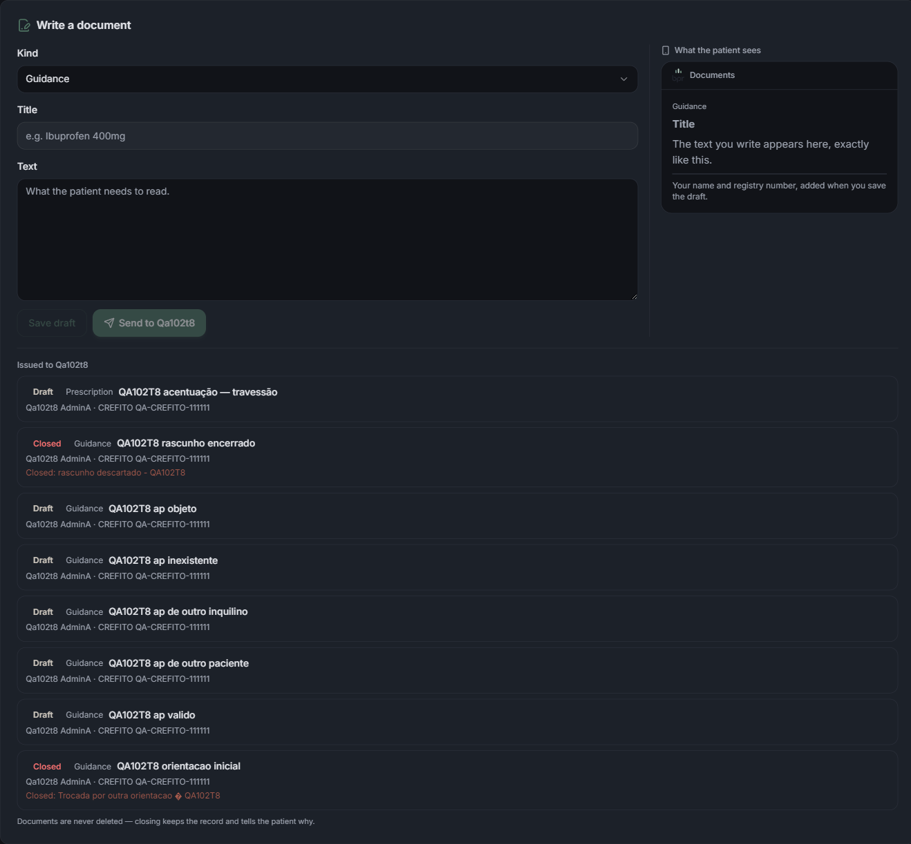

`/admin/patients/<id>/documents` mostra **"Write a document"** com `Kind`
(os quatro tipos: Prescription, Report, Exam request, Guidance), `Title`, `Text`,
os dois botões, e a coluna **"What the patient sees"** com o cabeçalho do app.

O logo é real, não um `alt` quebrado — medido no DOM:

```
img[alt="BPR"] -> src http://127.0.0.1:4011/logo.png
                  naturalWidth 581, naturalHeight 674, complete true
                  renderizado 17.2 x 20 px
```

### 8.2 A prévia vem antes do envio, e o envio é a segunda decisão ✅

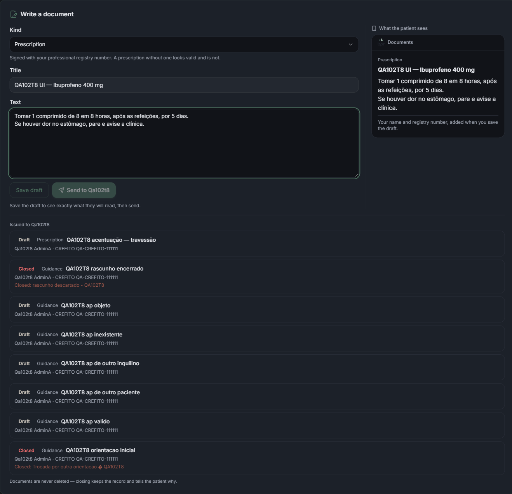

Com o formulário preenchido e **antes** de salvar, `Send to Qa102t8` está
**desabilitado**, com a frase *"Save the draft to see exactly what they will read,
then send."*. Não há um caminho de um clique.

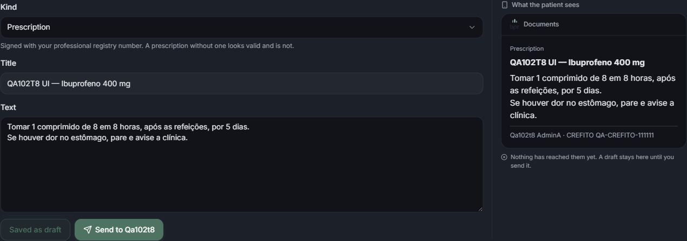

Depois de "Save draft": o botão vira **"Saved as draft"** (desabilitado), o
`Send` acende, a prévia ganha a assinatura verdadeira
(`Qa102t8 AdminA · CREFITO QA-CREFITO-111111` — que veio do servidor, não de um
campo digitável) e aparece *"Nothing has reached them yet. A draft stays here
until you send it."*

Medido pela API no mesmo instante, antes do clique em Send:

```
ANTES DO BOTAO ENVIAR - o que o paciente ve:  n=1   (só a orientação antiga)
```

### 8.3 Enviar, e então "Close this" ✅

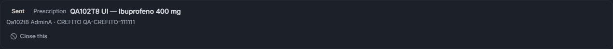

Depois do clique, a linha aparece como **Sent**, com a assinatura e o botão
**"Close this"** — e a API confirma que o paciente passou a ver a receita
(`sentAt: 2026-09-29T01:54:58.380Z`). Tela cheia em
[`t-8-enviado-toast.png`](screenshots/t-8-enviado-toast.png).

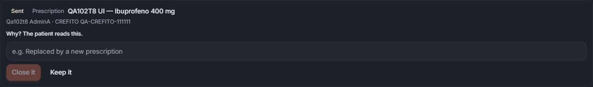

"Close this" abre *"Why? The patient reads this."* com **"Close it" desabilitado**
enquanto o motivo está vazio — a tela espelha o `reason_required` do servidor, e
o servidor recusa de qualquer jeito (§5.1).

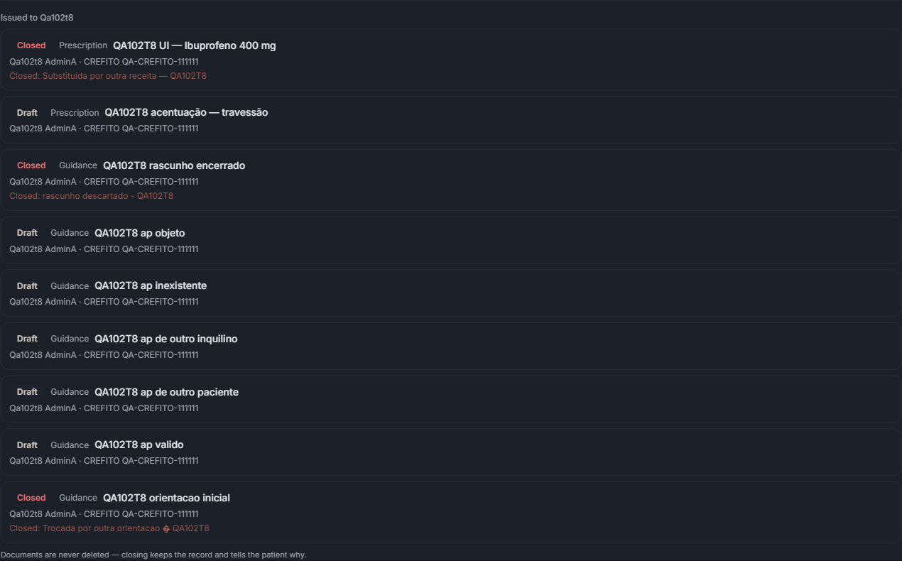

Encerrada, a linha fica **Closed** com *"Closed: Substituída por outra receita —
QA102T8"*, e o rodapé diz *"Documents are never deleted — closing keeps the record
and tells the patient why."*

### 8.4 ❌ **Achado 1 — o rascunho salvo vira órfão** (corrigido; remedição em §14)

> **Corrigido.** O que está abaixo é o estado da **primeira** rodada, guardado
> porque é o que descreve o defeito. A remedição, com a tela já consertada, está
> em §14.


Depois de recarregar a página, varri as linhas da lista pelo DOM:

```
[ {linha:"Closed", botoes:[]}, {linha:"Draft",  botoes:[]}, {linha:"Closed", botoes:[]},
  {linha:"Draft",  botoes:[]}, {linha:"Draft",  botoes:[]}, {linha:"Draft",  botoes:[]},
  {linha:"Draft",  botoes:[]}, {linha:"Draft",  botoes:[]}, {linha:"Closed", botoes:[]} ]
```

**Seis rascunhos, zero botões.** O `Send` da tela lê o estado local `rascunho`,
que só existe enquanto ninguém sai da página; a lista de emitidos não oferece
`Send` para nenhum rascunho, e `Close this` só aparece para `estado === "enviado"`.

O efeito: quem escreve uma receita, salva o rascunho, e volta amanhã **não tem
como enviá-la nem como encerrá-la** — só reescrevendo do zero, e deixando a
primeira linha morta no banco para sempre. Duas voltas menores pelo mesmo
caminho:

- `criar()` não chama `carregar()`, então o rascunho recém-salvo não entra na
  lista até um reload;
- trocar o `Kind` depois de salvar faz `setRascunho(null)` — protege contra
  enviar o tipo errado, mas abandona a linha já criada.

Onde olhar: `components/admin/escrever-documento.tsx` — o bloco `emitidos.map`
(por volta da linha 320) não tem caso para `estado === "rascunho"`. A rota
`/send` já existe e já faz a coisa certa; o que falta é um botão que a chame.

### 8.5 ⚠️ Não medido — a tela do app do paciente

`mobile/src/components/DocumentosDoProfissional.tsx`, montado em
`mobile/app/(app)/(clinica)/documents.tsx`, **não foi aberto**.

Por quê, medido:

```
http://localhost:8081/node_modules/expo-router/entry.bundle?platform=web…  -> HTTP 500
{"type":"UnableToResolveError",
 "originModulePath":"…\mobile\app\(app)\(clinica)\invoices.tsx",
 "targetModuleName":"@stripe/stripe-react-native",
 "message":"Unable to resolve module @stripe/stripe-react-native…"}
```

O pacote **está** instalado (`mobile/node_modules/@stripe/stripe-react-native/`,
completo, com `package.json`) — é cache velho do Metro daquele servidor. Ele é
deste worktree mas foi iniciado por **outra sessão** (PID 22960), e reiniciá-lo
é exatamente a colisão que a regra manda evitar. O app nativo, além disso,
depende de build EAS, que não se roda sem autorização.

**O que foi medido no lugar:** a resposta que essa tela consome. O payload do
`GET /api/patient/professional-documents` traz, por documento, os campos que o
componente lê (`kind`, `kindLabel`, `kindLabelPt`, `title`, `body`, `signature`,
`from`, `sentAt`, `revokedAt`, `revokedReason`) — e a assinatura chega pronta,
`"Qa102t8 AdminA · CREFITO QA-CREFITO-111111"`, montada no servidor. O que **não**
foi verificado é o desenho: se o logo, a tarja de encerrada e o motivo aparecem
na tela do telefone.

---

## 9. Erros de console

Na tela desta tarefa — `/admin/patients/<id>/documents`, carregada limpa em porta
nova: **0 erros, 0 avisos**. Nenhum `Invalid or unexpected token`, nenhuma falha
de hidratação. (As ocorrências que aparecem no histórico do navegador são de
sessões anteriores, em `localhost:4197`, um servidor que nem está mais de pé.)

**Fora do escopo desta tarefa**, mas achado no caminho: entrando como o admin do
inquilino do tipo `DOCTOR`, a home `/admin` dá 2 erros de console —

```
[ERROR] Failed to load resource: 404 @ http://127.0.0.1:4011/api/admin/notifications
```

Isso é a área do médico (T-1/T-2), não T-8. Anotado, não consertado.

---

## 10. Contra os critérios de aceite da T-8

| critério | resultado |
|---|---|
| O paciente recebe com nome e registro de quem assinou | ✅ `"signature":"… · CREFITO QA-CREFITO-111111"`, congelada na emissão |
| Prévia obrigatória, com logo, antes de qualquer envio | ✅ `Send` desabilitado até salvar; logo real (581x674) na prévia |
| Nada chega ao paciente sem alguém apertar um botão | ✅ `sentAt` nasce nulo; o paciente vê lista vazia até o `/send` |
| Um profissional não lê o que outro escreveu | ✅ lista por `clinicId`; `/send` e `DELETE` alheios → 404 |
| ICP-Brasil fora de escopo | ✅ nada de assinatura digital no código nem na tela |

---

## 11. Achados, em ordem

1. **✅ CORRIGIDO — rascunho salvo não podia ser enviado nem encerrado depois de
   sair da tela.** `enviar` passou a receber `id`, e a linha de rascunho ganhou
   "Send this" e "Discard this". Remedido em §14.1–14.4.
2. **✅ CORRIGIDO — `criar()` não recarregava a lista.** Agora chama `carregar()`;
   o rascunho entra na hora. Remedido em §14.1.
3. **✅ CORRIGIDO — trocar o `Kind` depois de salvar abandonava a linha.** A linha
   continua na lista e alcançável. Remedido em §14.5.
4. **⚠️ ABERTO — a tela do app do paciente não foi medida** — bundle do Expo web em
   500 por cache do Metro (pacote instalado), e o nativo depende de build EAS.
   **É a única coisa que falta** antes de marcar a T-8 concluída.
5. **ℹ️ Fora do escopo:** `/api/admin/notifications` responde 404 no inquilino
   `DOCTOR` (2 erros de console na home do admin dele).
6. **ℹ️ Cosmético:** o logo na prévia renderiza a 17x20 px, bem discreto sobre o
   tema escuro. Ele **está** lá; é só pequeno.

## 12. O que este QA não cobriu

- **Produção.** Tudo local, nada deployado. Falta o QA online com o commit
  confirmado na lista de deployments do Coolify.
- **O aviso no telefone.** `pushDocumento` é chamado depois do envio e engole o
  erro; que a notificação de fato chegue a um aparelho não foi medido — depende
  de build e de token de push.
- **Partilha entre profissionais (T-9).** Fora desta tarefa: aqui só se mediu que
  um não lê o do outro, que é o estado inicial correto.

---

## 13. Testes automatizados da tarefa

```
npx jest __tests__/tenant/o-que-o-profissional-devolve.test.ts

Test Suites: 1 passed, 1 total
Tests:       29 passed, 29 total
Time:        0.345 s
```

Vinte e nove passando. Eles cobrem a camada pura (`podeEmitir`,
`estadoDoDocumento`, `assinatura`, os rótulos dos quatro tipos); as rotas, o
banco e as duas telas foram medidos à mão, como está acima.

---

## 14. Remedição dos achados 1, 2 e 3 — 29/09/2026, mesma noite

A sessão principal corrigiu `components/admin/escrever-documento.tsx`: `enviar`
passou a receber um `id`, a linha de rascunho ganhou **"Send this"** e
**"Discard this"**, a condição dos botões virou `estado !== "encerrado"`, e
`criar()` passou a chamar `carregar()`.

**Só estes seis cenários foram remedidos.** Os 8 de API da primeira rodada não
mudaram de código e não foram repetidos.

### 14.0 O chunk velho quase virou um falso negativo

A primeira medição na `:4011` mostrou **zero botões** — igual ao defeito. Antes
de reportar "não corrigiu", conferi de onde vinha o que o navegador executava:

```
// o que o navegador tinha em memória:
scripts da página -> page.js contém "Save draft"
                                não contém "Send this" nem "Discard this"

// o mesmo arquivo, buscado com { cache: 'reload' }:
/_next/static/chunks/app/admin/patients/%5Bid%5D/documents/page.js
  1.757.469 bytes | temSendThis: true | temDiscardThis: true
```

E, no disco, o chunk era **mais novo que a edição**:

```
componente : 2026-09-29 03:08:47.283  components/admin/escrever-documento.tsx
chunk      : 2026-09-29 03:08:48.082  .next/static/chunks/.../documents/page.js
```

Servidor certo, navegador com cópia velha — o chunk sem hash servido como
`immutable` do dev. **Porta nova resolveu.** Fica registrado porque, sem essa
conferência, o relatório teria dito que a correção falhou.

Nova porta, com o dono confirmado antes de medir:

```
:4012 -> PID 54008 -> C:\Users\bruno\orca\workspaces\clinic\app_clinic\node_modules\next\...
:4000 -> PID 52568 -> C:\Users\bruno\Documents\clinic\...   (intacta, não foi tocada)
```

A `:4011` foi encerrada antes de subir a `:4012`: dois `next dev` no mesmo
`.next` corrompem o diretório.

### 14.1 Salvar um rascunho → ele entra na lista **sem reload** ✅

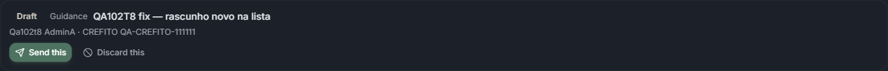

Antes de salvar a lista tinha 9 linhas. Logo após o clique em "Save draft", sem
navegar nem recarregar:

```
{ totalLinhas: 10,
  semReload_encontrou: [ { estado: "Draft",
                           botoes: ["Send this", "Discard this"] } ] }
```

### 14.2 Depois de **recarregar**, a linha Draft mantém os dois botões ✅

Este é o achado 1 propriamente dito, e a medição mais forte que dava para fazer:
os seis rascunhos abaixo foram criados **antes** da correção, numa sessão que já
morreu. Numa página recém-carregada, sem nenhum estado local, todos têm botão:

```
Closed | QA102T8 UI — Ibuprofeno 400 mg   -> []
Draft  | QA102T8 acentuação — travessão   -> ["Send this", "Discard this"]
Closed | QA102T8 rascunho encerrado       -> []
Draft  | QA102T8 ap objeto                -> ["Send this", "Discard this"]
Draft  | QA102T8 ap inexistente           -> ["Send this", "Discard this"]
Draft  | QA102T8 ap de outro inquilino    -> ["Send this", "Discard this"]
Draft  | QA102T8 ap de outro paciente     -> ["Send this", "Discard this"]
Draft  | QA102T8 ap valido                -> ["Send this", "Discard this"]
Closed | QA102T8 orientacao inicial       -> []
```

Na primeira rodada, esta mesma varredura devolvia `botoes: []` nas nove linhas.

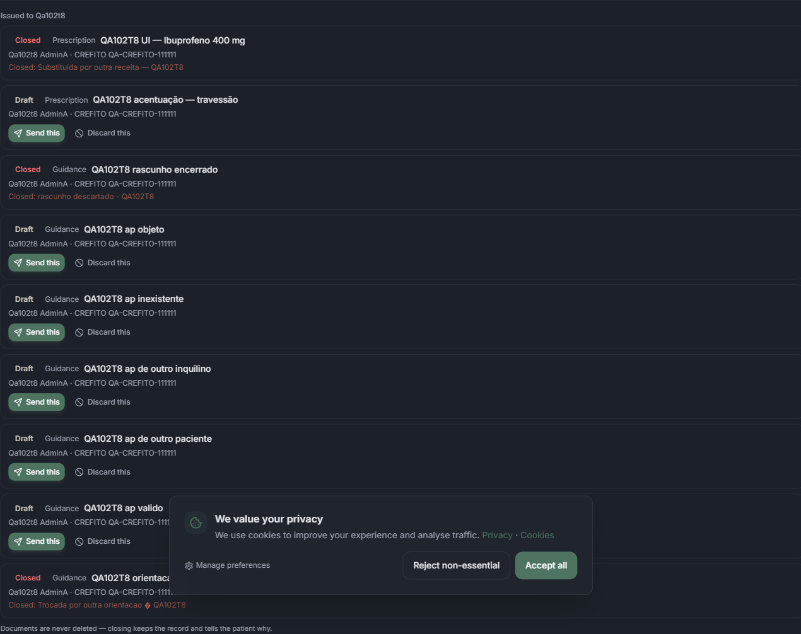

### 14.3 "Send this" na linha → vira Sent, e o paciente passa a ver ✅

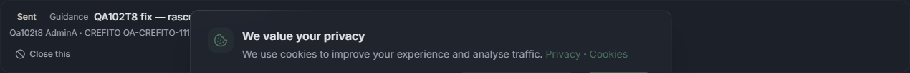

Clique no "Send this" da **linha** (não no botão do formulário):

```
antes  : { estado: "Draft", botoes: ["Send this", "Discard this"] }
depois : { estado: "Sent",  botoes: ["Close this"] }
```

E o paciente, medido pela API no mesmo instante:

```
- QA102T8 fix — rascunho novo na lista | sentAt=2026-09-29T02:12:55.125Z | revokedAt=null
- QA102T8 UI — Ibuprofeno 400 mg       | sentAt=2026-09-29T01:54:58.380Z | revokedAt=2026-09-29T01:55:26.515Z
- QA102T8 orientacao inicial           | sentAt=2026-09-29T01:51:00.115Z | revokedAt=2026-09-29T01:51:02.482Z
```

O documento que **só existia como rascunho de ontem** chegou ao paciente por um
botão da lista. Era exatamente isso que não dava para fazer.

### 14.4 "Discard this" → rótulo de descarte, e depois **nenhum botão** ✅

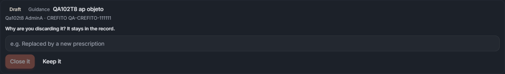

O formulário que abre no rascunho troca o texto, e o "Close it" nasce
desabilitado:

```
rotulo      : "Why are you discarding it? It stays in the record."
placeholder : "e.g. Replaced by a new prescription"
botoes      : [ {txt:"Close it", desabilitado:true}, {txt:"Keep it", desabilitado:false} ]
```

(Na linha **enviada**, o mesmo campo diz *"Why? The patient reads this."* — §8.3.)

Depois de digitar o motivo e confirmar:

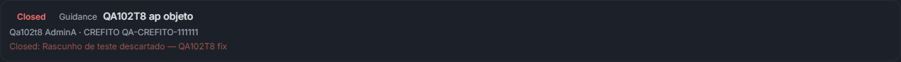

```
estado        : "Closed"
linha inteira : Closed | Guidance | QA102T8 ap objeto | Qa102t8 AdminA · CREFITO QA-CREFITO-111111
                | Closed: Rascunho de teste descartado — QA102T8 fix
botoes        : []
temSendThis   : false
temCloseThis  : false
temDiscardThis: false
```

**É o detalhe que foi pedido de propósito:** enviar o que foi encerrado é
impossível **pela tela**, e não só pela rota. As duas portas estão fechadas — a
rota já respondia 404 `not_sendable` num rascunho encerrado (§3.3), e agora a
tela também não oferece o caminho.

### 14.5 Trocar o `Kind` depois de salvar não perde mais o rascunho ✅

Com o rascunho salvo, troquei o tipo de `Guidance` para `Exam request`:

```
kindAgora                 : "Exam request"
rascunhoContinuaNaLista   : true
linha                     : { estado: "Draft", tipo: "Guidance",
                              botoes: ["Send this", "Discard this"] }
botoesDoFormulario        : [ {Save draft, habilitado}, {Send to Qa102t8, desabilitado} ]
```

O formulário larga o rascunho em memória de propósito — não se envia como
`Exam request` o que foi assinado como `Guidance` —, mas a linha **continua na
lista, com o tipo verdadeiro e os dois caminhos**. Nenhuma linha órfã.

### 14.6 A matriz de botões por estado, numa página recarregada ✅

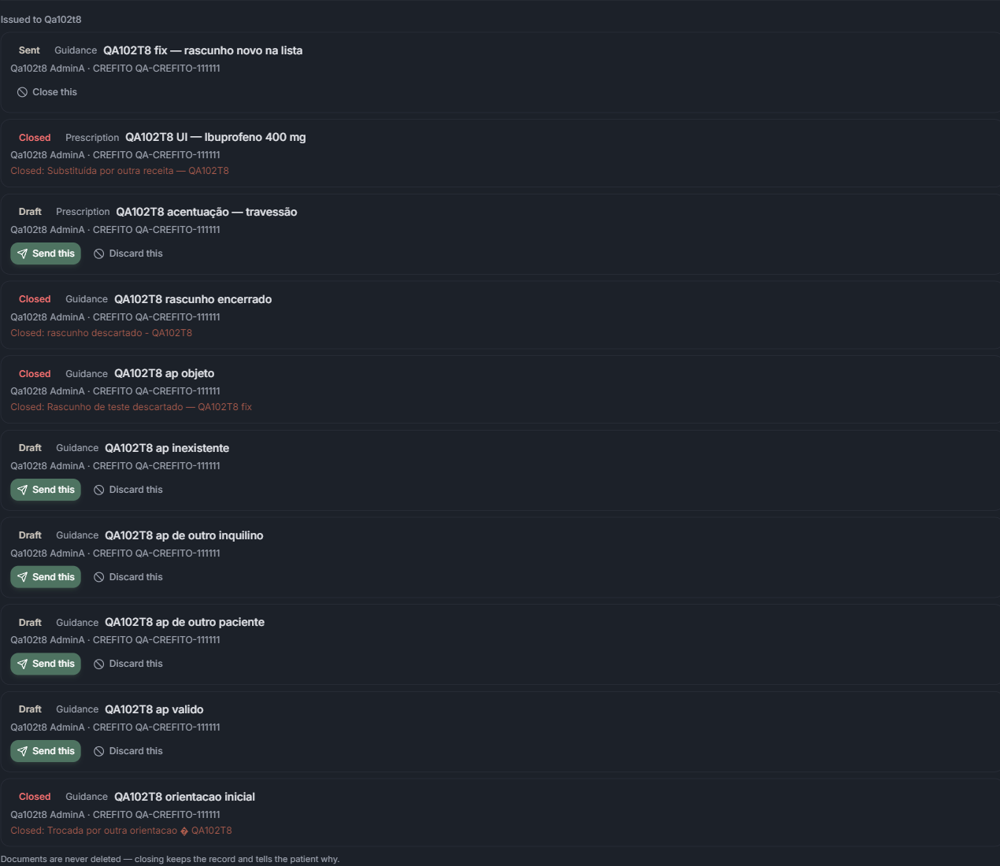

```
Draft  -> ["Send this", "Discard this"]   5 linhas
Sent   -> ["Close this"]                  1 linha
Closed -> []                              4 linhas
```

Dez linhas, três estados, nenhuma exceção.

**Console:** 0 erros, 0 avisos na tela, em toda a rodada.

### 14.7 E nada sumiu do banco ✅

```
linhas no banco para o paciente de teste: 12
por estado: {"rascunho":7,"enviado":1,"encerrado":4}

o rascunho descartado continua no banco: true | revokedAt=2026-09-29T02:13:29.692Z
motivo gravado: "Rascunho de teste descartado — QA102T8 fix"
tem travessao U+2014 intacto? true | tem U+FFFD? false
```

Doze no banco contra **dez na tela**: as outras duas são a do médico B e a do
médico C, que o admin A não vê — o isolamento do §6.1 continua de pé depois da
mudança.

E o travessão digitado na tela voltou como **U+2014**, sem nenhum U+FFFD, o que
encerra a dúvida da nota do §5.3: aquele caractere quebrado era do meu shell, não
do produto.

---

## 15. O que ainda falta para a T-8 fechar

1. **A tela do app do paciente** (§8.5) — único cenário não medido.
2. **QA online**, com o commit confirmado na lista de deployments do Coolify.
3. **O aviso no telefone** — não medido; depende de build e token de push.
