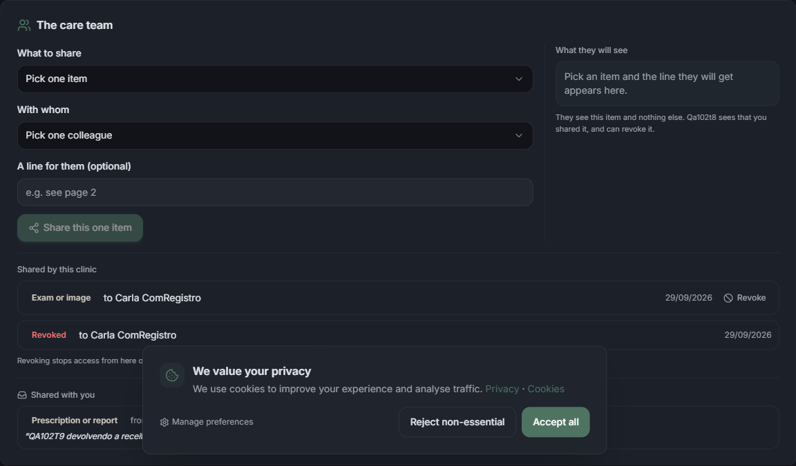
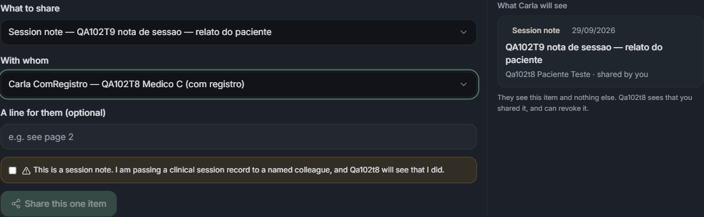
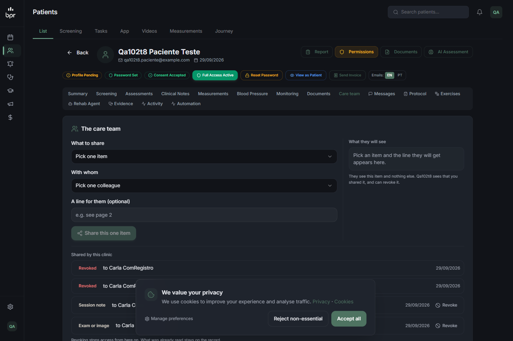

# QA — 102 T-9: a equipe partilha item a item, nos dois sentidos

**Data:** 29/09/2026
**Veredito:** ✅ **aprovado** — 16 de 16 cenários da primeira rodada passaram, e
os quatro achados foram corrigidos e remedidos. O achado que a remedição
levantou (a rota aceitava receita encerrada e rascunho) foi fechado na mesma
noite e **re-medido** em §23.
**Três rodadas:** a primeira em 29/09 às 02h38 (§0 a §20); a remedição dos
achados 1 a 4 em §21; o fechamento do achado novo em §23.
**Onde:** local, worktree `app_clinic`, banco local `bpr_clinic_local`.
**Tokens e cookies:** nenhum valor neste relatório — só `code`, status e tamanho.

> **A metade que importava mais.** Esta tarefa **fecha** acesso antes de somar
> partilha. As duas perguntas do §2 são, juntas, o veredito: o vínculo parou de
> abrir o prontuário **e** a clínica continua enxergando o próprio paciente.

---

## 0. Qual checkout serviu a porta

```
netstat -ano | grep 4013
  TCP  0.0.0.0:4013  LISTENING  10980

PID 10980 -> C:\Users\bruno\orca\workspaces\clinic\app_clinic\node_modules\next\...\start-server.js
PID 52568 -> C:\Users\bruno\Documents\clinic\...   (a :4000, intacta)
```

A `:4012` da rodada anterior já estava encerrada. O navegador trabalhou em
**`127.0.0.1:4013`**, não em `localhost`: cookie é por host, e entrar como admin
de teste em `localhost` derrubaria a sessão de quem usa a `:4000`.

## 1. A matriz de teste

Reaproveitados da T-8, mais três contas criadas para esta tarefa. Nenhum dado
real; tudo com prefixo `QA102T8`/`QA102T9` e e-mail `@example.com`.

| papel | quem | inquilino | vínculo com o paciente |
|---|---|---|---|
| **paciente de teste** | `Qa102t8 Paciente Teste` | A (dono) | — |
| clínica que cuida | `Qa102t8 AdminA` | A (`CLINIC`) | é o dono |
| médico com registro | `Carla ComRegistro` | C (`DOCTOR`) | **vivo** |
| médico sem registro | `Beto SemRegistro` | B (`DOCTOR`) | **vivo** |
| **colega novo** do C | `Nina NovaNaEquipeC` (nova) | C (`DOCTOR`) | pelo inquilino |
| staff sem vínculo | `Davi SemVinculoD` (novo) | D (`DOCTOR`) | **nenhum** |
| colega da própria casa | `Cleo ColegaDaCasaA` (nova) | A | mesmo inquilino |

Itens semeados: um **exame** do inquilino A, um **exame** do inquilino C, uma
**nota de sessão** do inquilino A, e a **receita** que o médico C escreveu na T-8.

`CareShare` no banco no início: **0 linhas**.

---

## 2. Resumo

| # | cenário | tipo | resultado |
|---|---|---|---|
| 1 | médico C (com vínculo) recebe **404** nas rotas amplas | API | ✅ |
| 2 | admin A (dono) continua recebendo **200** nas mesmas rotas | API | ✅ |
| 3 | `GET /patients/<id>` como C → `porPartilha: true`, perfil reduzido | API | ✅ |
| 4 | sem partilha, C vê **só identidade** — listado campo a campo | API | ✅ |
| 5 | `POST /shares` de A para C com um exame → C vê o exame e **nada mais** | API | ✅ |
| 6 | plural recusado: `toUserIds`, `toUserId:[x]`, `toEveryone`, `toClinicType` | API | ✅ |
| 7 | item que não é meu → **404**, nos dois sentidos | API | ✅ |
| 8 | destinatário sem vínculo (inquilino D) → **409 `no_care_link`** | API | ✅ |
| 9 | paciente e colega do próprio inquilino → **404 `no_colleague`** | API | ✅ |
| 10 | `SESSION_NOTE` sem `acknowledgeSessionNote` → **409 `extra_step_required`** | API | ✅ |
| 11 | idempotência: duas partilhas iguais → **uma** linha no banco | banco | ✅ |
| 12 | revogar: some para C, linha fica, reabre a **mesma** linha | API + banco | ✅ |
| 13 | os dois sentidos: C partilha com A, e A recebe | API | ✅ |
| 14 | o paciente vê tudo e **corta** — C perde o acesso na hora | API | ✅ |
| 15 | herança: caixa do colega novo **vazia** | API | ✅ |
| 16 | UI: aba "Care team", seletores singulares, prévia, passo extra | UI | ✅ (1 achado) |

**Erros de console:** 0 erros, 0 avisos na aba "Care team".
**Auditoria:** `CARE_SHARE_CREATED` 6, `CARE_SHARE_READ` 9, `CARE_SHARE_REVOKED` 2.

---

## 3. O fechamento — as duas metades, medidas lado a lado

A mesma requisição, com duas sessões, na mesma porta, no mesmo minuto.

| rota sob `/api/admin/patients/<id>` | admin A (dono) | médico C (vínculo vivo) |
|---|---|---|
| `GET /wellbeing` | **200** | **404** |
| `GET /report` | **200** | **404** |
| `GET /rehab-plan` | **200** | **404** |
| `GET /questions` | **200** | **404** |
| `GET /activity` | **200** | **404** |
| `GET /protocol-notes` | **200** | **404** |
| `GET /measurements` | **200** | **404** |
| `GET /diagnosis` | **200** | **404** |
| `GET /documents` | **200** | **404** |
| `GET /blood-pressure` | **200** | **404** |
| `GET /monitoring` | **200** | **404** |
| `GET /protocol` | **200** | **404** |
| `GET /adherence-today` | **200** | **404** |
| `GET /weekly-closing` | **200** | **404** |
| `GET /packages` | **200** | **404** |
| `GET /permissions` | **200** | **404** |
| `GET /messages` | **200** | **404** |
| `GET /evidence-report` | **200** | **404** |
| `GET /onboarding-pending` | **200** | **404** |
| `GET /email` | **200** | **404** |
| `GET /email/template` | 400 (chegou ao handler) | **404** |
| `POST /email/preview` | 400 (chegou ao handler) | **404** |
| `POST /email/send` | 400 (chegou ao handler) | **404** |
| `POST /invoice` | 400 (chegou ao handler) | **404** |
| `POST /measurements` (escrita) | 400 (chegou ao handler) | **404** |
| `POST /diagnosis` (escrita) | 500 (chegou ao handler) | **404** |

**As duas metades passam.** O 400/500 do lado do A é o meu corpo vazio batendo
na validação do handler — o que prova que a requisição **atravessou a guarda**;
o 404 do lado do C é a guarda recusando antes. É a distinção que importa: se a
correção tivesse quebrado a clínica, a coluna do A teria 404 também.

> **O "antes" não foi medido.** Está afirmado pela sessão principal, e eu não
> mexi no `git stash` para conferir (a pilha é partilhada com outros worktrees).
> O que está acima é o **depois**.

### 3.1 A premissa do desenho, verificada: a guarda é mesmo o único caminho

O desenho aposta que fechar **uma** função fecha as 46 rotas. Varri quem chama
o quê:

```
46 rotas sob /api/admin/patients/[id]/
41 chamam staffPatientAccess / patientRecordAccess diretamente
 4 (/email, /email/preview, /email/send, /email/template) chamam guardEmailAccess,
   que por dentro chama staffPatientAccess  (lib/patient-email-server.ts:24)
 1 (/monitoring) usa getSessionStaffActor com filtro próprio de inquilino
```

Nenhuma rota fica de fora, e as cinco que não citam a guarda no próprio arquivo
foram medidas mesmo assim (tabela acima): **404 para o C nas cinco**. A aposta
do "falha fechada" se confirma na medição, não só na leitura.

### 3.2 Duas rotas que a matriz não consegue discriminar — dito explicitamente

- `/measurements/<id>` exporta só **PATCH** e **DELETE**. Com um id inexistente,
  A e C respondem **404** os dois, então a medição não separa "guarda recusou"
  de "linha não existe". A discriminação está na raiz: `GET /measurements`
  → A=200, C=404.
- `GET` em `/invoice`, `/email/*` e `/measurements/<id>` devolve **405** porque
  esses verbos não existem. Medidos com o verbo certo, na tabela.

---

## 4. O perfil reduzido — campo a campo

`GET /api/admin/patients/<id>`, as duas sessões, **sem nenhuma partilha viva**:

| chave | admin A (dono) | médico C (por vínculo) |
|---|---|---|
| `porPartilha` | ausente | **`true`** |
| `documents` | `[2]` | `[0]` |
| `soapNotes` | `[1]` | `[0]` |
| `diagnoses` | `[0]` | `[0]` |
| `screening` | `null` | `null` |
| `protocols` · `bpReadings` · `footScans` · `bodyAssessments` | `[0]` | `[0]` |
| `professionalDocuments` · `monitoringReports` | ausente | `[0]` |

E dentro de `patient`:

| campo | admin A | médico C |
|---|---|---|
| `id`, `firstName`, `lastName`, `isActive`, `createdAt`, `preferredLocale`, `dateOfBirth` | presentes | **presentes** |
| `email` | presente | **AUSENTE** |
| `address` | presente | **AUSENTE** |
| `phone` | presente | **AUSENTE** |
| `emergencyContactName` / `Phone` / `Relation` | presentes | **AUSENTES** |
| `intakeToken`, `intakeTokenExpiry` | presentes | **AUSENTES** |
| `consentAcceptedAt`, `fullAccessOverride`, `profileCompleted`, `role`, `updatedAt` | presentes | **AUSENTES** |

**Cenário 4 respondido:** sem partilha, o que o médico C vê do paciente é
**identidade e mais nada** — id, nome, data de nascimento, idioma, se a conta
está ativa e desde quando. Sem endereço, sem telefone, sem e-mail, sem contato
de emergência, sem prontuário, sem pressão. É mais fechado do que o pedido, que
falava em identidade: o e-mail também não passa.

---

## 5. A partilha abre exatamente uma porta ✅

```
POST /api/admin/patients/<id>/shares      (sessão do admin A)
{"item":"EXAM","itemId":"<exame do inquilino A>","toUserId":"<médico C>","note":"QA102T9 veja a pagina 2"}

HTTP 200
{"share":{"id":"cmum2hv9r…","item":"EXAM","fromClinicId":"<A>","toUserId":"<C>",
          "toClinicId":"<C>","sharedAt":"2026-09-29T02:38:48.976Z","revokedAt":null}}
```

E o perfil do paciente, relido como C no segundo seguinte:

```
porPartilha: true
coleções   : {"documents":1,"soapNotes":0,"diagnoses":0,"monitoringReports":0,
              "professionalDocuments":0,"footScans":0,"bodyAssessments":0,
              "protocols":0,"bpReadings":0}
screening  : null
documents  : QA102T9 exame de sangue
```

**Um item entrou, e só ele.** Nenhuma outra coleção mudou de 0.

---

## 6. Plural é recusado, e por escrito ✅

| corpo enviado | status | `code` |
|---|---|---|
| `toUserIds: [x, y]` | **400** | `no_group_share` |
| `toEveryone: true` | **400** | `no_group_share` |
| `toClinicType: "DOCTOR"` | **400** | `no_group_share` |
| `toUserId: ["x"]` | **400** | `one_at_a_time` |
| `item: ["EXAM"]` | **400** | `one_at_a_time` |
| `itemId: ["…"]` | **400** | `one_at_a_time` |

Recusado **explicitamente**, não ignorado: uma tela futura que mandasse
`toUserIds` leva 400 em vez de partilhar com o primeiro da lista e parecer que
funcionou.

---

## 7. Você partilha o que é seu ✅

| tentativa | status | `code` |
|---|---|---|
| A partilha o `PROFESSIONAL_DOCUMENT` que o médico **C** escreveu | **404** | `not_found` |
| C partilha o **exame do inquilino A** | **404** | `not_found` |
| A partilha um `itemId` inexistente | **404** | `not_found` |

Os três com a mesma frase — *"That item is not available."* — porque distinguir
"não existe" de "existe e não é seu" já contaria que existe.

## 8 e 9. Para quem se pode partilhar ✅

| destinatário | status | `code` |
|---|---|---|
| staff do inquilino **D** (sem vínculo com o paciente) | **409** | `no_care_link` |
| o **próprio paciente** | **404** | `no_colleague` |
| colega do **próprio inquilino** (`Cleo`, da casa A) | **404** | `no_colleague` |
| `toUserId` inexistente | **404** | `no_colleague` |

O 409 do inquilino D é a distinção certa: aquela pessoa existe e é um colega
válido da plataforma — o que falta é o vínculo com **este** paciente.

## 10. A nota de sessão tem passo a mais ✅

```
SESSION_NOTE sem acknowledgeSessionNote  -> 409 {"code":"extra_step_required"}
SESSION_NOTE com acknowledgeSessionNote:false -> 409 {"code":"extra_step_required"}
SESSION_NOTE com acknowledgeSessionNote:true  -> 200, linha criada
```

O `false` explícito também recusa — a checagem é `=== true`, não "veio algo".

---

## 11. Idempotência: duas decisões iguais, uma linha ✅

O mesmo exame partilhado duas vezes para o mesmo colega:

```
1ª chamada -> id=cmum2hv9r000xxzh0wwyebks2  createdAt=02:38:48.976
2ª chamada -> id=cmum2hv9r000xxzh0wwyebks2  createdAt=02:38:48.976  sharedAt=02:38:51.905
```

Conferido por query, que é o que prova:

```
linhas para (paciente, EXAM, aquele exame, médico C): 1   <- partilhado DUAS vezes
```

Mesmo id, `createdAt` intacto, `sharedAt` atualizado. A chave única
`(patientId, item, itemId, toUserId)` não deixa a segunda linha nascer.

---

## 12. Revogar corta o futuro e guarda o passado ✅

```
antes  : C vê documents=[QA102T9 exame de sangue]  soapNotes=1
DELETE /shares/<id>  {"reason":"QA102T9 exame nao era necessario"}   -> 200 {"revoked":true}
depois : C vê documents=[]                          soapNotes=1
```

O `soapNotes=1` que fica é a outra partilha, ainda viva — revogar cortou **uma**
coisa, não a relação.

E a linha continua, visível para quem partilhou:

```
GET /shares (admin A), lista "sent":
  EXAM         -> Carla ComRegistro | REVOKED em 2026-09-29T02:39:36.554Z
                                      motivo="QA102T9 exame nao era necessario"
  SESSION_NOTE -> Carla ComRegistro | viva
```

```
segundo DELETE no mesmo share -> 404 {"code":"not_found"}
```

**E partilhar de novo reabre a mesma linha, não cria uma segunda:**

```
POST /shares (mesmo item, mesmo colega)
  -> id=cmum2hv9r000xxzh0wwyebks2   revokedAt=null   criadaEm=2026-09-29T02:38:48.976Z
C volta a ver: documents=[QA102T9 exame de sangue]
```

Id igual, `createdAt` igual ao da primeira partilha de todas.

---

## 13. Os dois sentidos ✅

O médico C partilha com o admin A a receita que **ele** escreveu:

```
POST /shares (sessão do médico C)
{"item":"PROFESSIONAL_DOCUMENT","itemId":"<receita de C>","toUserId":"<admin A>",
 "note":"QA102T9 devolvendo a receita"}          -> 200
```

E a caixa do admin A:

```
received: PROFESSIONAL_DOCUMENT de Carla ComRegistro (QA102T8 Medico C (com registro))
sent    : EXAM -> Carla ComRegistro | SESSION_NOTE -> Carla ComRegistro
```

Repare no complemento: o perfil do paciente lido por **A** continua com
`professionalDocuments: 0`. O documento é do inquilino C; ele chegou à **caixa
de entrada** de A, e não ao prontuário de A. É a simetria que a tarefa pediu —
a reabilitação só vê o que o médico devolveu, e vê como coisa recebida.

---

## 14. O paciente vê e corta ✅

```
GET /api/patient/care-shares   (bearer do app)   HTTP 200
  - Exam or image          | de Qa102t8 AdminA (QA102T8 Clinica A)      -> para Carla ComRegistro | 02:39:37
  - Prescription or report | de Carla ComRegistro (QA102T8 Medico C)    -> para Qa102t8 AdminA    | 02:39:34
  - Session note           | de Qa102t8 AdminA (QA102T8 Clinica A)      -> para Carla ComRegistro | 02:38:51
```

Quem, o quê, para quem e quando — incluindo a partilha em que **ele** não é
origem nem destino, que é o ponto.

```
antes  : C vê documents=1 soapNotes=1
DELETE /api/patient/care-shares/<id da nota de sessão>   -> 200 {"revoked":true}
depois : C vê documents=1 soapNotes=0
```

E a lista dele passa a mostrar a revogada, com o motivo que o sistema grava:

```
  - Session note   REVOGADA "Revoked by the patient"
```

Recusas medidas: id que não é dele → **404 `not_found`**; sem token → **401**.

---

## 15. O colega novo não herda ✅ (com uma observação)

`Nina NovaNaEquipeC`, criada depois de todas as partilhas, staff ativa do
inquilino C — o mesmo inquilino da Carla, que recebeu exame e nota de sessão:

```
GET /shares            -> received: 0     <- não herdou nada
GET /patients/<id>     -> porPartilha: true
                          coleções: {"soapNotes":0,"documents":0,"diagnoses":0,
                                     "monitoringReports":0,"professionalDocuments":0,
                                     "footScans":0,"bodyAssessments":0,
                                     "protocols":0,"bpReadings":0}
                          screening: null
```

**Zero em tudo.** O critério — *"um profissional novo não herda acesso a nada,
nem quando entra numa equipe que já existe"* — passa: ela não alcança nenhum
item que alguém partilhou com a colega dela.

**A observação** (ver achado 2): o mesmo `GET /shares` devolve `sent: 1` para
ela, porque `oQuePartilhei` filtra por `fromClinicId` — é a caixa de **saída do
inquilino**, não a dela. O que ela lê ali:

```
{ "item":"PROFESSIONAL_DOCUMENT", "itemId":"cmum0sbzp…",
  "note":"QA102T9 devolvendo a receita",
  "toUser":{"firstName":"Qa102t8","lastName":"AdminA"},
  "fromUser":{"firstName":"Carla","lastName":"ComRegistro"},
  "sharedAt":"…", "revokedAt":null }
```

Metadado do que o próprio inquilino dela disse para fora, mais o `note` — que é
texto livre escrito por um colega e pode carregar clínica ("veja a página 2, a
hemoglobina está baixa").

---

## 16. A tela



`/admin/patients/<id>` → aba **"Care team"**. O card traz, nesta ordem:
**"What to share"** (um seletor), **"With whom"** (um seletor), uma linha
opcional para o colega, e o botão **"Share this one item"** — **desabilitado**
enquanto faltar item ou colega.

Ao lado, **"What they will see"**, que antes de escolher diz *"Pick an item and
the line they will get appears here."* e, abaixo, a frase que resume a regra:
*"They see this item and nothing else. Qa102t8 sees that you shared it, and can
revoke it."*

### 16.1 Os dois seletores oferecem o que devem, e só isso

**Itens** — só o que o inquilino A tem deste paciente:

```
Session note — QA102T9 nota de sessao — relato do paciente
Exam or image — QA102T9 exame de sangue
Prescription or report — (os documentos que A escreveu na T-8)
```

O exame do inquilino **C** e a receita que **C** escreveu **não aparecem** — e
existem, no mesmo paciente. "Você partilha o que é seu", na tela.

**Colegas** — só quem já cuida desta pessoa, pessoa por pessoa:

```
Beto SemRegistro   — QA102T8 Medico B (sem registro)
Carla ComRegistro  — QA102T8 Medico C (com registro)
Nina NovaNaEquipeC — QA102T8 Medico C (com registro)
```

**Não aparecem:** o paciente, a `Cleo` (colega do próprio inquilino A) e ninguém
do inquilino **D**, que não tem vínculo. A lista é de **nomes**, e a Nina está
lá individualmente — partilhar com ela seria uma decisão à parte, não um efeito
de ela ter entrado na equipe.

### 16.2 A prévia mostra a linha exata, e a nota de sessão trava o botão



Com item e colega escolhidos, a prévia vira **"What Carla will see"** e desenha
a linha que ela vai receber:

```
Session note   29/09/2026
QA102T9 nota de sessao — relato do paciente
Qa102t8 Paciente Teste · shared by you
```

E, por ser nota de sessão, aparece a caixa de marcar:

> ⚠ *This is a session note. I am passing a clinical session record to a named
> colleague, and Qa102t8 will see that I did.*

**Com item e colega escolhidos, o botão continua desabilitado** enquanto a
caixa não for marcada — é mais forte do que o pedido, que era desabilitar até
item+colega. Medido no DOM:

```
antes de marcar : botaoHabilitado: false
depois de marcar: botaoHabilitado: true
```

O clique partilhou de verdade: a linha entrou em "Shared by this clinic" como
viva e o formulário voltou ao estado vazio.

### 16.3 Não existe caminho para partilhar com mais de um — medido de dois lados

No DOM da aba:

```
combos              : 2, os dois com aria-multiselectable ausente (selecao unica)
select[multiple]    : 0
checkboxes          : 1  — e e a do passo extra da nota de sessao
menciona all/everyone/the team/todos : false
```

E no código da tela (`components/admin/partilhar-com-a-equipe.tsx`):

```
grep -E "toUserIds|toEveryone|toClinicType|selectAll|multiple"  -> nenhuma ocorrencia
o corpo que a tela monta:
  { item: item.item, itemId: item.itemId, toUserId: destino.id,
    note: …, acknowledgeSessionNote: ciente || undefined }
```

Singular na tela e singular no corpo. Não há o que desabilitar, porque não há.

### 16.4 As duas listas, e o que já foi revogado

"Shared by this clinic" lista cada partilha com **Revoke** ao lado — e a linha
revogada aparece com a tarja `Revoked` e **sem botão**, com o rodapé *"Revoking
stops access from here on. What was already read stays on the record."*

"Shared with you" é a caixa de entrada, com a origem e a linha do colega:

```
Prescription or report
from Carla ComRegistro · QA102T8 Medico C (com registro)
"QA102T9 devolvendo a receita"
```

### 16.5 Achado 1 — `?tab=equipe` não abre a aba

```
navegar para /admin/patients/<id>?tab=equipe
  -> url: "?tab=equipe"   abaAtiva: "Summary"   abaEquipe: "inactive"
```

A aba abre **clicando**, e clicar escreve `?tab=equipe` na URL — mas recarregar
essa mesma URL cai no resumo. Não é o comportamento geral: `?tab=docs` abre
Documents corretamente, medido.

A causa é exata e tem uma linha:

```
app/admin/patients/[id]/page.tsx:8-12
const ABAS_VALIDAS = [
  "resumo", "screening", "avaliacoes", "assessments", "notas", "medidas", "pressao",
  "protocolo", "rehab", "evidencia", "exercicios", "workouts", "nutrition",
  "mensagens", "docs", "billing", "atividade", "automacao",
];                                    // "equipe" nao esta aqui

app/admin/patients/[id]/page.tsx:219
if (pedida && ABAS_VALIDAS.includes(pedida)) setActiveTab(pedida);
```

A aba nova escreve um valor que a própria lista rejeita na volta. O comentário
que está no código, três linhas acima, descreve o defeito que isto repõe: *"a
aba era estado puramente local, e por isso nada conseguia apontar para ela: nem
o contador do menu, nem o e-mail diário, nem um link colado numa conversa"*.

**Consequência prática:** nenhum link para a partilha de um paciente funciona —
nem colado numa conversa, nem vindo de um aviso.

---

## 17. Contra os critérios de aceite da T-9

| critério | resultado |
|---|---|
| Um profissional com vínculo vê **só** o que lhe foi partilhado | ✅ §3 e §4: 404 em 26 rotas, perfil só com identidade |
| Partilhar é por item e por colega, nunca "dar acesso à área" | ✅ §5, §16.1 |
| Funciona nos dois sentidos, e o teste mede os dois | ✅ §13 |
| Revogar corta o futuro e preserva o passado | ✅ §12, conferido por query |
| O paciente vê quem partilhou o quê, com quem e quando | ✅ §14 |
| Nota de sessão não entra na partilha comum | ✅ §10 e §16.2 |
| Nada partilhado sem alguém apertar um botão, e com prévia | ✅ §16.2 |
| **Não existe liberação automática** — provado por teste | ✅ §6, §16.3 |
| Profissional novo **não herda** | ✅ §15 (com a observação do achado 2) |
| **Não existe partilhar com "todos"** — nem rota nem botão | ✅ §6 e §16.3, medido nos dois |
| O que o paciente entrega direto chega sem partilha, e nada além | ✅ §4: identidade do cadastro dele, e só |

---

## 18. Achados da primeira rodada

Os quatro primeiros foram corrigidos pela sessão principal e remedidos em §21 —
o estado de cada um está marcado aqui, e o detalhe da medição está lá.

1. **✅ CORRIGIDO — `?tab=equipe` não abria a aba "Care team".**
   `ABAS_VALIDAS` em `app/admin/patients/[id]/page.tsx` não incluía `"equipe"`,
   e a inicialização filtrava por essa lista: a tela escrevia na URL um valor
   que ela mesma rejeitava ao recarregar. Remedido em **§21.1**.
2. **✅ CORRIGIDO — a `note` viajava na caixa de saída do inquilino.**
   Um colega recém-criado no inquilino C lia, em `sent`, o texto livre que um
   colega dele escreveu ao partilhar. O `received` já estava vazio, então o
   critério de herança passava; o que incomodava era a prosa clínica.
   Remedido em **§21.2**.
3. **✅ CORRIGIDO — o seletor oferecia rascunho e documento encerrado.**
   A tela foi fechada em §21.3, e a **rota** ficou aberta nessa rodada — o
   achado novo. Fechado depois, com **um critério só** lido pelas duas pontas,
   e re-medido em **§23**.
4. **✅ CORRIGIDO — `hasPassword: false` era constante no perfil reduzido.**
   Vinha escrito à mão em `perfilPorPartilha`, e o paciente tem senha.
   Remedido em **§21.4**.
5. **ℹ️ Fora do escopo, e continua aberto:** `POST /api/admin/patients/<id>/diagnosis`
   com corpo vazio responde **500** para o admin dono (as outras rotas respondem
   400 no mesmo teste). Pré-existente, não tocado por esta tarefa.

## 19. O que este QA não cobriu

- **Produção.** Tudo local. Falta o QA online com o commit confirmado na lista
  de deployments do Coolify.
- **A tela do app do paciente** — a seção "What was shared" em `quem-tem-acesso`
  e o botão de cortar. A rota que a alimenta foi medida inteira (§14), mas o
  desenho não: o bundle do Expo web segue em 500 por cache do Metro
  (`@stripe/stripe-react-native`, pacote instalado no disco), e o nativo depende
  de build EAS. É a **mesma** pendência da T-8.
- **O "antes" do fechamento.** Está afirmado pela sessão principal; medir exigia
  mexer no `git stash`, que é partilhado com os outros worktrees. Medi o depois.
- **Volume.** Nenhum teste com muitas partilhas: `itensQuePossoPartilhar` usa
  `take: 50` por tipo, e a tela mostra tudo numa lista só.

---

## 20. Estado final do banco

```
linhas de CareShare para o paciente de teste: 3   (comecou em 0)

EXAM                  to=medicoC  criada=02:38:48.976  sharedAt=02:39:37.260  revokedAt=null
SESSION_NOTE          to=medicoC  criada=02:38:51.776  sharedAt=02:42:39.701  revokedAt=null
PROFESSIONAL_DOCUMENT to=adminA   criada=02:39:34.781  sharedAt=02:39:34.781  revokedAt=null
                                  nota="QA102T9 devolvendo a receita"

auditoria: CARE_SHARE_CREATED 6 | CARE_SHARE_READ 9 | CARE_SHARE_REVOKED 2
```

**Três linhas para seis criações e duas revogações** — e é a melhor prova de que
o desenho funciona. As duas partilhas do exame são uma linha; a nota de sessão
foi partilhada, revogada **pelo paciente** e partilhada de novo **pela tela**, e
continua sendo a mesma linha, com o `createdAt` original e o `sharedAt` das
02:42. Revogar e repartilhar não empilha decisões; reabre a que havia.

---

## 21. Remedição dos achados 1 a 4 — 29/09/2026, mesma noite

A sessão principal corrigiu os quatro. **Só eles foram remedidos**; os 16
cenários da primeira rodada não foram repetidos.

Dev novo, com o dono confirmado antes de medir — o `.next` tinha sido limpo, e
a `:4013` já estava encerrada:

```
:4014 -> PID 7400  -> C:\Users\bruno\orca\workspaces\clinic\app_clinic\node_modules\next\...
:4000 -> PID 52568 -> C:\Users\bruno\Documents\clinic\...   (intacta, nao foi tocada)
```

Navegador em `127.0.0.1:4014`, como sempre. **Console: 0 erros, 0 avisos.**

### 21.1 ✅ `?tab=equipe` abre a aba, e `?tab=docs` não regrediu

```
navegar para ?tab=equipe     -> abaAtiva: "Care team"  estado: "active"
                                painel com "What to share": true
navegar para ?tab=docs       -> abaAtiva: "Documents"     (nao regrediu)
```



`"equipe"` entrou em `ABAS_VALIDAS`. O link agora leva onde diz que leva.

#### E a varredura que o pedido pedia, feita por inteiro

Em vez de conferir só `monitoramento`, cruzei **todas** as abas da tela contra a
lista — é a checagem que diz quantas mais existem:

```
abas na tela (20): resumo, screening, avaliacoes, notas, medidas, pressao,
                   monitoramento, docs, equipe, mensagens, protocolo, exercicios,
                   rehab, evidencia, atividade, automacao, workouts, assessments,
                   nutrition, billing
ABAS_VALIDAS (19)

NA TELA MAS FORA DA LISTA (link direto quebrado): monitoramento
NA LISTA MAS SEM ABA                            : (nenhuma)
```

**Confirmado, e é a única.** `?tab=monitoramento` reproduz o defeito antigo:

```
navegar para ?tab=monitoramento
  -> abaAtiva: "Summary"   aba Monitoring: existe, "inactive"
```

Fora do escopo desta tarefa e **não corrigido**, como pedido. Medida, não
suposição: de vinte abas, dezenove apontam e uma não — `monitoramento`, de fora
desde a 099. E a lista não tem entrada morta nenhuma.

### 21.2 ✅ A `note` saiu da caixa de saída, e ficou na de entrada

As duas metades, que é o que importava:

**A colega nova do inquilino C**, em `sent` — o que ela lê agora, inteiro:

```json
{"id":"cmum2ium4001a…","item":"PROFESSIONAL_DOCUMENT","itemId":"cmum0sbzp…",
 "sharedAt":"2026-09-29T02:39:34.781Z","revokedAt":null,"revokedReason":null,
 "toUser":{"firstName":"Qa102t8","lastName":"AdminA"},
 "fromUser":{"firstName":"Carla","lastName":"ComRegistro"}}

>> campo note presente em algum sent? false
>> received: 0
```

Item, para quem, de quem e quando — o registro de que o inquilino dela divulgou
algo. **Sem uma palavra de texto livre.**

**O admin A, que recebeu**, em `received`:

```
received -> PROFESSIONAL_DOCUMENT | note = "QA102T9 devolvendo a receita"
e no proprio sent de A, ha note? false | itens em sent: 2
```

A nota continua chegando a quem ela foi escrita, e sumiu de quem só está
olhando a caixa de saída da própria casa — inclusive para o admin A, na
**própria** caixa de saída dele. O corte foi na função, não num caso especial.

### 21.3 ⚠️ A tela fechou; a rota não — **achado novo**

**A tela está correta.** `GET /shareable` como admin A:

```
total de itens oferecidos: 3
PROFESSIONAL_DOCUMENT oferecidos (1):
  - cmum1jz0n…  QA102T8 fix — rascunho novo na lista     <- enviado e vivo
outros tipos: SESSION_NOTE, EXAM

>> oferece o ENCERRADO (QA102T8 rascunho encerrado)? false
>> oferece algum RASCUNHO (QA102T8 ap valido)?       false
>> oferece o ENVIADO+VIVO?                           true
```

O inquilino A tem **dez** documentos profissionais deste paciente — cinco
rascunhos, quatro encerrados e **um** enviado e vivo. A lista oferece exatamente
o único que deveria.

**A rota não.** Mandando o id direto no corpo, sem passar pela tela:

```
POST /shares  {"item":"PROFESSIONAL_DOCUMENT","itemId":"<QA102T8 rascunho encerrado>","toUserId":"<medico C>"}
  -> HTTP 200, partilha criada (id cmum36a74…)

POST /shares  {"item":"PROFESSIONAL_DOCUMENT","itemId":"<QA102T8 ap valido>","toUserId":"<medico C>"}
  -> HTTP 200, partilha criada (id cmum36abv…)
```

E a consequência, medida no perfil do médico C:

```
professionalDocuments (2):
  ENCERRADO | QA102T8 rascunho encerrado | sentAt=null | revokedAt=2026-09-29T01:51:22.983Z
  RASCUNHO  | QA102T8 ap valido          | sentAt=null | revokedAt=null
```

O médico C passou a ler, por inteiro, **uma receita que foi encerrada** e **um
rascunho que o paciente nunca recebeu**.

É a regra que a própria `qa-spec` escreve: *"todo cenário adversário é por rota,
não por tela: esconder botão não é fechar porta"*. `itensQuePossoPartilhar`
ganhou `sentAt: { not: null }, revokedAt: null`; `itemDoInquilino` — que é quem
a rota consulta — continua perguntando só *id + paciente + inquilino*.

**Onde olhar:** `lib/care-share.ts`, `itemDoInquilino`. Ela já lê a linha; falta
olhar o estado dela quando o item é `PROFESSIONAL_DOCUMENT`. A checagem de "é
meu" é a mesma; o que falta é "e está válido".

> **Limpeza:** as duas partilhas de teste foram revogadas, com o motivo
> `"QA102T9b limpeza do teste de rota"`, e o médico C voltou a
> `professionalDocuments: 0`. As linhas ficam no banco, como manda o desenho.

### 21.4 ✅ `hasPassword` saiu do perfil reduzido, e ficou no completo

```
perfil como médico C (por vínculo) : hasPassword presente? false
perfil como admin A (dono)         : hasPassword presente? true   valor: true
                                     porPartilha: ausente
```

O campo que mentia sumiu de quem não deveria vê-lo, e continua verdadeiro para
quem administra a conta.

### 21.5 Estado do banco ao fim da remedição

```
CareShare no banco: 5

EXAM                  viva       nota=null
SESSION_NOTE          viva       nota=null
PROFESSIONAL_DOCUMENT viva       nota="QA102T9 devolvendo a receita"
PROFESSIONAL_DOCUMENT ENCERRADA  motivo="QA102T9b limpeza do teste de rota"
PROFESSIONAL_DOCUMENT ENCERRADA  motivo="QA102T9b limpeza do teste de rota"
```

Três vivas (as da primeira rodada) e duas encerradas — as que eu criei pela rota
em §21.3 e depois cortei. A `note` continua gravada na linha; o que mudou foi
quem a lê, e não o que o banco guarda.

---

## 22. O que falta para a T-9 fechar

1. **A rota de partilha aceitando receita encerrada e rascunho** (§21.3) — único
   achado aberto que pede correção.
2. **A tela do app do paciente** — a seção "What was shared" e o botão de cortar.
   Mesma pendência da T-8: Expo web em 500 por cache do Metro, nativo depende de
   build EAS.
3. **QA online**, com o commit confirmado na lista de deployments do Coolify.
4. Fora do escopo, para o Bruno saber: **`?tab=monitoramento`** (§21.1) e o
   **500 do `POST /diagnosis`** com corpo vazio (§18, item 5).

---

## 23. O achado novo, fechado — 29/09/2026

A §21.3 tinha achado a metade que faltava: `/shareable` já não oferecia rascunho
nem encerrado, mas a **rota** aceitava os dois quando o id ia direto no corpo.

**A causa era duas cópias da regra.** `itensQuePossoPartilhar` (o seletor) ganhou
o filtro; `itemDoInquilino` (a porta) continuou perguntando só *id + paciente +
inquilino*. Agora o critério mora num lugar só, em `ITENS_PARTILHAVEIS`:

```ts
{ value: "PROFESSIONAL_DOCUMENT", …,
  partilhavelSe: { sentAt: { not: null }, revokedAt: null } }
```

e as duas pontas leem dele — `itemDoInquilino` espalha `...(def.partilhavelSe ?? {})`
no próprio `where`, e o seletor idem.

Medido de novo, com o id direto no corpo:

| `POST /shares` com `itemId` de… | antes (§21.3) | agora |
|---|---|---|
| receita **encerrada** (`QA102T8 rascunho encerrado`) | 200, criava | **404** `not_found` |
| rascunho **nunca enviado** (`QA102T8 ap valido`) | 200, criava | **404** `not_found` |
| receita **enviada e viva** (`QA102T8 fix — rascunho novo na lista`) | — | **200**, criada |

A terceira linha é a que importa tanto quanto as duas primeiras: **o filtro não
virou "recusa tudo"**. Dos dez documentos profissionais que o inquilino A tem
deste paciente — cinco rascunhos, quatro encerrados, um enviado e vivo — a rota
aceita exatamente aquele um.

E o seletor continua concordando com ela:

```
GET /shareable -> PROFESSIONAL_DOCUMENT oferecidos: 1 -> QA102T8 fix — rascunho novo na lista
                  oferece encerrado? false | oferece rascunho? false
```

O médico C passou a ler a receita partilhada, e só ela:

```
professionalDocuments (1): enviado | QA102T8 fix — rascunho novo na lista
```

**Tela e porta com um critério só, e é o mesmo objeto que as duas leem.** Era
exatamente aí que elas tinham discordado.
