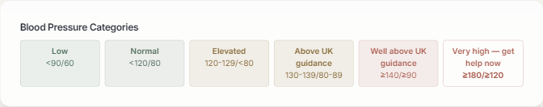
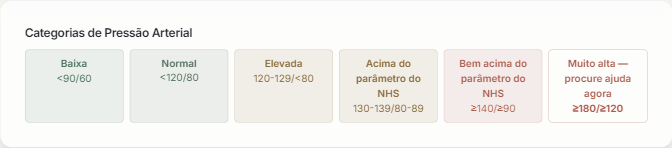

# QA online — `https://bpr.clinic` — deploy `d80d3d850` (PR #196)

**Data:** 01/10/2026, ~09:20–09:45Z
**Modo:** somente leitura. Nada foi criado, movido, atribuído, apagado, semeado ou enviado.
**Resultado geral:** ⚠️ Prioridade 1 aprovada (com um achado colateral); Prioridade 2 **não verificável**; Prioridade 3 verificada só em parte.

---

## Topo: bloqueei na autenticação, como temias

A sessão que existe no navegador é a do **paciente Bruno**, e só ela:

```json
{ "user": { "email": "brunoto02028@gmail.com", "role": "PATIENT",
            "clinicId": "cmska2rj90000sb4gqbfqzb0o" } }
```

Não há sessão de equipa. Não a criei, não adivinhei senha, não consultei o banco.

O portão responde certo e responde cedo:

| alvo | sem cookie | com o cookie do paciente |
|---|---|---|
| `/api/admin/measurement-sessions` | `401 session_expired` | `403 {"error":"Forbidden"}` |
| `/api/admin/blood-pressure` | — | `403 {"error":"Forbidden"}` |
| `/api/admin/education` | — | `403 {"error":"Forbidden"}` |
| `/admin/measurements/inbox` | — | redireciona para `/dashboard` |

**Consequência:** a Prioridade 2 inteira e três dos quatro itens da Prioridade 3 ficam **não verificáveis**. O quarto (contraste do musgo) consegui medir por outro caminho — a folha de estilo que a produção serve.

## Que build eu medi, e o que não consigo provar

| fonte | valor |
|---|---|
| `/version.json` | `buildDate: 2026-10-01T09:05:35.858Z`, **`commit: null`** |
| `/api/version` | buildId `VxXsNoPqbTB27Z_v9A-GF`, carimbo `2026-10-01T09:11:44Z` |
| `/api/health` | `uptime: 1537s` às 09:41:06Z → contentor de pé desde ~09:15:30Z |

O `commit` vem `null` — é o `.git` que o Coolify apaga antes do build. **A aplicação não sabe dizer o seu commit**, então nenhuma destas linhas é prova.

O que é prova:

- **Provado vivo:** tudo até `ae18c25ac` inclusive. A correção da faixa está na tela (abaixo) e a regra do musgo está no CSS servido.
- **Não provado:** `ca157ec3e` — o último commit do merge (08:57:12Z), o que traz `lastSyncError`. O build (09:05Z) é 8 minutos posterior a ele, o que é *consistente*, mas consistência não é o hash. Os três commits entre um e outro (`ccfda9949`, `a512ad338`, `d8e6a16a0`) são só `mobile/`, e por isso não deixam rasto alcançável na web.

Isto empilha **duas** incógnitas sobre a Prioridade 2, não uma: *(a)* o código está no build? *(b)* o `db push` correu?

---

## Prioridade 1 — a faixa de crise ✅ **funciona**

Tela: `/dashboard/blood-pressure`, sessão do próprio Bruno (dado dele, autorizado).

### As duas línguas

| faixa | EN | PT |
|---|---|---|
| `<90/60` | Low | Baixa |
| `<120/80` | Normal | Normal |
| `120-129/<80` | Elevated | Elevada |
| `130-139/80-89` | Above UK guidance | Acima do parâmetro do NHS |
| `≥140/≥90` | Well above UK guidance | Bem acima do parâmetro do NHS |
| **`≥180/≥120`** | **Very high — get help now** | **Muito alta — procure ajuda agora** |




As outras cinco faixas continuam certas, e a escada de limiares está completa e na ordem.

### `Crisis` / `Crise` não aparece

Na tela, nas duas línguas (`document.body.innerText`):

```
Crise:          0 ocorrências
Crisis:         0 ocorrências
Stage 1|2:      0 ocorrências
estágio 1|2:    0 ocorrências
```

Nos **21 chunks** que a página carrega, baixados da produção e lidos como texto:

```
grep "Crisis"  -> NO MATCH
grep "Crise"   -> NO MATCH
grep "Stage 1|2" -> NO MATCH

grep "Very high — get help now"      -> 6498-4f78dec2046c0f11.js
grep "Muito alta — procure ajuda agora" -> 6498-4f78dec2046c0f11.js
```

A única coisa que sobra com essas letras é `CRISIS` — **2 ocorrências, maiúsculas**, que é a chave do enum e está permitida de propósito. Nenhuma ocorrência da palavra escrita como se lê.

### As cores, com as camadas compostas

Fundo da página `rgb(245,243,240)`; cada fundo com alfa foi composto sobre os ancestrais até à tela antes de medir.

| # | faixa | fundo composto | luminância | texto composto | contraste |
|---|---|---|---|---|---|
| 1 | Low | `#ecefed` | 0,8549 | `#4f7361` | 4,57 |
| 2 | Normal | `#ecefec` | 0,8540 | `#55705f` | 4,67 |
| 3 | Elevated | `#f2eee9` | 0,8594 | `#8a6d3b` | 4,20 |
| 4 | Above UK guidance | `#f2eee9` | 0,8594 | `#8a6d3b` | 4,20 |
| 5 | Well above UK guidance | `#f5ecea` | 0,8547 | `#a85a4b` | 4,28 |
| 6 | **Very high — get help now** | **`#fdfdfc`** | **0,9791** | `#a85a4b` | 4,87 |

O matiz sobe como deve: 150° → 142° → 38° → 38° → 10° → 10°. Verde, âmbar, vermelho.

**Mas a escada quebra no último degrau** — ver a seguir.

---

## 🔴 Achado: a faixa mais grave é a única sem fundo

Não é regressão deste deploy. Mas é exatamente o que me pediste para medir, e a medição reprova.

A célula `≥180/≥120` pede `bg-ba1-bad/15`. O que o navegador calcula:

| faixa | classe | `backgroundColor` calculado |
|---|---|---|
| `≥140/≥90` | `bg-ba1-bad/10` | `rgba(168, 90, 75, 0.1)` ✅ |
| `≥180/≥120` | `bg-ba1-bad/15` | **`rgba(0, 0, 0, 0)`** ❌ |

O CSS que a produção serve gera `.bg-ba1-bad\/5`, `\/10` e `\/20` — **não gera `\/15`**. A classe existe no HTML, não existe na folha de estilo, e o fundo simplesmente não é pintado.

O efeito está na captura: a célula do alarme sai **branca**, enquanto a vizinha menos grave sai cor-de-rosa. Em luminância, 0,9791 contra 0,8547 — **a faixa mais grave é a célula mais pálida da grade**, e a única sem preenchimento.

A varredura completa (fonte × CSS servido) dá **9 degraus de alfa pedidos que a produção nunca emite**:

| classe | ficheiros que a usam |
|---|---|
| `bg-ba1-bad/15` | 7 |
| `bg-ba1-health/15` | 14 |
| `bg-ba1-ok/15` | 14 |
| `bg-ba1-warn/15` | 14 |
| `bg-ba1-ok/8` | 1 |
| `bg-ba1-bad/90` | 1 |
| `bg-ba1-health/90` | 3 |
| `bg-ba1-ok/90` | 3 |
| `bg-ba1-warn/90` | 3 |

Os gerados são `/5 /10 /20 /25 /30 /40 /70 /80`. Faltam exatamente `/8`, `/15` e `/90`. Os `/90` preocupam mais do que os `/15`: um `bg-…/90` é um preenchimento quase sólido — provavelmente botão — a sair transparente.

**Origem:** `7773176e2` ("brand-palette sweep across remaining patient dashboard pages"), muito antes deste deploy. `ae18c25ac` só trocou o rótulo da linha; as classes vieram intactas.

**Atenuante:** é só-navegador. A grade do app vem de `mobile/src/lib/faixa-de-pressao.ts`, que é React Native e não usa Tailwind — os rótulos lá já são os novos.

**Onde olhar:** por que `/5`, `/10` e `/20` saem e `/15` não, sendo a mesma folha e o mesmo token. `app/globals.css` não define estas utilidades à mão, então o corte está na geração.

---

## Prioridade 2 — ⚠️ **não verificável**, e o 403 não decide nada

Não consegui distinguir. Digo-o em vez de concluir.

**Por que o código de estado não serve.** Em `app/api/admin/measurement-sessions/route.ts`:

```
26:  const actor = await getSessionStaffActor(req);
27:  if (!actor) return ... 401
...
30:  const device = await clinicDevice(actor.clinicId);   <- a única query que toca lastSyncError
```

O 401 (sem cookie) sai na linha 27. O 403 (cookie de paciente) sai **antes disso**, no `middleware.ts` — `/api/admin` é rota de equipa e `PATIENT_ALLOWED_ADMIN_APIS` só abre exceção para `GET /api/admin/consent-texts` e `DELETE /api/admin/impersonate`. Nenhum dos dois chega à linha 30. Se a coluna não existisse, o 500 nunca apareceria daqui.

**Por que não há porta lateral.** `clinicDevice()` é a única função que seleciona `lastSyncError` explicitamente, e tem **exatamente dois chamadores**, ambos em `/api/admin/measurement-sessions` (linhas 30 e 106). As rotas de wearables alcançáveis pelo paciente ou têm `select` que não inclui as colunas novas (`/api/wearables/connections`), ou são escrita (`sync`, `disconnect`, `connect`, webhooks) — e escrita está fora das regras.

**O que ficou por ver**, quando houver sessão de equipa em `/admin/measurements/inbox`:

- a página carrega (ou devolve 500, que seria a resposta do `db push` que não correu);
- *"Perguntámos à Withings pela última vez: …"* — **a linha que estás à espera**;
- *"A última tentativa falhou: …"*, se houver.

### Mas trouxe metade da resposta por outro caminho

`/api/wearables/connections` é rota do paciente e é o aparelho do próprio Bruno. GET, sem escrita:

```json
{ "provider": "WITHINGS", "status": "CONNECTED",
  "lastSyncedAt":  "2026-10-01T08:42:30.038Z",
  "lastReadingAt": "2026-09-24T16:27:04.000Z",
  "daysSilent": 6, "silenceThreshold": 5, "silent": false,
  "delivery": "receiving", "pressaoPelaClinica": true,
  "missingBloodPressure": false }
```

**Perguntámos, sim.** `lastSyncedAt` é de hoje às **08:42:30Z** — ~40 minutos antes de eu abrir a página, portanto não fui eu que o provoquei. O cron corre e **completa** a sincronia desta ligação.

Isso fecha metade do beco que o `ca157ec3e` existe para abrir: *"não pedimos"* está eliminado para a ligação pessoal do Bruno. Fica *"pedimos e não veio"* — e `lastReadingAt` continua em **24/09**, seis dias atrás.

Ressalva importante: esta é a ligação **pessoal**, e `pressaoPelaClinica: true` diz que a pressão dela entra pelo aparelho da clínica, não por aqui. O `lastSyncedAt` do **aparelho da clínica** — que é o que a caixa mostra e o que interessa ao caso — só se lê pela rota de equipa. Não o vi.

Nota a favor do que subiu: `daysSilent: 6` é maior que `silenceThreshold: 5` e mesmo assim `silent: false`. É o "silêncio por desenho" do `4db2b8182` a funcionar — a ligação está muda para pressão de propósito, e não levanta alarme falso.

---

## Prioridade 3

| item | resultado |
|---|---|
| `/admin/blood-pressure`: legenda sem `Stage 1/2`, frase do NHS, sem câmera, alcançável pelo menu | ⚠️ **não verificável** — redireciona para `/dashboard` |
| Ficha do Bruno: a linha da ligação nunca diz só "conectado" | ⚠️ **não verificável** no painel (ver nota) |
| `/admin/education`: botão **Enviar** no cartão, abrir e fechar sem enviar | ⚠️ **não verificável** — `403` |
| Contraste do musgo como texto no painel | ✅ **passa** — medido na folha de estilo servida |

### Contraste do musgo ✅

Não entrei no painel, mas a produção serve o CSS, e o CSS é mensurável. A regra do `94a03f41d` está lá, e **ganha**:

```
byte 118.441   .text-primary{color:hsl(var(--primary))}
byte 148.151   .text-primary{color:hsl(var(--accent-bright))}   <- posterior, mesma especificidade: vence
```

Tokens servidos: `--primary: 150 19% 38%`, `--accent-bright: 150 30% 60%` (painel escuro) e `--accent-bright: 150 19% 38%` dentro de `.public-site`.

Medindo a cor antiga **primeiro**, como manda a lição de setembro:

| superfície | antes (`#4e7361`) | depois (`#7ab899`) |
|---|---|---|
| `--background` escuro `#111318` | 3,51 ❌ | **8,07** ✅ |
| `--card` escuro `#20242d` | 2,95 ❌ | **6,77** ✅ |
| área clara `.public-site` sobre osso `#f5f3f0` | 4,79 ✅ | 4,79 ✅ (inalterado, como desenhado) |

Passa 4,5 nas duas superfícies escuras, e a área clara não se mexeu. **Ressalva:** isto mede o token e a regra, não a tela renderizada; cobre quem usa `.text-primary`, e não quem escreva a cor por outro caminho.

### Nota sobre "a linha da ligação nunca diz só 'conectado'"

A ficha do painel não abre. A tela equivalente do paciente, `/dashboard/devices`, diz:

> Withings · **Last sync: 01/10/2026, 09:42:30** · Sync · Disconnect
> *No data yet. Connect a wearable and wait for the first sync.*

É "último sync: agora" com seis dias de silêncio atrás — a confusão exata que a 114 T-2 foi corrigir. **Mas isto não é defeito deste deploy:** `ccfda9949`, `a512ad338`, `d8e6a16a0` e `4db2b8182` mexeram em `mobile/app/(app)/(clinica)/wearables.tsx`, e **`app/dashboard/devices/page.tsx` não foi tocado**. A web do paciente é a tela velha, e a tela velha é a que perde o acesso no lançamento. Fica como observação, não como falha.

---

## Erros de console

Na página do paciente da pressão, depois de carregar e de trocar de língua nos dois sentidos: **0 erros, 0 avisos**.

O histórico do navegador tem erros, mas são de **outras sessões de QA a correr em paralelo** nos separadores `localhost:8081`, `:8106`, `:8114`, `:4114`, `:4201` e `:8090` — Metro desligado, `ERR_CONNECTION_REFUSED`, e um `TransformError` de JSX por fechar em `mobile/app/(app)/(clinica)/(tabs)/index.tsx:387`. Nada disto é de `bpr.clinic`. Deixo registado porque o último é um ficheiro real da árvore e pode interessar a quem está nele agora.

Os únicos erros com origem em `bpr.clinic` são os `403`/`401` das minhas próprias sondagens ao `/api/admin/*`.

---

## Resumo

| # | item | resultado |
|---|---|---|
| 1 | Faixa de crise, EN | ✅ "Very high — get help now" |
| 2 | Faixa de crise, PT | ✅ "Muito alta — procure ajuda agora" |
| 3 | `Crisis`/`Crise` fora da tela e dos chunks | ✅ 0 na tela, 0 em 21 chunks |
| 4 | As outras cinco faixas | ✅ certas e na ordem |
| 5 | Escada de gravidade (cores compostas) | ❌ quebra no topo: `bg-ba1-bad/15` não é gerado |
| 6 | `lastSyncError` / `lastSyncErrorAt` no banco | ⚠️ não verificável (sem sessão de equipa) |
| 7 | `/admin/measurements/inbox` e a linha "Perguntámos à Withings" | ⚠️ não verificável |
| 8 | `/admin/blood-pressure` | ⚠️ não verificável |
| 9 | Ficha do Bruno, linha da ligação | ⚠️ não verificável no painel |
| 10 | `/admin/education`, botão Enviar | ⚠️ não verificável |
| 11 | Contraste do musgo como texto | ✅ 8,07 e 6,77 (antes: 3,51 e 2,95) |

**4 ✅ · 1 ❌ · 6 ⚠️**

## O que falta, e o que é preciso para fechar

1. **Sessão de equipa.** Fecha os itens 6 a 10 de uma vez. É o único bloqueio.
2. **Confirmar `ca157ec3e` no build** pela lista de deployments do Coolify — a aplicação não diz o seu commit, e sem isso a Prioridade 2 tem duas incógnitas em vez de uma.
3. **O degrau `/15`** (item 5), e de caminho os `/90`, que são piores.
